# Registrar of Companies - Sri Lanka

Data Scraped from Registrar of Companies - Sri Lanka (https://eroc.drc.gov.lk)

Scraped **116,989** Companies ([3.58MB](data/companies.tsv)) as of *2023-12-10 10:01:41*.

*Scraping Progress: 48,530/52,728*
✅✅✅✅✅✅✅✅✅⬜

## Selection of Companies
*Sample of 10/116989*
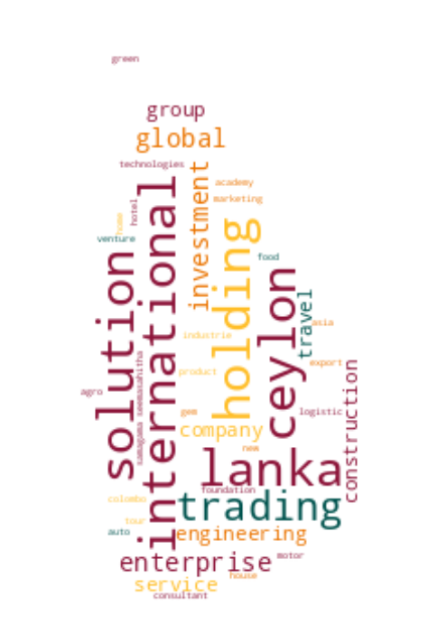
* (1) PCC00287821 - **99X TECHNOLOGY AS**
* (12,999) PV00245742 - **BIO AGRI INTERNATIONAL**
* (25,998) PV00252241 - **DAWON GROUP CONSTRUCTION**
* (38,997) PV00268340 - **GLITTERING HEARTS GEM AND JEWELLERY**
* (51,995) PV00230036 - **KALUKELE AGRO**
* (64,994) PV119576 - **MILLART**
* (77,993) PV7865 - **POLYMATE**
* (90,991) PV00231927 - **SETH NATURE LANKA**
* (103,990)  - **THE LIV FOUNDATION LANKA**
* (116,989) PV118576 - **ZZAPPIT**

## Latest 1,000 Companies
*Sample of 10/1000*
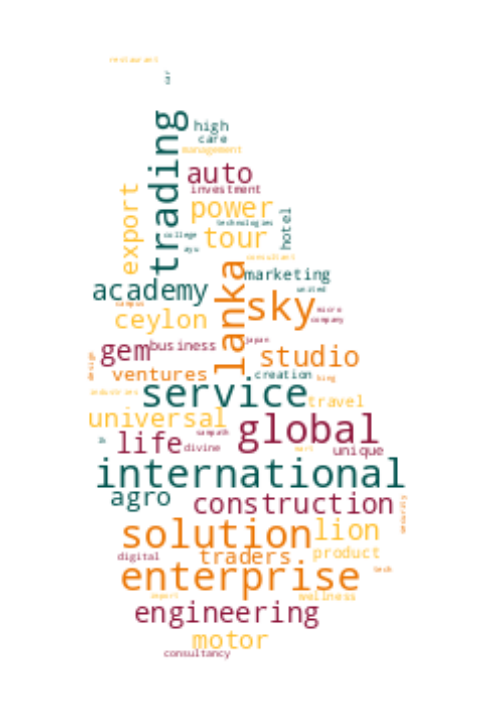
* (1) PV00288400 - **CHILL VIBES INTERNATIONAL**
* (112) PV00288580 - **CEYLON PURE SPICE EXPORT & TRADING**
* (223) PV00288745 - **JEEVA'S FRESH**
* (334) PV00288916 - **BLUE DIAMOND SPA**
* (445) PV00289071 - **VANCON CELLULAR**
* (556) PV00289250 - **REISEN LANKA TOURS**
* (667) PV00289434 - **PASYALA CABS AND RENT A CAR**
* (778) PV00289594 - **LUXURY ACRES**
* (889) PV00289789 - **DEWS SPICE EXPORT**
* (1,000) PV00290135 - **SCEPTER DIGITAL AGENCY CONSULTARE**

## Selection for Companies by Type

### "PV"
*Sample of 10/107848*
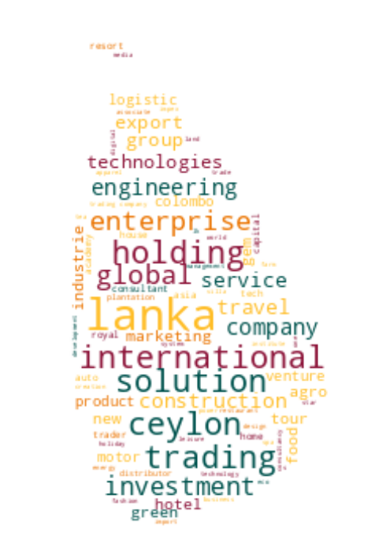
* (1) PV20853 - **A AND A ASSOCIATES**
* (11,984) PV00202997 - **BING BONG**
* (23,967) PV96661 - **DE ADELIA**
* (35,950) PV109279 - **GLINT FURNITURE & INTERIOR SOLUITONS**
* (47,933) PV00261061 - **KAMIL HEWAVITHARANA**
* (59,916) PV20347 - **MILLI CONSTRUCTION COMPANY**
* (71,899) PV93152 - **POORNIMA CONSTRUCTIONS**
* (83,882) PV100700 - **SERENITY ENTERTAINMENT**
* (95,865) PV00209421 - **THE LIGHT SHAPING**
* (107,848) PV118576 - **ZZAPPIT**

### ""
*Sample of 10/3445*
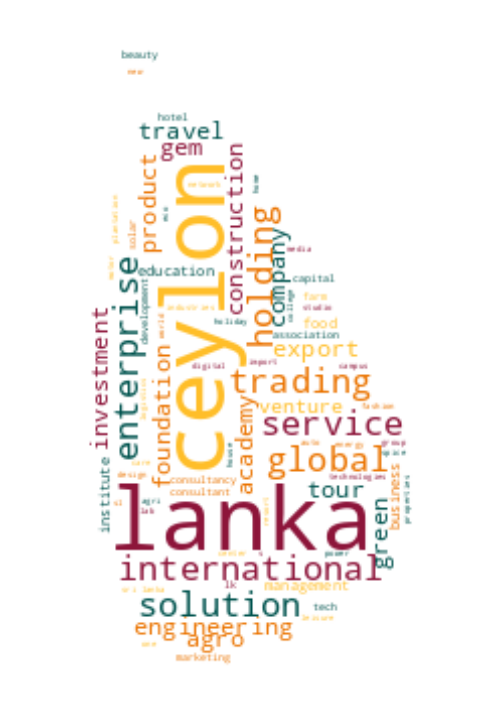
* (1)  - **A KIRUBAA GROUP OF COMPANIES**
* (383)  - **BLUE  FORCE HOLDINGS**
* (766)  - **DAKSHINA MARKETING AND DISTRIBUTORS**
* (1,149)  - **GLOBAL AIRLINE ACADEMY**
* (1,531)  - **JP WATER SOLUTION**
* (1,914)  - **MITHUDAMA LANDS & PROPERTIES**
* (2,297)  - **PHOEBUS ENERGY**
* (2,679)  - **SHANTHI TILES & BATHWARE**
* (3,062)  - **THE ONE SOLUTION**
* (3,445)  - **ZOVO ENTERPRISES**

### "GA"
*Sample of 10/2177*
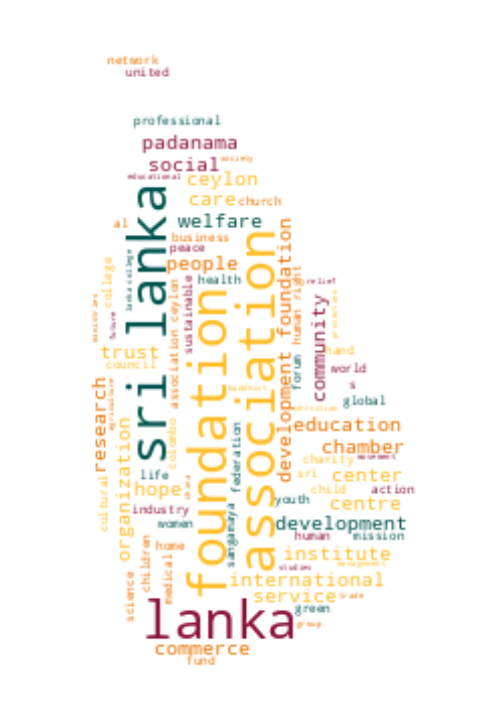
* (1) GA00213478 - **A QUINT ONDAATJE FOUNDATION**
* (242) GA3150 - **BETHEL IN HABARANA**
* (484) GA3066 - **CONSTRUCTION INDUSTRY SKILLS COUNCIL**
* (726) GA00257319 - **GRAMEEN LANKA FOUNDATION**
* (968) GA00242399 - **KADEEJA FOUNDATION**
* (1,209) GA288 - **MIDORI FOUNDATION**
* (1,451) GA2117 - **PRAGATHI FOUNDATION**
* (1,693) GA318 - **SOS CHILDREN'S VILLAGES SRI LANKA**
* (1,935) GA155 - **THE INSTITUTE FOR THE DEVELOPMENT OF COMMERCIAL LAW AND PRACTICE**
* (2,177) GA470 - **ZONTA CLUB II OF COLOMBO**

### "PB"
*Sample of 10/1378*
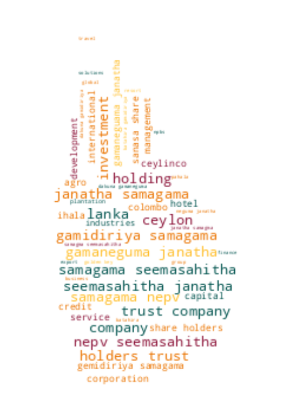
* (1) PB5111 - **A ONE TOP TRADING**
* (154) PB824 - **BRANDIX TEXTILE HOLDINGS**
* (307) PB00208269 - **CLIFTON GROUP**
* (460) PB5001 - **FOSTER REAL ESTATE**
* (613) PB5454 - **ISLAND AGRO PLANTATION**
* (766) PB00222421 - **M POWER CAPITAL SECURITIES**
* (919) PB4875 - **PALLEPOLA SANASA DEVELOPMENT BANK`S SHARAHOLDERS TRUST COMPANY**
* (1,072) PB5188 - **SARVODAYA SUSTAINABLE ECONOMIC ENTERPRISE DEVELOPMENT SERVICES**
* (1,225) PB1290 - **THE BEACH RESORTS**
* (1,378) PB118 - **ZYREX POWER COMPANY**

### "GL"
*Sample of 10/688*
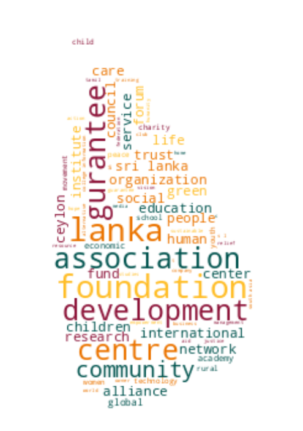
* (1) GL00223389 - **A LITTLE  FOUNDATION**
* (77) GL00248061 - **BLOOMING BUDS SOCIAL FOUNDATION**
* (153) GL00268852 - **E SUPPORTING CENTER**
* (230) GL65 - **HAMBANTHOTA BUSINESS DEVELOPMENT CENTRE**
* (306) GL2243 - **KARUNYA LANKA**
* (382) GL00255293 - **MIRELLY OUTREACH FUND FOR CHILDREN**
* (459) GL2001 - **PURA SARANA**
* (535) GL2186 - **SNEHA LANKA**
* (611) GL2205 - **TRADERS ASSOCIATION VAVUNIYA**
* (688) GL2310 - **ZOE LIFE INTERNATIONAL (GURANTEE)**

### "NF"
*Sample of 10/482*
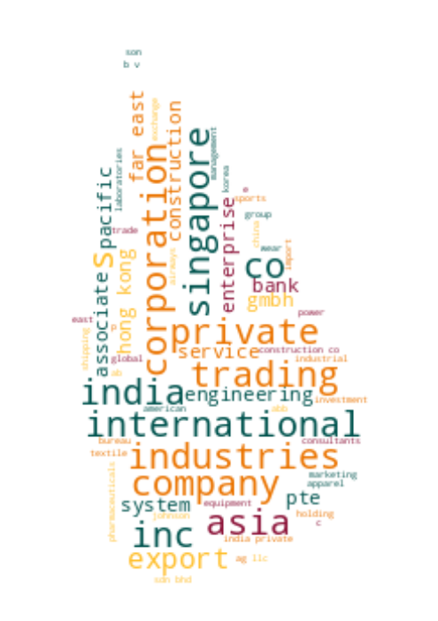
* (1) NF137 - **AB FINLANKA**
* (54) NF193 - **BRIGHT ELITE**
* (107) NF154 - **DECISION TEXTILE COMPANY**
* (161) NF488 - **GOOD HARVEST TEXTILES**
* (214) NF266 - **KEC INTERNATIONAL**
* (268) NF191 - **MCB BANK**
* (321) NF303 - **PACIFIC RESOUSRCES EXPORT**
* (375) NF93 - **SILVER GRAND SOURCING**
* (428) NF306 - **TORRENT PHARMACEUTICALS LILMITED**
* (482) NF711 - **ZTE CORPORATION**

### "FC"
*Sample of 10/344*
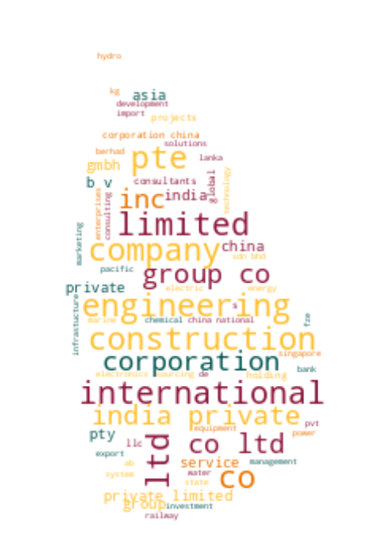
* (1) FC00251549 - **AA JAPAN (PVT) LTD**
* (39) FC1251 - **BAUSCH & LOMB INDIA PRIVATE LIMITED**
* (77) FC1168 - **COMPAGNIE D'ENTERPRISES CFE SA**
* (115) FC1180 - **FLASHFX PTY**
* (153) FC1378 - **INTERNATIONAL EXECUTIVE SERVICE CORPS**
* (191) FC1350 - **LIPINS PARTNERS PTY.**
* (229) FC1030 - **NUGA BEST CO.**
* (267) FC1325 - **SAFEGE**
* (305) FC1019 - **TETRA - PAK INDIA PRIVATE**
* (344) FC1065 - **ZIBO GUANGZHENG ALKALI ALUMINIUM CHEMICAL INDUSTRY CO.,**

### "F"
*Sample of 10/196*
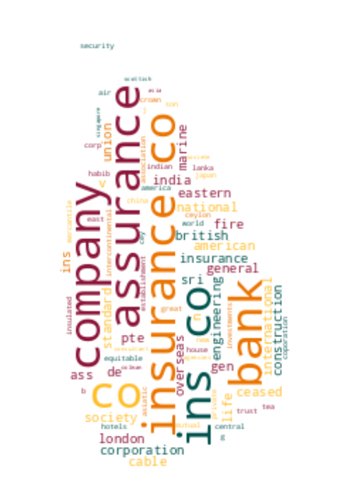
* (1) F234 - **ALCO INSURANCE COMPANY**
* (22) F327 - **BANQUE DE L'INDOCHINE ET DE SUEZ (FRANCE)**
* (44) F365 - **DAIMEI DENWA KOAYO CO**
* (66) F134 - **GRINDLAY & CO**
* (87) F170 - **JOHN DULANSON & CO.**
* (109) F70 - **NATIONAL GUARANTEE & SURETYSHIP ASSOCIATION**
* (131) F223 - **RECKIT COLMAN**
* (152) F325 - **STYLE DESIGN AND TECHNICAL CONSULTANTS**
* (174) F254 - **THE SOUTH INDIA INS CO.**
* (196) F6 - **YORKSHIRE INSURANCE CO LTC CEASED 1/11/70**

### "PQ"
*Sample of 10/153*
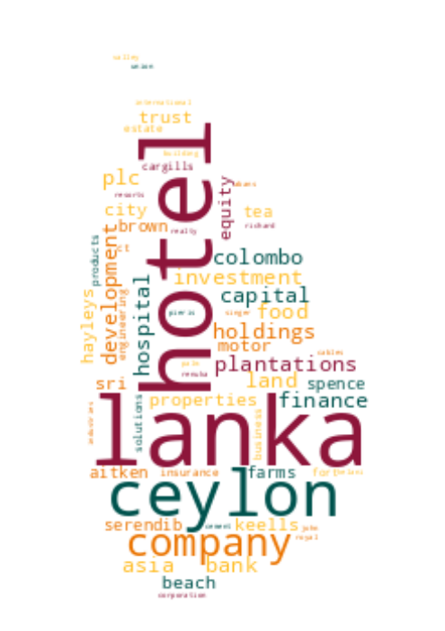
* (1) PQ188 - **ABANS ELECTRICALS**
* (17) PQ00252285 - **CAPITAL ALLIANCE**
* (34) PQ211 - **CITRUS LEISURE**
* (51) PQ112 - **DISTILLERIES COMPANY OF SRI LANKA**
* (68) PQ45 - **INDO-MALAY**
* (85) PQ142 - **LANKA MILK FOODS (CWE)**
* (102) PQ39 - **OVERSEAS REALTY (CEYLON)**
* (119) PQ230 - **SERENDIB ENGINEERING GROUP**
* (136) PQ1 - **THE FINANCE COMPANY**
* (153) PQ00234079 - **WINDFORCE**

### "PBPV"
*Sample of 10/70*
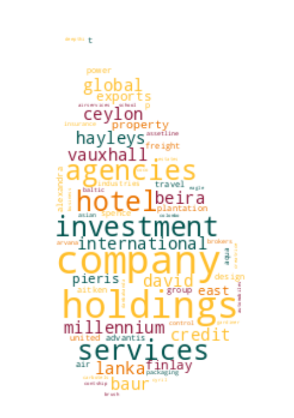
* (1) PB1296PV - **A BAUR AND COMPANY  TRAVEL**
* (8) PB162PV - **ASSETLINE INSURANCE BROKERS**
* (16) PB419PV - **DAMBAKANDA ESTATES COMPANY**
* (24) PB303PV - **GEORGE STEUART HEALTH**
* (31) PB1637PV - **HOTEL INTERNATIONAL**
* (39) PB583PV - **MARITIME AGENCIES**
* (47) PB504PV - **RAVI MARKETING SERVICES**
* (54) PB4771PV - **SOFIA HOTELS**
* (62) PB5256PV - **TOKYO SUPER AGGREGATE**
* (70) PB312PV - **VERITAS INVESTMENTS**

### "PBG"
*Sample of 10/45*
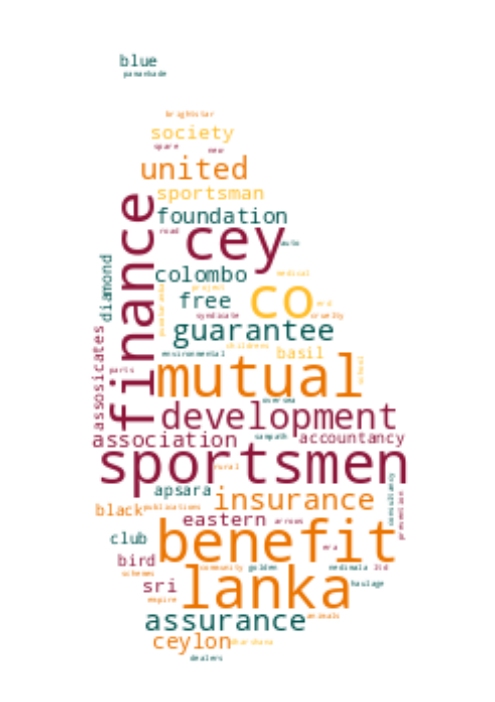
* (1) PBG45 - **ACCOUNTANCY ASSOSICATES**
* (5) PBG28 - **BLUE DIAMOND SPORTSMEN**
* (10) PBG8 - **COLOMBO MEDICAL SCHEMES**
* (15) PBG43 - **ERD FINANCE**
* (20) PBG9 - **OVERSEA CHILDRENS SCHOOL LTD ( BY GUARANTEE)**
* (25) PBG35 - **SAMPATH SPORTSMEN**
* (30) PBG17 - **THE BENEFIT PROVIDENT FUND**
* (35) PBG16 - **THE INSURANCE POLICY HOLDERS SERVICES**
* (40) PBG39 - **THEEPAM INSTITUTE**
* (45) PBG14 - **UNITED SPORTSMAN**

### "PVPB"
*Sample of 10/38*
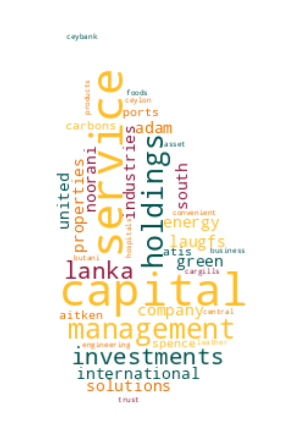
* (1) PV4158PB - **ADAM CARBONS**
* (5) PV11479PB - **CARGILLS CONVENIENT FOODS**
* (9) PV440PB - **CITRUS VACATIONS LIMITED**
* (13) PV5736PB - **ELGI RUBBER COMPANY**
* (17) PV7493PB - **LAUGFS ECO SRI**
* (21) PV69307PB - **NATURE'S BEST INDUSTRY**
* (25) PV21775PB - **ORIENT CAPITAL**
* (29) PV121855PB - **SITHUN INVESTMENTS AND PROPERTIES**
* (33) PV12903PB - **SUN TAN BEACH RESORTS**
* (38) PV77431PB - **WELIGAMA HOTEL PROPERTIES**

### "PBPQ"
*Sample of 10/30*
* (1) PB1015PQ - **ABANS FINANCE**
* (4) PB139PQ - **ASIA ASSET FINANCE**
* (7) PB1280PQ - **CEYLON TEA BROKERS**
* (10) PB127PQ - **FIRST CAPITAL TREASURIES**
* (13) PB965PQ - **HNB FINANCE**
* (17) PB712PQ - **MULLER AND PHILLIPS DISTRIBUTORS**
* (20) PB1108PQ - **RENUKA AGRI FOODS**
* (23) PB238PQ - **SENKADAGALA FINANCE**
* (26) PB779PQ - **SOFTLOGIC CAPITAL**
* (30) PB3831PQ - **VALLIBEL ONE**

### "PCC"
*Sample of 10/27*
* (1) PCC00287821 - **99X TECHNOLOGY AS**
* (3) PCC00284133 - **ASIRI PORT CITY HOSPITAL (PRIVATE) LIMITED .**
* (6) PCC00289505 - **CHINA DUTY FREE (LANKA) (PVT) LTD.**
* (9) PCC00289048 - **COMMERCIAL BANK OF CEYLON PLC.**
* (12) PCC00275578 - **GREENSTAT HYDROGEN (PVT) LTD.**
* (15) PCC00289835 - **INDO-PACIFIC CENTRE PTE. LTD**
* (18) PCC00289410 - **NCINGA PTE LTD**
* (21) PCC00289735 - **PORT CITY BPO (PRIVATE) LIMITED.**
* (24) PCC00289409 - **SAMPATH BANK PLC.**
* (27) PCC00284609 - **TIQRI SOFTWARE PTE LTD**

### "NPVS"
*Sample of 10/26*
* (1) NPVS40803 - **ALNA WATER SYSTEMS**
* (3) NPVS48106 - **AQUA GEO CONSULTANTS**
* (6) NPVS25835 - **DIGITAL LOGIC INNOVATIONS**
* (9) NPVS26524 - **ECO-GREEN INTERNATIONAL**
* (12) NPVS42442 - **HERITAGE SAPPHIRES**
* (14) NPVS38695 - **MCMILLAN CEYLON MARKETING**
* (17) NPVS9611 - **Q-NET**
* (20) NPVS18562 - **SERENDIB INSURANCE BROKERS**
* (23) NPVS47980 - **STYLE APPAREL**
* (26) NPVS16673 - **WESTERN TRADING COMPANY**

### "PVPBPQ"
*Sample of 10/11*
* (1) PV66136PBPQ - **BROWNS INVESTMENTS**
* (2) PVPB13254PQ - **JETWING SYMPHONY**
* (3) PV8330PBPQ - **LAUGFS GAS**
* (4) PVPB7385PQ - **LOTUS HYDRO POWER**
* (5) PV17807PB/PQ - **MACKWOODS ENERGY**
* (6) PV10922PBPQ - **RAIGAM WAYAMBA SALTERNS**
* (7) PVPB8234PQ - **RAMBODA FALLS**
* (8) PV415PBPQ - **RESUS ENERGY**
* (9) PV70371PB/PQ - **SINGHE HOSPITALS**
* (11) PV7617PBPQ - **TEEJAY LANKA**

### "PQPB"
* (1) PQ96PB - **ASIRI CENTRAL HOSPITALS**
* (2) PQ15PB - **ASSOCIATED ELECTRICAL CORPORATION**
* (3) PQ17PB - **ASSOCIATED PROPERTY DEVELOPMENT**
* (4) PQ193PB - **BERUWELA WALK INN**
* (5) PQ99PB - **CEYLON LEATHER PRODUCTS**
* (6) PQ143PB - **HOTEL DEVELOPERS (LANKA) LIMITED**
* (7) PQ176PB - **KURUWITA TEXTILE MILLS**
* (8) PQ220PB - **METROPOLITAN RESOURCE HOLDINGS**
* (9) PQ77PB - **MORISON**

### "PVPQ"
* (1) PV10527PQ - **ADAM CAPITAL**
* (2) PV78150PQ - **ADAM INVESTMENTS**
* (3) PV1618PQ - **AGSTAR**
* (4) PV72355PQ - **ANILANA HOTELS & PROPERTIES**
* (5) PV7206PQ - **ODEL**
* (6) PV1536PQ - **SOFT LOGIC HOLDINGS**

### "PVS"
* (1) PVS1795 - **CINE-TECH**
* (2) PVS8467 - **LAKMINI ENTERPRISES**
* (3) PVS7888 - **RADIAN PRODUCTS**
* (4) PVS7498 - **WINGS TRAVELS AND TOURS**
* (5) PVS8227 - **WOODLANDS LANKA**

### "OC"
* (1) OC108 - **CAMSO TRADING**
* (2) OC110 - **GLOBAL SOFT TECHNOLOGIES**
* (3) OC101 - **ISLANDERS MALDIVES PTE**
* (4) OC102 - **POWER HUB INTERNATIONAL SDN PHD**

### "PQPBPV"
* (1) PQ98PBPV - **ACE POWER GENERATION MATARA**
* (2) PQ16PB/PV - **ASSOCIATED MOTORWAYS**

### "PBPVPB"
* (1) PB553PV/PB - **INTERNATIONAL CONSUMER BRANDS**
* (2) PBPVPB138 - **MCLARENS SHIPPING**

### "GAGL"
* (1) GA683GL - **LANKA PRISON FELLOWSHIP**

### "PBpv"
* (1) PB1236pv - **UNILEAVER CEYLON SERVICES**

### "PQPV"
* (1) PQ231PV - **UNION RESORTS**
