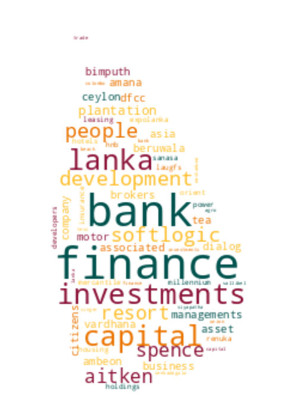
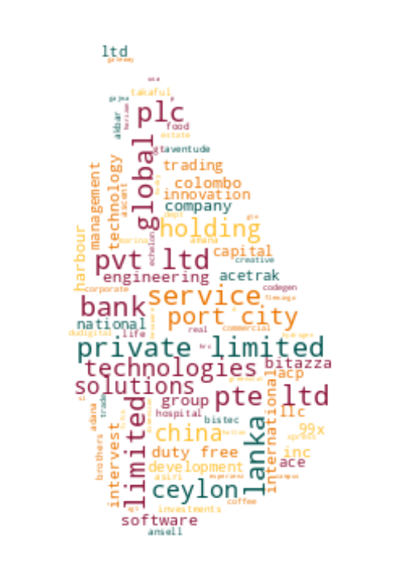

# Registrar of Companies - Sri Lanka

Data Scraped from Registrar of Companies - Sri Lanka (https://eroc.drc.gov.lk)

Scraped **129,680** Companies ([4.01MB](data/companies.tsv)) as of *2024-02-29 20:15:16*.

*Scraping Progress: 52,728/52,728*
✅✅✅✅✅✅✅✅✅✅

## Selection of Companies
*Sample of 10/129680*

* (1) PCC00287821 - **99X TECHNOLOGY AS**
* (14,409) PV8619 - **BLUESCOPE LYSAGHT LANKA**
* (28,818) PV13388 - **DIMASHA APPARELS**
* (43,227) PV107909 - **GORUK EXPORTERS**
* (57,636) PV00217933 - **KEERTHI TRADE CENTRE**
* (72,044) PV00263056 - **MONTEREO ENTERPRISES**
* (86,453) PV102673 - **PRISM INTERNATIONAL**
* (100,862) PV103941 - **SEWANAGALA PLANTATIONS**
* (115,271) PV00279389 - **THE PANT HOUSE**
* (129,680) PV118576 - **ZZAPPIT**

## Latest 1,000 Companies
*Sample of 10/1000*

* (1) PV00291514 - **KN ESPORTS**
* (112) PV00291713 - **NK TRENDS**
* (223) PV00291994 - **PETTAH PAPER AND BOARD BRIGHTON**
* (334) PV00292308 - **ALTITUDE1**
* (445) PV00292614 - **AKS ACADEMY & PRODUCTS**
* (556) PV00292946 - **MILLENNIUM GLOBAL SOLUTION**
* (667) PV00293317 - **STRIVECORE**
* (778) PV00293684 - **AISHUWARAA COCOS**
* (889) PV00294214 - **HERBAL COMFORTS**
* (1,000) PV00295395 - **AIR KINGS AIR CONDITIONING**

## Selection for Companies by Type

### "PV"
*Sample of 10/117859*

* (1) PV20853 - **A AND A ASSOCIATES**
* (13,096) PV113745 - **BLUE PARADISE LANKA**
* (26,191) PV2154 - **DILANI CONCRETE WORKS**
* (39,287) PV00258504 - **GOLDEN HAPPY CONSTRUCTION**
* (52,382) PV00271961 - **KAPUWELLA ESTATE**
* (65,477) PV00203658 - **MIYOTA LANKA**
* (78,573) PV00291636 - **PREMIER AUTO MART - KOHUWALA**
* (91,668) PV14043 - **SHAA COLA BEVERAGES**
* (104,763) PV00202807 - **THE SALON HIRU ACADEMY**
* (117,859) PV118576 - **ZZAPPIT**

### ""
*Sample of 10/4403*

* (1)  - **A AND Y COMMODITIES**
* (490)  - **BOSEWANA ENTERPRISE**
* (979)  - **DISSON INVESTMENTS**
* (1,468)  - **GMB HOLDING**
* (1,957)  - **KAY BEE AL HASEENA JEWELLERS**
* (2,446)  - **MOTHER LANKA CABS**
* (2,935)  - **PRASANNA NARANGODA CONSULTANTS**
* (3,424)  - **SHOPRI JEWELLERS**
* (3,913)  - **THEMI APPERAL**
* (4,403)  - **ZULACART**

### "PB"
*Sample of 10/2761*

* (1) PB5111 - **A ONE TOP TRADING**
* (307) PB4798 - **CITRUS VILLAS KALPITIYA**
* (614) PB729 - **INFO CRAFT**
* (921) PB857 - **NEGOMBO HOTELS**
* (1,227) PB3056 - **SEEMASAHITHA (JANATHA) BOGAHAKUMBURA GAMIDIRIYA SAMAGAMA**
* (1,534) PB1035 - **SEEMASAHITHA (JANATHA) OORUPALEWWA GAMIDIRIYA SAMAGAMA**
* (1,841) PB4274 - **SEEMASAHITHA DIVULAPELESSA IHALA GAMANEGUMA JANATHA SAMAGAMA**
* (2,147) PB4508 - **SEEMASAHITHA NILDANDAHEENA GAMANEGUAMA JANATHA SAMAGAMA**
* (2,454) PB4923 - **SEWANAGALA SANASA SHARE HOLDERS TRUST COMPANY**
* (2,761) PB118 - **ZYREX POWER COMPANY**

### "GA"
*Sample of 10/2337*

* (1) GA00213478 - **A QUINT ONDAATJE FOUNDATION**
* (260) GA00241664 - **BO SEWANA FOUNDATION**
* (520) GA659 - **DABINDU COLLECTIVE**
* (779) GA00239490 - **GUARDIANS LANKA FOUNDATION**
* (1,039) GA2043 - **JESUS REDEEMS MINISTRIES**
* (1,298) GA534 - **MENDIS MACKWOODS CHARITY FUND**
* (1,558) GA448 - **POWER MINISTRIES**
* (1,817) GA00238128 - **SMART ENERGY COUNCIL**
* (2,077) GA2403 - **THE INTERNATIONAL INSTITUTE OF MANAGEMENT**
* (2,337) GA470 - **ZONTA CLUB II OF COLOMBO**

### "GL"
*Sample of 10/768*

* (1) GL00223389 - **A LITTLE  FOUNDATION**
* (86) GL2 - **BRAC LANKA**
* (171) GL2408 - **DOWELS DOCTORS WELFARE ASSOCIATION**
* (256) GL56 - **GREEN VISION**
* (341) GL00246806 - **JANASHAKTHI FOUNDATION**
* (427) GL00242177 - **MEP INDUSTRY FORUM**
* (512) GL2300 - **POLONNARUWA CHIDREAN''S PROGRAM (GURANTEE)**
* (597) GL2272 - **SIRAKUGAL FOUNDATION**
* (682) GL2210 - **THE SOUTH ASIA COUNCIL FOR COMMUNITY & CHILDREN IN CRISIS**
* (768) GL2310 - **ZOE LIFE INTERNATIONAL (GURANTEE)**

### "NF"
*Sample of 10/503*

* (1) NF137 - **AB FINLANKA**
* (56) NF27 - **BRIMMER**
* (112) NF328 - **EDEN LLC**
* (168) NF663 - **HAVELL`S INDIA**
* (224) NF214 - **KINSHO MATAIEHI CORPORATION**
* (279) NF117 - **MILES (HONG-KONG)**
* (335) NF64 - **PATRILACK FUNDS**
* (391) NF609 - **SHAOXING COUNTRY YILI - TEXTILE CO.**
* (447) NF524 - **THE HADDED APPAREL GROUP**
* (503) NF711 - **ZTE CORPORATION**

### "FC"
*Sample of 10/369*

* (1) FC00251549 - **AA JAPAN (PVT) LTD**
* (41) FC1363 - **BEYOND HOSPITALITY PVT**
* (82) FC1127 - **DAIHO CORPORATION**
* (123) FC1306 - **GBX TRADING FZE**
* (164) FC1274 - **JANSON BRIDGING INTERNATIONAL B.V.**
* (205) FC00260998 - **MATSUURA KIKAI SEISAKUSHO CO. LTD.**
* (246) FC1060 - **ONMOBILE GLOBAL LIMITED**
* (287) FC1096 - **SAMSUNG INDIA ELECTRONICS PRIVATE LIMITED**
* (328) FC1019 - **TETRA - PAK INDIA PRIVATE**
* (369) FC1065 - **ZIBO GUANGZHENG ALKALI ALUMINIUM CHEMICAL INDUSTRY CO.,**

### "F"
*Sample of 10/205*

* (1) F234 - **ALCO INSURANCE COMPANY**
* (23) F327 - **BANQUE DE L'INDOCHINE ET DE SUEZ (FRANCE)**
* (46) F301 - **DEEN RAMBLE PVT**
* (69) F375 - **HARRIS CORPORATION (BERMUDA)**
* (91) F205 - **LIVERPOOL MARINE & GEN INS CO.**
* (114) F315 - **OBEROI HOTELS (INDIA) PRIVATE**
* (137) F49 - **SCOTTISH UNION NATIONAL INSURANCE CO.**
* (159) F76 - **SUN LIFE ASSURANCE CO OF CANADA**
* (182) F193 - **THE STANDARD GENERAL ASSURANCE CO.**
* (205) F6 - **YORKSHIRE INSURANCE CO LTC CEASED 1/11/70**

### "PQ"
*Sample of 10/155*

* (1) PQ188 - **ABANS ELECTRICALS**
* (18) PQ25 - **BROWN AND COMPANY**
* (35) PQ50 - **COLOMBO DOCKYARD**
* (52) PQ199 - **EDEN HOTEL LANKA**
* (69) PQ81 - **HOTEL SIGIRYA**
* (86) PQ187 - **LANKA ALUMINIUM INDUSTRIES**
* (103) PQ177 - **MULLER & PHIPPS (CEYLON)**
* (120) PQ125 - **ROYAL CERAMICS LANKA**
* (137) PQ36 - **TALAWAKELLE TEA ESTATES**
* (155) PQ181 - **YORK ARCADE HOLDINGS**

### "PBPV"
*Sample of 10/81*

* (1) PB1296PV - **A BAUR AND COMPANY  TRAVEL**
* (9) PB5118PV - **ASIAN CREDIT COMPANY**
* (18) PB1567PV - **CYRIL GARDINER**
* (27) PB303PV - **GEORGE STEUART HEALTH**
* (36) PB1637PV - **HOTEL INTERNATIONAL**
* (45) PB583PV - **MARITIME AGENCIES**
* (54) PB4803PV - **PREMIER PHYSICIANS MEDICAL GROUP**
* (63) PB3376PV - **SHAW WALLACE PROPERTIES**
* (72) PB5256PV - **TOKYO SUPER AGGREGATE**
* (81) PB144PV - **WORLD SUBSEA SERVICES**

### "PBG"
*Sample of 10/46*

* (1) PBG45 - **ACCOUNTANCY ASSOSICATES**
* (6) PBG48 - **BRIGHTSTAR FINANCE**
* (11) PBG37 - **CONSULTANCY AND FINANCE AND DEVELOPMENT**
* (16) PBG22 - **FREE LANKA SPORTSMEN**
* (21) PBG9 - **OVERSEA CHILDRENS SCHOOL LTD ( BY GUARANTEE)**
* (26) PBG35 - **SAMPATH SPORTSMEN**
* (31) PBG17 - **THE BENEFIT PROVIDENT FUND**
* (36) PBG16 - **THE INSURANCE POLICY HOLDERS SERVICES**
* (41) PBG39 - **THEEPAM INSTITUTE**
* (46) PBG14 - **UNITED SPORTSMAN**

### "PVPB"
*Sample of 10/42*

* (1) PV4158PB - **ADAM CARBONS**
* (5) PV7329PB - **BUSINESS MANAGEMENT SERVICES**
* (10) PV6857PB - **CEYLON LEATHER PRODUCTS MANUFACTURERS**
* (14) PV5736PB - **ELGI RUBBER COMPANY**
* (19) PV102488PB - **GRAINS 'N' GREEN**
* (23) PV75597PB - **LAUGFS SOLUTIONS**
* (28) PV114960PB - **NOORANI RENEWABLE ENERGY**
* (32) PV12813PB - **SIERRA CONSTRUCTION**
* (37) PV12903PB - **SUN TAN BEACH RESORTS**
* (42) PV127512PB - **UNITED CAPITAL HOLDINGS**

### "PBPQ"
*Sample of 10/39*

* (1) PB200PQ - **ACCESS ENGINEERING**
* (5) PB4739PQ - **ARPICO INSURANCE**
* (9) PB3259PQ - **BIMPUTH FINANCE**
* (13) PB765PQ - **DIALOG FINANCE**
* (17) PB965PQ - **HNB FINANCE**
* (22) PB376PQ - **MILLENNIUM HOUSING DEVELOPERS**
* (26) PB647PQ - **PEOPLE'S LEASING & FINANCE**
* (30) PB238PQ - **SENKADAGALA FINANCE**
* (34) PB641PQ - **SOFTLOGIC FINANCE**
* (39) PB4242PQ - **WASKADUWA BEACH RESORT**

### "PCC"
*Sample of 10/37*

* (1) PCC00287821 - **99X TECHNOLOGY AS**
* (5) PCC00278331 - **BITAZZA INTERNATIONAL LIMITED**
* (9) PCC00290488 - **CHINA HARBOUR ENGINEERING COMPANY (LANKA) LIMITED.**
* (13) PCC00289048 - **COMMERCIAL BANK OF CEYLON PLC.**
* (17) PCC00275578 - **GREENSTAT HYDROGEN (PVT) LTD.**
* (21) PCC00290386 - **INVIGORATE CEYLON (PVT) LTD**
* (25) PCC00290514 - **LAK ARCADE (PVT) LTD.**
* (29) PCC00289735 - **PORT CITY BPO (PRIVATE) LIMITED.**
* (33) PCC00284610 - **SATGURU TRAVEL AND TOURISM LLC**
* (37) PCC00292982 - **YOULANKA GROUP LIMITED**

### "NPVS"
*Sample of 10/29*
* (1) NPVS40803 - **ALNA WATER SYSTEMS**
* (4) NPVS22400 - **CEETEE INTERNATIONAL**
* (7) NPVS35441 - **DUMBARA FERTILIZERS**
* (10) NPVS15104 - **FIVE STAR EXPORTS**
* (13) NPVS42442 - **HERITAGE SAPPHIRES**
* (16) NPVS38695 - **MCMILLAN CEYLON MARKETING**
* (19) NPVS9611 - **Q-NET**
* (22) NPVS18562 - **SERENDIB INSURANCE BROKERS**
* (25) NPVS11267 - **SILVER SHRIMPS**
* (29) NPVS16673 - **WESTERN TRADING COMPANY**

### "PVPBPQ"
* (1) PV5301PBPQ - **ABANS**
* (2) PVPB13254PQ - **JETWING SYMPHONY**
* (3) PV8330PBPQ - **LAUGFS GAS**
* (4) PVPB7385PQ - **LOTUS HYDRO POWER**
* (5) PV17807PB/PQ - **MACKWOODS ENERGY**
* (6) PVPB8234PQ - **RAMBODA FALLS**
* (7) PV415PBPQ - **RESUS ENERGY**
* (8) PV70371PB/PQ - **SINGHE HOSPITALS**
* (9) PV1536PBPQ - **SOFTLOGIC HOLDINGS**
* (10) PV7617PBPQ - **TEEJAY LANKA**

### "PQPB"
* (1) PQ96PB - **ASIRI CENTRAL HOSPITALS**
* (2) PQ15PB - **ASSOCIATED ELECTRICAL CORPORATION**
* (3) PQ17PB - **ASSOCIATED PROPERTY DEVELOPMENT**
* (4) PQ193PB - **BERUWELA WALK INN**
* (5) PQ99PB - **CEYLON LEATHER PRODUCTS**
* (6) PQ61PB - **FINLAYS COLOMBO**
* (7) PQ143PB - **HOTEL DEVELOPERS (LANKA) LIMITED**
* (8) PQ176PB - **KURUWITA TEXTILE MILLS**
* (9) PQ220PB - **METROPOLITAN RESOURCE HOLDINGS**

### "OC"
* (1) OC111 - **ASTER JETFUEL**
* (2) OC108 - **CAMSO TRADING**
* (3) OC109 - **ENERGY COMMERCE B.V.**
* (4) OC101 - **ISLANDERS MALDIVES PTE**
* (5) OC104 - **MERCANTILE SEASCAPE SHIPPING COMPANY**
* (6) OC103 - **MERCANTILE SEBORNE SHIPPING**
* (7) OC102 - **POWER HUB INTERNATIONAL SDN PHD**

### "PVPQ"
* (1) PV10527PQ - **ADAM CAPITAL**
* (2) PV1618PQ - **AGSTAR**
* (3) PV72355PQ - **ANILANA HOTELS & PROPERTIES**
* (4) PV415PQ - **HEMAS POWER**
* (5) PV7206PQ - **ODEL**
* (6) PV1536PQ - **SOFT LOGIC HOLDINGS**

### "PVS"
* (1) PVS1795 - **CINE-TECH**
* (2) PVS8467 - **LAKMINI ENTERPRISES**
* (3) PVS7888 - **RADIAN PRODUCTS**
* (4) PVS7498 - **WINGS TRAVELS AND TOURS**
* (5) PVS8227 - **WOODLANDS LANKA**

### "PQPBPV"
* (1) PQ98PBPV - **ACE POWER GENERATION MATARA**
* (2) PQ16PB/PV - **ASSOCIATED MOTORWAYS**

### "PBPVPB"
* (1) PB64PVPB - **GAC SHIPPING**
* (2) PBPVPB138 - **MCLARENS SHIPPING**

### "NFA"
* (1) NF160A - **CO ECHO ENTERPRISES**

### "PVPBPV"
* (1) PV4405PBPV - **DAVE TRACTORS**

### "UC"
* (1) UC1 - **JACEY AND COMPANY**

### "GAGL"
* (1) GA683GL - **LANKA PRISON FELLOWSHIP**

### "PQPV"
* (1) PQ231PV - **UNION RESORTS**
