# Registrar of Companies - Sri Lanka

Data Scraped from Registrar of Companies - Sri Lanka (https://eroc.drc.gov.lk)

Scraped **152,034** Companies ([4.69MB](data/companies.tsv)) as of *2026-05-08 10:55:13*.

*Scraping Progress: 52,728/52,728*
✅✅✅✅✅✅✅✅✅✅

## Selection of Companies
*Sample of 10/152034*
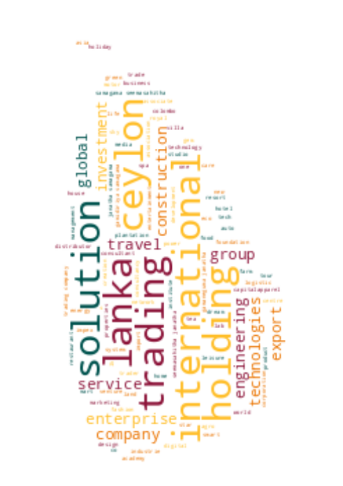
* (1) PCC00287821 - **99X TECHNOLOGY AS**
* (16,893) PV00253212 - **BLUE OCEAN AQUA**
* (33,786) PV00315703 - **DIGITAL NEXUS VIP**
* (50,678) PV109631 - **GOLDEN SHORES MANAGEMENT**
* (67,571) PV72789 - **KAYANKERNI BEACH RESORTS**
* (84,463) PV105561 - **MONARCH REGENCY**
* (101,356) PV14324 - **PRIYANKARA FURNITURE**
* (118,248) PV00260045 - **SGM APPARELS**
* (135,141) PV00229825 - **THICO GEM & JWELERIES**
* (152,034) PV118576 - **ZZAPPIT**

## Latest 1,000 Companies
*Sample of 10/1000*
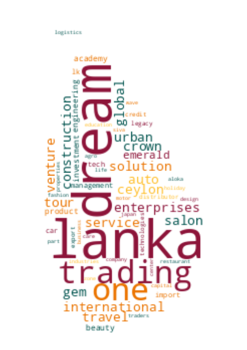
* (1) PV00345437 - **EMERIQUE**
* (112) PV00346702 - **TONY & DEE**
* (223) PV00347956 - **SECOND CHOICE**
* (334) PV00349354 - **YUNARA FRESH BAKES**
* (445) PV00351003 - **CRAZY TOURS**
* (556) PV00352523 - **CROWN BARK**
* (667) PV00354185 - **AYZAL ELECTRONIC WORLD**
* (778) PV00355859 - **AROMA HERBAL BLEND**
* (889) PV00358349 - **AMAZON TOURS**
* (1,000) PV00362569 - **LAK ARTHA SERVICES**

## Selection for Companies by Type

### "PV"
*Sample of 10/138263*
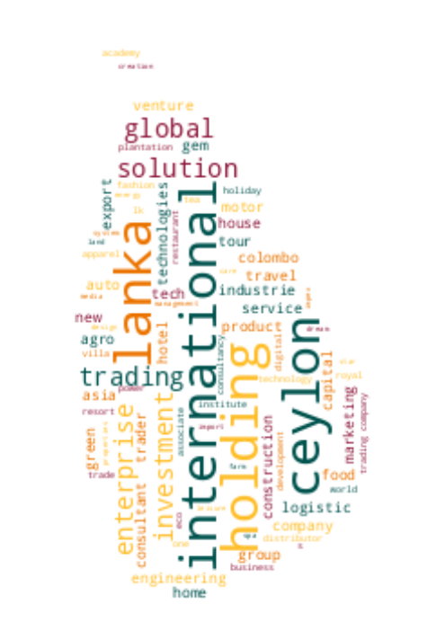
* (1) PV20853 - **A AND A ASSOCIATES**
* (15,363) PV10814 - **BLUE LAGOON HOTEL RESORT**
* (30,725) PV00222506 - **DIGITAL EYE SOLUTIONS**
* (46,088) PV69772 - **GOBETTER LOGISTICS AND DISTRIBUTIOIN**
* (61,450) PV19427 - **KARANDANA GEMS AND TOURS**
* (76,813) PV00269130 - **MMI PROJECTS**
* (92,175) PV95624 - **PREMIER ENTRANCE TECHNOLOGIES**
* (107,538) PV114333 - **SHAFNI LANKA HOLDINGS**
* (122,900) PV00211170 - **THINKSCRIPT INTERNATIONAL**
* (138,263) PV118576 - **ZZAPPIT**

### ""
*Sample of 10/5652*
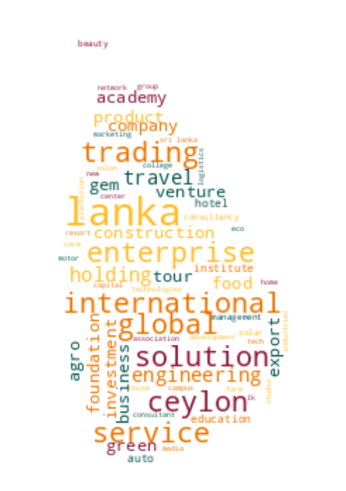
* (1)  - **A BRAND HOLDINGS**
* (628)  - **BIG ROC CONSTRUCTIONS**
* (1,256)  - **DESTINY TOURS AND TRAVELS**
* (1,884)  - **GLOBAL UNI CONNECT PTE. LTD**
* (2,512)  - **KALPATARU RESEARCH AND CONSULTANCY**
* (3,140)  - **MORCH KENN**
* (3,768)  - **PROMOTA LANKA**
* (4,396)  - **SIERRA READYMIX**
* (5,024)  - **TITANS DEFENSE LANKA**
* (5,652)  - **ZYPHER CLOUD**

### "PB"
*Sample of 10/2863*
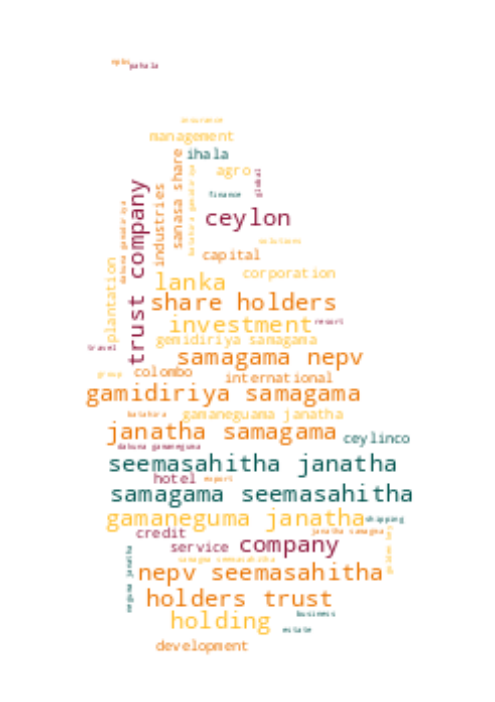
* (1) PB5111 - **A ONE TOP TRADING**
* (319) PB00274504 - **CHSR CAPITALS**
* (637) PB00325576 - **HAYWIND ONE**
* (955) PB1464 - **MERRIL J FERNANDO COMPANY**
* (1,273) PB481 - **SEEMASAHITHA (JANATHA) ALLAKANDA GAMIDIRIYA SAMAGAMA**
* (1,591) PB968 - **SEEMASAHITHA (JANATHA) MORAKANDEGODA GEMIDIRIYA SAMAGAMA**
* (1,909) PB4705 - **SEEMASAHITHA DEHIATTAWALA GAMANEGUMA JANATHA SAMAGAMA**
* (2,227) PB3617 - **SEEMASAHITHA NETALAPORUWA GAMA NEGUMA JANATHA SAMAGAMA**
* (2,545) PB5079 - **SINGER INSURANCE BROKERS**
* (2,863) PB118 - **ZYREX POWER COMPANY**

### "GA"
*Sample of 10/2673*
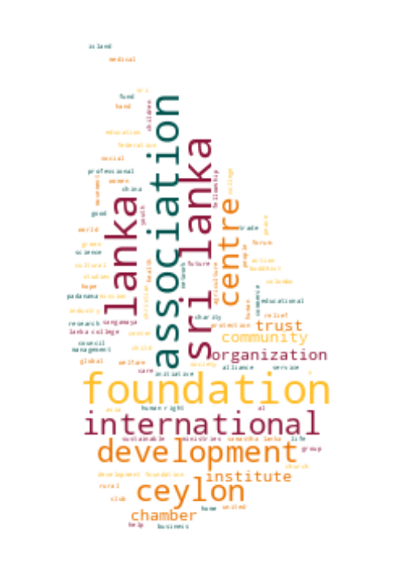
* (1) GA00321009 - **A HAND OF HOPE**
* (297) GA00312900 - **AYU CEYLON FOUNDATION**
* (594) GA2987 - **CONSERVE INDIGENOUS KNOWLEDGE**
* (891) GA442 - **GOPIO OF SRI LANKA**
* (1,188) GA3474 - **JAM'IRRATHUS SAILAN AL-KHAIRIYYA.**
* (1,485) GA00294180 - **MATARA ATTORNEYS’ CHAMBERS**
* (1,782) GA00281571 - **POTHANE DHAMMANANDA NAHIMI PADANAMA**
* (2,079) GA3210 - **SIVAN ARUL FOUNDATION**
* (2,376) GA235 - **THE INDIA SRI LANKA FOUNDATION**
* (2,673) GA470 - **ZONTA CLUB II OF COLOMBO**

### "GL"
*Sample of 10/882*
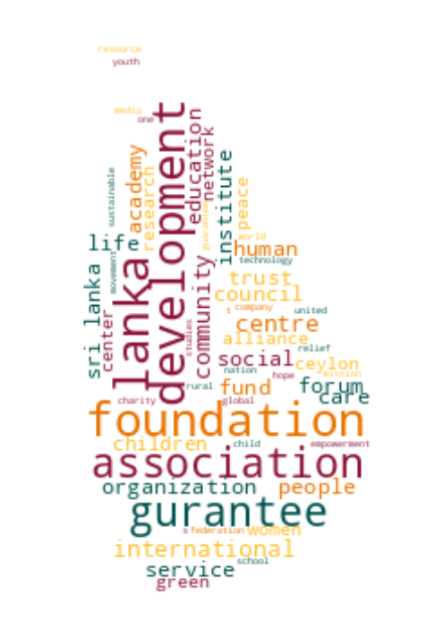
* (1) GL00223389 - **A LITTLE  FOUNDATION**
* (98) GL00305527 - **AYUVA EARTHFIRST FOUNDATION**
* (196) GL00240810 - **DIGITAL MARKETING ASSOCIATION OF LANKA**
* (294) GL00284189 - **GREEN ASSOCIATION FOR SOCIAL DEVELOPMENT**
* (392) GL00352515 - **JAPANESE GUIDE ASSOCIATION**
* (490) GL00242177 - **MEP INDUSTRY FORUM**
* (588) GL00314031 - **PULMODDAI CENTRAL SHOORA COUNCIL**
* (686) GL00234768 - **SIVATHARMA MAHABODHI ATHEENAM**
* (784) GL2348 - **TRINITY CENTRE OF EXCELLENCE COMPANY**
* (882) GL2310 - **ZOE LIFE INTERNATIONAL (GURANTEE)**

### "NF"
*Sample of 10/534*
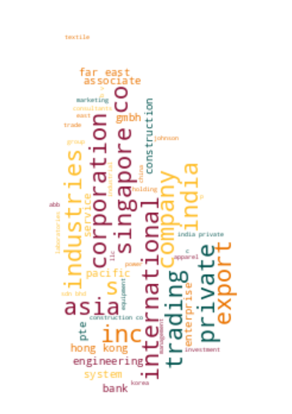
* (1) NF137 - **AB FINLANKA**
* (60) NF421 - **BOVIS MCLACHIAN (PRIVAT)**
* (119) NF328 - **EDEN LLC**
* (178) NF622 - **HAZMA CORPORATION**
* (237) NF260 - **KOREA EXCHANGE BANK**
* (297) NF31 - **MOVING STAR**
* (356) NF495 - **PONIE INTERNATIONAL**
* (415) NF10 - **SLIPCON (S) (PRIVATE) LIMIITED**
* (474) NF203 - **TOPSEAL COMPANY**
* (534) NF711 - **ZTE CORPORATION**

### "FC"
*Sample of 10/396*
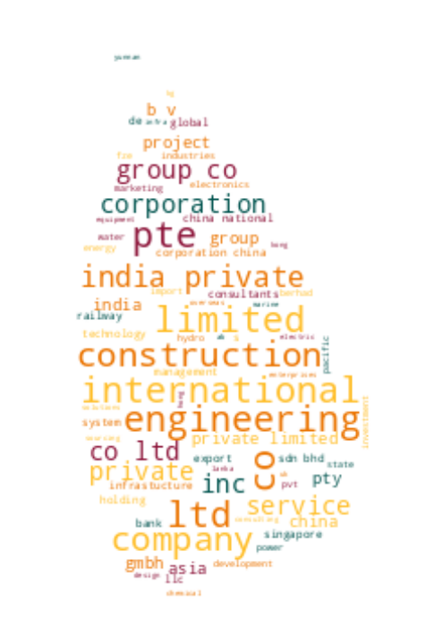
* (1) FC00251549 - **AA JAPAN (PVT) LTD**
* (44) FC1044 - **BIS VAM ANLAGENTECHNIK GMBH**
* (88) FC1253 - **CONTROL PRINT**
* (132) FC1306 - **GBX TRADING FZE**
* (176) FC00268109 - **ITD CEMENTATION INDIA LIMITED**
* (220) FC1313 - **MARTI CONTRACTORS**
* (264) FC1341 - **ORCHESTRA ASIA**
* (308) FC1008 - **SATYAM COMPUTER SERVICES**
* (352) FC00247605 - **THE WESTMINSTER FOUNDATION FOR DEMOCRACY LIMITED**
* (396) FC1444 - **ZIFAM PINNACLE PTY LTD**

### "F"
*Sample of 10/217*
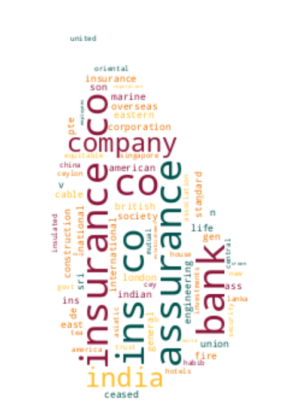
* (1) F234 - **ALCO INSURANCE COMPANY**
* (25) F87 - **BRITISH EQUITABLE ASS CO.**
* (49) F318 - **ENGINEERING CONSTRUCTION CORPORATION**
* (73) F91 - **HOME INSURANCE CO.**
* (97) F77 - **LONDON ASSURANCE**
* (121) F376 - **ORIENTA CONSULTANT INVESTMENTS CO**
* (145) F228 - **SECURITY INSURANCE COMPANY OF NEW HAVEN**
* (169) F257 - **THE BANGALORE FINANCE**
* (193) F126 - **THE UNITED INDIA PROM. ASSON**
* (217) F6 - **YORKSHIRE INSURANCE CO LTC CEASED 1/11/70**

### "PQ"
*Sample of 10/170*
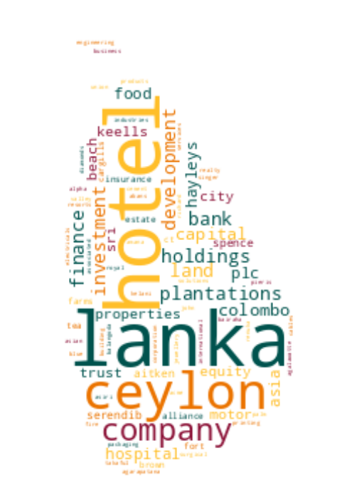
* (1) PQ188 - **ABANS ELECTRICALS**
* (19) PQ25 - **BROWN AND COMPANY**
* (38) PQ90 - **CITY HOUSING AND REAL ESTATE COMPANY**
* (57) PQ19 - **EQUITY PROPERTIES**
* (76) PQ178 - **HUEJAY INTERNATIONAL INVESTMENT**
* (94) PQ179 - **LANKA IOC**
* (113) PQ132 - **PALM GARDEN HOTELS**
* (132) PQ00247201 - **SANASA LIFE INSURANCE COMPANY**
* (151) PQ172 - **THE COLOMBO FORT LAND AND BUILDING**
* (170) PQ181 - **YORK ARCADE HOLDINGS**

### "PBPV"
*Sample of 10/92*
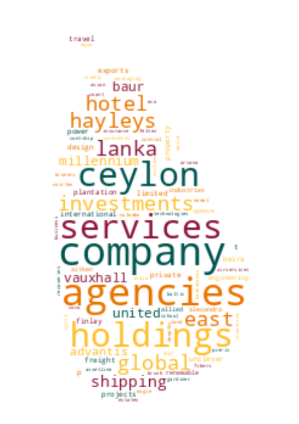
* (1) PB1296PV - **A BAUR AND COMPANY  TRAVEL**
* (11) PB162PV - **ASSETLINE INSURANCE BROKERS**
* (21) PB1567PV - **CYRIL GARDINER**
* (31) PB98PV - **FINLAY AIRLINE AGENCIES**
* (41) PB753PV - **HAYLEYS AVENTURA**
* (51) PB283PV - **KINGS COLLEGE**
* (61) PB382PV - **NATURE HOLDINGS**
* (71) PB854PV - **RENUKA AGRO EXPORTS**
* (81) PB3798PV - **TOKYO CEMENT POWER (LANKA)**
* (92) PB144PV - **WORLD SUBSEA SERVICES**

### "PCC"
*Sample of 10/83*
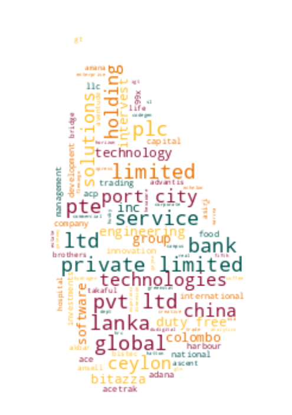
* (1) PCC00287821 - **99X TECHNOLOGY AS**
* (10) PCC00320558 - **ASCENT GLOBAL SOLUTIONS LIMITED**
* (19) PCC00290488 - **CHINA HARBOUR ENGINEERING COMPANY (LANKA) LIMITED.**
* (28) PCC00284521 - **ECHELON TRADE (PVT) LTD.**
* (37) PCC00295997 - **GTN GROUP HOLDING LIMITED**
* (46) PCC00289835 - **INDO-PACIFIC CENTRE PTE. LTD**
* (55) PCC00331682 - **LEGACY HEALTH OVERSEAS (PVT) LTD.**
* (64) PCC00300472 - **PATHFINDER GLOBAL FZCO**
* (73) PCC00284610 - **SATGURU TRAVEL AND TOURISM LLC**
* (83) PCC00292982 - **YOULANKA GROUP LIMITED**

### "PVPB"
*Sample of 10/56*
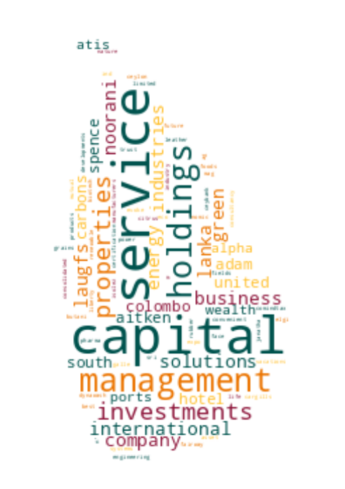
* (1) PV4158PB - **ADAM CARBONS**
* (7) PV75497PB - **CAPITAL TRUST HOLDINGS**
* (13) PV5851PB - **CONSOLIDATED BUSINESS SYSTEMS**
* (19) PV118379PB - **FUTURE LIFE INVESTMENTS**
* (25) PV64818PB - **JANATHA CAPITAL INVESTMENTS**
* (31) PV71746PB - **MUTUAL HOLDINGS**
* (37) PV64694PB - **PADIYAPELELLA HYDROPOWER**
* (43) PV3574PB - **SOUTH ASIA TEXTILES**
* (49) PV3822PB - **SWARNAMAHAL JEWELLERS**
* (56) PV77431PB - **WELIGAMA HOTEL PROPERTIES**

### "PBG"
*Sample of 10/46*
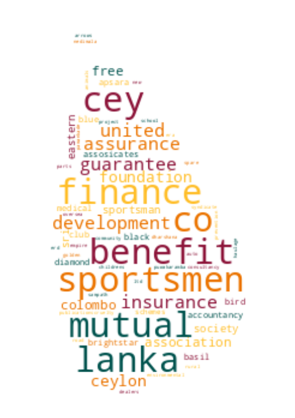
* (1) PBG45 - **ACCOUNTANCY ASSOSICATES**
* (6) PBG48 - **BRIGHTSTAR FINANCE**
* (11) PBG37 - **CONSULTANCY AND FINANCE AND DEVELOPMENT**
* (16) PBG22 - **FREE LANKA SPORTSMEN**
* (21) PBG9 - **OVERSEA CHILDRENS SCHOOL LTD ( BY GUARANTEE)**
* (26) PBG35 - **SAMPATH SPORTSMEN**
* (31) PBG17 - **THE BENEFIT PROVIDENT FUND**
* (36) PBG16 - **THE INSURANCE POLICY HOLDERS SERVICES**
* (41) PBG39 - **THEEPAM INSTITUTE**
* (46) PBG14 - **UNITED SPORTSMAN**

### "PBPQ"
*Sample of 10/30*
* (1) PB3618PQ - **AMANA BANK**
* (4) PB139PQ - **ASIA ASSET FINANCE**
* (7) PB3259PQ - **BIMPUTH LANKA INVESTMENTS**
* (10) PB633PQ - **DFCC VARDHANA BANK**
* (13) PB965PQ - **HNB FINANCE**
* (17) PB3754PQ - **PEOPLE'S  INSURANCE**
* (20) PB62PQ - **SANASA DEVELOPMENT BANK**
* (23) PB917PQ - **SIYAPATHA FINANCE**
* (26) PB689PQ - **TESS AGRO**
* (30) PB4242PQ - **WASKADUWA BEACH RESORT**

### "NPVS"
*Sample of 10/29*
* (1) NPVS40803 - **ALNA WATER SYSTEMS**
* (4) NPVS22400 - **CEETEE INTERNATIONAL**
* (7) NPVS35441 - **DUMBARA FERTILIZERS**
* (10) NPVS15104 - **FIVE STAR EXPORTS**
* (13) NPVS42442 - **HERITAGE SAPPHIRES**
* (16) NPVS38695 - **MCMILLAN CEYLON MARKETING**
* (19) NPVS9611 - **Q-NET**
* (22) NPVS18562 - **SERENDIB INSURANCE BROKERS**
* (25) NPVS11267 - **SILVER SHRIMPS**
* (29) NPVS16673 - **WESTERN TRADING COMPANY**

### "PVPBPQ"
*Sample of 10/12*
* (1) PV5301PBPQ - **ABANS**
* (2) PV3562PB/PQ - **ASIA SIYAKA COMODITIES**
* (3) PVPB13254PQ - **JETWING SYMPHONY**
* (4) PV8330PBPQ - **LAUGFS GAS**
* (5) PVPB7385PQ - **LOTUS HYDRO POWER**
* (7) PV10922PBPQ - **RAIGAM WAYAMBA SALTERNS**
* (8) PVPB8234PQ - **RAMBODA FALLS**
* (9) PV415PBPQ - **RESUS ENERGY**
* (10) PV70371PB/PQ - **SINGHE HOSPITALS**
* (12) PV7617PBPQ - **TEEJAY LANKA**

### "PQPB"
* (1) PQ96PB - **ASIRI CENTRAL HOSPITALS**
* (2) PQ15PB - **ASSOCIATED ELECTRICAL CORPORATION**
* (3) PQ17PB - **ASSOCIATED PROPERTY DEVELOPMENT**
* (4) PQ193PB - **BERUWELA WALK INN**
* (5) PQ99PB - **CEYLON LEATHER PRODUCTS**
* (6) PQ19PB - **EQUITY ONE**
* (7) PQ176PB - **KURUWITA TEXTILE MILLS**
* (8) PQ220PB - **METROPOLITAN RESOURCE HOLDINGS**
* (9) PQ77PB - **MORISON**

### "OC"
* (1) OC111 - **ASTER JETFUEL**
* (2) OC108 - **CAMSO TRADING**
* (3) OC109 - **ENERGY COMMERCE B.V.**
* (4) OC110 - **GLOBAL SOFT TECHNOLOGIES**
* (5) OC104 - **MERCANTILE SEASCAPE SHIPPING COMPANY**
* (6) OC106 - **MERCANTILE SEAWIND SHIPPING COMPANY**
* (7) OC103 - **MERCANTILE SEBORNE SHIPPING**
* (8) OC102 - **POWER HUB INTERNATIONAL SDN PHD**

### "PVS"
* (1) PVS1795 - **CINE-TECH**
* (2) PVS8467 - **LAKMINI ENTERPRISES**
* (3) PVS7888 - **RADIAN PRODUCTS**
* (4) PVS7498 - **WINGS TRAVELS AND TOURS**
* (5) PVS8227 - **WOODLANDS LANKA**

### "PVPQ"
* (1) PV10527PQ - **ADAM CAPITAL**
* (2) PV1618PQ - **AGSTAR**
* (3) PV72355PQ - **ANILANA HOTELS & PROPERTIES**

### "PBPVPB"
* (1) PB64PVPB - **GAC SHIPPING**
* (2) PB553PV/PB - **INTERNATIONAL CONSUMER BRANDS**
* (3) PBPVPB138 - **MCLARENS SHIPPING**

### "PQPBPV"
* (1) PQ98PBPV - **ACE POWER GENERATION MATARA**
* (2) PQ16PB/PV - **ASSOCIATED MOTORWAYS**

### "NFA"
* (1) NF160A - **CO ECHO ENTERPRISES**

### "PBPQPB"
* (1) PB613PQ/PB - **JANASHAKTHI**

### "GAGL"
* (1) GA683GL - **LANKA PRISON FELLOWSHIP**

### "CIA"
* (1) CIA389 - **REFINITIV**

### "PBpv"
* (1) PB1236pv - **UNILEAVER CEYLON SERVICES**

### "PQPV"
* (1) PQ231PV - **UNION RESORTS**
