# Registrar of Companies - Sri Lanka

Data Scraped from Registrar of Companies - Sri Lanka (https://eroc.drc.gov.lk)

Scraped **156,731** Companies ([4.83MB](data/companies.tsv)) as of *2026-08-17 10:18:36*.

*Scraping Progress: 52,728/52,728*
✅✅✅✅✅✅✅✅✅✅

## Selection of Companies
*Sample of 10/156731*
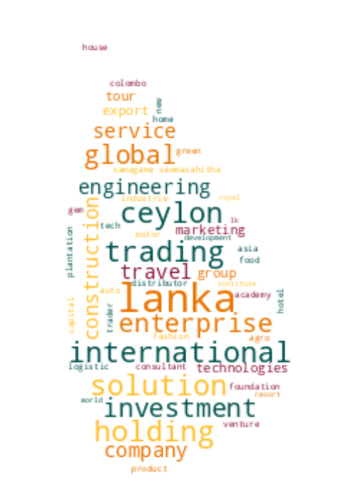
* (1) PCC00287821 - **99X TECHNOLOGY AS**
* (17,415) PV94458 - **BLUECHIP CONSTRUX**
* (34,829) PV6009 - **DIGIZONE COMPUTER TRAINING**
* (52,244) PV00281693 - **GOODS FOR LIFE SIGNATURE**
* (69,658) PV12115 - **KEEN TEX PRINT**
* (87,073) PV00241402 - **MOOI**
* (104,487) PV00278932 - **PRIME FEED**
* (121,902) PV90231 - **SEVENT'S INVESTMENTS HOLDINGS**
* (139,316) PV00247754 - **THE V NECK**
* (156,731) PV118576 - **ZZAPPIT**

## Latest 1,000 Companies
*Sample of 10/1000*
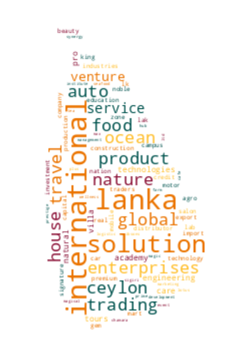
* (1) PV00354167 - **MERIDIAN IMPORT**
* (112) PV00355073 - **POPO KIDS PARK**
* (223) PB00356112 - **ATDA TRAVELS & TOURS**
* (334) PV00357331 - **NET LANKA TRAVELS**
* (445) PV00358711 - **SABBIADORO BEACH HOTEL**
* (556) PV00359954 - **GRID-EV**
* (667) PV00361353 - **LOTUS BREEZE**
* (778) PV00363398 - **AV HERTZ**
* (889) PV00365412 - **ORIENTAL NEST LANKA**
* (1,000) PV00370482 - **B PLUS EVENTS & ENTERTAINMENT**

## Selection for Companies by Type

### "PV"
*Sample of 10/142463*
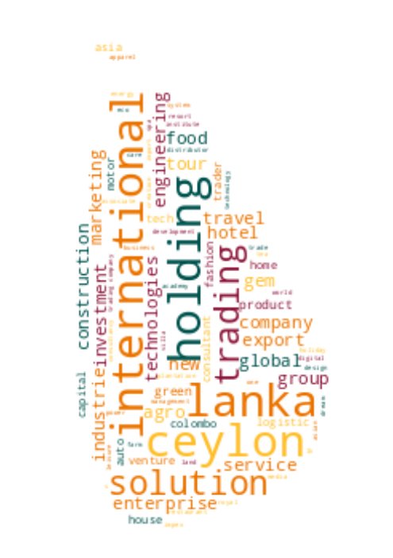
* (1) PV20853 - **A AND A ASSOCIATES**
* (15,830) PV00235921 - **BLUE STAR CONFECTIONERIES**
* (31,659) PV00327712 - **DIGITAL WEALTH ERA**
* (47,488) PV00220983 - **GOLDEN LOTUS RESTAURANTS**
* (63,317) PV90736 - **KASTHURI INVESTMENT**
* (79,146) PV00248192 - **MOBILEWORLD.LK**
* (94,975) PV19807 - **PREMADASA OFF-SET PLATE MAKERS**
* (110,804) PV00200345 - **SEYLION RENEWABLE ENERGY**
* (126,633) PV75157 - **THENUWARA TRANSPORT SERVICES**
* (142,463) PV118576 - **ZZAPPIT**

### ""
*Sample of 10/6052*
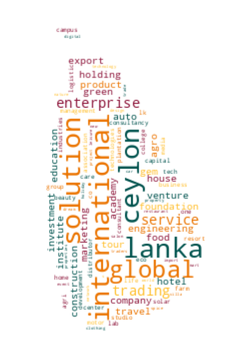
* (1)  - **A BRAND HOLDINGS**
* (673)  - **BLACKPOOL HYDRO POWER**
* (1,345)  - **DHANARA ENTERPRISES LANKA**
* (2,018)  - **GOLDEN RULE**
* (2,690)  - **KASHIKOI NIHONGO GAKKOU**
* (3,362)  - **MR BARBER**
* (4,035)  - **PRIME FOOD EXPORT**
* (4,707)  - **SI ENGINEERING**
* (5,379)  - **TIINY VISA SERVICES**
* (6,052)  - **ZYPHER CLOUD**

### "PB"
*Sample of 10/2877*
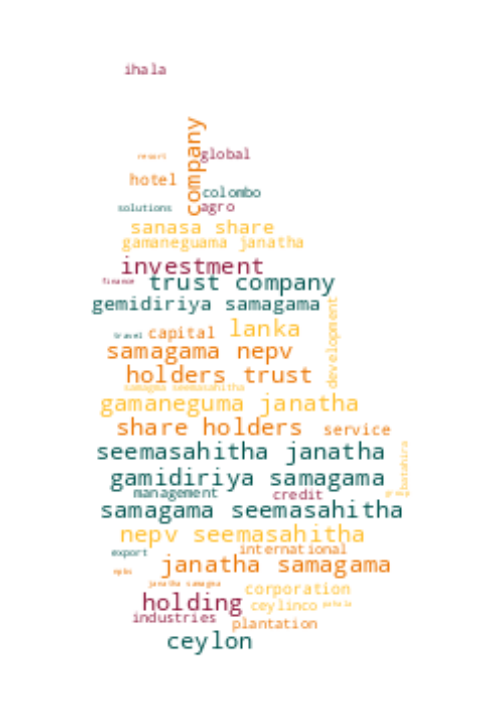
* (1) PB5111 - **A ONE TOP TRADING**
* (320) PB5247 - **CHINA HARBOUR ENGINEERING COMPANY (LANKA)**
* (640) PB00351566 - **HAYLEYS GREEN ENERGY HOLDINGS**
* (959) PB233 - **MERCANTILE MERCHANT BANK**
* (1,279) PB1645 - **SEEMASAHITHA (JANATHA( ALUGALGE GAMIDIRIIYA SAMAGAMA (NEPV 191)**
* (1,598) PB1342 - **SEEMASAHITHA (JANATHA) MIHINDU GAMIDIRIYA SAMAGAMA**
* (1,918) PB4007 - **SEEMASAHITHA DAPANE RUWANKOTHA GAMANEGUMA JANATHA SAMAGAMA**
* (2,237) PB4038 - **SEEMASAHITHA NAWANAGARAYAGAMA GAMANEGUMA JANATHA SAMAGAMA**
* (2,557) PB328 - **SILVERSTOCK**
* (2,877) PB118 - **ZYREX POWER COMPANY**

### "GA"
*Sample of 10/2717*
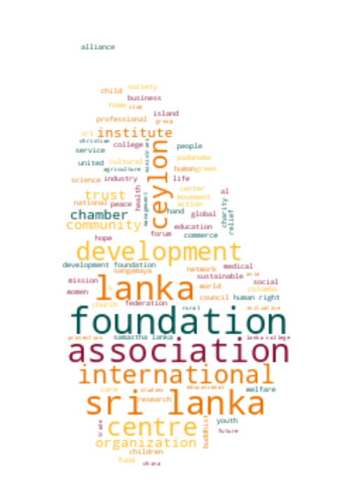
* (1) GA00321009 - **A HAND OF HOPE**
* (302) GA00210195 - **AYURVEDIC DRUGS IMPORTERS ASSOCIATION**
* (604) GA3066 - **CONSTRUCTION INDUSTRY SKILLS COUNCIL**
* (906) GA00220180 - **GOTHAMI PSYCHOLOGICAL COUNSELING & SPIRITUAL DEVELOPMENT CENTER**
* (1,208) GA3464 - **JANA HITHA SUWAYA FOUNDATION**
* (1,509) GA387 - **MATARA DISTRICT WOMEN`S CHAMBER OF COMMERS AND INDUSTRY**
* (1,811) GA2588 - **POSITIVE WOMEN`S NETWORK**
* (2,113) GA00257749 - **SISU NENA PRADEEPA FOUNDATION**
* (2,415) GA9 - **THE GAMI SEVA SEVANA**
* (2,717) GA470 - **ZONTA CLUB II OF COLOMBO**

### "GL"
*Sample of 10/902*
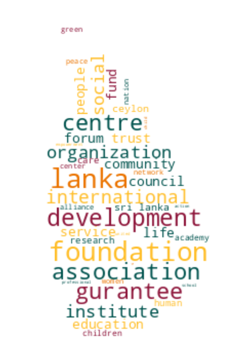
* (1) GL00223389 - **A LITTLE  FOUNDATION**
* (101) GL00305527 - **AYUVA EARTHFIRST FOUNDATION**
* (201) GL00240810 - **DIGITAL MARKETING ASSOCIATION OF LANKA**
* (301) GL2230 - **GREEN LANKA MICRO CREDIT**
* (401) GL2173 - **JANATHAKSHAN (GUARANTEE)**
* (501) GL00293799 - **MEENAMBAL ANNAMALAY FOUNDATION**
* (601) GL00261708 - **PSYCHOLOGICAL ADVISORY CENTRE**
* (701) GL00209561 - **SIVALINGAM MEDICAL CENTRE**
* (801) GL2450 - **TRINCO AID**
* (902) GL2310 - **ZOE LIFE INTERNATIONAL (GURANTEE)**

### "NF"
*Sample of 10/538*
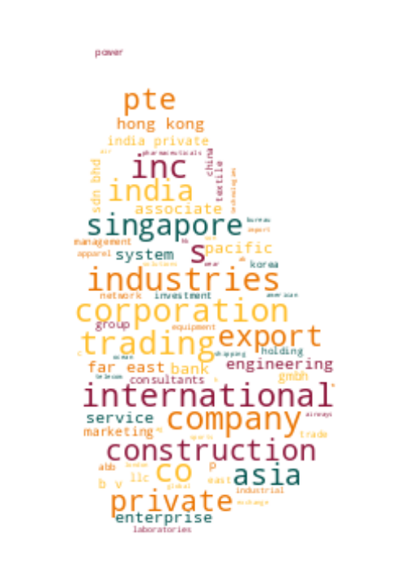
* (1) NF137 - **AB FINLANKA**
* (60) NF421 - **BOVIS MCLACHIAN (PRIVAT)**
* (120) NF182 - **EDEN TOYS INC.**
* (180) NF309 - **HELLY HANSEN (FAR EAST)**
* (239) NF260 - **KOREA EXCHANGE BANK**
* (299) NF31 - **MOVING STAR**
* (359) NF287 - **PRAJ INDUSTRIES L**
* (418) NF108 - **SKY TRACK LMITED**
* (478) NF203 - **TOPSEAL COMPANY**
* (538) NF711 - **ZTE CORPORATION**

### "FC"
*Sample of 10/397*
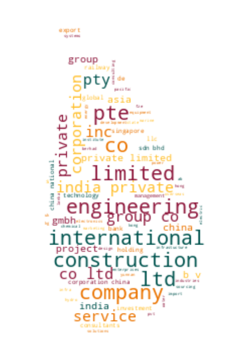
* (1) FC00251549 - **AA JAPAN (PVT) LTD**
* (45) FC1036 - **BIWATER CONTRACTING B.V.**
* (89) FC1441 - **COOPERATIVE HOUSING FOUNDATION (LIAISON OFFICE)**
* (133) FC1306 - **GBX TRADING FZE**
* (177) FC1274 - **JANSON BRIDGING INTERNATIONAL B.V.**
* (221) FC00222714 - **MAST INDUSTRIES (FAR EAST) LIMITED**
* (265) FC1390 - **ORIENTAL CONSULTANTS GLOBAL CO.,**
* (309) FC00211497 - **SBT CO., LTD.**
* (353) FC00247605 - **THE WESTMINSTER FOUNDATION FOR DEMOCRACY LIMITED**
* (397) FC1444 - **ZIFAM PINNACLE PTY LTD**

### "F"
*Sample of 10/222*
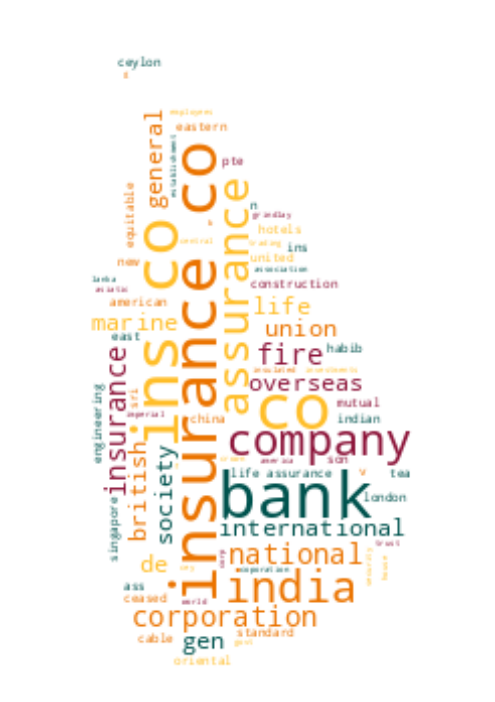
* (1) F234 - **ALCO INSURANCE COMPANY**
* (25) F132 - **BPTIST MISSIONERY SOCIETY**
* (50) F100 - **EMPLOYEES LIAB ARSON CO**
* (74) F375 - **HARRIS CORPORATION (BERMUDA)**
* (99) F47 - **LONDON & LANKASHIRE INSURANCE CO.**
* (123) F199 - **NORWICK UNION LIFE ASSURANCE SOCIETY**
* (148) F162 - **SAMPON & CO**
* (172) F203 - **THE ANGLE FRENCH DRUG CO .**
* (197) F193 - **THE STANDARD GENERAL ASSURANCE CO.**
* (222) F6 - **YORKSHIRE INSURANCE CO LTC CEASED 1/11/70**

### "PQ"
*Sample of 10/172*
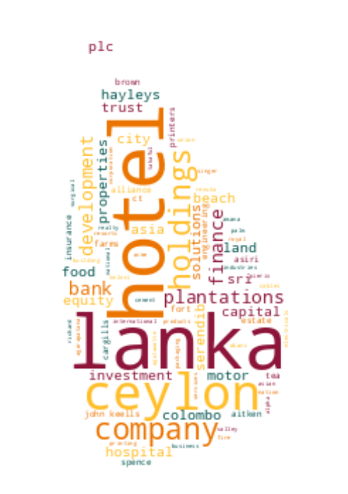
* (1) PQ188 - **ABANS ELECTRICALS**
* (20) PQ202 - **BROWNS BEACH HOTELS**
* (39) PQ71 - **COLOMBO CITY HOLDINGS**
* (58) PQ53 - **EQUITY SEVEN**
* (77) PQ72 - **HUNAS HOLDINGS**
* (96) PQ179 - **LANKA IOC**
* (115) PQ132 - **PALM GARDEN HOTELS**
* (134) PQ00247201 - **SANASA LIFE INSURANCE COMPANY**
* (153) PQ172 - **THE COLOMBO FORT LAND AND BUILDING**
* (172) PQ181 - **YORK ARCADE HOLDINGS**

### "PBPV"
*Sample of 10/92*
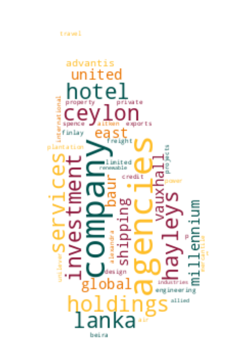
* (1) PB1296PV - **A BAUR AND COMPANY  TRAVEL**
* (11) PB162PV - **ASSETLINE INSURANCE BROKERS**
* (21) PB1567PV - **CYRIL GARDINER**
* (31) PB98PV - **FINLAY AIRLINE AGENCIES**
* (41) PB753PV - **HAYLEYS AVENTURA**
* (51) PB283PV - **KINGS COLLEGE**
* (61) PB382PV - **NATURE HOLDINGS**
* (71) PB854PV - **RENUKA AGRO EXPORTS**
* (81) PB3798PV - **TOKYO CEMENT POWER (LANKA)**
* (92) PB144PV - **WORLD SUBSEA SERVICES**

### "PCC"
*Sample of 10/90*
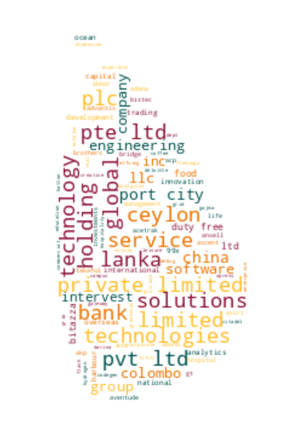
* (1) PCC00287821 - **99X TECHNOLOGY AS**
* (10) PCC00320558 - **ASCENT GLOBAL SOLUTIONS LIMITED**
* (20) PCC00285477 - **CHINA HARBOUR ENGINEERING COMPANY LIMITED**
* (30) PCC00362086 - **ELFVING OFF-GRID COMPANY (PRIVATE) LIMITED.**
* (40) PCC00295997 - **GTN GROUP HOLDING LIMITED**
* (50) PCC00289835 - **INDO-PACIFIC CENTRE PTE. LTD**
* (60) PCC00331682 - **LEGACY HEALTH OVERSEAS (PVT) LTD.**
* (70) PCC00300472 - **PATHFINDER GLOBAL FZCO**
* (80) PCC00271536 - **SCALLOP (PVT) LTD**
* (90) PCC00292982 - **YOULANKA GROUP LIMITED**

### "PVPB"
*Sample of 10/56*
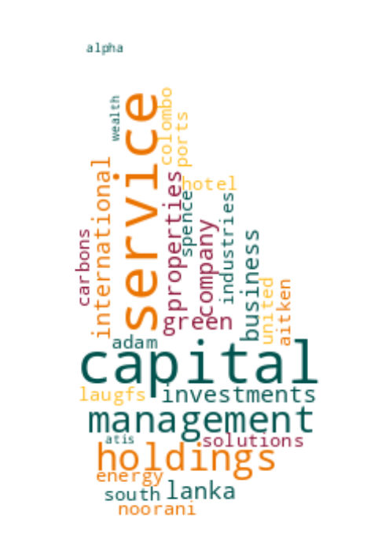
* (1) PV4158PB - **ADAM CARBONS**
* (7) PV75497PB - **CAPITAL TRUST HOLDINGS**
* (13) PV5851PB - **CONSOLIDATED BUSINESS SYSTEMS**
* (19) PV118379PB - **FUTURE LIFE INVESTMENTS**
* (25) PV64818PB - **JANATHA CAPITAL INVESTMENTS**
* (31) PV71746PB - **MUTUAL HOLDINGS**
* (37) PV64694PB - **PADIYAPELELLA HYDROPOWER**
* (43) PV3574PB - **SOUTH ASIA TEXTILES**
* (49) PV3822PB - **SWARNAMAHAL JEWELLERS**
* (56) PV77431PB - **WELIGAMA HOTEL PROPERTIES**

### "PBG"
*Sample of 10/46*
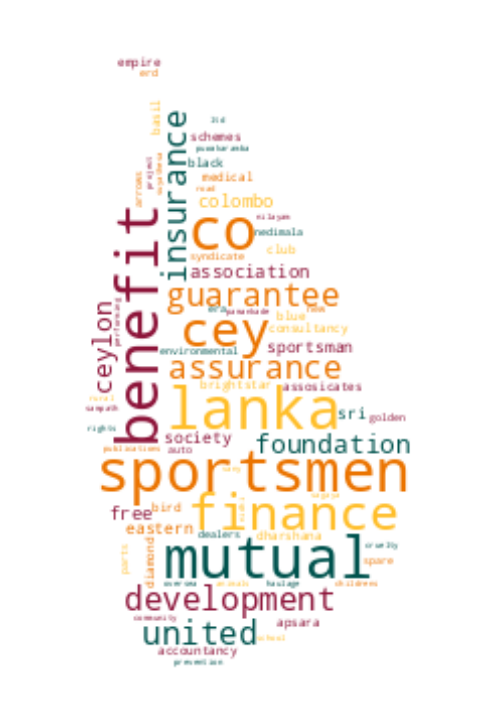
* (1) PBG45 - **ACCOUNTANCY ASSOSICATES**
* (6) PBG48 - **BRIGHTSTAR FINANCE**
* (11) PBG37 - **CONSULTANCY AND FINANCE AND DEVELOPMENT**
* (16) PBG22 - **FREE LANKA SPORTSMEN**
* (21) PBG9 - **OVERSEA CHILDRENS SCHOOL LTD ( BY GUARANTEE)**
* (26) PBG35 - **SAMPATH SPORTSMEN**
* (31) PBG17 - **THE BENEFIT PROVIDENT FUND**
* (36) PBG16 - **THE INSURANCE POLICY HOLDERS SERVICES**
* (41) PBG39 - **THEEPAM INSTITUTE**
* (46) PBG14 - **UNITED SPORTSMAN**

### "PBPQ"
*Sample of 10/30*
* (1) PB3618PQ - **AMANA BANK**
* (4) PB139PQ - **ASIA ASSET FINANCE**
* (7) PB3259PQ - **BIMPUTH LANKA INVESTMENTS**
* (10) PB633PQ - **DFCC VARDHANA BANK**
* (13) PB965PQ - **HNB FINANCE**
* (17) PB3754PQ - **PEOPLE'S  INSURANCE**
* (20) PB62PQ - **SANASA DEVELOPMENT BANK**
* (23) PB917PQ - **SIYAPATHA FINANCE**
* (26) PB689PQ - **TESS AGRO**
* (30) PB4242PQ - **WASKADUWA BEACH RESORT**

### "NPVS"
*Sample of 10/29*
* (1) NPVS40803 - **ALNA WATER SYSTEMS**
* (4) NPVS22400 - **CEETEE INTERNATIONAL**
* (7) NPVS35441 - **DUMBARA FERTILIZERS**
* (10) NPVS15104 - **FIVE STAR EXPORTS**
* (13) NPVS42442 - **HERITAGE SAPPHIRES**
* (16) NPVS38695 - **MCMILLAN CEYLON MARKETING**
* (19) NPVS9611 - **Q-NET**
* (22) NPVS18562 - **SERENDIB INSURANCE BROKERS**
* (25) NPVS11267 - **SILVER SHRIMPS**
* (29) NPVS16673 - **WESTERN TRADING COMPANY**

### "PVPBPQ"
*Sample of 10/12*
* (1) PV5301PBPQ - **ABANS**
* (2) PV3562PB/PQ - **ASIA SIYAKA COMODITIES**
* (3) PVPB13254PQ - **JETWING SYMPHONY**
* (4) PV8330PBPQ - **LAUGFS GAS**
* (5) PVPB7385PQ - **LOTUS HYDRO POWER**
* (7) PV10922PBPQ - **RAIGAM WAYAMBA SALTERNS**
* (8) PVPB8234PQ - **RAMBODA FALLS**
* (9) PV415PBPQ - **RESUS ENERGY**
* (10) PV70371PB/PQ - **SINGHE HOSPITALS**
* (12) PV7617PBPQ - **TEEJAY LANKA**

### "PQPB"
* (1) PQ96PB - **ASIRI CENTRAL HOSPITALS**
* (2) PQ15PB - **ASSOCIATED ELECTRICAL CORPORATION**
* (3) PQ17PB - **ASSOCIATED PROPERTY DEVELOPMENT**
* (4) PQ193PB - **BERUWELA WALK INN**
* (5) PQ99PB - **CEYLON LEATHER PRODUCTS**
* (6) PQ19PB - **EQUITY ONE**
* (7) PQ176PB - **KURUWITA TEXTILE MILLS**
* (8) PQ220PB - **METROPOLITAN RESOURCE HOLDINGS**
* (9) PQ77PB - **MORISON**

### "OC"
* (1) OC111 - **ASTER JETFUEL**
* (2) OC108 - **CAMSO TRADING**
* (3) OC109 - **ENERGY COMMERCE B.V.**
* (4) OC110 - **GLOBAL SOFT TECHNOLOGIES**
* (5) OC104 - **MERCANTILE SEASCAPE SHIPPING COMPANY**
* (6) OC106 - **MERCANTILE SEAWIND SHIPPING COMPANY**
* (7) OC103 - **MERCANTILE SEBORNE SHIPPING**
* (8) OC102 - **POWER HUB INTERNATIONAL SDN PHD**

### "PVS"
* (1) PVS1795 - **CINE-TECH**
* (2) PVS8467 - **LAKMINI ENTERPRISES**
* (3) PVS7888 - **RADIAN PRODUCTS**
* (4) PVS7498 - **WINGS TRAVELS AND TOURS**
* (5) PVS8227 - **WOODLANDS LANKA**

### "PVPQ"
* (1) PV10527PQ - **ADAM CAPITAL**
* (2) PV1618PQ - **AGSTAR**
* (3) PV72355PQ - **ANILANA HOTELS & PROPERTIES**

### "PBPVPB"
* (1) PB64PVPB - **GAC SHIPPING**
* (2) PB553PV/PB - **INTERNATIONAL CONSUMER BRANDS**
* (3) PBPVPB138 - **MCLARENS SHIPPING**

### "PQPBPV"
* (1) PQ98PBPV - **ACE POWER GENERATION MATARA**
* (2) PQ16PB/PV - **ASSOCIATED MOTORWAYS**

### "NFA"
* (1) NF160A - **CO ECHO ENTERPRISES**

### "PBPQPB"
* (1) PB613PQ/PB - **JANASHAKTHI**

### "GAGL"
* (1) GA683GL - **LANKA PRISON FELLOWSHIP**

### "CIA"
* (1) CIA389 - **REFINITIV**

### "PBpv"
* (1) PB1236pv - **UNILEAVER CEYLON SERVICES**

### "PQPV"
* (1) PQ231PV - **UNION RESORTS**
