# Registrar of Companies - Sri Lanka

Data Scraped from Registrar of Companies - Sri Lanka (https://eroc.drc.gov.lk)

Scraped **161,808** Companies ([4.98MB](data/companies.tsv)) as of *2026-10-10 10:15:01*.

*Scraping Progress: 52,728/52,728*
✅✅✅✅✅✅✅✅✅✅

## Selection of Companies
*Sample of 10/161808*
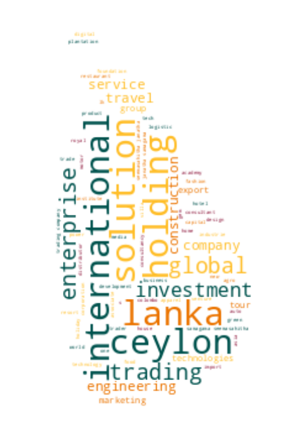
* (1) PCC00287821 - **99X TECHNOLOGY AS**
* (17,979) PV129905 - **BLUE SPRINGS MOTOR COMPANY**
* (35,958) PV00232547 - **DIGITAL 101**
* (53,936) PV115847 - **GOOD IDEA ADVERTISING**
* (71,915) PV108164 - **KENSIRI PROR**
* (89,893) PV00301780 - **MORNING OF EARTH**
* (107,872) PV108305 - **PREMIO GLOBAL DYNAICS**
* (125,850) PV00210683 - **SENU AGRO AND FARMS**
* (143,829) PV00249234 - **THE REAL ESTATE PLATFORM**
* (161,808) PV118576 - **ZZAPPIT**

## Latest 1,000 Companies
*Sample of 10/1000*
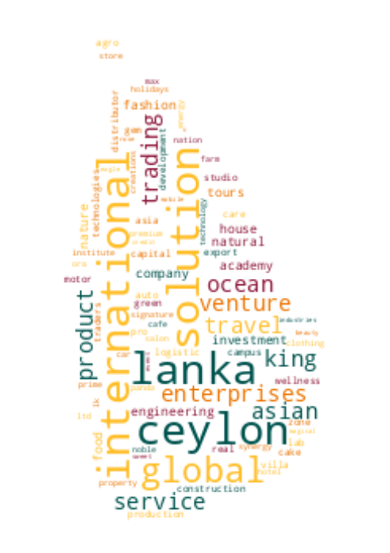
* (1) PV00360266 - **PRANA WELLNESS BY LUCKY**
* (112) PV00361271 - **HETHEN LIVE**
* (223) PV00362477 - **OCEAN SOUL COLLECTIVE**
* (334) PV00363850 - **WIXPANEL**
* (445) PV00364941 - **KING FOOD  AND TEA CEYLON**
* (556) PV00366314 - **VNV ENGINEERING**
* (667) PV00367738 - **KRIST BEVERAGES CEYLON**
* (778) PV00369473 - **ASIA GLOBAL EXPORTS**
* (889) PV00371864 - **MAGAMPURA LANDSCAPING**
* (1,000) PV00377042 - **ROSS SERVICES**

## Selection for Companies by Type

### "PV"
*Sample of 10/147066*
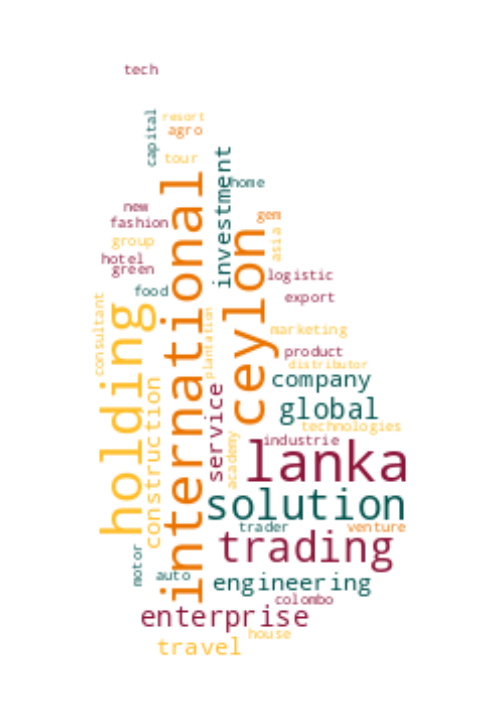
* (1) PV20853 - **A AND A ASSOCIATES**
* (16,341) PV00210528 - **BLUE PEARL INVESTMENTS**
* (32,682) PV17106 - **DIGICOM SECURITY SERVICES**
* (49,022) PV124569 - **GOLDEN ARGO**
* (65,363) PV00300738 - **KAYODHA**
* (81,703) PV4760 - **MODERN PACKAGING INDUSTRIES**
* (98,044) PV76138 - **PRAGATHI HOLDINGS**
* (114,384) PV00219702 - **SERANDIB MOVERS**
* (130,725) PV79740 - **THE STRATEGISTS**
* (147,066) PV118576 - **ZZAPPIT**

### ""
*Sample of 10/6364*
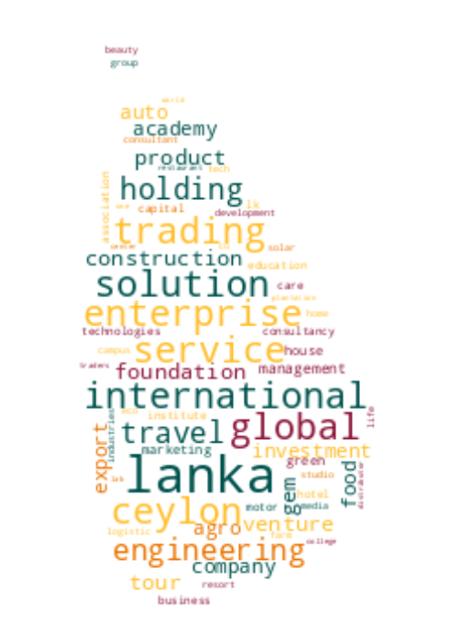
* (1)  - **A BRAND HOLDINGS**
* (708)  - **BIOMA HEALTHCARE**
* (1,415)  - **DG ELECTRICAL & CCTV**
* (2,122)  - **GOOD GUIDE**
* (2,829)  - **KEILY BRAND INTERNATIONAL**
* (3,536)  - **MULTIVERSE PRODUCTS**
* (4,243)  - **PREMIUM CARE DENTAL CENTER**
* (4,950)  - **SHANI TRADING INTERNATIONAL**
* (5,657)  - **THYA INTERNATIONAL**
* (6,364)  - **ZYPHER CLOUD**

### "PB"
*Sample of 10/2918*
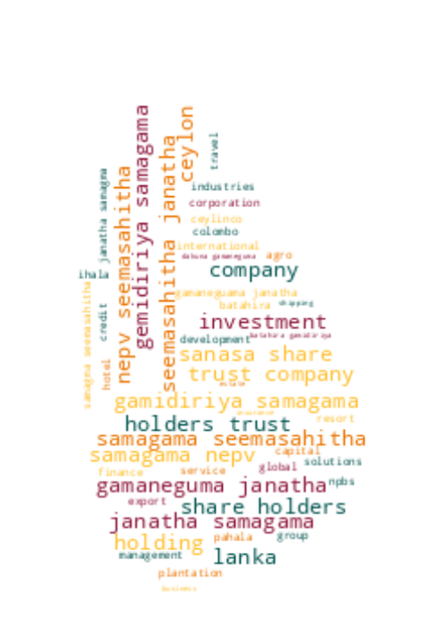
* (1) PB5111 - **A ONE TOP TRADING**
* (325) PB709 - **CHAMBERS FOR PATENTS AND TRADE MARKS CEYLON**
* (649) PB1487 - **HAYLEYS FABRIC SOLUTIONS**
* (973) PB349 - **MERCANTILE GLOBAL SHIPPING**
* (1,297) PB1638 - **SAVIJANA LANKA COMMUNITY DEVELOPMENT FINANCE  (NPBS 1376)**
* (1,621) PB3052 - **SEEMASAHITHA (JANATHA) MAWATALANDA GAMIDIRIYA SAMAGAMA**
* (1,945) PB3923 - **SEEMASAHITHA DABAWINNA GAMANEGUMA JANATHA SAMAGAMA**
* (2,269) PB4461 - **SEEMASAHITHA MURUTHAWELA GAMANEGUAMA JANATHA SAMAGAMA**
* (2,593) PB00272079 - **SIGIRI GUAVA**
* (2,918) PB118 - **ZYREX POWER COMPANY**

### "GA"
*Sample of 10/2793*
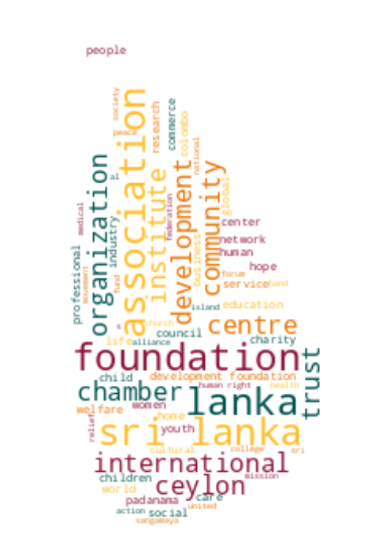
* (1) GA00321009 - **A HAND OF HOPE**
* (311) GA00274957 - **BAITHUL MAAL FUND**
* (621) GA2220 - **COMPASSION INTERNATIONAL LANKA**
* (931) GA00215276 - **GOOD SAMARITAN REHABILITATION CENTER**
* (1,241) GA3464 - **JANA HITHA SUWAYA FOUNDATION**
* (1,552) GA697 - **MAWBIMA LANKA PADANAMA**
* (1,862) GA00270752 - **POLICY DIALOGUE INITIATIVE**
* (2,172) GA00205665 - **SHRI YOGI FOUNDATION**
* (2,482) GA00289855 - **THE EBENEZER HILL**
* (2,793) GA470 - **ZONTA CLUB II OF COLOMBO**

### "GL"
*Sample of 10/924*
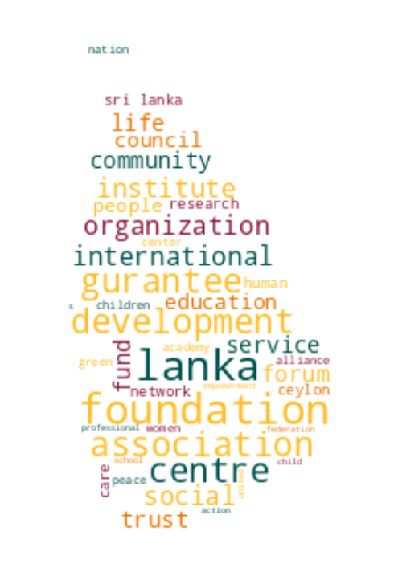
* (1) GL00223389 - **A LITTLE  FOUNDATION**
* (103) GL2198 - **AXIOM TRAINING SOLUTIONS**
* (206) GL00204865 - **DIFFERENTLY ABLE TAMILS ASSOCIATION**
* (308) GL00284189 - **GREEN ASSOCIATION FOR SOCIAL DEVELOPMENT**
* (411) GL2130 - **JARS OF CLAY**
* (513) GL73 - **MERCY FOUNDATION**
* (616) GL00242716 - **PROFESSOR H.Y. RANJIT PERERA INSTITUTE FOR APPLIED RESEARCH**
* (718) GL00231601 - **SIMPLY UNIQUE - LANKA**
* (821) GL2205 - **TRADERS ASSOCIATION VAVUNIYA**
* (924) GL2310 - **ZOE LIFE INTERNATIONAL (GURANTEE)**

### "NF"
*Sample of 10/543*
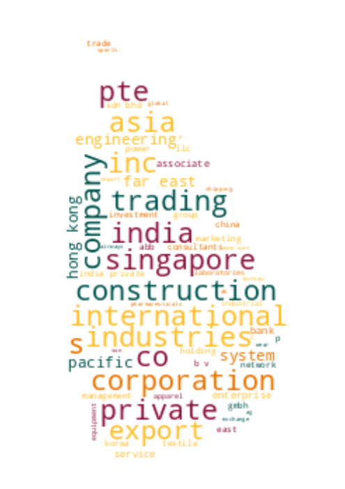
* (1) NF137 - **AB FINLANKA**
* (61) NF421 - **BOVIS MCLACHIAN (PRIVAT)**
* (121) NF182 - **EDEN TOYS INC.**
* (181) NF309 - **HELLY HANSEN (FAR EAST)**
* (241) NF317 - **KOREA HEAVY INDUSTRIES AND CONSTRUCTION CO.**
* (302) NF278 - **MY INTERNATIONAL CO.**
* (362) NF495 - **PONIE INTERNATIONAL**
* (422) NF118 - **SKD PACIFIC**
* (482) NF80 - **TOMEN HOTLINE (HONG-KONG)**
* (543) NF711 - **ZTE CORPORATION**

### "FC"
*Sample of 10/400*
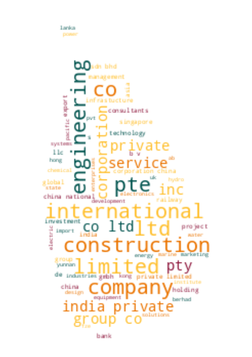
* (1) FC00251549 - **AA JAPAN (PVT) LTD**
* (45) FC1036 - **BIWATER CONTRACTING B.V.**
* (89) FC1253 - **CONTROL PRINT**
* (134) FC1306 - **GBX TRADING FZE**
* (178) FC1244 - **JAPAN AIRPORT CONSULTANTS, INC.**
* (222) FC1263 - **MASTERCARD SINGAPORE HOLDING PTE.**
* (267) FC1228 - **OTT HYDROMET GMBH**
* (311) FC00211497 - **SBT CO., LTD.**
* (355) FC00247605 - **THE WESTMINSTER FOUNDATION FOR DEMOCRACY LIMITED**
* (400) FC1444 - **ZIFAM PINNACLE PTY LTD**

### "F"
*Sample of 10/227*
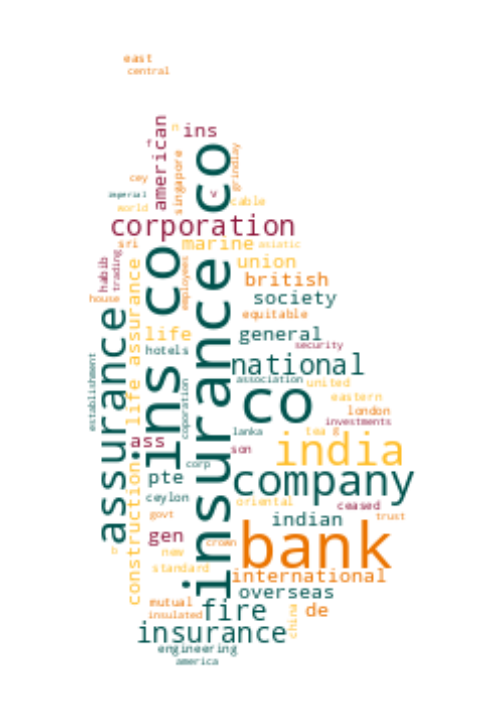
* (1) F234 - **ALCO INSURANCE COMPANY**
* (26) F87 - **BRITISH EQUITABLE ASS CO.**
* (51) F318 - **ENGINEERING CONSTRUCTION CORPORATION**
* (76) F306 - **HYATT OF CEYLON**
* (101) F77 - **LONDON ASSURANCE**
* (126) F315 - **OBEROI HOTELS (INDIA) PRIVATE**
* (151) F59 - **ROYAL INSURANCE CO.**
* (176) F332 - **THAI AIRWAYS INTERNATIONAL**
* (201) F250 - **THE PIONERR FIRE & GEN INS CO**
* (227) F6 - **YORKSHIRE INSURANCE CO LTC CEASED 1/11/70**

### "PQ"
*Sample of 10/176*
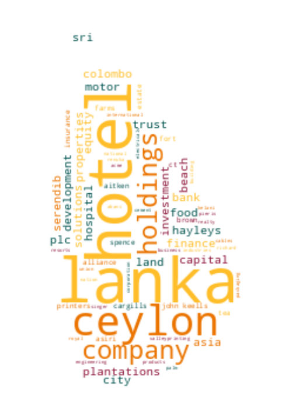
* (1) PQ188 - **ABANS ELECTRICALS**
* (20) PQ25 - **BROWN AND COMPANY**
* (39) PQ90 - **CITY HOUSING AND REAL ESTATE COMPANY**
* (59) PQ53 - **EQUITY SEVEN**
* (78) PQ72 - **HUNAS HOLDINGS**
* (98) PQ179 - **LANKA IOC**
* (117) PQ141 - **OFFICE EQUIPMENT**
* (137) PQ192 - **SAMSON INTERNATIONAL**
* (156) PQ84 - **THE AUTODROME**
* (176) PQ181 - **YORK ARCADE HOLDINGS**

### "PCC"
*Sample of 10/95*
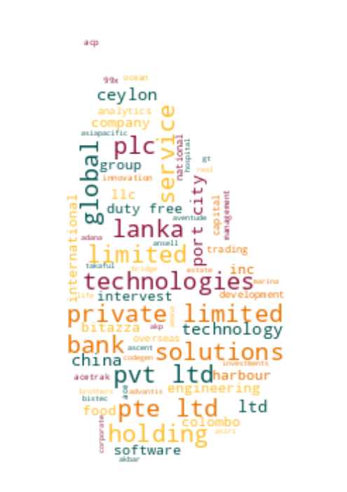
* (1) PCC00287821 - **99X TECHNOLOGY AS**
* (11) PCC00320558 - **ASCENT GLOBAL SOLUTIONS LIMITED**
* (21) PCC00290488 - **CHINA HARBOUR ENGINEERING COMPANY (LANKA) LIMITED.**
* (32) PCC00362086 - **ELFVING OFF-GRID COMPANY (PRIVATE) LIMITED.**
* (42) PCC00295997 - **GTN GROUP HOLDING LIMITED**
* (53) PCC00332665 - **INTERVEST ADVANCED TECHNOLOGIES (PRIVATE) LIMITED.**
* (63) PCC00325152 - **MANANTIAL SOLUTIONS (PRIVATE) LIMITED.**
* (74) PCC00300472 - **PATHFINDER GLOBAL FZCO**
* (84) PCC00284610 - **SATGURU TRAVEL AND TOURISM LLC**
* (95) PCC00292982 - **YOULANKA GROUP LIMITED**

### "PBPV"
*Sample of 10/92*
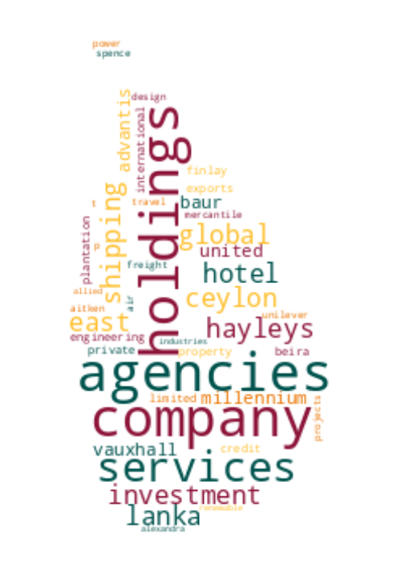
* (1) PB1296PV - **A BAUR AND COMPANY  TRAVEL**
* (11) PB162PV - **ASSETLINE INSURANCE BROKERS**
* (21) PB1567PV - **CYRIL GARDINER**
* (31) PB98PV - **FINLAY AIRLINE AGENCIES**
* (41) PB753PV - **HAYLEYS AVENTURA**
* (51) PB283PV - **KINGS COLLEGE**
* (61) PB382PV - **NATURE HOLDINGS**
* (71) PB854PV - **RENUKA AGRO EXPORTS**
* (81) PB3798PV - **TOKYO CEMENT POWER (LANKA)**
* (92) PB144PV - **WORLD SUBSEA SERVICES**

### "PVPB"
*Sample of 10/56*
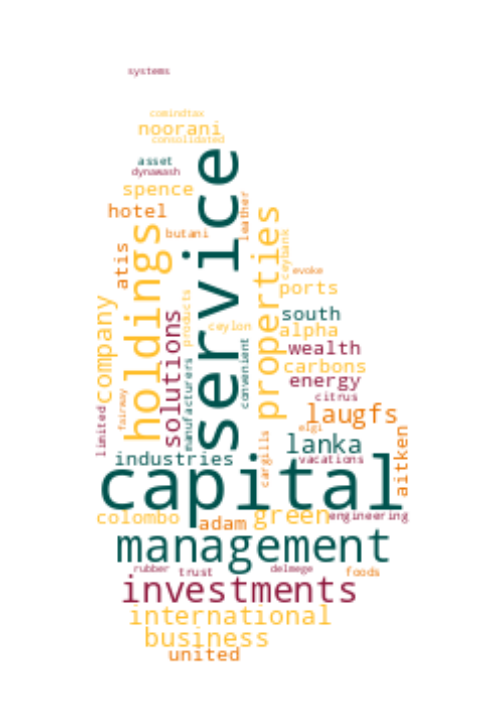
* (1) PV4158PB - **ADAM CARBONS**
* (7) PV75497PB - **CAPITAL TRUST HOLDINGS**
* (13) PV5851PB - **CONSOLIDATED BUSINESS SYSTEMS**
* (19) PV118379PB - **FUTURE LIFE INVESTMENTS**
* (25) PV64818PB - **JANATHA CAPITAL INVESTMENTS**
* (31) PV71746PB - **MUTUAL HOLDINGS**
* (37) PV64694PB - **PADIYAPELELLA HYDROPOWER**
* (43) PV3574PB - **SOUTH ASIA TEXTILES**
* (49) PV3822PB - **SWARNAMAHAL JEWELLERS**
* (56) PV77431PB - **WELIGAMA HOTEL PROPERTIES**

### "PBG"
*Sample of 10/46*
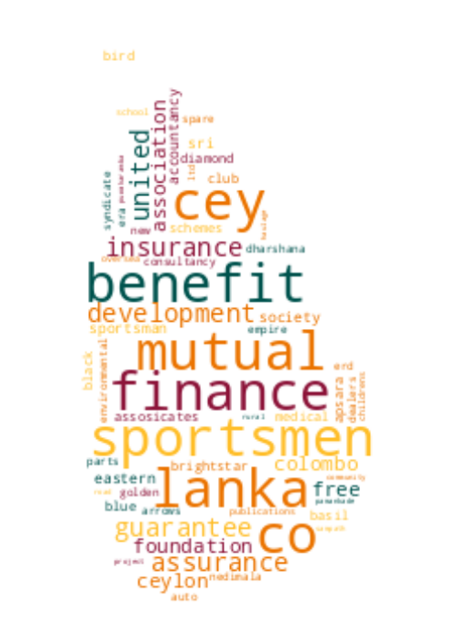
* (1) PBG45 - **ACCOUNTANCY ASSOSICATES**
* (6) PBG48 - **BRIGHTSTAR FINANCE**
* (11) PBG37 - **CONSULTANCY AND FINANCE AND DEVELOPMENT**
* (16) PBG22 - **FREE LANKA SPORTSMEN**
* (21) PBG9 - **OVERSEA CHILDRENS SCHOOL LTD ( BY GUARANTEE)**
* (26) PBG35 - **SAMPATH SPORTSMEN**
* (31) PBG17 - **THE BENEFIT PROVIDENT FUND**
* (36) PBG16 - **THE INSURANCE POLICY HOLDERS SERVICES**
* (41) PBG39 - **THEEPAM INSTITUTE**
* (46) PBG14 - **UNITED SPORTSMAN**

### "PBPQ"
*Sample of 10/30*
* (1) PB3618PQ - **AMANA BANK**
* (4) PB139PQ - **ASIA ASSET FINANCE**
* (7) PB3259PQ - **BIMPUTH LANKA INVESTMENTS**
* (10) PB633PQ - **DFCC VARDHANA BANK**
* (13) PB965PQ - **HNB FINANCE**
* (17) PB3754PQ - **PEOPLE'S  INSURANCE**
* (20) PB62PQ - **SANASA DEVELOPMENT BANK**
* (23) PB917PQ - **SIYAPATHA FINANCE**
* (26) PB689PQ - **TESS AGRO**
* (30) PB4242PQ - **WASKADUWA BEACH RESORT**

### "NPVS"
*Sample of 10/29*
* (1) NPVS40803 - **ALNA WATER SYSTEMS**
* (4) NPVS22400 - **CEETEE INTERNATIONAL**
* (7) NPVS35441 - **DUMBARA FERTILIZERS**
* (10) NPVS15104 - **FIVE STAR EXPORTS**
* (13) NPVS42442 - **HERITAGE SAPPHIRES**
* (16) NPVS38695 - **MCMILLAN CEYLON MARKETING**
* (19) NPVS9611 - **Q-NET**
* (22) NPVS18562 - **SERENDIB INSURANCE BROKERS**
* (25) NPVS11267 - **SILVER SHRIMPS**
* (29) NPVS16673 - **WESTERN TRADING COMPANY**

### "PVPBPQ"
*Sample of 10/13*
* (1) PV5301PBPQ - **ABANS**
* (2) PV3562PB/PQ - **ASIA SIYAKA COMODITIES**
* (3) PVPB13254PQ - **JETWING SYMPHONY**
* (5) PVPB7385PQ - **LOTUS HYDRO POWER**
* (6) PV9346PBPQ - **ORIENT GARMENTS**
* (7) PV9959PBPQ - **PANASIAN POWER**
* (9) PVPB8234PQ - **RAMBODA FALLS**
* (10) PV415PBPQ - **RESUS ENERGY**
* (11) PV70371PB/PQ - **SINGHE HOSPITALS**
* (13) PV7617PBPQ - **TEEJAY LANKA**

### "PQPB"
* (1) PQ96PB - **ASIRI CENTRAL HOSPITALS**
* (2) PQ15PB - **ASSOCIATED ELECTRICAL CORPORATION**
* (3) PQ17PB - **ASSOCIATED PROPERTY DEVELOPMENT**
* (4) PQ193PB - **BERUWELA WALK INN**
* (5) PQ99PB - **CEYLON LEATHER PRODUCTS**
* (6) PQ19PB - **EQUITY ONE**
* (7) PQ176PB - **KURUWITA TEXTILE MILLS**
* (8) PQ220PB - **METROPOLITAN RESOURCE HOLDINGS**
* (9) PQ77PB - **MORISON**

### "OC"
* (1) OC111 - **ASTER JETFUEL**
* (2) OC108 - **CAMSO TRADING**
* (3) OC109 - **ENERGY COMMERCE B.V.**
* (4) OC110 - **GLOBAL SOFT TECHNOLOGIES**
* (5) OC104 - **MERCANTILE SEASCAPE SHIPPING COMPANY**
* (6) OC106 - **MERCANTILE SEAWIND SHIPPING COMPANY**
* (7) OC103 - **MERCANTILE SEBORNE SHIPPING**
* (8) OC102 - **POWER HUB INTERNATIONAL SDN PHD**

### "PVS"
* (1) PVS1795 - **CINE-TECH**
* (2) PVS8467 - **LAKMINI ENTERPRISES**
* (3) PVS7888 - **RADIAN PRODUCTS**
* (4) PVS7498 - **WINGS TRAVELS AND TOURS**
* (5) PVS8227 - **WOODLANDS LANKA**

### "PVPQ"
* (1) PV10527PQ - **ADAM CAPITAL**
* (2) PV1618PQ - **AGSTAR**
* (3) PV72355PQ - **ANILANA HOTELS & PROPERTIES**

### "PBPVPB"
* (1) PB64PVPB - **GAC SHIPPING**
* (2) PB553PV/PB - **INTERNATIONAL CONSUMER BRANDS**
* (3) PBPVPB138 - **MCLARENS SHIPPING**

### "PQPBPV"
* (1) PQ98PBPV - **ACE POWER GENERATION MATARA**
* (2) PQ16PB/PV - **ASSOCIATED MOTORWAYS**

### "NFA"
* (1) NF160A - **CO ECHO ENTERPRISES**

### "PBPQPB"
* (1) PB613PQ/PB - **JANASHAKTHI**

### "GAGL"
* (1) GA683GL - **LANKA PRISON FELLOWSHIP**

### "CIA"
* (1) CIA389 - **REFINITIV**

### "PBpv"
* (1) PB1236pv - **UNILEAVER CEYLON SERVICES**

### "PQPV"
* (1) PQ231PV - **UNION RESORTS**
