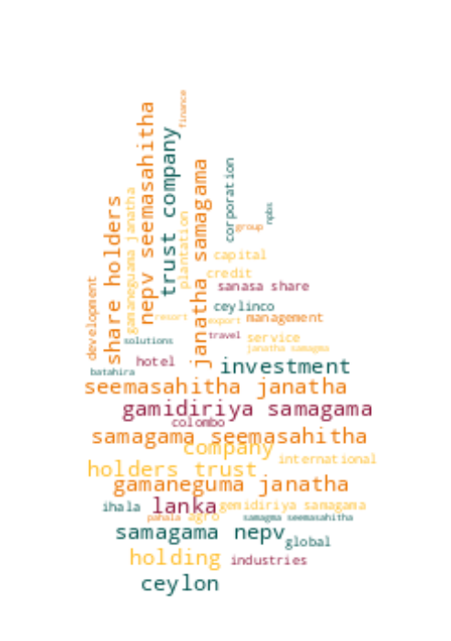
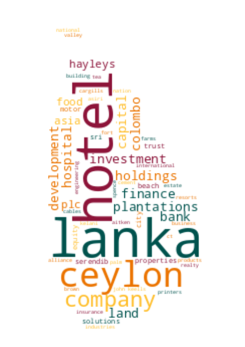
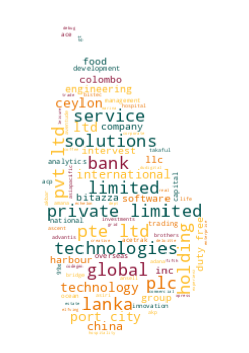
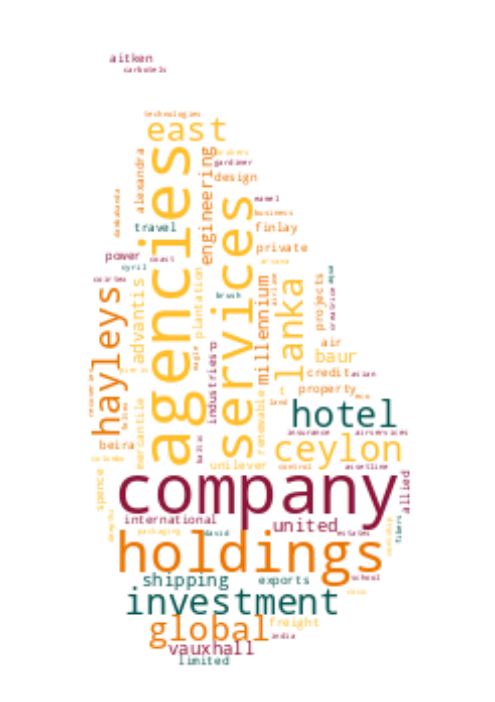
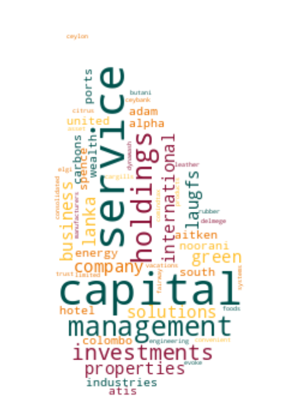
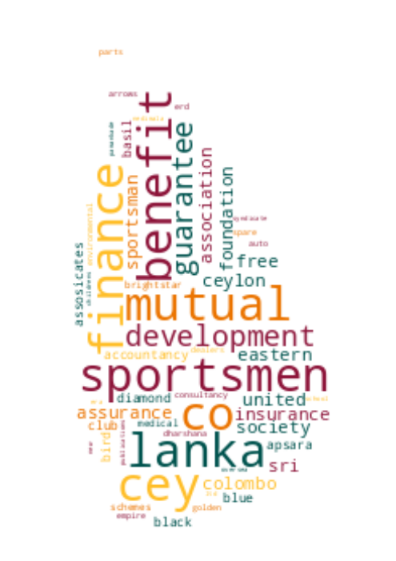

# Registrar of Companies - Sri Lanka

Data Scraped from Registrar of Companies - Sri Lanka (https://eroc.drc.gov.lk)

Scraped **164,031** Companies ([5.05MB](data/companies.tsv)) as of *2026-11-23 10:08:40*.

*Scraping Progress: 52,728/52,728*
✅✅✅✅✅✅✅✅✅✅

## Selection of Companies
*Sample of 10/164031*

* (1) PCC00287821 - **99X TECHNOLOGY AS**
* (18,226) PV91159 - **BLUEINK HOLDINGS**
* (36,452) PV93944 - **DIGITAL NET COMPANY**
* (54,677) PV00375009 - **GOYA CEYLON**
* (72,903) PV00227313 - **KEYSTONE HOLDINGS**
* (91,128)  - **MSD NETWORK TECHNOLOGIES**
* (109,354) PV00261981 - **PRIME COCO LAND**
* (127,579) PV00304700 - **SERENDIB ROYAL BATH**
* (145,805) PV00280070 - **THE SIX VILLAS**
* (164,031) PV118576 - **ZZAPPIT**

## Latest 1,000 Companies
*Sample of 10/1000*

* (1) PV00364163 - **SAYUNI LANKA**
* (112) PV00365027 - **LASHEEYTO**
* (223) PV00366175 - **RRHYTHM OF KAILASA**
* (334) PV00367076 - **BCREATIONS DESIGN STUDIO**
* (445) PV00368334 - **NATURAL CRAVINGS**
* (556) PV00369496 - **SAYURA SOLUTIONS**
* (667) PV00371143 - **ZOH KITCHEN**
* (778) PV00373154 - **TERRABYTE**
* (889) PV00375397 - **LASHA BRIDE**
* (1,000) PV00380817 - **STERLING JEWELLERY**

## Selection for Companies by Type

### "PV"
*Sample of 10/149139*

* (1) PV20853 - **A AND A ASSOCIATES**
* (16,571) PV00273659 - **BLUE UNIVERSE ACADEMY**
* (33,142) PV00303452 - **DIGITAL GROWTH**
* (49,713) PV00288017 - **GOLF LANKA HOLDING**
* (66,284) PV19815 - **KELSEY ALUMINIUM**
* (82,855) PV87915 - **MOONMIN VALLEY**
* (99,426) PV20698 - **PREMA LEARNERS**
* (115,997) PV130825 - **SERVICE EXPRESS**
* (132,568) PV115831 - **THE TRAVELCART**
* (149,139) PV118576 - **ZZAPPIT**

### ""
*Sample of 10/6476*

* (1)  - **A BRAND HOLDINGS**
* (720)  - **BLACKPOOL HYDRO POWER**
* (1,439)  - **DHANA AUTO MART**
* (2,159)  - **GOSMO**
* (2,878)  - **KEVIN'S FABRICS**
* (3,598)  - **MY TOUR WAY**
* (4,317)  - **PRETTY LOUD**
* (5,037)  - **SHIVA PARTNERS**
* (5,756)  - **TILAKO FOODS**
* (6,476)  - **ZYPHER CLOUD**

### "PB"
*Sample of 10/2922*

* (1) PB5111 - **A ONE TOP TRADING**
* (325) PB00293166 - **CEYLON WHEELS**
* (650) PB627 - **HAYLEYS CONSUMER PRODUCTS**
* (974) PB243 - **MERCANTILE FINANCIAL BROKERS**
* (1,299) PB00210021 - **SAVAN GREEN ENERGY SOLUTIONS LANKA**
* (1,623) PB3090 - **SEEMASAHITHA (JANATHA) MASIMBULA PRAGATI GAMIDIRIYA SAMAGAMA**
* (1,948) PB3923 - **SEEMASAHITHA DABAWINNA GAMANEGUMA JANATHA SAMAGAMA**
* (2,272) PB4461 - **SEEMASAHITHA MURUTHAWELA GAMANEGUAMA JANATHA SAMAGAMA**
* (2,597) PB1250 - **SIGIRIYA RESORTS**
* (2,922) PB118 - **ZYREX POWER COMPANY**

### "GA"
*Sample of 10/2807*

* (1) GA00321009 - **A HAND OF HOPE**
* (312) GA2451 - **BAITHUZ ZAKATH PANADURA**
* (624) GA00320528 - **CONCIERGE ASSOCIATION OF THE HOTEL'S**
* (936) GA00259606 - **GOOD SHEPHERD ALUMNI**
* (1,248) GA2600 - **JANASETHA SEVA FOUNDATION**
* (1,559) GA00319928 - **MAXIMILIAN FOUNDATION**
* (1,871) GA178 - **POPULATION SERVICES LANKA**
* (2,183) GA00338730 - **SIHALA SENAGA**
* (2,495) GA408 - **THE EUROPEAN CHAMBER OF COMMERCE OF SRI LANKA**
* (2,807) GA470 - **ZONTA CLUB II OF COLOMBO**

### "GL"
*Sample of 10/934*

* (1) GL00223389 - **A LITTLE  FOUNDATION**
* (104) GL00305527 - **AYUVA EARTHFIRST FOUNDATION**
* (208) GL00318108 - **DIGITAL TRUST ALLIANCE**
* (312) GL56 - **GREEN VISION**
* (415) GL42 - **JEHOVAH SHALOM MINISTRIES**
* (519) GL2327 - **MICHAEL DUELL PRE SCHOOL**
* (623) GL00314031 - **PULMODDAI CENTRAL SHOORA COUNCIL**
* (726) GL2272 - **SIRAKUGAL FOUNDATION**
* (830) GL2450 - **TRINCO AID**
* (934) GL2310 - **ZOE LIFE INTERNATIONAL (GURANTEE)**

### "NF"
*Sample of 10/545*

* (1) NF137 - **AB FINLANKA**
* (61) NF200 - **BRAUN MEDICAL INDUSTERIES SDN BHD**
* (121) NF328 - **EDEN LLC**
* (182) NF309 - **HELLY HANSEN (FAR EAST)**
* (242) NF260 - **KOREA EXCHANGE BANK**
* (303) NF33 - **MULPHA MARKETING (S) PRIVATE**
* (363) NF57 - **POMP QUICK COMPANY**
* (424) NF118 - **SKD PACIFIC**
* (484) NF80 - **TOMEN HOTLINE (HONG-KONG)**
* (545) NF711 - **ZTE CORPORATION**

### "FC"
*Sample of 10/402*

* (1) FC00251549 - **AA JAPAN (PVT) LTD**
* (45) FC1044 - **BIS VAM ANLAGENTECHNIK GMBH**
* (90) FC1253 - **CONTROL PRINT**
* (134) FC1191 - **GARAMSPACE COMPANY**
* (179) FC1244 - **JAPAN AIRPORT CONSULTANTS, INC.**
* (223) FC1263 - **MASTERCARD SINGAPORE HOLDING PTE.**
* (268) FC1228 - **OTT HYDROMET GMBH**
* (312) FC00211497 - **SBT CO., LTD.**
* (357) FC00247605 - **THE WESTMINSTER FOUNDATION FOR DEMOCRACY LIMITED**
* (402) FC1444 - **ZIFAM PINNACLE PTY LTD**

### "F"
*Sample of 10/230*

* (1) F234 - **ALCO INSURANCE COMPANY**
* (26) F87 - **BRITISH EQUITABLE ASS CO.**
* (51) F318 - **ENGINEERING CONSTRUCTION CORPORATION**
* (77) F322 - **HYOSUWG CORPORATION**
* (102) F304 - **MALAYAON AIR WAYS**
* (128) F376 - **ORIENTA CONSULTANT INVESTMENTS CO**
* (153) F162 - **SAMPON & CO**
* (179) F332 - **THAI AIRWAYS INTERNATIONAL**
* (204) F250 - **THE PIONERR FIRE & GEN INS CO**
* (230) F6 - **YORKSHIRE INSURANCE CO LTC CEASED 1/11/70**

### "PQ"
*Sample of 10/176*

* (1) PQ188 - **ABANS ELECTRICALS**
* (20) PQ25 - **BROWN AND COMPANY**
* (39) PQ90 - **CITY HOUSING AND REAL ESTATE COMPANY**
* (59) PQ53 - **EQUITY SEVEN**
* (78) PQ72 - **HUNAS HOLDINGS**
* (98) PQ179 - **LANKA IOC**
* (117) PQ141 - **OFFICE EQUIPMENT**
* (137) PQ192 - **SAMSON INTERNATIONAL**
* (156) PQ84 - **THE AUTODROME**
* (176) PQ181 - **YORK ARCADE HOLDINGS**

### "PCC"
*Sample of 10/98*

* (1) PCC00287821 - **99X TECHNOLOGY AS**
* (11) PCC00320558 - **ASCENT GLOBAL SOLUTIONS LIMITED**
* (22) PCC00285477 - **CHINA HARBOUR ENGINEERING COMPANY LIMITED**
* (33) PCC00324835 - **ENTERPRISE ANALYTICS LANKA (PVT) LTD.**
* (44) PCC00297858 - **HEXAWARE TECHNOLOGIES SL (PRIVATE) LIMITED.**
* (54) PCC00332631 - **INTERVEST GLOBAL DELIVERY (PRIVATE) LIMITED.**
* (65) PCC00298024 - **MITRA INNOVATION (AMERICAS) INC.**
* (76) PCC00300472 - **PATHFINDER GLOBAL FZCO**
* (87) PCC00284610 - **SATGURU TRAVEL AND TOURISM LLC**
* (98) PCC00292982 - **YOULANKA GROUP LIMITED**

### "PBPV"
*Sample of 10/92*

* (1) PB1296PV - **A BAUR AND COMPANY  TRAVEL**
* (11) PB162PV - **ASSETLINE INSURANCE BROKERS**
* (21) PB1567PV - **CYRIL GARDINER**
* (31) PB98PV - **FINLAY AIRLINE AGENCIES**
* (41) PB753PV - **HAYLEYS AVENTURA**
* (51) PB283PV - **KINGS COLLEGE**
* (61) PB382PV - **NATURE HOLDINGS**
* (71) PB854PV - **RENUKA AGRO EXPORTS**
* (81) PB3798PV - **TOKYO CEMENT POWER (LANKA)**
* (92) PB144PV - **WORLD SUBSEA SERVICES**

### "PVPB"
*Sample of 10/56*

* (1) PV4158PB - **ADAM CARBONS**
* (7) PV75497PB - **CAPITAL TRUST HOLDINGS**
* (13) PV5851PB - **CONSOLIDATED BUSINESS SYSTEMS**
* (19) PV118379PB - **FUTURE LIFE INVESTMENTS**
* (25) PV64818PB - **JANATHA CAPITAL INVESTMENTS**
* (31) PV71746PB - **MUTUAL HOLDINGS**
* (37) PV64694PB - **PADIYAPELELLA HYDROPOWER**
* (43) PV3574PB - **SOUTH ASIA TEXTILES**
* (49) PV3822PB - **SWARNAMAHAL JEWELLERS**
* (56) PV77431PB - **WELIGAMA HOTEL PROPERTIES**

### "PBG"
*Sample of 10/46*

* (1) PBG45 - **ACCOUNTANCY ASSOSICATES**
* (6) PBG48 - **BRIGHTSTAR FINANCE**
* (11) PBG37 - **CONSULTANCY AND FINANCE AND DEVELOPMENT**
* (16) PBG22 - **FREE LANKA SPORTSMEN**
* (21) PBG9 - **OVERSEA CHILDRENS SCHOOL LTD ( BY GUARANTEE)**
* (26) PBG35 - **SAMPATH SPORTSMEN**
* (31) PBG17 - **THE BENEFIT PROVIDENT FUND**
* (36) PBG16 - **THE INSURANCE POLICY HOLDERS SERVICES**
* (41) PBG39 - **THEEPAM INSTITUTE**
* (46) PBG14 - **UNITED SPORTSMAN**

### "PBPQ"
*Sample of 10/30*
* (1) PB3618PQ - **AMANA BANK**
* (4) PB139PQ - **ASIA ASSET FINANCE**
* (7) PB3259PQ - **BIMPUTH LANKA INVESTMENTS**
* (10) PB633PQ - **DFCC VARDHANA BANK**
* (13) PB965PQ - **HNB FINANCE**
* (17) PB3754PQ - **PEOPLE'S  INSURANCE**
* (20) PB62PQ - **SANASA DEVELOPMENT BANK**
* (23) PB917PQ - **SIYAPATHA FINANCE**
* (26) PB689PQ - **TESS AGRO**
* (30) PB4242PQ - **WASKADUWA BEACH RESORT**

### "NPVS"
*Sample of 10/29*
* (1) NPVS40803 - **ALNA WATER SYSTEMS**
* (4) NPVS22400 - **CEETEE INTERNATIONAL**
* (7) NPVS35441 - **DUMBARA FERTILIZERS**
* (10) NPVS15104 - **FIVE STAR EXPORTS**
* (13) NPVS42442 - **HERITAGE SAPPHIRES**
* (16) NPVS38695 - **MCMILLAN CEYLON MARKETING**
* (19) NPVS9611 - **Q-NET**
* (22) NPVS18562 - **SERENDIB INSURANCE BROKERS**
* (25) NPVS11267 - **SILVER SHRIMPS**
* (29) NPVS16673 - **WESTERN TRADING COMPANY**

### "PVPBPQ"
*Sample of 10/13*
* (1) PV5301PBPQ - **ABANS**
* (2) PV3562PB/PQ - **ASIA SIYAKA COMODITIES**
* (3) PVPB13254PQ - **JETWING SYMPHONY**
* (5) PVPB7385PQ - **LOTUS HYDRO POWER**
* (6) PV9346PBPQ - **ORIENT GARMENTS**
* (7) PV9959PBPQ - **PANASIAN POWER**
* (9) PVPB8234PQ - **RAMBODA FALLS**
* (10) PV415PBPQ - **RESUS ENERGY**
* (11) PV70371PB/PQ - **SINGHE HOSPITALS**
* (13) PV7617PBPQ - **TEEJAY LANKA**

### "PQPB"
* (1) PQ96PB - **ASIRI CENTRAL HOSPITALS**
* (2) PQ15PB - **ASSOCIATED ELECTRICAL CORPORATION**
* (3) PQ17PB - **ASSOCIATED PROPERTY DEVELOPMENT**
* (4) PQ193PB - **BERUWELA WALK INN**
* (5) PQ99PB - **CEYLON LEATHER PRODUCTS**
* (6) PQ19PB - **EQUITY ONE**
* (7) PQ176PB - **KURUWITA TEXTILE MILLS**
* (8) PQ220PB - **METROPOLITAN RESOURCE HOLDINGS**
* (9) PQ77PB - **MORISON**

### "OC"
* (1) OC111 - **ASTER JETFUEL**
* (2) OC108 - **CAMSO TRADING**
* (3) OC109 - **ENERGY COMMERCE B.V.**
* (4) OC110 - **GLOBAL SOFT TECHNOLOGIES**
* (5) OC104 - **MERCANTILE SEASCAPE SHIPPING COMPANY**
* (6) OC106 - **MERCANTILE SEAWIND SHIPPING COMPANY**
* (7) OC103 - **MERCANTILE SEBORNE SHIPPING**
* (8) OC102 - **POWER HUB INTERNATIONAL SDN PHD**

### "PVS"
* (1) PVS1795 - **CINE-TECH**
* (2) PVS8467 - **LAKMINI ENTERPRISES**
* (3) PVS7888 - **RADIAN PRODUCTS**
* (4) PVS7498 - **WINGS TRAVELS AND TOURS**
* (5) PVS8227 - **WOODLANDS LANKA**

### "PVPQ"
* (1) PV10527PQ - **ADAM CAPITAL**
* (2) PV1618PQ - **AGSTAR**
* (3) PV72355PQ - **ANILANA HOTELS & PROPERTIES**

### "PBPVPB"
* (1) PB64PVPB - **GAC SHIPPING**
* (2) PB553PV/PB - **INTERNATIONAL CONSUMER BRANDS**
* (3) PBPVPB138 - **MCLARENS SHIPPING**

### "PQPBPV"
* (1) PQ98PBPV - **ACE POWER GENERATION MATARA**
* (2) PQ16PB/PV - **ASSOCIATED MOTORWAYS**

### "NFA"
* (1) NF160A - **CO ECHO ENTERPRISES**

### "PBPQPB"
* (1) PB613PQ/PB - **JANASHAKTHI**

### "GAGL"
* (1) GA683GL - **LANKA PRISON FELLOWSHIP**

### "CIA"
* (1) CIA389 - **REFINITIV**

### "PBpv"
* (1) PB1236pv - **UNILEAVER CEYLON SERVICES**

### "PQPV"
* (1) PQ231PV - **UNION RESORTS**
