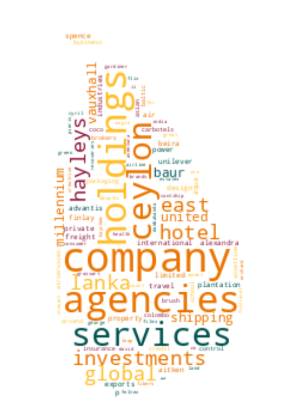

# Registrar of Companies - Sri Lanka

Data Scraped from Registrar of Companies - Sri Lanka (https://eroc.drc.gov.lk)

Scraped **131,902** Companies ([4.08MB](data/companies.tsv)) as of *2024-04-08 22:16:52*.

*Scraping Progress: 52,728/52,728*
✅✅✅✅✅✅✅✅✅✅

## Selection of Companies
*Sample of 10/131902*

* (1) PCC00287821 - **99X TECHNOLOGY AS**
* (14,656) PV7654 - **BLUECHIP CUSTOMER ENGINEERING LANKA**
* (29,312) PV83771 - **DILANMA**
* (43,968) PV00288936 - **GOODMAX INTERNATIONAL**
* (58,623) PV00264081 - **KEEN APIS MELLIFERA**
* (73,279) PV00276484 - **MONTFORT INTERNATIONAL**
* (87,935) PQ75 - **PRINTCARE**
* (102,590)  - **SEYANSA GAS DISTRIBUTORS**
* (117,246) PV00263741 - **THE PRIME FOCUS**
* (131,902) PV118576 - **ZZAPPIT**

## Latest 1,000 Companies
*Sample of 10/1000*

* (1) PV00294651 - **THELIALLA ECO HOLIDAY RESORT**
* (112) PV00294925 - **KALUWILA ENTERPRISES**
* (223) PV00295248 - **LAK COCO OIL MILL**
* (334) PV00295542 - **SERENE BRIDGE WINE STORES**
* (445) PV00295892 - **DUETFLY THE SCHOOL OF MUSIC**
* (556) PV00296230 - **NIRVI CIVIL ENGINEERS**
* (667) PV00296643 - **WOWBOOKS.LK**
* (778) PV00297072 - **BIOBLEND GLOBAL VENTURES**
* (889) PV00297597 - **LOLC PROPERTY HOLDINGS SL**
* (1,000) PV00298610 - **SHUNKAI INTERNATIONAL LOGISTICS LANKA**

## Selection for Companies by Type

### "PV"
*Sample of 10/119942*

* (1) PV20853 - **A AND A ASSOCIATES**
* (13,327) PV61714 - **BLUE OCEAN TRANS SHIPPING**
* (26,654) PV00221400 - **DIGITAL ONE LABS**
* (39,981) PV00261347 - **GOLDEN GATE MIGRATION CONSULTANT**
* (53,308) PV77877 - **KARFT INTERNATIONAL L K**
* (66,634) PV540 - **MLESNA THE KIOSK**
* (79,961) PV00254519 - **PREMA JAYASINGHE PLANTATIONS**
* (93,288) PV67734 - **SHADES OF WANAMAL**
* (106,615) PV00260923 - **THE SLIDER STATION**
* (119,942) PV118576 - **ZZAPPIT**

### ""
*Sample of 10/4449*

* (1)  - **A AND Y COMMODITIES**
* (495)  - **BLACKPOOL RESTAURANTS**
* (989)  - **DHANAWARDANA ENTERPRISES**
* (1,483)  - **GLOBAL CITY CENTER**
* (1,977)  - **JOUCHI JAPANESE LANGUAGE ACADEMY**
* (2,472)  - **MNA SOLUTIONS**
* (2,966)  - **POWER GRID SOLUTIONS**
* (3,460)  - **SHIKISEN**
* (3,954)  - **THREE FEIORY ENTERPRISES**
* (4,449)  - **ZYNOWIX**

### "PB"
*Sample of 10/2800*

* (1) PB5111 - **A ONE TOP TRADING**
* (312) PB5416 - **CHANGSHA ROAD AND BRIDGE CONSTRUCTION CORPORATION LANKA**
* (623) PB316 - **HORIZON PARTNERS**
* (934) PB4971 - **NARAMMALA SANASA SHARE HOLDERS TRUST COMPANY**
* (1,245) PB1386 - **SEEMASAHITHA (JANATHA) BANGAMUKANDA GAMIDIRIYA SAMAGAMA (NEPV 317)**
* (1,556) PB3132 - **SEEMASAHITHA (JANATHA) NIDAHAS RUVINGAMA GAMIDIRIYA SAMAGAMA**
* (1,867) PB4696 - **SEEMASAHITHA DIANAWATTA GAMANEGUMA JANATHA SAMAGAMA**
* (2,178) PB3996 - **SEEMASAHITHA NELUYAYA GAMANEGUMA JANATHA SAMAGAMA**
* (2,489) PB1618 - **SEVENTY  (PBS 601)**
* (2,800) PB118 - **ZYREX POWER COMPANY**

### "GA"
*Sample of 10/2336*

* (1) GA00213478 - **A QUINT ONDAATJE FOUNDATION**
* (260) GA3366 - **BODY OF JESUS CHRIST''S ASSEMBLY**
* (519) GA245 - **DAR - AL - BIR ASSOCIATION**
* (779) GA3372 - **GURU DEV SUWA ARANA**
* (1,038) GA3216 - **JESUS FAMILY MISSION LANKA**
* (1,298) GA00284985 - **MAWELLA FOUNDATION**
* (1,557) GA00288853 - **PODU URUMA SURAKEEME SANVIDHANAYA**
* (1,817) GA3121 - **SLANSHEI**
* (2,076) GA00240607 - **THE JAPANESE TRUST BRIDGE**
* (2,336) GA470 - **ZONTA CLUB II OF COLOMBO**

### "GL"
*Sample of 10/806*

* (1) GL00223389 - **A LITTLE  FOUNDATION**
* (90) GL00248061 - **BLOOMING BUDS SOCIAL FOUNDATION**
* (179) GL2408 - **DOWELS DOCTORS WELFARE ASSOCIATION**
* (269) GL2375 - **GREEN WISH**
* (358) GL00218954 - **JASMINE  FOUNDATION**
* (448) GL00279874 - **MINDFULNESS FOR EARTH**
* (537) GL2415 - **RATIONAL CHILDREN FOR AN ENLIGHTENED NATION**
* (627) GL2124 - **SMALL WORLD**
* (716) GL2205 - **TRADERS ASSOCIATION VAVUNIYA**
* (806) GL2310 - **ZOE LIFE INTERNATIONAL (GURANTEE)**

### "NF"
*Sample of 10/501*

* (1) NF137 - **AB FINLANKA**
* (56) NF206 - **BRILLIANT VALLEY**
* (112) NF705 - **EDUCOMP SOLUTIONS**
* (167) NF298 - **HITACHI PALNT ENGINEERING CONSTRUCTION CO**
* (223) NF49 - **KUMAGAI GUMI CO.**
* (278) NF263 - **MOUNTEL COMMUNICATIONS INTERNATIONAL B.V.**
* (334) NF402 - **POLY - K - AMERICA INC.**
* (389) NF386 - **SKANSKA INTERNATIONAL CIVIL ENGINEERING AKTIOBOLAG**
* (445) NF161 - **TOGETHER PRODUCTION**
* (501) NF711 - **ZTE CORPORATION**

### "FC"
*Sample of 10/368*

* (1) FC00251549 - **AA JAPAN (PVT) LTD**
* (41) FC1036 - **BIWATER CONTRACTING B.V.**
* (82) FC1122 - **CREW SKILLS INTERNATIONAL**
* (123) FC1191 - **GARAMSPACE COMPANY**
* (164) FC1056 - **JEONG - SUK MARINE CONSTRUCTIONS CO**
* (204) FC00222714 - **MAST INDUSTRIES (FAR EAST) LIMITED**
* (245) FC1060 - **ONMOBILE GLOBAL LIMITED**
* (286) FC00211497 - **SBT CO., LTD.**
* (327) FC1236 - **TOKYO ELECTRICS POWER SERVICES CO.**
* (368) FC1065 - **ZIBO GUANGZHENG ALKALI ALUMINIUM CHEMICAL INDUSTRY CO.,**

### "F"
*Sample of 10/211*

* (1) F234 - **ALCO INSURANCE COMPANY**
* (24) F41 - **BOMBAY LIFE ASSURANCE CO.**
* (47) F380 - **DUBAI BANK**
* (71) F91 - **HOME INSURANCE CO.**
* (94) F205 - **LIVERPOOL MARINE & GEN INS CO.**
* (117) F199 - **NORWICK UNION LIFE ASSURANCE SOCIETY**
* (141) F61 - **SCOTTISH INSURANCE CO.**
* (164) F209 - **TALAWAKELLE ESTATE CO.**
* (187) F250 - **THE PIONERR FIRE & GEN INS CO**
* (211) F6 - **YORKSHIRE INSURANCE CO LTC CEASED 1/11/70**

### "PQ"
*Sample of 10/151*

* (1) PQ188 - **ABANS ELECTRICALS**
* (17) PQ00252285 - **CAPITAL ALLIANCE**
* (34) PQ90 - **CITY HOUSING AND REAL ESTATE COMPANY**
* (51) PQ199 - **EDEN HOTEL LANKA**
* (67) PQ81 - **HOTEL SIGIRYA**
* (84) PQ194 - **LANKA CEMENT**
* (101) PQ78 - **NAWALOKA HOSPITALS**
* (117) PQ192 - **SAMSON INTERNATIONAL**
* (134) PQ1 - **THE FINANCE COMPANY**
* (151) PQ181 - **YORK ARCADE HOLDINGS**

### "PBPV"
*Sample of 10/83*

* (1) PB1296PV - **A BAUR AND COMPANY  TRAVEL**
* (10) PB540PV - **BALTIC CONTROL SERVICES**
* (19) PB419PV - **DAMBAKANDA ESTATES COMPANY**
* (28) PB98PV - **FINLAY AIRLINE AGENCIES**
* (37) PB598PV - **HAYLEYS ELECTRONICS MANUFACTURING**
* (46) PB283PV - **KINGS COLLEGE**
* (55) PB79PV - **MILLENNIUM I.T.E.S.P.**
* (64) PB854PV - **RENUKA AGRO EXPORTS**
* (73) PB5092PV - **TOKYO EASTERN CEMENT COMPANY**
* (83) PB144PV - **WORLD SUBSEA SERVICES**

### "PCC"
*Sample of 10/48*

* (1) PCC00287821 - **99X TECHNOLOGY AS**
* (6) PCC00295416 - **BISTEC SOLUTIONS (PVT) LTD.**
* (11) PCC00290488 - **CHINA HARBOUR ENGINEERING COMPANY (LANKA) LIMITED.**
* (16) PCC00289048 - **COMMERCIAL BANK OF CEYLON PLC.**
* (21) PCC00275578 - **GREENSTAT HYDROGEN (PVT) LTD.**
* (27) PCC00290386 - **INVIGORATE CEYLON (PVT) LTD**
* (32) PCC00294426 - **NATIONAL DEVELOPMENT BANK PLC.**
* (37) PCC00296106 - **PAGERO LANKA SOFTWARE ENGINEERING (PVT) LTD.**
* (42) PCC00289409 - **SAMPATH BANK PLC.**
* (48) PCC00292982 - **YOULANKA GROUP LIMITED**

### "PBG"
*Sample of 10/45*

* (1) PBG45 - **ACCOUNTANCY ASSOSICATES**
* (5) PBG28 - **BLUE DIAMOND SPORTSMEN**
* (10) PBG8 - **COLOMBO MEDICAL SCHEMES**
* (15) PBG43 - **ERD FINANCE**
* (20) PBG50 - **NEW ERA PUBLICATIONS**
* (25) PBG47 - **RURAL COMMUNITY DEVELOPMENT PROJECT**
* (30) PBG7 - **SUYATHESA AFIVIRTHI SANGAM**
* (35) PBG20 - **THE FREE LANKA BENEFITS**
* (40) PBG39 - **THEEPAM INSTITUTE**
* (45) PBG14 - **UNITED SPORTSMAN**

### "PVPB"
*Sample of 10/45*

* (1) PV4158PB - **ADAM CARBONS**
* (5) PV7329PB - **BUSINESS MANAGEMENT SERVICES**
* (10) PV3326PB - **CEYBANK ASSET MANAGEMENT**
* (15) PV5736PB - **ELGI RUBBER COMPANY**
* (20) PV102488PB - **GRAINS 'N' GREEN**
* (25) PV17741PB - **LIBERTY HOLDINGS**
* (30) PV114960PB - **NOORANI RENEWABLE ENERGY**
* (35) PV65801PB - **SILVEREEN MICRO CREDITCOMPANY**
* (40) PV83543PB - **STANDARD PAINTS**
* (45) PV78825PB - **TRILLIUM PROPERTY MANAGEMENT & SERVICES**

### "PBPQ"
*Sample of 10/39*

* (1) PB200PQ - **ACCESS ENGINEERING**
* (5) PB4739PQ - **ARPICO INSURANCE**
* (9) PB1280PQ - **CEYLON TEA BROKERS**
* (13) PB744PQ - **EXPOLANKA HOLDINGS**
* (17) PB307PQ - **JANASHAKTHI INSURANCE**
* (22) PB376PQ - **MILLENNIUM HOUSING DEVELOPERS**
* (26) PB647PQ - **PEOPLE'S LEASING & FINANCE**
* (30) PB813PQ - **SINGER FINANCE (LANKA)**
* (34) PB689PQ - **TESS AGRO**
* (39) PB4242PQ - **WASKADUWA BEACH RESORT**

### "NPVS"
*Sample of 10/29*
* (1) NPVS40803 - **ALNA WATER SYSTEMS**
* (4) NPVS22400 - **CEETEE INTERNATIONAL**
* (7) NPVS35441 - **DUMBARA FERTILIZERS**
* (10) NPVS15104 - **FIVE STAR EXPORTS**
* (13) NPVS42442 - **HERITAGE SAPPHIRES**
* (16) NPVS38695 - **MCMILLAN CEYLON MARKETING**
* (19) NPVS9611 - **Q-NET**
* (22) NPVS18562 - **SERENDIB INSURANCE BROKERS**
* (25) NPVS11267 - **SILVER SHRIMPS**
* (29) NPVS16673 - **WESTERN TRADING COMPANY**

### "PVPBPQ"
*Sample of 10/11*
* (1) PV5301PBPQ - **ABANS**
* (2) PV17807PB/PQ - **GREENTECH ENERGY**
* (3) PVPB13254PQ - **JETWING SYMPHONY**
* (4) PV8330PBPQ - **LAUGFS GAS**
* (5) PVPB7385PQ - **LOTUS HYDRO POWER**
* (6) PV10922PBPQ - **RAIGAM WAYAMBA SALTERNS**
* (7) PVPB8234PQ - **RAMBODA FALLS**
* (8) PV415PBPQ - **RESUS ENERGY**
* (9) PV70371PB/PQ - **SINGHE HOSPITALS**
* (11) PV7617PBPQ - **TEEJAY LANKA**

### "PQPB"
* (1) PQ96PB - **ASIRI CENTRAL HOSPITALS**
* (2) PQ15PB - **ASSOCIATED ELECTRICAL CORPORATION**
* (3) PQ17PB - **ASSOCIATED PROPERTY DEVELOPMENT**
* (4) PQ193PB - **BERUWELA WALK INN**
* (5) PQ99PB - **CEYLON LEATHER PRODUCTS**
* (6) PQ61PB - **FINLAYS COLOMBO**
* (7) PQ143PB - **HOTEL DEVELOPERS (LANKA) LIMITED**
* (8) PQ176PB - **KURUWITA TEXTILE MILLS**
* (9) PQ77PB - **MORISON**

### "OC"
* (1) OC111 - **ASTER JETFUEL**
* (2) OC108 - **CAMSO TRADING**
* (3) OC109 - **ENERGY COMMERCE B.V.**
* (4) OC101 - **ISLANDERS MALDIVES PTE**
* (5) OC104 - **MERCANTILE SEASCAPE SHIPPING COMPANY**
* (6) OC106 - **MERCANTILE SEAWIND SHIPPING COMPANY**
* (7) OC103 - **MERCANTILE SEBORNE SHIPPING**
* (8) OC102 - **POWER HUB INTERNATIONAL SDN PHD**

### "PVPQ"
* (1) PV10527PQ - **ADAM CAPITAL**
* (2) PV1618PQ - **AGSTAR**
* (3) PV72355PQ - **ANILANA HOTELS & PROPERTIES**
* (4) PV415PQ - **HEMAS POWER**
* (5) PV7206PQ - **ODEL**
* (6) PV1536PQ - **SOFT LOGIC HOLDINGS**

### "PVS"
* (1) PVS1795 - **CINE-TECH**
* (2) PVS8467 - **LAKMINI ENTERPRISES**
* (3) PVS7888 - **RADIAN PRODUCTS**
* (4) PVS7498 - **WINGS TRAVELS AND TOURS**
* (5) PVS8227 - **WOODLANDS LANKA**

### "PQPBPV"
* (1) PQ98PBPV - **ACE POWER GENERATION MATARA**
* (2) PQ16PB/PV - **ASSOCIATED MOTORWAYS**

### "PBPVPB"
* (1) PB64PVPB - **GAC SHIPPING**
* (2) PBPVPB138 - **MCLARENS SHIPPING**

### "NFA"
* (1) NF160A - **CO ECHO ENTERPRISES**

### "PVPBPV"
* (1) PV4405PBPV - **DAVE TRACTORS**

### "UC"
* (1) UC1 - **JACEY AND COMPANY**

### "GAGL"
* (1) GA683GL - **LANKA PRISON FELLOWSHIP**

### "PBpv"
* (1) PB1236pv - **UNILEAVER CEYLON SERVICES**

### "PQPV"
* (1) PQ231PV - **UNION RESORTS**
