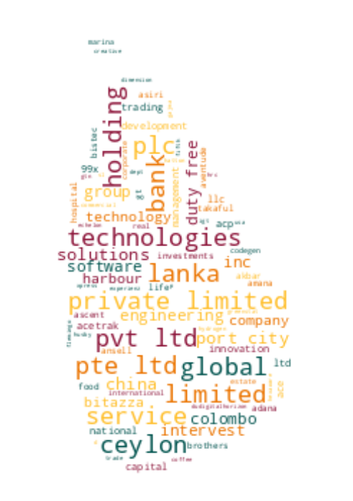

# Registrar of Companies - Sri Lanka

Data Scraped from Registrar of Companies - Sri Lanka (https://eroc.drc.gov.lk)

Scraped **133,468** Companies ([4.12MB](data/companies.tsv)) as of *2024-05-11 14:15:09*.

*Scraping Progress: 52,728/52,728*
✅✅✅✅✅✅✅✅✅✅

## Selection of Companies
*Sample of 10/133468*

* (1) PCC00287821 - **99X TECHNOLOGY AS**
* (14,830) PV00247393 - **BLUE WILD**
* (29,660) PV00241213 - **DILAN FARM ORGANIC PRODUCE**
* (44,490) PV00272175 - **GOOD VIBE'S INVESTMENT**
* (59,319) PV101947 - **KEERTHI GUNAWARDANA CONSTRUCTION**
* (74,149) PV76584 - **MOON LIGHT HOTEL**
* (88,979) PV00283717 - **PRIYA TEXTILES**
* (103,808) PV126483 - **SEYON INTERNATIONAL DECOR & TRADING**
* (118,638) PV00223237 - **THE PETMARK**
* (133,468) PV118576 - **ZZAPPIT**

## Latest 1,000 Companies
*Sample of 10/1000*

* (1) PV00297089 - **THE VINTAGE KITCHEN**
* (112) PV00297321 - **NEW ALLI STORES**
* (223) PV00297580 - **INTERNATIONAL HEALTH FIELD STUDIES CAMPUS**
* (334) PV00297818 - **ASJEE TRADING**
* (445) PV00298099 - **MALMO COMPANY**
* (556) PV00298397 - **IST HOLIDAYS**
* (667) PV00298699 - **THAYA AGRO**
* (778) PV00299071 - **KEYSTONE VENTURES**
* (889) GA00299536 - **ECFABT**
* (1,000) PV00300660 - **KIARA TEAS**

## Selection for Companies by Type

### "PV"
*Sample of 10/121451*

* (1) PV20853 - **A AND A ASSOCIATES**
* (13,495) PV95018 - **BLUE OCEAN REALTY**
* (26,989) PV00267664 - **DIGITAL MENTOR**
* (40,484) PV90384 - **GOLDEN COLLEGE**
* (53,978) PV88019 - **KARAINAGAR BEACH HOTEL AND RECREATIONS**
* (67,473) PV126103 - **MIZUNO TRADE LINK**
* (80,967) PV112721 - **PREM LANKA GENERAL TRADERS**
* (94,462) PV4417 - **SHADES AND SHADOWS**
* (107,956) PV00269148 - **THE SERENDIPITY EXPERIENCES**
* (121,451) PV118576 - **ZZAPPIT**

### ""
*Sample of 10/4402*

* (1)  - **A AND Y COMMODITIES**
* (490)  - **BIOMA HEALTHCARE**
* (979)  - **DEMEP OVERSEAS**
* (1,468)  - **GLOBAL MAJASTIC WELLNESS**
* (1,957)  - **KALU ARACHCHI & SONS**
* (2,446)  - **MORNING OF EARTH**
* (2,935)  - **PRSYP CLOTHING**
* (3,424)  - **SINGHA SHOES**
* (3,913)  - **TICASS KITCHEN AND CAFFEE**
* (4,402)  - **ZZ PRESTIGE MOTORS**

### "PB"
*Sample of 10/2829*

* (1) PB5111 - **A ONE TOP TRADING**
* (315) PB4885 - **CHILAW SANASA SHARE HOLDERS TRUST COMPANY**
* (629) PB740 - **HUBLINE AGENCIES (LANKA)**
* (943) PB00271461 - **NATIONAL CREDIT GUARANTEE INSTITUTION**
* (1,257) PB3089 - **SEEMASAHITHA (JANATHA) BIBILEGAMA BATAHIRA IHALA GAMIDIRIYA SAMAGAMA**
* (1,572) PB3242 - **SEEMASAHITHA (JANATHA) OLD FACTORY GEMIDIRIYA SAMAGMA**
* (1,886) PB4110 - **SEEMASAHITHA DIKELLA SAMAGI GAMANEGUMA JANATHA SAMAGAMA**
* (2,200) PB4727 - **SEEMASAHITHA NAHAWILA WATTA GAMANEGUMA JANATHA SAMAGAMA**
* (2,514) PB5268 - **SEYLAN FARM**
* (2,829) PB118 - **ZYREX POWER COMPANY**

### "GA"
*Sample of 10/2373*

* (1) GA00213478 - **A QUINT ONDAATJE FOUNDATION**
* (264) GA3218 - **BLUE RESOURCES TRUST**
* (528) GA2010 - **DAIRY DEVELOPMENT LANKA**
* (791) GA3372 - **GURU DEV SUWA ARANA**
* (1,055) GA00262709 - **JOSEPH THEVAN FOUNDATION**
* (1,318) GA00285591 - **METHTHA SAMADHI INTERNATIONAL FOUNDATION**
* (1,582) GA00281571 - **POTHANE DHAMMANANDA NAHIMI PADANAMA**
* (1,845) GA2792 - **SMYL'S RURAL DEVELOPMENT**
* (2,109) GA2206 - **THE INDUSTRIAL RELATIONS ASSOCIATION SRI LANKA**
* (2,373) GA470 - **ZONTA CLUB II OF COLOMBO**

### "GL"
*Sample of 10/819*

* (1) GL00223389 - **A LITTLE  FOUNDATION**
* (91) GL00275141 - **BLOCKCHAIN CENTRE**
* (182) GL2223 - **DIRIYA EKSATH LANKA**
* (273) GL2120 - **GREEN LIFE MICRO FINANCE**
* (364) GL00281353 - **JIREH FOUNDATION**
* (455) GL00277004 - **MODERNIZED SPECIAL TOUR BUS ASSOCIATION**
* (546) GL00292978 - **RAYS OF RELIEF**
* (637) GL00241208 - **SLASSCOM FOUNDATION**
* (728) GL00223778 - **TOURISM ALLIANCE**
* (819) GL2310 - **ZOE LIFE INTERNATIONAL (GURANTEE)**

### "NF"
*Sample of 10/514*

* (1) NF137 - **AB FINLANKA**
* (58) NF200 - **BRAUN MEDICAL INDUSTERIES SDN BHD**
* (115) NF211 - **ED ZUBLIN AKTIENGESELLSCHAFT**
* (172) NF622 - **HAZMA CORPORATION**
* (229) NF317 - **KOREA HEAVY INDUSTRIES AND CONSTRUCTION CO.**
* (286) NF455 - **MONSANTO INDIA**
* (343) NF19 - **PIRELLI CONSTRUCTION COMPANY**
* (400) NF691 - **SIMPLEX INFRASTRUCTURE**
* (457) NF161 - **TOGETHER PRODUCTION**
* (514) NF711 - **ZTE CORPORATION**

### "FC"
*Sample of 10/369*

* (1) FC00251549 - **AA JAPAN (PVT) LTD**
* (41) FC1044 - **BIS VAM ANLAGENTECHNIK GMBH**
* (82) FC1077 - **CYRIL SWEETT INTERNATIONAL**
* (123) FC1081 - **FUJITO PTE**
* (164) FC00268109 - **ITD CEMENTATION INDIA LIMITED**
* (205) FC1293 - **MALAYSIA AIRLINES BERHAD**
* (246) FC1169 - **OMRAN MAROON ENGINEERS COMPANY (PRIVATE JOINT STOCK)**
* (287) FC1278 - **SEASPAN CREW MANAGEMENT**
* (328) FC1141 - **TIDE WATER MARINE INTERNATIONAL INC**
* (369) FC1065 - **ZIBO GUANGZHENG ALKALI ALUMINIUM CHEMICAL INDUSTRY CO.,**

### "F"
*Sample of 10/214*

* (1) F234 - **ALCO INSURANCE COMPANY**
* (24) F56 - **BRITISH INDIAN GENERAL INSURANCE CO.**
* (48) F36 - **ESSEX DUFFOLK EQUITABLE INSURANCE SOCIETY**
* (72) F286 - **IBM WORLD TRADE CORPORATION**
* (95) F166 - **MARSHALL SONS & CO .  OF INDIA**
* (119) F50 - **PALATINE INSURANCE CO.**
* (143) F292 - **SKANKA CEMENT JUTERIET**
* (166) F203 - **THE ANGLE FRENCH DRUG CO .**
* (190) F250 - **THE PIONERR FIRE & GEN INS CO**
* (214) F6 - **YORKSHIRE INSURANCE CO LTC CEASED 1/11/70**

### "PQ"
*Sample of 10/156*

* (1) PQ188 - **ABANS ELECTRICALS**
* (18) PQ202 - **BROWNS BEACH HOTELS**
* (35) PQ54 - **CHEVRON LUBRICANTS LANKA**
* (52) PQ153 - **EASTERN MERCHANTS**
* (69) PQ00245385 - **HSENID BUSINESS SOLUTIONS**
* (87) PQ00251997 - **LANKA CREDIT AND  BUSINESS FINANCE**
* (104) PQ48 - **PAN ASIA BANKING CORPORATION**
* (121) PQ105 - **SATHOSA MOTORS**
* (138) PQ1 - **THE FINANCE COMPANY**
* (156) PQ181 - **YORK ARCADE HOLDINGS**

### "PBPV"
*Sample of 10/86*

* (1) PB1296PV - **A BAUR AND COMPANY  TRAVEL**
* (10) PB1491PV - **BAURS AIRSERVICES**
* (19) PB419PV - **DAMBAKANDA ESTATES COMPANY**
* (29) PB98PV - **FINLAY AIRLINE AGENCIES**
* (38) PB598PV - **HAYLEYS ELECTRONICS MANUFACTURING**
* (48) PB132PV - **MAC GROUP INTERNATIONAL**
* (57) PB382PV - **NATURE HOLDINGS**
* (67) PB854PV - **RENUKA AGRO EXPORTS**
* (76) PB3798PV - **TOKYO CEMENT POWER (LANKA)**
* (86) PB144PV - **WORLD SUBSEA SERVICES**

### "PCC"
*Sample of 10/55*

* (1) PCC00287821 - **99X TECHNOLOGY AS**
* (7) PCC00278331 - **BITAZZA INTERNATIONAL LIMITED**
* (13) PCC00271314 - **CODEGEN INNOVATIONS (PRIVATE) LIMITED**
* (19) PCC00284521 - **ECHELON TRADE (PVT) LTD.**
* (25) PCC00289173 - **HATTON NATIONAL BANK PLC.**
* (31) PCC00290386 - **INVIGORATE CEYLON (PVT) LTD**
* (37) PCC00295573 - **NATIONS TRUST BANK PLC.**
* (43) PCC00289735 - **PORT CITY BPO (PRIVATE) LIMITED.**
* (49) PCC00271536 - **SCALLOP (PVT) LTD**
* (55) PCC00292982 - **YOULANKA GROUP LIMITED**

### "PBG"
*Sample of 10/46*

* (1) PBG45 - **ACCOUNTANCY ASSOSICATES**
* (6) PBG48 - **BRIGHTSTAR FINANCE**
* (11) PBG37 - **CONSULTANCY AND FINANCE AND DEVELOPMENT**
* (16) PBG22 - **FREE LANKA SPORTSMEN**
* (21) PBG9 - **OVERSEA CHILDRENS SCHOOL LTD ( BY GUARANTEE)**
* (26) PBG35 - **SAMPATH SPORTSMEN**
* (31) PBG17 - **THE BENEFIT PROVIDENT FUND**
* (36) PBG16 - **THE INSURANCE POLICY HOLDERS SERVICES**
* (41) PBG39 - **THEEPAM INSTITUTE**
* (46) PBG14 - **UNITED SPORTSMAN**

### "PVPB"
*Sample of 10/44*

* (1) PV4158PB - **ADAM CARBONS**
* (5) PV7329PB - **BUSINESS MANAGEMENT SERVICES**
* (10) PV3326PB - **CEYBANK ASSET MANAGEMENT**
* (15) PV64927PB - **EVOKE INTERNATIONAL**
* (20) PV88548PB - **GREEN FIELDS CONSULTANCY SERVICES**
* (24) PV75597PB - **LAUGFS SOLUTIONS**
* (29) PV69307PB - **NATURE'S BEST INDUSTRY**
* (34) PV64694PB - **PADIYAPELELLA HYDROPOWER**
* (39) PV64641PB - **SOUTH ASIAN INSTITUTE OF TECHNOLOGY AND MEDICINE**
* (44) PV3822PB - **SWARNAMAHAL JEWELLERS**

### "PBPQ"
*Sample of 10/37*

* (1) PB200PQ - **ACCESS ENGINEERING**
* (5) PB4739PQ - **ARPICO INSURANCE**
* (9) PB3259PQ - **BIMPUTH FINANCE**
* (13) PB765PQ - **DIALOG FINANCE**
* (17) PB307PQ - **JANASHAKTHI INSURANCE**
* (21) PB376PQ - **MILLENNIUM HOUSING DEVELOPERS**
* (25) PB647PQ - **PEOPLE'S LEASING & FINANCE**
* (29) PB813PQ - **SINGER FINANCE (LANKA)**
* (33) PB689PQ - **TESS AGRO**
* (37) PB4242PQ - **WASKADUWA BEACH RESORT**

### "NPVS"
*Sample of 10/29*
* (1) NPVS40803 - **ALNA WATER SYSTEMS**
* (4) NPVS22400 - **CEETEE INTERNATIONAL**
* (7) NPVS35441 - **DUMBARA FERTILIZERS**
* (10) NPVS15104 - **FIVE STAR EXPORTS**
* (13) NPVS42442 - **HERITAGE SAPPHIRES**
* (16) NPVS38695 - **MCMILLAN CEYLON MARKETING**
* (19) NPVS9611 - **Q-NET**
* (22) NPVS18562 - **SERENDIB INSURANCE BROKERS**
* (25) NPVS11267 - **SILVER SHRIMPS**
* (29) NPVS16673 - **WESTERN TRADING COMPANY**

### "PVPBPQ"
*Sample of 10/11*
* (1) PV5301PBPQ - **ABANS**
* (2) PV3562PB/PQ - **ASIA SIYAKA COMODITIES**
* (3) PVPB13254PQ - **JETWING SYMPHONY**
* (4) PV8330PBPQ - **LAUGFS GAS**
* (5) PVPB7385PQ - **LOTUS HYDRO POWER**
* (6) PV10922PBPQ - **RAIGAM WAYAMBA SALTERNS**
* (7) PVPB8234PQ - **RAMBODA FALLS**
* (8) PV415PBPQ - **RESUS ENERGY**
* (9) PV70371PB/PQ - **SINGHE HOSPITALS**
* (11) PV7617PBPQ - **TEEJAY LANKA**

### "PQPB"
* (1) PQ96PB - **ASIRI CENTRAL HOSPITALS**
* (2) PQ15PB - **ASSOCIATED ELECTRICAL CORPORATION**
* (3) PQ193PB - **BERUWELA WALK INN**
* (4) PQ99PB - **CEYLON LEATHER PRODUCTS**
* (5) PQ19PB - **EQUITY ONE**
* (6) PQ61PB - **FINLAYS COLOMBO**
* (7) PQ176PB - **KURUWITA TEXTILE MILLS**
* (8) PQ77PB - **MORISON**

### "PVPQ"
* (1) PV10527PQ - **ADAM CAPITAL**
* (2) PV1618PQ - **AGSTAR**
* (3) PV72355PQ - **ANILANA HOTELS & PROPERTIES**
* (4) PV415PQ - **HEMAS POWER**
* (5) PV1536PQ - **SOFT LOGIC HOLDINGS**

### "OC"
* (1) OC108 - **CAMSO TRADING**
* (2) OC109 - **ENERGY COMMERCE B.V.**
* (3) OC104 - **MERCANTILE SEASCAPE SHIPPING COMPANY**
* (4) OC103 - **MERCANTILE SEBORNE SHIPPING**
* (5) OC102 - **POWER HUB INTERNATIONAL SDN PHD**

### "PVS"
* (1) PVS1795 - **CINE-TECH**
* (2) PVS8467 - **LAKMINI ENTERPRISES**
* (3) PVS7888 - **RADIAN PRODUCTS**
* (4) PVS7498 - **WINGS TRAVELS AND TOURS**
* (5) PVS8227 - **WOODLANDS LANKA**

### "PBPVPB"
* (1) PB64PVPB - **GAC SHIPPING**
* (2) PB553PV/PB - **INTERNATIONAL CONSUMER BRANDS**
* (3) PBPVPB138 - **MCLARENS SHIPPING**

### "PQPBPV"
* (1) PQ98PBPV - **ACE POWER GENERATION MATARA**
* (2) PQ16PB/PV - **ASSOCIATED MOTORWAYS**

### "NFA"
* (1) NF160A - **CO ECHO ENTERPRISES**

### "PVPBPV"
* (1) PV4405PBPV - **DAVE TRACTORS**

### "UC"
* (1) UC1 - **JACEY AND COMPANY**

### "PBpv"
* (1) PB1236pv - **UNILEAVER CEYLON SERVICES**

### "PQPV"
* (1) PQ231PV - **UNION RESORTS**
