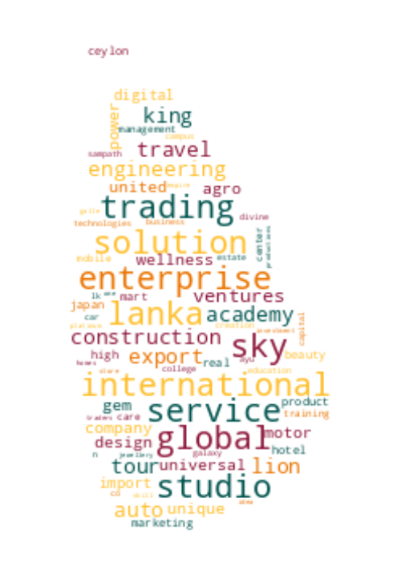

# Registrar of Companies - Sri Lanka

Data Scraped from Registrar of Companies - Sri Lanka (https://eroc.drc.gov.lk)

Scraped **134,157** Companies ([4.15MB](data/companies.tsv)) as of *2024-08-11 10:13:12*.

*Scraping Progress: 52,728/52,728*
✅✅✅✅✅✅✅✅✅✅

## Selection of Companies
*Sample of 10/134157*

* (1) PCC00287821 - **99X TECHNOLOGY AS**
* (14,907) PV00279034 - **BLUE WATER TRADING**
* (29,813) PV00246875 - **DILESHA ECO PRODUCTS**
* (44,719) PV00207183 - **GOODWIN COMPLEX**
* (59,625) PV00212137 - **KELANI BRIDGES**
* (74,532) PV106056 - **MOONLIT GROUP**
* (89,438) PV00281543 - **PRO - LINK SERVICES**
* (104,344) PV126483 - **SEYON INTERNATIONAL DECOR & TRADING**
* (119,250) PV00228062 - **THE ORIENT LIFE**
* (134,157) PV118576 - **ZZAPPIT**

## Latest 1,000 Companies
*Sample of 10/1000*

* (1) PV00298343 - **NEXT LANE**
* (112) PV00298573 - **MAHAYAYA RESOURCES**
* (223) PV00298848 - **RAJARATA TYRE CENTER**
* (334) PV00299123 - **HIDE GLOW**
* (445) PV00299452 - **ELITE ESCAPES**
* (556) PV00299834 - **CROSS STREET FIVE**
* (667) PV00300347 - **FESLA LANKA**
* (778) PV00301005 - **QUALITY LIVESTOCK SOLUTIONS**
* (889) PV00302557 - **GOLDEN HARVEST LANKA**
* (1,000) PV00306388 - **QIQI MEDIA COMPANY**

## Selection for Companies by Type

### "PV"
*Sample of 10/122107*

* (1) PV20853 - **A AND A ASSOCIATES**
* (13,568) PV00286193 - **BLUE OCEAN PEARL**
* (27,135) PV00280365 - **DIGITAL TECH ACADEMY**
* (40,703) PV00238294 - **GOLDEN ELITE INTERNATIONAL**
* (54,270) PV80663 - **KAROODA RETAIL**
* (67,837) PV00294557 - **MN ELECTRONICS**
* (81,405) PV71779 - **PREMIER CRICKET TOURS HOLDINGS**
* (94,972) PV19535 - **SHAAZ TRAVELS**
* (108,539) PV88763 - **THE RICH LIST**
* (122,107) PV118576 - **ZZAPPIT**

### ""
*Sample of 10/4421*

* (1)  - **A AND Y COMMODITIES**
* (492)  - **BHAGYA HERBALS**
* (983)  - **DEFENCE TECHNOLOGY SOLUTIONS**
* (1,474)  - **GLUMY ENTERPRISES**
* (1,965)  - **KANKANAMGE TRADINGS**
* (2,456)  - **MOSLEY IMPORT EXPORT LANKA**
* (2,947)  - **PROTECT SRI LANKA**
* (3,438)  - **SINGHA CLEARING AND TRANSPORT**
* (3,929)  - **THRIVE DYNAMICS**
* (4,421)  - **ZZ PRESTIGE MOTORS**

### "PB"
*Sample of 10/2809*

* (1) PB5111 - **A ONE TOP TRADING**
* (313) PB7 - **CINNAMON HOTEL MANAGEMENT**
* (625) PB4790 - **HOTELROOMNET**
* (937) PB5008 - **MY WAY LEISURE**
* (1,249) PB502 - **SEEMASAHITHA (JANATHA) BALAGOLLA GEMIDIRIYA SANGAMAYA**
* (1,561) PB987 - **SEEMASAHITHA (JANATHA) NATHUWALA GEMIDIRIYA SAMAGAMA**
* (1,873) PB4426 - **SEEMASAHITHA DOBEPOLA POONUGALAWATTA GAMANEGUMA JANATHA SAMAGAMA**
* (2,185) PB4548 - **SEEMASAHITHA NEW MADAKUMBURA GAMANEGUMA JANATHA SAMAGAMA**
* (2,497) PB00272079 - **SIGIRI GUAVA**
* (2,809) PB118 - **ZYREX POWER COMPANY**

### "GA"
*Sample of 10/2400*

* (1) GA00213478 - **A QUINT ONDAATJE FOUNDATION**
* (267) GA3116 - **BJOERN STEIGER FOUNDATION**
* (534) GA00258612 - **DARUL BIR ASSOCIATION FOR WELFARE**
* (800) GA00260781 - **HAILEY FOUNDATION**
* (1,067) GA2427 - **JOYCE MAYER FOUNDATION**
* (1,333) GA00223897 - **METHMAGA MEDIA NETWORK**
* (1,600) GA2233 - **PRAGATHI SEWA PADANAMA**
* (1,866) GA327 - **SOCIAL ECONOMICAL AND ENVIRONMENTAL DEVELOPERS**
* (2,133) GA3182 - **THE I I A LANKA CHAPTER**
* (2,400) GA470 - **ZONTA CLUB II OF COLOMBO**

### "GL"
*Sample of 10/821*

* (1) GL00223389 - **A LITTLE  FOUNDATION**
* (92) GL28 - **BERENDINA DEVELOPMENT SERVICES**
* (183) GL00261912 - **DILIGANZ TRUST**
* (274) GL2410 - **GRACE CARE FUND (GURANTEE)**
* (365) GL00250516 - **JATAA WORLDWIDE**
* (456) GL2359 - **MISSION OF THE NATION (GUARUNTEE)**
* (547) GL86 - **RAVAYA PUBLISHERS**
* (638) GL00241208 - **SLASSCOM FOUNDATION**
* (729) GL2488 - **TOOBA ACADEMY**
* (821) GL2310 - **ZOE LIFE INTERNATIONAL (GURANTEE)**

### "NF"
*Sample of 10/516*

* (1) NF137 - **AB FINLANKA**
* (58) NF421 - **BOVIS MCLACHIAN (PRIVAT)**
* (115) NF432 - **EDDIE BAVER INTERNATIONAL**
* (172) NF373 - **HARTSTRINGS NEVIS LLC**
* (229) NF269 - **KODAK (SINGAPORE)**
* (287) NF407 - **MODLEY PHARMACEUTICALS**
* (344) NF19 - **PIRELLI CONSTRUCTION COMPANY**
* (401) NF619 - **SILVERLAKE SYSTEMS SDN BHD**
* (458) NF8 - **TODA CONSTRUCTION COMPANY**
* (516) NF711 - **ZTE CORPORATION**

### "FC"
*Sample of 10/369*

* (1) FC00251549 - **AA JAPAN (PVT) LTD**
* (41) FC1036 - **BIWATER CONTRACTING B.V.**
* (82) FC1253 - **CONTROL PRINT**
* (123) FC1081 - **FUJITO PTE**
* (164) FC1070 - **IRCON INTERNATIONAL**
* (205) FC1293 - **MALAYSIA AIRLINES BERHAD**
* (246) FC00210858 - **OELT Limited**
* (287) FC00211497 - **SBT CO., LTD.**
* (328) FC1038 - **THE BRITISH COMPUTER SOCIETY**
* (369) FC1065 - **ZIBO GUANGZHENG ALKALI ALUMINIUM CHEMICAL INDUSTRY CO.,**

### "F"
*Sample of 10/213*

* (1) F234 - **ALCO INSURANCE COMPANY**
* (24) F225 - **BHARAT FIRE & GENERAL INS**
* (48) F318 - **ENGINEERING CONSTRUCTION CORPORATION**
* (71) F306 - **HYATT OF CEYLON**
* (95) F75 - **MANUFACTURERS LIFE INS. CO.**
* (118) F376 - **ORIENTA CONSULTANT INVESTMENTS CO**
* (142) F379 - **SIMPLEX CONCRETE PILES (INDIA) PRIVATE**
* (165) F332 - **THAI AIRWAYS INTERNATIONAL**
* (189) F190 - **THE NONO TYPE CORPORATION**
* (213) F6 - **YORKSHIRE INSURANCE CO LTC CEASED 1/11/70**

### "PQ"
*Sample of 10/159*

* (1) PQ188 - **ABANS ELECTRICALS**
* (18) PQ202 - **BROWNS BEACH HOTELS**
* (36) PQ00244471 - **CHRISSWORLD**
* (53) PQ199 - **EDEN HOTEL LANKA**
* (71) PQ178 - **HUEJAY INTERNATIONAL INVESTMENT**
* (88) PQ179 - **LANKA IOC**
* (106) PQ30 - **PELWATTE SUGAR**
* (123) PQ105 - **SATHOSA MOTORS**
* (141) PQ1 - **THE FINANCE COMPANY**
* (159) PQ181 - **YORK ARCADE HOLDINGS**

### "PBPV"
*Sample of 10/84*

* (1) PB1296PV - **A BAUR AND COMPANY  TRAVEL**
* (10) PB540PV - **BALTIC CONTROL SERVICES**
* (19) PB1567PV - **CYRIL GARDINER**
* (28) PB512PV - **FELTEX**
* (37) PB753PV - **HAYLEYS AVENTURA**
* (47) PB583PV - **MARITIME AGENCIES**
* (56) PB5365PV - **NIMBUS CLOUD LANKA**
* (65) PB854PV - **RENUKA AGRO EXPORTS**
* (74) PB3798PV - **TOKYO CEMENT POWER (LANKA)**
* (84) PB144PV - **WORLD SUBSEA SERVICES**

### "PCC"
*Sample of 10/57*

* (1) PCC00287821 - **99X TECHNOLOGY AS**
* (7) PCC00278331 - **BITAZZA INTERNATIONAL LIMITED**
* (13) PCC00285477 - **CHINA HARBOUR ENGINEERING COMPANY LIMITED**
* (19) PCC00284521 - **ECHELON TRADE (PVT) LTD.**
* (25) PCC00289173 - **HATTON NATIONAL BANK PLC.**
* (32) PCC00288843 - **IVIVA PTE LTD**
* (38) PCC00289410 - **NCINGA PTE LTD**
* (44) PCC00289735 - **PORT CITY BPO (PRIVATE) LIMITED.**
* (50) PCC00284610 - **SATGURU TRAVEL AND TOURISM LLC**
* (57) PCC00292982 - **YOULANKA GROUP LIMITED**

### "PVPB"
*Sample of 10/47*

* (1) PV4158PB - **ADAM CARBONS**
* (6) PV75497PB - **CAPITAL TRUST HOLDINGS**
* (11) PV440PB - **CITRUS VACATIONS LIMITED**
* (16) PV118379PB - **FUTURE LIFE INVESTMENTS**
* (21) PV115971PB - **ISOLEZ BIOTECH PHARMA AG**
* (26) PV6401PB - **MAG INDUSTRIES**
* (31) PV114960PB - **NOORANI RENEWABLE ENERGY**
* (36) PV12813PB - **SIERRA CONSTRUCTION**
* (41) PV83543PB - **STANDARD PAINTS**
* (47) PV78825PB - **TRILLIUM PROPERTY MANAGEMENT & SERVICES**

### "PBG"
*Sample of 10/46*

* (1) PBG45 - **ACCOUNTANCY ASSOSICATES**
* (6) PBG48 - **BRIGHTSTAR FINANCE**
* (11) PBG37 - **CONSULTANCY AND FINANCE AND DEVELOPMENT**
* (16) PBG22 - **FREE LANKA SPORTSMEN**
* (21) PBG9 - **OVERSEA CHILDRENS SCHOOL LTD ( BY GUARANTEE)**
* (26) PBG35 - **SAMPATH SPORTSMEN**
* (31) PBG17 - **THE BENEFIT PROVIDENT FUND**
* (36) PBG16 - **THE INSURANCE POLICY HOLDERS SERVICES**
* (41) PBG39 - **THEEPAM INSTITUTE**
* (46) PBG14 - **UNITED SPORTSMAN**

### "PBPQ"
*Sample of 10/36*

* (1) PB200PQ - **ACCESS ENGINEERING**
* (4) PB1090PQ - **AMBEON CAPITAL**
* (8) PB1280PQ - **CEYLON TEA BROKERS**
* (12) PB765PQ - **DIALOG FINANCE**
* (16) PB307PQ - **JANASHAKTHI INSURANCE**
* (20) PB376PQ - **MILLENNIUM HOUSING DEVELOPERS**
* (24) PB647PQ - **PEOPLE'S LEASING & FINANCE**
* (28) PB813PQ - **SINGER FINANCE (LANKA)**
* (32) PB689PQ - **TESS AGRO**
* (36) PB4242PQ - **WASKADUWA BEACH RESORT**

### "NPVS"
*Sample of 10/29*
* (1) NPVS40803 - **ALNA WATER SYSTEMS**
* (4) NPVS22400 - **CEETEE INTERNATIONAL**
* (7) NPVS35441 - **DUMBARA FERTILIZERS**
* (10) NPVS15104 - **FIVE STAR EXPORTS**
* (13) NPVS42442 - **HERITAGE SAPPHIRES**
* (16) NPVS38695 - **MCMILLAN CEYLON MARKETING**
* (19) NPVS9611 - **Q-NET**
* (22) NPVS18562 - **SERENDIB INSURANCE BROKERS**
* (25) NPVS11267 - **SILVER SHRIMPS**
* (29) NPVS16673 - **WESTERN TRADING COMPANY**

### "PVPBPQ"
*Sample of 10/11*
* (1) PV5301PBPQ - **ABANS**
* (2) PV3562PB/PQ - **ASIA SIYAKA COMODITIES**
* (3) PVPB13254PQ - **JETWING SYMPHONY**
* (4) PV8330PBPQ - **LAUGFS GAS**
* (5) PVPB7385PQ - **LOTUS HYDRO POWER**
* (6) PV10922PBPQ - **RAIGAM WAYAMBA SALTERNS**
* (7) PVPB8234PQ - **RAMBODA FALLS**
* (8) PV415PBPQ - **RESUS ENERGY**
* (9) PV70371PB/PQ - **SINGHE HOSPITALS**
* (11) PV7617PBPQ - **TEEJAY LANKA**

### "PQPB"
* (1) PQ96PB - **ASIRI CENTRAL HOSPITALS**
* (2) PQ15PB - **ASSOCIATED ELECTRICAL CORPORATION**
* (3) PQ193PB - **BERUWELA WALK INN**
* (4) PQ99PB - **CEYLON LEATHER PRODUCTS**
* (5) PQ19PB - **EQUITY ONE**
* (6) PQ61PB - **FINLAYS COLOMBO**
* (7) PQ176PB - **KURUWITA TEXTILE MILLS**
* (8) PQ77PB - **MORISON**

### "OC"
* (1) OC111 - **ASTER JETFUEL**
* (2) OC108 - **CAMSO TRADING**
* (3) OC109 - **ENERGY COMMERCE B.V.**
* (4) OC104 - **MERCANTILE SEASCAPE SHIPPING COMPANY**
* (5) OC103 - **MERCANTILE SEBORNE SHIPPING**
* (6) OC102 - **POWER HUB INTERNATIONAL SDN PHD**

### "PVS"
* (1) PVS1795 - **CINE-TECH**
* (2) PVS8467 - **LAKMINI ENTERPRISES**
* (3) PVS7888 - **RADIAN PRODUCTS**
* (4) PVS7498 - **WINGS TRAVELS AND TOURS**
* (5) PVS8227 - **WOODLANDS LANKA**

### "PVPQ"
* (1) PV10527PQ - **ADAM CAPITAL**
* (2) PV1618PQ - **AGSTAR**
* (3) PV72355PQ - **ANILANA HOTELS & PROPERTIES**
* (4) PV415PQ - **HEMAS POWER**

### "PBPVPB"
* (1) PB64PVPB - **GAC SHIPPING**
* (2) PB553PV/PB - **INTERNATIONAL CONSUMER BRANDS**
* (3) PBPVPB138 - **MCLARENS SHIPPING**

### "PQPBPV"
* (1) PQ98PBPV - **ACE POWER GENERATION MATARA**
* (2) PQ16PB/PV - **ASSOCIATED MOTORWAYS**

### "NFA"
* (1) NF160A - **CO ECHO ENTERPRISES**

### "PVPBPV"
* (1) PV4405PBPV - **DAVE TRACTORS**

### "PBpv"
* (1) PB1236pv - **UNILEAVER CEYLON SERVICES**

### "PQPV"
* (1) PQ231PV - **UNION RESORTS**
