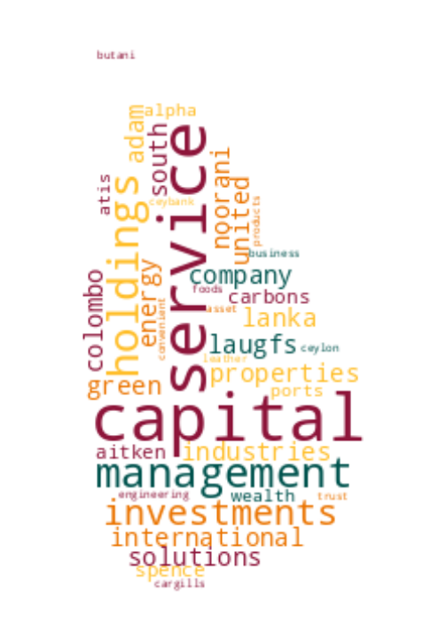

# Registrar of Companies - Sri Lanka

Data Scraped from Registrar of Companies - Sri Lanka (https://eroc.drc.gov.lk)

Scraped **131,601** Companies ([4.07MB](data/companies.tsv)) as of *2024-04-02 22:16:16*.

*Scraping Progress: 52,728/52,728*
✅✅✅✅✅✅✅✅✅✅

## Selection of Companies
*Sample of 10/131601*

* (1) PCC00287821 - **99X TECHNOLOGY AS**
* (14,623) PV90695 - **BLUEPRINT HOLDINGS**
* (29,245) PV63991 - **DILIGENCE GLOBAL**
* (43,867) PV00260829 - **GORDON FOREIGN EDUCATIONAL CONSULTANCY**
* (58,489) PV00200203 - **KEERTHIRATHNA HOLDINGS**
* (73,112) PV00277949 - **MONTREAL CEYLON**
* (87,734) PV00286947 - **PRINTEX DESIGN**
* (102,356) PV90093 - **SEWVANDHI RUBBER INDUSTRIES**
* (116,978) GL00232067 - **THE PARROTFISH COLLECTIVE**
* (131,601) PV118576 - **ZZAPPIT**

## Latest 1,000 Companies
*Sample of 10/1000*

* (1) PV00294154 - **SERENDIB AGRO**
* (112) PV00294401 - **MNS MULTI PRODUCTS**
* (223) PV00294658 - **HOUZE OF JINDAL**
* (334) PV00294957 - **THE PRINCESS SEWING**
* (445) PV00295329 - **EURO PLASTICS**
* (556) PV00295671 - **PLUSHIES AND FLUFFIES**
* (667) PV00296044 - **JING SEASONS**
* (778) PV00296516 - **CEYLON FISHBAY**
* (889) PV00297033 - **SHINE TECHNOLOGY SOLUTIONS**
* (1,000) PV00297922 - **MICHIKA GLOBAL TRADING**

## Selection for Companies by Type

### "PV"
*Sample of 10/119662*

* (1) PV20853 - **A AND A ASSOCIATES**
* (13,296) PV109731 - **BLUE SANDS BACH**
* (26,592) PV75835 - **DIGITAL SIGN ADVERTISING SERVICES**
* (39,888) PV107874 - **GOLDEN LAND PROPERTY DEVELOPERS**
* (53,183) PV80582 - **KAROODA HOLDINS**
* (66,479) PV00267771 - **MLM SAFETY HOUSE**
* (79,775) PV107877 - **PREMADASA PRINT MEIDA**
* (93,070) PV00209485 - **SHABITH JAPAN LANKA**
* (106,366) PV00266776 - **THE ROYAL ROUTE**
* (119,662) PV118576 - **ZZAPPIT**

### ""
*Sample of 10/4447*

* (1)  - **A AND Y COMMODITIES**
* (495)  - **BLOCKCHAIN ASSOCIATION OF SRI LANKA**
* (989)  - **DIGITAL BRIDGE COMPANY**
* (1,483)  - **GLOBAL FOOD NETWORK**
* (1,977)  - **JSM LEISURE HOLDING**
* (2,471)  - **MOKSHA AYURVEDA HEALTHCARE**
* (2,965)  - **PRASANNA PVC INDUSTRIES**
* (3,459)  - **SHRAMA MUTHU**
* (3,953)  - **THREE SN ENTERPRISES**
* (4,447)  - **ZYNOWIX**

### "PB"
*Sample of 10/2782*

* (1) PB5111 - **A ONE TOP TRADING**
* (310) PB5194 - **CHINA  AERO - TECHNOLOGY IMPORT & EXPORT CORPORATION LANKA**
* (619) PB4843 - **HOTICULTURIST LANKA**
* (928) PB1025 - **NATIONAL ASSET MANAGEMENT**
* (1,237) PB804 - **SEEMASAHITHA (JANATHA) BATHALAYAYA IHALA GAMIDIRIYA SAMAGAMA (PEOPLES)**
* (1,546) PB3398 - **SEEMASAHITHA (JANATHA) NIKAGODA GAMIDIRIYA SAMAGAMA**
* (1,855) PB4743 - **SEEMASAHITHA DIGGALPURA YAYA HAYA GAMANEGUMA JANATHA SAMAGAMA**
* (2,164) PB4101 - **SEEMASAHITHA NEGENAHIRA MAHAWEWA GAMANEGUMA JANATHA SAMAGAMA**
* (2,473) PB00215449 - **SEVEN SENSES LANKA**
* (2,782) PB118 - **ZYREX POWER COMPANY**

### "GA"
*Sample of 10/2341*

* (1) GA00213478 - **A QUINT ONDAATJE FOUNDATION**
* (261) GA427 - **BODHI RANASINGHE FOUNDATION**
* (521) GA00257667 - **DADDY FOUNDATION**
* (781) GA00239490 - **GUARDIANS LANKA FOUNDATION**
* (1,041) GA00211470 - **JERUSHIYA  FOUNDATION**
* (1,301) GA579 - **MAWANTHANPETH**
* (1,561) GA00262226 - **PJFM INTERNATIONAL FOUNDATION**
* (1,821) GA00245932 - **SIW HELAYE DARUWO**
* (2,081) GA163 - **THE INSURANCE ASSOCIATION OF SRI LANKA**
* (2,341) GA470 - **ZONTA CLUB II OF COLOMBO**

### "GL"
*Sample of 10/811*

* (1) GL00223389 - **A LITTLE  FOUNDATION**
* (91) GL2 - **BRAC LANKA**
* (181) GL2408 - **DOWELS DOCTORS WELFARE ASSOCIATION**
* (271) GL2040 - **GROW & GLOW**
* (361) GL91 - **JETWING RELIEF FUND**
* (451) GL00277004 - **MODERNIZED SPECIAL TOUR BUS ASSOCIATION**
* (541) GL2415 - **RATIONAL CHILDREN FOR AN ENLIGHTENED NATION**
* (631) GL2211 - **SLASSCOM**
* (721) GL2488 - **TOOBA ACADEMY**
* (811) GL2310 - **ZOE LIFE INTERNATIONAL (GURANTEE)**

### "NF"
*Sample of 10/504*

* (1) NF137 - **AB FINLANKA**
* (56) NF206 - **BRILLIANT VALLEY**
* (112) NF637 - **EDEXCEL**
* (168) NF679 - **HIGH MAX (HONG KONG)**
* (224) NF240 - **KOREA TELECOM INTERNATIONAL CO.**
* (280) NF195 - **MOTOROLA SINGAPORE**
* (336) NF95 - **PILKINGTON ( ASIA)**
* (392) NF691 - **SIMPLEX INFRASTRUCTURE**
* (448) NF534 - **TOA CORPORATION**
* (504) NF711 - **ZTE CORPORATION**

### "FC"
*Sample of 10/365*

* (1) FC00251549 - **AA JAPAN (PVT) LTD**
* (41) FC1044 - **BIS VAM ANLAGENTECHNIK GMBH**
* (81) FC1253 - **CONTROL PRINT**
* (122) FC1123 - **FOVAROSI VIZMUVEK ZRT**
* (162) FC1070 - **IRCON INTERNATIONAL**
* (203) FC1073 - **MARK INFRATRADE**
* (243) FC00210858 - **OELT Limited**
* (284) FC1119 - **SCHLUMBER OILFIELD EASTERN**
* (324) FC1186 - **TIKKU MARKETING SERVICES PRIVATE**
* (365) FC1065 - **ZIBO GUANGZHENG ALKALI ALUMINIUM CHEMICAL INDUSTRY CO.,**

### "F"
*Sample of 10/205*

* (1) F234 - **ALCO INSURANCE COMPANY**
* (23) F327 - **BANQUE DE L'INDOCHINE ET DE SUEZ (FRANCE)**
* (46) F351 - **DET NORSKE VERITAS**
* (69) F340 - **HABIB BANK A.G. ZURICH**
* (91) F255 - **LA MATERAL ELECRIEQUE**
* (114) F7 - **NORTHERN ASSUARENCE CO.**
* (137) F49 - **SCOTTISH UNION NATIONAL INSURANCE CO.**
* (159) F209 - **TALAWAKELLE ESTATE CO.**
* (182) F250 - **THE PIONERR FIRE & GEN INS CO**
* (205) F6 - **YORKSHIRE INSURANCE CO LTC CEASED 1/11/70**

### "PQ"
*Sample of 10/150*

* (1) PQ188 - **ABANS ELECTRICALS**
* (17) PQ56 - **BUKIT DARAH**
* (34) PQ90 - **CITY HOUSING AND REAL ESTATE COMPANY**
* (50) PQ153 - **EASTERN MERCHANTS**
* (67) PQ6 - **HEMAS HOLDINGS**
* (83) PQ187 - **LANKA ALUMINIUM INDUSTRIES**
* (100) PQ177 - **MULLER & PHIPPS (CEYLON)**
* (116) PQ167 - **ROYAL PALMS BEACH HOTELS**
* (133) PQ84 - **THE AUTODROME**
* (150) PQ00234079 - **WINDFORCE**

### "PBPV"
*Sample of 10/80*

* (1) PB1296PV - **A BAUR AND COMPANY  TRAVEL**
* (9) PB162PV - **ASSETLINE INSURANCE BROKERS**
* (18) PB30PV - **DAVID PIERIS AUTOMOBILES**
* (27) PB303PV - **GEORGE STEUART HEALTH**
* (36) PB350PV - **HAYLEYS PLANTATION SERVICES**
* (44) PB4516PV - **LUMIERE TEXTILES**
* (53) PB547PV - **MILLENNIUM TRANSPORTATION**
* (62) PB752PV - **RILEYS**
* (71) PB1236PV - **UNILEVER CEYLON SERVICES**
* (80) PB144PV - **WORLD SUBSEA SERVICES**

### "PCC"
*Sample of 10/47*

* (1) PCC00287821 - **99X TECHNOLOGY AS**
* (6) PCC00295416 - **BISTEC SOLUTIONS (PVT) LTD.**
* (11) PCC00290488 - **CHINA HARBOUR ENGINEERING COMPANY (LANKA) LIMITED.**
* (16) PCC00295415 - **CREATIVE SOFTWARE (PVT) LTD.**
* (21) PCC00295997 - **GTN GROUP HOLDING LIMITED**
* (26) PCC00290386 - **INVIGORATE CEYLON (PVT) LTD**
* (31) PCC00294426 - **NATIONAL DEVELOPMENT BANK PLC.**
* (36) PCC00296106 - **PAGERO LANKA SOFTWARE ENGINEERING (PVT) LTD.**
* (41) PCC00289409 - **SAMPATH BANK PLC.**
* (47) PCC00292982 - **YOULANKA GROUP LIMITED**

### "PVPB"
*Sample of 10/46*

* (1) PV4158PB - **ADAM CARBONS**
* (6) PV77699PB - **BUTANI CAPITAL**
* (11) PV6857PB - **CEYLON LEATHER PRODUCTS MANUFACTURERS**
* (16) PV64927PB - **EVOKE INTERNATIONAL**
* (21) PV88548PB - **GREEN FIELDS CONSULTANCY SERVICES**
* (26) PV84201PB - **M POWER CAPITAL**
* (31) PV21775PB - **ORIENT CAPITAL**
* (36) PV92257PB - **SMALL & MEDIUM WEALTH MANAGEMENT**
* (41) PV13611PB - **SUMANAGIRI LANKA**
* (46) PV127512PB - **UNITED CAPITAL HOLDINGS**

### "PBG"
*Sample of 10/45*

* (1) PBG45 - **ACCOUNTANCY ASSOSICATES**
* (5) PBG28 - **BLUE DIAMOND SPORTSMEN**
* (10) PBG8 - **COLOMBO MEDICAL SCHEMES**
* (15) PBG43 - **ERD FINANCE**
* (20) PBG50 - **NEW ERA PUBLICATIONS**
* (25) PBG47 - **RURAL COMMUNITY DEVELOPMENT PROJECT**
* (30) PBG7 - **SUYATHESA AFIVIRTHI SANGAM**
* (35) PBG20 - **THE FREE LANKA BENEFITS**
* (40) PBG39 - **THEEPAM INSTITUTE**
* (45) PBG14 - **UNITED SPORTSMAN**

### "PBPQ"
*Sample of 10/39*

* (1) PB200PQ - **ACCESS ENGINEERING**
* (5) PB4739PQ - **ARPICO INSURANCE**
* (9) PB1280PQ - **CEYLON TEA BROKERS**
* (13) PB744PQ - **EXPOLANKA HOLDINGS**
* (17) PB307PQ - **JANASHAKTHI INSURANCE**
* (22) PB376PQ - **MILLENNIUM HOUSING DEVELOPERS**
* (26) PB647PQ - **PEOPLE'S LEASING & FINANCE**
* (30) PB813PQ - **SINGER FINANCE (LANKA)**
* (34) PB689PQ - **TESS AGRO**
* (39) PB4242PQ - **WASKADUWA BEACH RESORT**

### "NPVS"
*Sample of 10/29*
* (1) NPVS40803 - **ALNA WATER SYSTEMS**
* (4) NPVS22400 - **CEETEE INTERNATIONAL**
* (7) NPVS35441 - **DUMBARA FERTILIZERS**
* (10) NPVS15104 - **FIVE STAR EXPORTS**
* (13) NPVS42442 - **HERITAGE SAPPHIRES**
* (16) NPVS38695 - **MCMILLAN CEYLON MARKETING**
* (19) NPVS9611 - **Q-NET**
* (22) NPVS18562 - **SERENDIB INSURANCE BROKERS**
* (25) NPVS11267 - **SILVER SHRIMPS**
* (29) NPVS16673 - **WESTERN TRADING COMPANY**

### "PVPBPQ"
* (1) PV5301PBPQ - **ABANS**
* (2) PV17807PB/PQ - **GREENTECH ENERGY**
* (3) PVPB13254PQ - **JETWING SYMPHONY**
* (4) PV8330PBPQ - **LAUGFS GAS**
* (5) PVPB7385PQ - **LOTUS HYDRO POWER**
* (6) PVPB8234PQ - **RAMBODA FALLS**
* (7) PV415PBPQ - **RESUS ENERGY**
* (8) PV70371PB/PQ - **SINGHE HOSPITALS**
* (9) PV1536PBPQ - **SOFTLOGIC HOLDINGS**
* (10) PV7617PBPQ - **TEEJAY LANKA**

### "PQPB"
* (1) PQ96PB - **ASIRI CENTRAL HOSPITALS**
* (2) PQ15PB - **ASSOCIATED ELECTRICAL CORPORATION**
* (3) PQ17PB - **ASSOCIATED PROPERTY DEVELOPMENT**
* (4) PQ193PB - **BERUWELA WALK INN**
* (5) PQ99PB - **CEYLON LEATHER PRODUCTS**
* (6) PQ61PB - **FINLAYS COLOMBO**
* (7) PQ143PB - **HOTEL DEVELOPERS (LANKA) LIMITED**
* (8) PQ176PB - **KURUWITA TEXTILE MILLS**
* (9) PQ77PB - **MORISON**

### "OC"
* (1) OC111 - **ASTER JETFUEL**
* (2) OC108 - **CAMSO TRADING**
* (3) OC109 - **ENERGY COMMERCE B.V.**
* (4) OC101 - **ISLANDERS MALDIVES PTE**
* (5) OC104 - **MERCANTILE SEASCAPE SHIPPING COMPANY**
* (6) OC106 - **MERCANTILE SEAWIND SHIPPING COMPANY**
* (7) OC103 - **MERCANTILE SEBORNE SHIPPING**
* (8) OC102 - **POWER HUB INTERNATIONAL SDN PHD**

### "PVPQ"
* (1) PV10527PQ - **ADAM CAPITAL**
* (2) PV1618PQ - **AGSTAR**
* (3) PV72355PQ - **ANILANA HOTELS & PROPERTIES**
* (4) PV415PQ - **HEMAS POWER**
* (5) PV7206PQ - **ODEL**
* (6) PV1536PQ - **SOFT LOGIC HOLDINGS**

### "PVS"
* (1) PVS1795 - **CINE-TECH**
* (2) PVS8467 - **LAKMINI ENTERPRISES**
* (3) PVS7888 - **RADIAN PRODUCTS**
* (4) PVS7498 - **WINGS TRAVELS AND TOURS**
* (5) PVS8227 - **WOODLANDS LANKA**

### "PQPBPV"
* (1) PQ98PBPV - **ACE POWER GENERATION MATARA**
* (2) PQ16PB/PV - **ASSOCIATED MOTORWAYS**

### "PBPVPB"
* (1) PB64PVPB - **GAC SHIPPING**
* (2) PBPVPB138 - **MCLARENS SHIPPING**

### "NFA"
* (1) NF160A - **CO ECHO ENTERPRISES**

### "PVPBPV"
* (1) PV4405PBPV - **DAVE TRACTORS**

### "UC"
* (1) UC1 - **JACEY AND COMPANY**

### "PBPQPB"
* (1) PB613PQ/PB - **JANASHAKTHI**

### "GAGL"
* (1) GA683GL - **LANKA PRISON FELLOWSHIP**

### "PQPV"
* (1) PQ231PV - **UNION RESORTS**
