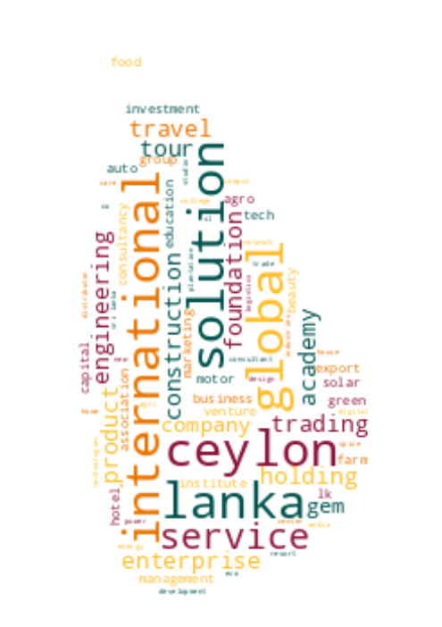

# Registrar of Companies - Sri Lanka

Data Scraped from Registrar of Companies - Sri Lanka (https://eroc.drc.gov.lk)

Scraped **127,487** Companies ([3.94MB](data/companies.tsv)) as of *2024-01-05 17:12:27*.

*Scraping Progress: 52,728/52,728*
✅✅✅✅✅✅✅✅✅✅

## Selection of Companies
*Sample of 10/127487*

* (1) PCC00287821 - **99X TECHNOLOGY AS**
* (14,166) PV00250084 - **BODHI**
* (28,331) PV116153 - **DIMACO ENTERPRISES**
* (42,496) GA00277707 - **GOSPEL MISSION OF LIFE**
* (56,661) PV18277 - **KEHELWATTA ESTATES**
* (70,826) PV00276515 - **MOONRISE HOLIDAYS**
* (84,991) PV2245 - **PRINTSERVE**
* (99,156) PV90655 - **SEVER**
* (113,321) PV00278018 - **THE ONE FORT**
* (127,487) PV118576 - **ZZAPPIT**

## Latest 1,000 Companies
*Sample of 10/1000*

* (1) PV00288610 - **MALINGA99**
* (112) PV00288763 - **NEW ERA LEISURE TRAVEL**
* (223) PV00288921 - **ECHOES GLOBAL EDUCATION AND MIGRATION SERVICES**
* (334) PV00289067 - **ARYASHRI TRADING**
* (445) PV00289231 - **EVOQ SYSTEMS**
* (556) PV00289405 - **K FISH PALATE**
* (667) PV00289555 - **GIANT GLOBAL**
* (778) PV00289711 - **TELEART PRINTERS**
* (889) PV00289919 - **HAASINI TRAVELS AND TOURS**
* (1,000) PV00291555 - **SL MOBILE**

## Selection for Companies by Type

### "PV"
*Sample of 10/116386*

* (1) PV20853 - **A AND A ASSOCIATES**
* (12,932) PV109263 - **BLUE WAVE CONSTRUCTION**
* (25,864) PV00283442 - **DILAN KONARA INTERNATIONAL**
* (38,796) PV00256491 - **GOLDEN GATE HOLDING**
* (51,727) PV00255216 - **KARATHOTA GOVIPALA**
* (64,659) PV00258770 - **MM AUTO TRADERS MODIFICATION PARTS**
* (77,591) PV14085 - **PRECISION PRODUCTIONS**
* (90,522) PV00248081 - **SFS HOLDINGS**
* (103,454) PV00215941 - **THE ROYAL BAKERY 1906**
* (116,386) PV118576 - **ZZAPPIT**

### ""
*Sample of 10/3742*

* (1)  - **A KIRUBAA GROUP OF COMPANIES**
* (416)  - **BOSKOFA BATTERIES AND ENERGY STORAGE SYSTEMSDIOGER HEAVY INDUSTRIES**
* (832)  - **DIGITAL WEALTH**
* (1,248)  - **GLOMA INTERNATIONAL**
* (1,663)  - **KAARAH HOSPITALITY**
* (2,079)  - **MOHIZHU FABRIC**
* (2,495)  - **POLYCAMPUS**
* (2,910)  - **SHIVA PARTNERS**
* (3,326)  - **THE RMT HOLDER'S**
* (3,742)  - **ZOVO ENTERPRISES**

### "PB"
*Sample of 10/2760*

* (1) PB5111 - **A ONE TOP TRADING**
* (307) PB4772 - **CITYSTATE INSURANCE COMPANY**
* (614) PB5288 - **IDEA GROUP**
* (920) PB4819 - **NATION LANKA ASSET MANAGEMENT**
* (1,227) PB3278 - **SEEMASAHITHA (JANATHA) BAMBARAGALA THELAMBUGAHAARA GAMIDIRIYA SAMAGAMA**
* (1,533) PB3345 - **SEEMASAHITHA (JANATHA) MEEGASDENIYA GAMIDIRIYA SAMAGAMA**
* (1,840) PB4354 - **SEEMASAHITHA BUDDHIGAMA BATAHIRA GAMANEGUMA JANATHA SAMAGAMA**
* (2,146) PB4319 - **SEEMASAHITHA MINIPURAGAMA GAMANEGUMA JANATHA SAMAGAMA**
* (2,453) PB5448 - **SHAKYA HEALTH CARE MAGIYANGANA**
* (2,760) PB118 - **ZYREX POWER COMPANY**

### "GA"
*Sample of 10/2326*

* (1) GA00213478 - **A QUINT ONDAATJE FOUNDATION**
* (259) GA427 - **BODHI RANASINGHE FOUNDATION**
* (517) GA2408 - **DARUL JAILAN INTERNATIONAL FOUNDATION**
* (776) GA3080 - **HARENDRE & UDANI FOUNDATION**
* (1,034) GA2027 - **KEBITHIGOLLEWA EKABADDA GRMEEYA SANWARDENA SANVIDHANAYA**
* (1,292) GA84 - **MOHAN LAL GRERO FOUNDATION**
* (1,551) GA3162 - **PROFESSIONAL FOR A BETTER FUTURE**
* (1,809) GA3486 - **SOCIAL MERCY VOLUNTEERS FOUNDATION**
* (2,067) GA2206 - **THE INDUSTRIAL RELATIONS ASSOCIATION SRI LANKA**
* (2,326) GA470 - **ZONTA CLUB II OF COLOMBO**

### "GL"
*Sample of 10/729*

* (1) GL00223389 - **A LITTLE  FOUNDATION**
* (81) GL39 - **BOAT BUILDING TECHNOLOGY IMPROVEMENT INSTITUTE LANKA**
* (162) GL00280587 - **EASTERN YOUTH'S ORGANIZATION (EYO)**
* (243) GL2420 - **GROW & GLOW**
* (324) GL00247238 - **KANAPATHI ARAKADDALAI**
* (405) GL2255 - **MISSION FOR SMILES**
* (486) GL00247122 - **RAI FOUNDATION**
* (567) GL00241208 - **SLASSCOM FOUNDATION**
* (648) GL2313 - **TOXIN FREE CROP PRODUCER NETWORK**
* (729) GL2310 - **ZOE LIFE INTERNATIONAL (GURANTEE)**

### "NF"
*Sample of 10/513*

* (1) NF137 - **AB FINLANKA**
* (57) NF193 - **BRIGHT ELITE**
* (114) NF401 - **DIMON INTERNATIONAL A.G.**
* (171) NF327 - **GREGOR CORPORATION**
* (228) NF513 - **KELLWOOD TRADING**
* (285) NF228 - **MERCK SHARIP & DOHME IDEA INC.**
* (342) NF360 - **PFAFF SINGAPORE**
* (399) NF108 - **SKY TRACK LMITED**
* (456) NF150 - **TORRENT EXPORTS**
* (513) NF711 - **ZTE CORPORATION**

### "FC"
*Sample of 10/363*

* (1) FC00251549 - **AA JAPAN (PVT) LTD**
* (41) FC1289 - **BIOCON**
* (81) FC1077 - **CYRIL SWEETT INTERNATIONAL**
* (121) FC1399 - **FUJITA CORPORATION**
* (161) FC00236404 - **ITW CONSULTING PRIVATE LIMITED**
* (202) FC00260998 - **MATSUURA KIKAI SEISAKUSHO CO. LTD.**
* (242) FC1048 - **OPTIMA ENERGY SA**
* (282) FC1119 - **SCHLUMBER OILFIELD EASTERN**
* (322) FC1038 - **THE BRITISH COMPUTER SOCIETY**
* (363) FC1065 - **ZIBO GUANGZHENG ALKALI ALUMINIUM CHEMICAL INDUSTRY CO.,**

### "F"
*Sample of 10/213*

* (1) F234 - **ALCO INSURANCE COMPANY**
* (24) F41 - **BOMBAY LIFE ASSURANCE CO.**
* (48) F351 - **DET NORSKE VERITAS**
* (71) F352 - **GULFEAST INTERNATIONAL (PTE)**
* (95) F288 - **LINTAS**
* (118) F206 - **NEW HAMPSHIRE FIRE INS CO**
* (142) F59 - **ROYAL INSURANCE CO.**
* (165) F172 - **STERLING GEN INS CO**
* (189) F250 - **THE PIONERR FIRE & GEN INS CO**
* (213) F6 - **YORKSHIRE INSURANCE CO LTC CEASED 1/11/70**

### "PQ"
*Sample of 10/162*

* (1) PQ188 - **ABANS ELECTRICALS**
* (18) PQ00252285 - **CAPITAL ALLIANCE**
* (36) PQ90 - **CITY HOUSING AND REAL ESTATE COMPANY**
* (54) PQ69 - **DUNAMIS CAPITAL**
* (72) PQ185 - **INDUSTRIAL ASPHALTS (CEYLON)**
* (90) PQ139 - **LANKA REALTY INVESTMENTS**
* (108) PQ39 - **OVERSEAS REALTY (CEYLON)**
* (126) PQ46 - **SELINSING**
* (144) PQ172 - **THE COLOMBO FORT LAND AND BUILDING**
* (162) PQ00234079 - **WINDFORCE**

### "PBPV"
*Sample of 10/75*

* (1) PB1296PV - **A BAUR AND COMPANY  TRAVEL**
* (9) PB956PV - **BEIRA BRUSH**
* (17) PB235PV - **EAMEL EXPORTS**
* (25) PB303PV - **GEORGE STEUART HEALTH**
* (33) PB1637PV - **HOTEL INTERNATIONAL**
* (42) PB155PV - **MC MARINE**
* (50) PB514PV - **PURITAS**
* (58) PB3376PV - **SHAW WALLACE PROPERTIES**
* (66) PB5092PV - **TOKYO EASTERN CEMENT COMPANY**
* (75) PB312PV - **VERITAS INVESTMENTS**

### "PBG"
*Sample of 10/46*

* (1) PBG45 - **ACCOUNTANCY ASSOSICATES**
* (6) PBG48 - **BRIGHTSTAR FINANCE**
* (11) PBG37 - **CONSULTANCY AND FINANCE AND DEVELOPMENT**
* (16) PBG22 - **FREE LANKA SPORTSMEN**
* (21) PBG9 - **OVERSEA CHILDRENS SCHOOL LTD ( BY GUARANTEE)**
* (26) PBG35 - **SAMPATH SPORTSMEN**
* (31) PBG17 - **THE BENEFIT PROVIDENT FUND**
* (36) PBG16 - **THE INSURANCE POLICY HOLDERS SERVICES**
* (41) PBG39 - **THEEPAM INSTITUTE**
* (46) PBG14 - **UNITED SPORTSMAN**

### "PVPB"
*Sample of 10/41*

* (1) PV4158PB - **ADAM CARBONS**
* (5) PV11479PB - **CARGILLS CONVENIENT FOODS**
* (9) PV440PB - **CITRUS VACATIONS LIMITED**
* (14) PV64927PB - **EVOKE INTERNATIONAL**
* (18) PV115971PB - **ISOLEZ BIOTECH PHARMA AG**
* (23) PV69307PB - **NATURE'S BEST INDUSTRY**
* (27) PV21775PB - **ORIENT CAPITAL**
* (32) PV92257PB - **SMALL & MEDIUM WEALTH MANAGEMENT**
* (36) PV62841PB - **SUNDARAM LANKA TYRES**
* (41) PV77431PB - **WELIGAMA HOTEL PROPERTIES**

### "PBPQ"
*Sample of 10/30*
* (1) PB1015PQ - **ABANS FINANCE**
* (4) PB139PQ - **ASIA ASSET FINANCE**
* (7) PB1280PQ - **CEYLON TEA BROKERS**
* (10) PB127PQ - **FIRST CAPITAL TREASURIES**
* (13) PB3006PQ - **LUCKY LANKA MILK PROCESSING COMPANY**
* (17) PB712PQ - **MULLER AND PHILLIPS DISTRIBUTORS**
* (20) PB1108PQ - **RENUKA AGRI FOODS**
* (23) PB238PQ - **SENKADAGALA FINANCE**
* (26) PB779PQ - **SOFTLOGIC CAPITAL**
* (30) PB3831PQ - **VALLIBEL ONE**

### "NPVS"
*Sample of 10/28*
* (1) NPVS40803 - **ALNA WATER SYSTEMS**
* (4) NPVS22400 - **CEETEE INTERNATIONAL**
* (7) NPVS35441 - **DUMBARA FERTILIZERS**
* (10) NPVS15104 - **FIVE STAR EXPORTS**
* (13) NPVS42442 - **HERITAGE SAPPHIRES**
* (16) NPVS13741 - **PET PACKAGING**
* (19) NPVS9774 - **SAMINDU**
* (22) NPVS29809 - **SHERRY HOMES**
* (25) NPVS47980 - **STYLE APPAREL**
* (28) NPVS16673 - **WESTERN TRADING COMPANY**

### "PCC"
*Sample of 10/27*
* (1) PCC00287821 - **99X TECHNOLOGY AS**
* (3) PCC00284133 - **ASIRI PORT CITY HOSPITAL (PRIVATE) LIMITED .**
* (6) PCC00289505 - **CHINA DUTY FREE (LANKA) (PVT) LTD.**
* (9) PCC00289048 - **COMMERCIAL BANK OF CEYLON PLC.**
* (12) PCC00275578 - **GREENSTAT HYDROGEN (PVT) LTD.**
* (15) PCC00289835 - **INDO-PACIFIC CENTRE PTE. LTD**
* (18) PCC00289410 - **NCINGA PTE LTD**
* (21) PCC00289735 - **PORT CITY BPO (PRIVATE) LIMITED.**
* (24) PCC00289409 - **SAMPATH BANK PLC.**
* (27) PCC00284609 - **TIQRI SOFTWARE PTE LTD**

### "PVPBPQ"
*Sample of 10/11*
* (1) PV66136PBPQ - **BROWNS INVESTMENTS**
* (2) PVPB13254PQ - **JETWING SYMPHONY**
* (3) PV8330PBPQ - **LAUGFS GAS**
* (4) PVPB7385PQ - **LOTUS HYDRO POWER**
* (5) PV17807PB/PQ - **MACKWOODS ENERGY**
* (6) PV10922PBPQ - **RAIGAM WAYAMBA SALTERNS**
* (7) PVPB8234PQ - **RAMBODA FALLS**
* (8) PV415PBPQ - **RESUS ENERGY**
* (9) PV70371PB/PQ - **SINGHE HOSPITALS**
* (11) PV7617PBPQ - **TEEJAY LANKA**

### "PQPB"
* (1) PQ96PB - **ASIRI CENTRAL HOSPITALS**
* (2) PQ15PB - **ASSOCIATED ELECTRICAL CORPORATION**
* (3) PQ17PB - **ASSOCIATED PROPERTY DEVELOPMENT**
* (4) PQ193PB - **BERUWELA WALK INN**
* (5) PQ99PB - **CEYLON LEATHER PRODUCTS**
* (6) PQ143PB - **HOTEL DEVELOPERS (LANKA) LIMITED**
* (7) PQ176PB - **KURUWITA TEXTILE MILLS**
* (8) PQ220PB - **METROPOLITAN RESOURCE HOLDINGS**
* (9) PQ77PB - **MORISON**

### "PVPQ"
* (1) PV10527PQ - **ADAM CAPITAL**
* (2) PV78150PQ - **ADAM INVESTMENTS**
* (3) PV1618PQ - **AGSTAR**
* (4) PV72355PQ - **ANILANA HOTELS & PROPERTIES**
* (5) PV7206PQ - **ODEL**
* (6) PV1536PQ - **SOFT LOGIC HOLDINGS**

### "PVS"
* (1) PVS1795 - **CINE-TECH**
* (2) PVS8467 - **LAKMINI ENTERPRISES**
* (3) PVS7888 - **RADIAN PRODUCTS**
* (4) PVS7498 - **WINGS TRAVELS AND TOURS**
* (5) PVS8227 - **WOODLANDS LANKA**

### "OC"
* (1) OC110 - **GLOBAL SOFT TECHNOLOGIES**
* (2) OC101 - **ISLANDERS MALDIVES PTE**
* (3) OC104 - **MERCANTILE SEASCAPE SHIPPING COMPANY**
* (4) OC103 - **MERCANTILE SEBORNE SHIPPING**
* (5) OC102 - **POWER HUB INTERNATIONAL SDN PHD**

### "PBPVPB"
* (1) PB64PVPB - **GAC SHIPPING**
* (2) PB553PV/PB - **INTERNATIONAL CONSUMER BRANDS**
* (3) PBPVPB138 - **MCLARENS SHIPPING**

### "PQPBPV"
* (1) PQ98PBPV - **ACE POWER GENERATION MATARA**
* (2) PQ16PB/PV - **ASSOCIATED MOTORWAYS**

### "NFA"
* (1) NF160A - **CO ECHO ENTERPRISES**

### "PVPBPV"
* (1) PV4405PBPV - **DAVE TRACTORS**

### "GAGL"
* (1) GA683GL - **LANKA PRISON FELLOWSHIP**

### "PBpv"
* (1) PB1236pv - **UNILEAVER CEYLON SERVICES**

### "PQPV"
* (1) PQ231PV - **UNION RESORTS**
