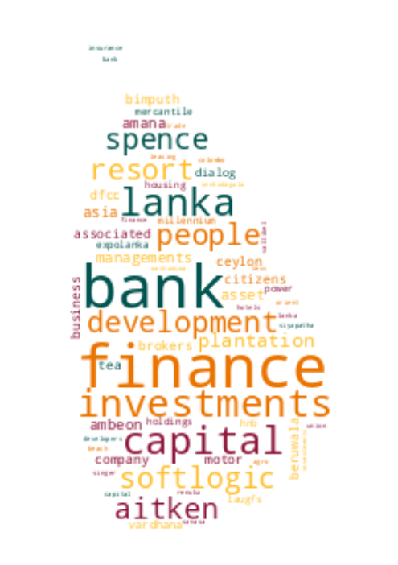

# Registrar of Companies - Sri Lanka

Data Scraped from Registrar of Companies - Sri Lanka (https://eroc.drc.gov.lk)

Scraped **135,170** Companies ([4.18MB](data/companies.tsv)) as of *2025-02-21 10:15:45*.

*Scraping Progress: 52,728/52,728*
✅✅✅✅✅✅✅✅✅✅

## Selection of Companies
*Sample of 10/135170*

* (1) PCC00287821 - **99X TECHNOLOGY AS**
* (15,019) PV00251245 - **BLUEBERRY APPARELS**
* (30,038) PV00251668 - **DILLID CAPITAL HOLDINGS**
* (45,057) PV60475 - **GOVERNORS APPAREL SOURCING**
* (60,076) PV114849 - **KEMINDA TECHNOLOGIES**
* (75,094) PV00266517 - **MOREVER LANKA**
* (90,113) GA2514 - **PROFESSIONAL ASSOCIATION FOR SOCIO ECONOMIC AND ENVIRONMENTAL DEVELOPMENT**
* (105,132) PV00252819 - **SHAAHID TEXTILES**
* (120,151) F250 - **THE PIONERR FIRE & GEN INS CO**
* (135,170) PV118576 - **ZZAPPIT**

## Latest 1,000 Companies
*Sample of 10/1000*

* (1) PV00308321 - **LUXURIOUS LOVE LANKA**
* (112) PV00309363 - **SAMARATHUNGA CONSTRUCTIONS**
* (223) PV00310394 - **VOCAINE**
* (334) PV00311453 - **COOL  PROO**
* (445) PV00312491 - **ELEGANT CAST IRON WORKS**
* (556) PV00313543 - **NJA TRAVELS & TOURS**
* (667) PV00314799 - **BOOK LOVERS**
* (778) PV00316258 - **SSR TECSOLUTIONS**
* (889) PV00318413 - **GROW FUND**
* (1,000) PV00322504 - **PATH TO LEAD CONSULTANCY**

## Selection for Companies by Type

### "PV"
*Sample of 10/123010*

* (1) PV20853 - **A AND A ASSOCIATES**
* (13,668) PV110937 - **BLUE RAY SECURITY**
* (27,336) PV00275921 - **DIGITUS TECHNOLOGY**
* (41,004) PV00266641 - **GOLDEN LIFE AYURVEDIC MEDICINE**
* (54,671) PV00222235 - **KASIWASI**
* (68,339) PV102655 - **MOBILITY SOLUTIONS**
* (82,007) PV00291565 - **PREMIER SAPPHIRES**
* (95,674) PV79536 - **SHAILYA SOLUTIONS**
* (109,342) PV00217357 - **THE SILK BODY**
* (123,010) PV118576 - **ZZAPPIT**

### ""
*Sample of 10/4539*

* (1)  - **A SEVEN CONSTRUCTION & ENGINEERING**
* (505)  - **BIZ FIRST CONSULTANTS**
* (1,009)  - **DEEN FOOD IDIYAPPA GEDARA**
* (1,513)  - **GOBI MOBILE PLAZA**
* (2,017)  - **KAWDANA MEDICALS**
* (2,522)  - **MSME CHAMBER OF SRI LANKA**
* (3,026)  - **QUANTA TECH GLOBAL**
* (3,530)  - **SINDY'S STORE**
* (4,034)  - **THINK UNI**
* (4,539)  - **ZZ PRESTIGE MOTORS**

### "PB"
*Sample of 10/2783*

* (1) PB5111 - **A ONE TOP TRADING**
* (310) PB703 - **CHILAW PLANTATIONS**
* (619) PB5269 - **HORIZON CAMPUS**
* (928) PB814 - **MULTINATIONAL PROPERTY DEVELOPMENTS**
* (1,237) PB747 - **SEEMASAHITHA (JANATHA) AYAGAMA THE JANAPADAYA GAMIDIRIYA SAMAGAMA**
* (1,546) PB1782 - **SEEMASAHITHA (JANATHA) NEGENAHIRU SIYABALAGASWADIYA GAMIDIRIYA SAMAGAMA (NEPV 207)**
* (1,855) PB4480 - **SEEMASAHITHA DERANIYAGALA DAKUNA ARUNALU GAMANEGUAMA JANATHA SAMAGAMA**
* (2,164) PB4547 - **SEEMASAHITHA NEW DUNUKEDENIYA GAMANEGUMA JANATHA SAMAGAMA**
* (2,473) PB404 - **SIEDLES T.V. INDUSTRY**
* (2,783) PB118 - **ZYREX POWER COMPANY**

### "GA"
*Sample of 10/2435*

* (1) GA00321009 - **A HAND OF HOPE**
* (271) GA00224335 - **BODHI CHATHUPARISA TAMBAPANNIDEEPA**
* (541) GA2270 - **DEEPA CENTRE FOR COMMUNITY DEVELOPMENT AND PEACE BUILDING**
* (812) GA3080 - **HARENDRE & UDANI FOUNDATION**
* (1,082) GA238 - **KALUTARA DISTRICT CHAMBER OF COMMERCE , INDUSTRY AND AGRICULTURE**
* (1,353) GA3483 - **MINDFUL LANKA FOUNDATION**
* (1,623) GA00201283 - **PROSPEROUS DEVELOPMENT FOUNDATION**
* (1,894) GA2722 - **SOCIAL WELFARE ECONOMICAL AND ENVIRONMENTAL DEVELOPMENT FOUNDATION**
* (2,164) GA3408 - **THE INSTITUTION OF FIRE ENGINEERS**
* (2,435) GA470 - **ZONTA CLUB II OF COLOMBO**

### "GL"
*Sample of 10/809*

* (1) GL00223389 - **A LITTLE  FOUNDATION**
* (90) GL28 - **BERENDINA DEVELOPMENT SERVICES**
* (180) GL92 - **DIMUTHU FOUNDATION**
* (270) GL56 - **GREEN VISION**
* (360) GL00246742 - **KALYANA S L**
* (449) GL00264423 - **MJF MANAGEMENT TRUST**
* (539) GL2101 - **RECIPE CONSULTING**
* (629) GL00241208 - **SLASSCOM FOUNDATION**
* (719) GL2313 - **TOXIN FREE CROP PRODUCER NETWORK**
* (809) GL2310 - **ZOE LIFE INTERNATIONAL (GURANTEE)**

### "NF"
*Sample of 10/516*

* (1) NF137 - **AB FINLANKA**
* (58) NF218 - **BLOOM & PEAT PRODUCTS**
* (115) NF211 - **ED ZUBLIN AKTIENGESELLSCHAFT**
* (172) NF373 - **HARTSTRINGS NEVIS LLC**
* (229) NF670 - **KOREA ELECTRONIC BANKING TECHNOLOGY CO.**
* (287) NF407 - **MODLEY PHARMACEUTICALS**
* (344) NF158 - **POLSON ENTERPRISES**
* (401) NF118 - **SKD PACIFIC**
* (458) NF80 - **TOMEN HOTLINE (HONG-KONG)**
* (516) NF711 - **ZTE CORPORATION**

### "FC"
*Sample of 10/376*

* (1) FC00251549 - **AA JAPAN (PVT) LTD**
* (42) FC1011 - **BRANDIX INDIA APPAREL CITY PRIVATE**
* (84) FC00277895 - **CUBE CONTENT GOVERNANCE GLOBAL LIMITED**
* (126) FC1191 - **GARAMSPACE COMPANY**
* (167) FC1070 - **IRCON INTERNATIONAL**
* (209) FC1073 - **MARK INFRATRADE**
* (251) FC1134 - **OKRICH GARMANT INTERNATIONAL CO.**
* (292) FC1087 - **SAMSUNG SDS CO.,**
* (334) FC00247635 - **TEXT CO., LTD**
* (376) FC1065 - **ZIBO GUANGZHENG ALKALI ALUMINIUM CHEMICAL INDUSTRY CO.,**

### "F"
*Sample of 10/204*

* (1) F234 - **ALCO INSURANCE COMPANY**
* (23) F132 - **BPTIST MISSIONERY SOCIETY**
* (46) F11 - **EAGLE STAR INSURANCE CO.**
* (68) F91 - **HOME INSURANCE CO.**
* (91) F304 - **MALAYAON AIR WAYS**
* (113) F199 - **NORWICK UNION LIFE ASSURANCE SOCIETY**
* (136) F228 - **SECURITY INSURANCE COMPANY OF NEW HAVEN**
* (158) F239 - **THE ASIA FOUNDATION**
* (181) F250 - **THE PIONERR FIRE & GEN INS CO**
* (204) F6 - **YORKSHIRE INSURANCE CO LTC CEASED 1/11/70**

### "PQ"
*Sample of 10/159*

* (1) PQ188 - **ABANS ELECTRICALS**
* (18) PQ202 - **BROWNS BEACH HOTELS**
* (36) PQ00244471 - **CHRISSWORLD**
* (53) PQ199 - **EDEN HOTEL LANKA**
* (71) PQ178 - **HUEJAY INTERNATIONAL INVESTMENT**
* (88) PQ55 - **LANKA WALLTILES**
* (106) PQ40 - **PEGASUS HOTELS OF CEYLON**
* (123) PQ105 - **SATHOSA MOTORS**
* (141) PQ172 - **THE COLOMBO FORT LAND AND BUILDING**
* (159) PQ181 - **YORK ARCADE HOLDINGS**

### "PBPV"
*Sample of 10/79*

* (1) PB1296PV - **A BAUR AND COMPANY  TRAVEL**
* (9) PB162PV - **ASSETLINE INSURANCE BROKERS**
* (18) PB1567PV - **CYRIL GARDINER**
* (27) PB512PV - **FELTEX**
* (35) PB738PV - **HAYCHEM**
* (44) PB4516PV - **LUMIERE TEXTILES**
* (53) PB382PV - **NATURE HOLDINGS**
* (61) PB23PV - **RENTOKIL INITIAL CEYLON**
* (70) PB3798PV - **TOKYO CEMENT POWER (LANKA)**
* (79) PB144PV - **WORLD SUBSEA SERVICES**

### "PCC"
*Sample of 10/60*

* (1) PCC00287821 - **99X TECHNOLOGY AS**
* (7) PCC00295416 - **BISTEC SOLUTIONS (PVT) LTD.**
* (14) PCC00285477 - **CHINA HARBOUR ENGINEERING COMPANY LIMITED**
* (20) PCC00300198 - **DUDIGITAL GLOBAL (LANKA) (PVT) LTD.**
* (27) PCC00289173 - **HATTON NATIONAL BANK PLC.**
* (33) PCC00290386 - **INVIGORATE CEYLON (PVT) LTD**
* (40) PCC00289410 - **NCINGA PTE LTD**
* (46) PCC00289735 - **PORT CITY BPO (PRIVATE) LIMITED.**
* (53) PCC00271536 - **SCALLOP (PVT) LTD**
* (60) PCC00292982 - **YOULANKA GROUP LIMITED**

### "PVPB"
*Sample of 10/51*

* (1) PV4158PB - **ADAM CARBONS**
* (6) PV75497PB - **CAPITAL TRUST HOLDINGS**
* (12) PV1632PB - **COMINDTAX MANAGEMENT SERVICE**
* (17) PV70722PB - **GALLE FACE PROPERTIES**
* (23) PV7493PB - **LAUGFS ECO SRI**
* (28) PV71746PB - **MUTUAL HOLDINGS**
* (34) PV21775PB - **ORIENT CAPITAL**
* (39) PV121855PB - **SITHUN INVESTMENTS AND PROPERTIES**
* (45) PV62841PB - **SUNDARAM LANKA TYRES**
* (51) PV19546PB - **UNITED HOTELS COMPANY**

### "PBG"
*Sample of 10/46*

* (1) PBG45 - **ACCOUNTANCY ASSOSICATES**
* (6) PBG48 - **BRIGHTSTAR FINANCE**
* (11) PBG37 - **CONSULTANCY AND FINANCE AND DEVELOPMENT**
* (16) PBG22 - **FREE LANKA SPORTSMEN**
* (21) PBG9 - **OVERSEA CHILDRENS SCHOOL LTD ( BY GUARANTEE)**
* (26) PBG35 - **SAMPATH SPORTSMEN**
* (31) PBG17 - **THE BENEFIT PROVIDENT FUND**
* (36) PBG16 - **THE INSURANCE POLICY HOLDERS SERVICES**
* (41) PBG39 - **THEEPAM INSTITUTE**
* (46) PBG14 - **UNITED SPORTSMAN**

### "PBPQ"
*Sample of 10/31*

* (1) PB1196PQ - **AITKEN SPENCE PLANTATION MANAGEMENTS**
* (4) PB139PQ - **ASIA ASSET FINANCE**
* (7) PB1280PQ - **CEYLON TEA BROKERS**
* (11) PB744PQ - **EXPOLANKA HOLDINGS**
* (14) PB1595PQ - **LAUGFS POWER**
* (17) PB1079PQ - **ORIENT FINANCE**
* (21) PB62PQ - **SANASA DEVELOPMENT BANK**
* (24) PB917PQ - **SIYAPATHA FINANCE**
* (27) PB689PQ - **TESS AGRO**
* (31) PB4242PQ - **WASKADUWA BEACH RESORT**

### "NPVS"
*Sample of 10/29*
* (1) NPVS40803 - **ALNA WATER SYSTEMS**
* (4) NPVS22400 - **CEETEE INTERNATIONAL**
* (7) NPVS35441 - **DUMBARA FERTILIZERS**
* (10) NPVS15104 - **FIVE STAR EXPORTS**
* (13) NPVS42442 - **HERITAGE SAPPHIRES**
* (16) NPVS38695 - **MCMILLAN CEYLON MARKETING**
* (19) NPVS9611 - **Q-NET**
* (22) NPVS18562 - **SERENDIB INSURANCE BROKERS**
* (25) NPVS11267 - **SILVER SHRIMPS**
* (29) NPVS16673 - **WESTERN TRADING COMPANY**

### "PVPBPQ"
*Sample of 10/11*
* (1) PV5301PBPQ - **ABANS**
* (2) PV3562PB/PQ - **ASIA SIYAKA COMODITIES**
* (3) PVPB13254PQ - **JETWING SYMPHONY**
* (4) PV8330PBPQ - **LAUGFS GAS**
* (5) PVPB7385PQ - **LOTUS HYDRO POWER**
* (6) PV10922PBPQ - **RAIGAM WAYAMBA SALTERNS**
* (7) PVPB8234PQ - **RAMBODA FALLS**
* (8) PV415PBPQ - **RESUS ENERGY**
* (9) PV70371PB/PQ - **SINGHE HOSPITALS**
* (11) PV7617PBPQ - **TEEJAY LANKA**

### "PQPB"
* (1) PQ96PB - **ASIRI CENTRAL HOSPITALS**
* (2) PQ15PB - **ASSOCIATED ELECTRICAL CORPORATION**
* (3) PQ193PB - **BERUWELA WALK INN**
* (4) PQ99PB - **CEYLON LEATHER PRODUCTS**
* (5) PQ19PB - **EQUITY ONE**
* (6) PQ61PB - **FINLAYS COLOMBO**
* (7) PQ176PB - **KURUWITA TEXTILE MILLS**
* (8) PQ220PB - **METROPOLITAN RESOURCE HOLDINGS**
* (9) PQ77PB - **MORISON**

### "OC"
* (1) OC111 - **ASTER JETFUEL**
* (2) OC108 - **CAMSO TRADING**
* (3) OC109 - **ENERGY COMMERCE B.V.**
* (4) OC104 - **MERCANTILE SEASCAPE SHIPPING COMPANY**
* (5) OC103 - **MERCANTILE SEBORNE SHIPPING**
* (6) OC102 - **POWER HUB INTERNATIONAL SDN PHD**

### "PVS"
* (1) PVS1795 - **CINE-TECH**
* (2) PVS8467 - **LAKMINI ENTERPRISES**
* (3) PVS7888 - **RADIAN PRODUCTS**
* (4) PVS7498 - **WINGS TRAVELS AND TOURS**
* (5) PVS8227 - **WOODLANDS LANKA**

### "PVPQ"
* (1) PV10527PQ - **ADAM CAPITAL**
* (2) PV1618PQ - **AGSTAR**
* (3) PV72355PQ - **ANILANA HOTELS & PROPERTIES**

### "PQPBPV"
* (1) PQ98PBPV - **ACE POWER GENERATION MATARA**
* (2) PQ16PB/PV - **ASSOCIATED MOTORWAYS**

### "PBPVPB"
* (1) PB64PVPB - **GAC SHIPPING**
* (2) PBPVPB138 - **MCLARENS SHIPPING**

### "NFA"
* (1) NF160A - **CO ECHO ENTERPRISES**

### "PVPBPV"
* (1) PV4405PBPV - **DAVE TRACTORS**

### "PBPQPB"
* (1) PB613PQ/PB - **JANASHAKTHI**

### "PBpv"
* (1) PB1236pv - **UNILEAVER CEYLON SERVICES**

### "PQPV"
* (1) PQ231PV - **UNION RESORTS**
