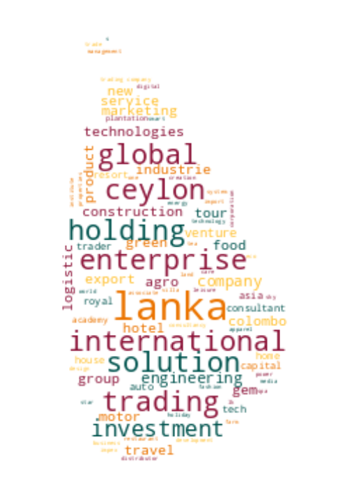

# Registrar of Companies - Sri Lanka

Data Scraped from Registrar of Companies - Sri Lanka (https://eroc.drc.gov.lk)

Scraped **56,781** Companies ([1.74MB](data/companies.tsv)) as of *2023-12-06 19:12:31*.

## Selection of Companies
*Sample of 10/56781*

* (1) PCC00287821 - **99X TECHNOLOGY AS**
* (6,309) PV00251798 - **APK STEEL FABRICATIONS**
* (12,618) PV00249319 - **BHASHA NIPUNATHA SANWARDHANA AYATHANAYA**
* (18,927) PV00258664 - **CEYLON MUD CRAB CO.**
* (25,236) PV00211327 - **DAMITHA GEMS**
* (31,545) PV00274313 - **I AND I IMPEX**
* (37,854) PV126487 - **MEDVITO ECO SOLUTION**
* (44,163) PV119767 - **ROYAL CHOICE FOODS**
* (50,472) PV128142 - **TEQZA INNOVATIONS**
* (56,781) PV118576 - **ZZAPPIT**

## Latest 1,000 Companies
*Sample of 10/1000*

* (1) PV00286491 - **APOLLO CAFE**
* (112) PV00286895 - **ART**
* (223) PV00287249 - **RISPIT**
* (334) PV00287597 - **SYZYGY POWER**
* (445) PV00287956 - **THAI CHARM**
* (556) PV00288276 - **MAATHAJEE LANKA PRODUCTS**
* (667) PV00288625 - **BIKA**
* (778) PV00288980 - **MINSARA DISTRIBUTOR**
* (889) PB00289382 - **THAYAKAM AGRO**
* (1,000) PV00289886 - **TOPONE IMPORT & EXPORTS**

## Selection for Companies by Type

### "PV"
*Sample of 10/52273*

* (1) PV20853 - **A AND A ASSOCIATES**
* (5,809) PV63288 - **APLO VENTURES**
* (11,617) PV98661 - **BEYONDSOFT SOLUTIONS**
* (17,425) PV00279002 - **CEYLON NATURAL RUBBER**
* (23,233) PV114041 - **DANIDU CREDIT**
* (29,041) PV117353 - **IHLA CIVIL CONSTRUCTION**
* (34,849) PV00211137 - **MEMBER'S HOLDINGS**
* (40,657) PV124795 - **ROYAL BUSINESS COLLEGE OF HIGHER EDUCATION**
* (46,465) PV112824 - **TECKWIN CEMENTS**
* (52,273) PV118576 - **ZZAPPIT**

### ""
*Sample of 10/1671*

* (1)  - **A KIRUBAA GROUP OF COMPANIES**
* (186)  - **AQUA ROSA**
* (372)  - **BLACK BEAUTY**
* (557)  - **CEYLON LEGAL AND CORPORATE SERVICES**
* (743)  - **CUSTOMER RELATION MANAGEMENT SERVICES**
* (928)  - **HARVEST CLUB**
* (1,114)  - **MEXEM**
* (1,299)  - **SAARA LANKA HOLDINGS**
* (1,485)  - **THALITHA HERBALS**
* (1,671)  - **ZOVO ENTERPRISES**

### "GA"
*Sample of 10/1093*

* (1) GA00213478 - **A QUINT ONDAATJE FOUNDATION**
* (122) GA00286367 - **APOSTOLIC MEDIA NETWORK**
* (243) GA00269003 - **BEYOND THE DUTCH**
* (365) GA2775 - **CEYLON INCOME TAX PAYERS ASSOCIATION**
* (486) GA3337 - **CORNER''S ASSOCIATION OF SRI LANKA**
* (607) GA2334 - **HIGHER NATIONAL ENGINEERING DIPLOMATS' ASSOCIATION**
* (729) GA00253144 - **MOVE FRONT INSTITUTION**
* (850) GA2687 - **SINSANIYA SEVA**
* (971) GA385 - **THE INSTITURE OF PUBLIC FINANCE AND DEVELOPMENT ACCOUNTANCY**
* (1,093) GA00230951 - **YOHAN PATHIRANA FOUNDATION**

### "PB"
*Sample of 10/685*

* (1) PB5111 - **A ONE TOP TRADING**
* (77) PB5367 - **ARENA BLUE HOTEL AND RESORT**
* (153) PB88 - **BRANDIX LIGHTSEW**
* (229) PB72 - **CEYLINCO INTERNET SERVICES**
* (305) PB772 - **CLARION HOMES INTERNATIONAL**
* (381) PB5168 - **ENTRUST WEALTH MANAGEMENT**
* (457) PB4774 - **KARIWALA LANKA**
* (533) PB1399 - **POWER HOUSE**
* (609) PB203 - **SUNTEL**
* (685) PB4828 - **ZIPP INTERNATIONAL (LANKA)**

### "GL"
*Sample of 10/328*

* (1) GL00223389 - **A LITTLE  FOUNDATION**
* (37) GL00258831 - **ANNOOR ACADEMY**
* (73) GL00260926 - **BEYOND**
* (110) GL2239 - **CHIBBY'S FRIENDS**
* (146) GL2063 - **DHARANI (GURANTEE)**
* (182) GL00246519 - **INSTITUTE OF OCEAN RESOURCES ANALYSIS**
* (219) GL2309 - **NON - PROFIT DEVELOPMENT FACILITY**
* (255) GL00210136 - **SLYCAN TRUST**
* (291) GL2138 - **THE PREMADASA CENTRE**
* (328) GL2140 - **WORLDWIDE NETWORK**

### "NF"
*Sample of 10/231*

* (1) NF137 - **AB FINLANKA**
* (26) NF678 - **AMERICAN POWER CONVERSION (INDIA) PRIVATE**
* (52) NF421 - **BOVIS MCLACHIAN (PRIVAT)**
* (77) NF412 - **CHINA GUANGXI CORPORATION FOR INTERNATIONAL TECHNO ECONOMIC CORPORATION**
* (103) NF293 - **CROSBY SECURITIES**
* (128) NF373 - **HARTSTRINGS NEVIS LLC**
* (154) NF397 - **MACPI S.P.A. PRESSING DIVISION**
* (179) NF247 - **PRAXIS (FAR EAST)**
* (205) NF127 - **THE RESOURCE CLUB**
* (231) NF711 - **ZTE CORPORATION**

### "FC"
*Sample of 10/178*

* (1) FC00251549 - **AA JAPAN (PVT) LTD**
* (20) FC1364 - **ALPHA ATELIER (M) SDN. BHD.**
* (40) FC00242630 - **BEIJING ENTERPRISES WATER GROUP LIMITED**
* (60) FC1151 - **CHINA INTERNATIONAL WATER & ELECTIC CORPORATION**
* (79) FC1253 - **CONTROL PRINT**
* (99) FC1260 - **GE T & D INDIA**
* (119) FC1386 - **KRITA ENGINEERING PRIVATE**
* (138) FC1030 - **NUGA BEST CO.**
* (158) FC00232682 - **SMEC INTERNATIONAL PTY. LIMITED**
* (178) FC1193 - **WORLD PRODUCTION PARTNERS CO.**

### "F"
*Sample of 10/105*

* (1) F234 - **ALCO INSURANCE COMPANY**
* (12) F237 - **ASIATIC GOVT SECURITY LIFE & GEN ASS**
* (24) F41 - **BOMBAY LIFE ASSURANCE CO.**
* (35) F22 - **CENTRAL INSURANCE CO.**
* (47) F301 - **DEEN RAMBLE PVT**
* (58) F177 - **IMPERIAL CHEMICAL INS**
* (70) F317 - **ROYAL NEPAL AIR LINES CORPORATION**
* (81) F197 - **THE BANGALORE PROVIDENT INSURANCE CORPORATION**
* (93) F190 - **THE NONO TYPE CORPORATION**
* (105) F268 - **Y CICHAEL**

### "PQ"
*Sample of 10/82*

* (1) PQ188 - **ABANS ELECTRICALS**
* (10) PQ204 - **ASIRI HOSPITAL HOLDINGS**
* (19) PQ222 - **CARGO BOAT DEVELOPMENT COMPANY**
* (28) PQ113 - **CEYLON HOSPITALS**
* (37) PQ50 - **COLOMBO DOCKYARD**
* (46) PQ224 - **DOLPHIN HOTELS**
* (55) PQ76 - **KELSEY DEVELOPMENTS**
* (64) PQ125 - **ROYAL CERAMICS LANKA**
* (73) PQ84 - **THE AUTODROME**
* (82) PQ00234079 - **WINDFORCE**

### "PBPV"
*Sample of 10/31*

* (1) PB1296PV - **A BAUR AND COMPANY  TRAVEL**
* (4) PB872PV - **ALEXANDRA INDUSTRIES (CEYLON)**
* (7) PB5118PV - **ASIAN CREDIT COMPANY**
* (11) PB1098PV - **COIRTEX**
* (14) PB2PV - **CONTSHIP AGENCIES**
* (17) PB30PV - **DAVID PIERIS AUTOMOBILES**
* (21) PB3539PV - **KELSEY HOMES**
* (24) PB807PV - **PHOENIX VENTURES**
* (27) PB3799PV - **ST ANTHONY'S HYDRO POWER**
* (31) PB458PV - **VENIGROS**

### "PCC"
*Sample of 10/22*
* (1) PCC00287821 - **99X TECHNOLOGY AS**
* (3) PCC00284133 - **ASIRI PORT CITY HOSPITAL (PRIVATE) LIMITED .**
* (5) PCC00272290 - **BITAZZA LANKA (PRIVATE) LIMITED**
* (8) PCC00271314 - **CODEGEN INNOVATIONS (PRIVATE) LIMITED**
* (10) PCC00284521 - **ECHELON TRADE (PVT) LTD.**
* (12) PCC00289173 - **HATTON NATIONAL BANK PLC.**
* (15) PCC00289410 - **NCINGA PTE LTD**
* (17) PCC00278728 - **PATHLY HOLDINGS, INC**
* (19) PCC00276910 - **REMEDIUMONE GLOBAL PRIVATE LIMITED**
* (22) PCC00284609 - **TIQRI SOFTWARE PTE LTD**

### "PVPB"
*Sample of 10/20*
* (1) PV4158PB - **ADAM CARBONS**
* (3) PV60755PB - **ALPHA WEALTH**
* (5) PV11479PB - **CARGILLS CONVENIENT FOODS**
* (7) PV3326PB - **CEYBANK ASSET MANAGEMENT**
* (9) PV440PB - **CITRUS VACATIONS LIMITED**
* (11) PV7155PB - **DYNAWASH**
* (13) PV7493PB - **LAUGFS ECO SRI**
* (15) PV6401PB - **MAG INDUSTRIES**
* (17) PV21775PB - **ORIENT CAPITAL**
* (20) PV62911PB - **TRICO LOGISTICS**

### "PBG"
*Sample of 10/18*
* (1) PBG32 - **BASIL SPORTSMEN**
* (2) PBG28 - **BLUE DIAMOND SPORTSMEN**
* (4) PBG3 - **CEYLON MUTUAL INSURANCE CO**
* (6) PBG37 - **CONSULTANCY AND FINANCE AND DEVELOPMENT**
* (8) PBG27 - **PAMANKADE SPORTSMEN**
* (10) PBG17 - **THE BENEFIT PROVIDENT FUND**
* (12) PBG10 - **THE EASTERN MUTUAL GENERAL ASSURANCE**
* (14) PBG23 - **THE STAR BENEFIT CO**
* (16) PBG21 - **THE WORKERS BENEFIT (LUNUGALA)**
* (18) PBG49 - **TRRO**

### "PBPQ"
*Sample of 10/14*
* (1) PB1015PQ - **ABANS FINANCE**
* (2) PB1196PQ - **AITKEN SPENCE PLANTATION MANAGEMENTS**
* (3) PB4739PQ - **ARPICO INSURANCE**
* (5) PB733PQ - **ASSOCIATED MOTOR FINANCE COMPANY**
* (6) PB3259PQ - **BIMPUTH FINANCE**
* (8) PB232PQ - **CITIZENS DEVELOPMENT BUSINESS FINANCE**
* (9) PB127PQ - **FIRST CAPITAL TREASURIES**
* (11) PB647PQ - **PEOPLE'S LEASING & FINANCE**
* (12) PB813PQ - **SINGER FINANCE (LANKA)**
* (14) PB641PQ - **SOFTLOGIC FINANCE**

### "PVPBPQ"
* (1) PV66136PBPQ - **BROWNS INVESTMENTS**
* (2) PVPB13254PQ - **JETWING SYMPHONY**
* (3) PV8330PBPQ - **LAUGFS GAS**
* (4) PVPB7385PQ - **LOTUS HYDRO POWER**
* (5) PV17807PB/PQ - **MACKWOODS ENERGY**
* (6) PVPB8234PQ - **RAMBODA FALLS**
* (7) PV70371PB/PQ - **SINGHE HOSPITALS**
* (8) PV1536PBPQ - **SOFTLOGIC HOLDINGS**

### "PQPB"
* (1) PQ96PB - **ASIRI CENTRAL HOSPITALS**
* (2) PQ15PB - **ASSOCIATED ELECTRICAL CORPORATION**
* (3) PQ17PB - **ASSOCIATED PROPERTY DEVELOPMENT**
* (4) PQ193PB - **BERUWELA WALK INN**
* (5) PQ99PB - **CEYLON LEATHER PRODUCTS**
* (6) PQ176PB - **KURUWITA TEXTILE MILLS**
* (7) PQ220PB - **METROPOLITAN RESOURCE HOLDINGS**

### "PVPQ"
* (1) PV10527PQ - **ADAM CAPITAL**
* (2) PV78150PQ - **ADAM INVESTMENTS**
* (3) PV1618PQ - **AGSTAR**
* (4) PV72355PQ - **ANILANA HOTELS & PROPERTIES**
* (5) PV7206PQ - **ODEL**
* (6) PV1536PQ - **SOFT LOGIC HOLDINGS**

### "PVS"
* (1) PVS1795 - **CINE-TECH**
* (2) PVS8467 - **LAKMINI ENTERPRISES**
* (3) PVS7888 - **RADIAN PRODUCTS**
* (4) PVS7498 - **WINGS TRAVELS AND TOURS**
* (5) PVS8227 - **WOODLANDS LANKA**

### "PQPBPV"
* (1) PQ98PBPV - **ACE POWER GENERATION MATARA**
* (2) PQ16PB/PV - **ASSOCIATED MOTORWAYS**

### "OC"
* (1) OC108 - **CAMSO TRADING**
* (2) OC102 - **POWER HUB INTERNATIONAL SDN PHD**
