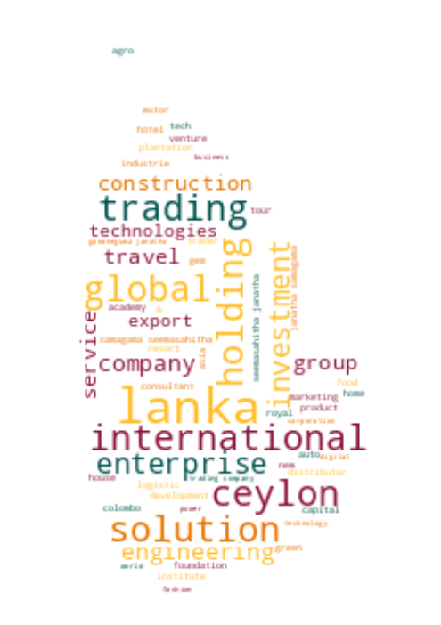

# Registrar of Companies - Sri Lanka

Data Scraped from Registrar of Companies - Sri Lanka (https://eroc.drc.gov.lk)

Scraped **130,049** Companies ([4.02MB](data/companies.tsv)) as of *2024-03-04 22:16:15*.

*Scraping Progress: 52,728/52,728*
✅✅✅✅✅✅✅✅✅✅

## Selection of Companies
*Sample of 10/130049*

* (1) PCC00287821 - **99X TECHNOLOGY AS**
* (14,450) PV00281290 - **BLUEPEAK SOLUTIONS**
* (28,900) PV122848 - **DILYA PRODUCTS**
* (43,350) PV00239941 - **GOODWILL TRADE MART**
* (57,800) PV00241360 - **KEENPICK ENERGY VENTURES**
* (72,249) PV101028 - **MONTE ZITA RESTAURANTS**
* (86,699) PV67660 - **PRINTSOLUTIONS INTERNATIONAL**
* (101,149) PV90655 - **SEVER**
* (115,599) PV00279234 - **THE NYELANT CONSTRUCTION COMPANY**
* (130,049) PV118576 - **ZZAPPIT**

## Latest 1,000 Companies
*Sample of 10/1000*

* (1) PV00291813 - **OSHMIRA SOLUTIONS**
* (112) PV00292114 - **SATEHA**
* (223) PV00292423 - **INTERNATIONAL EDUCATION COUNCIL**
* (334) PV00292712 - **CGRL LANKA**
* (445) PV00292997 - **LEISURE SPORTS & WELLNESS**
* (556) PV00293340 - **SHINE WAVE SOLUTIONS**
* (667) PV00293652 - **NETH RU**
* (778) PV00294052 - **PETWAY TRAVELS**
* (889) PV00294594 - **JK CREATIONS**
* (1,000) PV00295671 - **PLUSHIES AND FLUFFIES**

## Selection for Companies by Type

### "PV"
*Sample of 10/118212*

* (1) PV20853 - **A AND A ASSOCIATES**
* (13,135) PV80236 - **BLUE OCEAN RESIDENCIES**
* (26,270) PV00241213 - **DILAN FARM ORGANIC PRODUCE**
* (39,404) PV00258251 - **GOLDEN CONSTRUCTION & TRADINGS**
* (52,539) PV92777 - **KAPPALADY KITEGARDEN**
* (65,673) PV00248782 - **MIXICO**
* (78,808) PV61507 - **PREMA METAL CRUSHERS**
* (91,942) PV00289036 - **SHA EVENTS**
* (105,077) PV16369 - **THE REEF BEACH HOTEL**
* (118,212) PV118576 - **ZZAPPIT**

### ""
*Sample of 10/4424*

* (1)  - **A AND Y COMMODITIES**
* (492)  - **BONDSCREEN**
* (983)  - **DINEHUTZ**
* (1,475)  - **GOBIAN GEMS AND JEWELLERY INTERNATIONAL**
* (1,966)  - **KASHMEER FOOD CITY**
* (2,458)  - **MORINGA HOTELS**
* (2,949)  - **PREMIER BUILDERS**
* (3,441)  - **SHINE LA HOLDINGS**
* (3,932)  - **THEEPAM TRADERS**
* (4,424)  - **ZULACART**

### "PB"
*Sample of 10/2758*

* (1) PB5111 - **A ONE TOP TRADING**
* (307) PB4729 - **CITRUS AQUA**
* (613) PB1301 - **INFORMATICS HOSPITALITY SYSTEMS**
* (920) PB00225691 - **NEL EXCESS SEVEN**
* (1,226) PB1791 - **SEEMASAHITHA (JANATHA) BORALUHENA GAMIDIRIYA SAMAGAMA (NEPV 284)**
* (1,532) PB1131 - **SEEMASAHITHA (JANATHA) PAHALA HAKAMUWA GAMIDIRIYA SAMAGAMA**
* (1,839) PB4238 - **SEEMASAHITHA DIYAPOTA GAMANEGUMA JANATHA SAMAGAMA**
* (2,145) PB4215 - **SEEMASAHITHA NIYADELLA RANIWEWA GAMANEGUMA JANATHA SAMAGAMA**
* (2,451) PB00278378 - **SEYLAMA HOLDINGS**
* (2,758) PB118 - **ZYREX POWER COMPANY**

### "GA"
*Sample of 10/2339*

* (1) GA00213478 - **A QUINT ONDAATJE FOUNDATION**
* (260) GA00224335 - **BODHI CHATHUPARISA TAMBAPANNIDEEPA**
* (520) GA00257667 - **DADDY FOUNDATION**
* (780) GA565 - **GURUGODELLA JANATHA SANGAMAYA**
* (1,040) GA00218442 - **JILIN CHAMBER OF COMMERCE**
* (1,299) GA2031 - **MENHANDY**
* (1,559) GA2588 - **POSITIVE WOMEN`S NETWORK**
* (1,819) GA2018 - **SMALL HYDRO POWER DEVELOPERS ASSOCIATION**
* (2,079) GA88 - **THE INSTITUTE OF REAL ESTATE AND VALUATION**
* (2,339) GA470 - **ZONTA CLUB II OF COLOMBO**

### "GL"
*Sample of 10/766*

* (1) GL00223389 - **A LITTLE  FOUNDATION**
* (86) GL00236287 - **BRIDGE OF HOPE LANKA**
* (171) GL00257726 - **DR SITHIRAVELU SARAVANAPAVAN FOUNDATION**
* (256) GL00224776 - **GROW A LIFE**
* (341) GL42 - **JEHOVAH SHALOM MINISTRIES**
* (426) GL2244 - **METROPOLITAN CAMPUS**
* (511) GL2215 - **PREVENTION AND ELIMINATION OF DENGUE FOUNDATION**
* (596) GL18 - **SIRI PRABODHA**
* (681) GL00214151 - **TITANS UNITED**
* (766) GL2310 - **ZOE LIFE INTERNATIONAL (GURANTEE)**

### "NF"
*Sample of 10/506*

* (1) NF137 - **AB FINLANKA**
* (57) NF155 - **BROWN AND ROOT INTERNATIONAL INC**
* (113) NF182 - **EDEN TOYS INC.**
* (169) NF67 - **HAWKER SIDDELEY POWER ENGINEERING**
* (225) NF214 - **KINSHO MATAIEHI CORPORATION**
* (281) NF142 - **MITSUI & CO.**
* (337) NF64 - **PATRILACK FUNDS**
* (393) NF599 - **SHIMIZU CORPORATION**
* (449) NF7 - **THE R.C.P.**
* (506) NF711 - **ZTE CORPORATION**

### "FC"
*Sample of 10/372*

* (1) FC00251549 - **AA JAPAN (PVT) LTD**
* (42) FC1363 - **BEYOND HOSPITALITY PVT**
* (83) FC1127 - **DAIHO CORPORATION**
* (124) FC1306 - **GBX TRADING FZE**
* (165) FC1274 - **JANSON BRIDGING INTERNATIONAL B.V.**
* (207) FC1231 - **MAYBRAY DIGITAL PTY**
* (248) FC1048 - **OPTIMA ENERGY SA**
* (289) FC00211497 - **SBT CO., LTD.**
* (330) FC00247635 - **TEXT CO., LTD**
* (372) FC1065 - **ZIBO GUANGZHENG ALKALI ALUMINIUM CHEMICAL INDUSTRY CO.,**

### "F"
*Sample of 10/204*

* (1) F234 - **ALCO INSURANCE COMPANY**
* (23) F327 - **BANQUE DE L'INDOCHINE ET DE SUEZ (FRANCE)**
* (46) F301 - **DEEN RAMBLE PVT**
* (68) F91 - **HOME INSURANCE CO.**
* (91) F77 - **LONDON ASSURANCE**
* (113) F376 - **ORIENTA CONSULTANT INVESTMENTS CO**
* (136) F49 - **SCOTTISH UNION NATIONAL INSURANCE CO.**
* (158) F325 - **STYLE DESIGN AND TECHNICAL CONSULTANTS**
* (181) F131 - **THE PRUDENTIAL ASSURANCE CO.**
* (204) F268 - **Y CICHAEL**

### "PQ"
*Sample of 10/152*

* (1) PQ188 - **ABANS ELECTRICALS**
* (17) PQ202 - **BROWNS BEACH HOTELS**
* (34) PQ100 - **COLOMBO FORT INVESTMENTS**
* (51) PQ171 - **ELPITIYA PLANTATIONS**
* (68) PQ00245385 - **HSENID BUSINESS SOLUTIONS**
* (84) PQ187 - **LANKA ALUMINIUM INDUSTRIES**
* (101) PQ00239455 - **MYLAND DEVELOPMENTS**
* (118) PQ167 - **ROYAL PALMS BEACH HOTELS**
* (135) PQ162 - **TANGERINE BEACH HOTELS**
* (152) PQ00234079 - **WINDFORCE**

### "PBPV"
*Sample of 10/78*

* (1) PB1296PV - **A BAUR AND COMPANY  TRAVEL**
* (9) PB162PV - **ASSETLINE INSURANCE BROKERS**
* (18) PB419PV - **DAMBAKANDA ESTATES COMPANY**
* (26) PB303PV - **GEORGE STEUART HEALTH**
* (35) PB1637PV - **HOTEL INTERNATIONAL**
* (43) PB132PV - **MAC GROUP INTERNATIONAL**
* (52) PB807PV - **PHOENIX VENTURES**
* (60) PB752PV - **RILEYS**
* (69) PB5256PV - **TOKYO SUPER AGGREGATE**
* (78) PB144PV - **WORLD SUBSEA SERVICES**

### "PBG"
*Sample of 10/46*

* (1) PBG45 - **ACCOUNTANCY ASSOSICATES**
* (6) PBG48 - **BRIGHTSTAR FINANCE**
* (11) PBG37 - **CONSULTANCY AND FINANCE AND DEVELOPMENT**
* (16) PBG22 - **FREE LANKA SPORTSMEN**
* (21) PBG9 - **OVERSEA CHILDRENS SCHOOL LTD ( BY GUARANTEE)**
* (26) PBG35 - **SAMPATH SPORTSMEN**
* (31) PBG17 - **THE BENEFIT PROVIDENT FUND**
* (36) PBG16 - **THE INSURANCE POLICY HOLDERS SERVICES**
* (41) PBG39 - **THEEPAM INSTITUTE**
* (46) PBG14 - **UNITED SPORTSMAN**

### "PVPB"
*Sample of 10/44*

* (1) PV4158PB - **ADAM CARBONS**
* (5) PV7329PB - **BUSINESS MANAGEMENT SERVICES**
* (10) PV6857PB - **CEYLON LEATHER PRODUCTS MANUFACTURERS**
* (15) PV5736PB - **ELGI RUBBER COMPANY**
* (20) PV102488PB - **GRAINS 'N' GREEN**
* (24) PV75597PB - **LAUGFS SOLUTIONS**
* (29) PV114960PB - **NOORANI RENEWABLE ENERGY**
* (34) PV12813PB - **SIERRA CONSTRUCTION**
* (39) PV12903PB - **SUN TAN BEACH RESORTS**
* (44) PV127512PB - **UNITED CAPITAL HOLDINGS**

### "PCC"
*Sample of 10/37*

* (1) PCC00287821 - **99X TECHNOLOGY AS**
* (5) PCC00278331 - **BITAZZA INTERNATIONAL LIMITED**
* (9) PCC00290488 - **CHINA HARBOUR ENGINEERING COMPANY (LANKA) LIMITED.**
* (13) PCC00289048 - **COMMERCIAL BANK OF CEYLON PLC.**
* (17) PCC00275578 - **GREENSTAT HYDROGEN (PVT) LTD.**
* (21) PCC00290386 - **INVIGORATE CEYLON (PVT) LTD**
* (25) PCC00290514 - **LAK ARCADE (PVT) LTD.**
* (29) PCC00289735 - **PORT CITY BPO (PRIVATE) LIMITED.**
* (33) PCC00284610 - **SATGURU TRAVEL AND TOURISM LLC**
* (37) PCC00292982 - **YOULANKA GROUP LIMITED**

### "PBPQ"
*Sample of 10/37*

* (1) PB200PQ - **ACCESS ENGINEERING**
* (5) PB733PQ - **ASSOCIATED MOTOR FINANCE COMPANY**
* (9) PB232PQ - **CITIZENS DEVELOPMENT BUSINESS FINANCE**
* (13) PB127PQ - **FIRST CAPITAL TREASURIES**
* (17) PB3006PQ - **LUCKY LANKA MILK PROCESSING COMPANY**
* (21) PB891PQ - **MULTI FINANCE**
* (25) PB1108PQ - **RENUKA AGRI FOODS**
* (29) PB813PQ - **SINGER FINANCE (LANKA)**
* (33) PB689PQ - **TESS AGRO**
* (37) PB4242PQ - **WASKADUWA BEACH RESORT**

### "NPVS"
*Sample of 10/29*
* (1) NPVS40803 - **ALNA WATER SYSTEMS**
* (4) NPVS22400 - **CEETEE INTERNATIONAL**
* (7) NPVS35441 - **DUMBARA FERTILIZERS**
* (10) NPVS15104 - **FIVE STAR EXPORTS**
* (13) NPVS42442 - **HERITAGE SAPPHIRES**
* (16) NPVS38695 - **MCMILLAN CEYLON MARKETING**
* (19) NPVS9611 - **Q-NET**
* (22) NPVS18562 - **SERENDIB INSURANCE BROKERS**
* (25) NPVS11267 - **SILVER SHRIMPS**
* (29) NPVS16673 - **WESTERN TRADING COMPANY**

### "PVPBPQ"
* (1) PV5301PBPQ - **ABANS**
* (2) PVPB13254PQ - **JETWING SYMPHONY**
* (3) PV8330PBPQ - **LAUGFS GAS**
* (4) PVPB7385PQ - **LOTUS HYDRO POWER**
* (5) PVPB8234PQ - **RAMBODA FALLS**
* (6) PV415PBPQ - **RESUS ENERGY**
* (7) PV70371PB/PQ - **SINGHE HOSPITALS**
* (8) PV1536PBPQ - **SOFTLOGIC HOLDINGS**
* (9) PV7617PBPQ - **TEEJAY LANKA**

### "PQPB"
* (1) PQ96PB - **ASIRI CENTRAL HOSPITALS**
* (2) PQ15PB - **ASSOCIATED ELECTRICAL CORPORATION**
* (3) PQ17PB - **ASSOCIATED PROPERTY DEVELOPMENT**
* (4) PQ193PB - **BERUWELA WALK INN**
* (5) PQ99PB - **CEYLON LEATHER PRODUCTS**
* (6) PQ61PB - **FINLAYS COLOMBO**
* (7) PQ143PB - **HOTEL DEVELOPERS (LANKA) LIMITED**
* (8) PQ176PB - **KURUWITA TEXTILE MILLS**
* (9) PQ220PB - **METROPOLITAN RESOURCE HOLDINGS**

### "OC"
* (1) OC111 - **ASTER JETFUEL**
* (2) OC108 - **CAMSO TRADING**
* (3) OC109 - **ENERGY COMMERCE B.V.**
* (4) OC101 - **ISLANDERS MALDIVES PTE**
* (5) OC104 - **MERCANTILE SEASCAPE SHIPPING COMPANY**
* (6) OC103 - **MERCANTILE SEBORNE SHIPPING**
* (7) OC102 - **POWER HUB INTERNATIONAL SDN PHD**

### "PVPQ"
* (1) PV10527PQ - **ADAM CAPITAL**
* (2) PV1618PQ - **AGSTAR**
* (3) PV72355PQ - **ANILANA HOTELS & PROPERTIES**
* (4) PV415PQ - **HEMAS POWER**
* (5) PV7206PQ - **ODEL**
* (6) PV1536PQ - **SOFT LOGIC HOLDINGS**

### "PVS"
* (1) PVS1795 - **CINE-TECH**
* (2) PVS8467 - **LAKMINI ENTERPRISES**
* (3) PVS7888 - **RADIAN PRODUCTS**
* (4) PVS7498 - **WINGS TRAVELS AND TOURS**
* (5) PVS8227 - **WOODLANDS LANKA**

### "PQPBPV"
* (1) PQ98PBPV - **ACE POWER GENERATION MATARA**
* (2) PQ16PB/PV - **ASSOCIATED MOTORWAYS**

### "PBPVPB"
* (1) PB64PVPB - **GAC SHIPPING**
* (2) PBPVPB138 - **MCLARENS SHIPPING**

### "NFA"
* (1) NF160A - **CO ECHO ENTERPRISES**

### "PVPBPV"
* (1) PV4405PBPV - **DAVE TRACTORS**

### "UC"
* (1) UC1 - **JACEY AND COMPANY**

### "GAGL"
* (1) GA683GL - **LANKA PRISON FELLOWSHIP**

### "PQPV"
* (1) PQ231PV - **UNION RESORTS**
