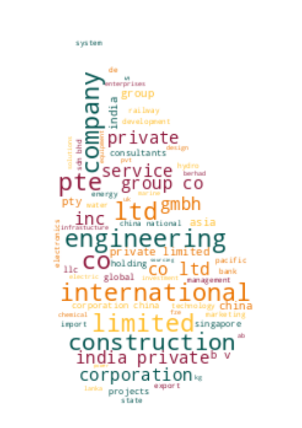

# Registrar of Companies - Sri Lanka

Data Scraped from Registrar of Companies - Sri Lanka (https://eroc.drc.gov.lk)

Scraped **142,746** Companies ([4.41MB](data/companies.tsv)) as of *2025-11-13 10:13:00*.

*Scraping Progress: 52,728/52,728*
✅✅✅✅✅✅✅✅✅✅

## Selection of Companies
*Sample of 10/142746*

* (1) PCC00287821 - **99X TECHNOLOGY AS**
* (15,861) PV00221634 - **BON APPAREL**
* (31,722) PV00245965 - **DISSANAYAKA HOLDINGS INTERNATIONAL**
* (47,582) PV00201937 - **GREAT HOMES**
* (63,443) PV14642 - **KEYZER EXCHANGE**
* (79,303) PV00212319 - **MULLAI EXPORTS**
* (95,164) PV00230994 - **PURE EARTH CEYLON**
* (111,024) PV00216221 - **SHAN CEYLON INTERNATIONAL**
* (126,885) F171 - **THE WESTERN ELECTIC CO OF INDIA**
* (142,746) PV118576 - **ZZAPPIT**

## Latest 1,000 Companies
*Sample of 10/1000*

* (1) PV00328129 - **GLORIOUS ENTERPRISES & ECLECTIC EMPORIUM**
* (112) PV00329110 - **MJ AUTOMOBILE SERVICE & PARTS**
* (223) PV00330038 - **REALITY HOMES**
* (334) PV00330994 - **AGROFLORA BIOTECHNOLOGY**
* (445) PV00332337 - **GOOD NIGHT PILLOW INDUSTRIES**
* (556) PV00334003 - **SKYLINE ACCESS SOLUTIONS**
* (667) PV00335820 - **MOKSHA WELLNESS**
* (778) PV00337406 - **KIND SEVEN**
* (889) PV00339496 - **GOOD MINUTE INTERNATIONAL**
* (1,000) PV00345803 - **ANTON STATUE PALACE & STATIONERY**

## Selection for Companies by Type

### "PV"
*Sample of 10/129839*

* (1) PV20853 - **A AND A ASSOCIATES**
* (14,427) PV87831 - **BOBOLO**
* (28,853) PV131196 - **DIRECCION PLUS**
* (43,280) PV98235 - **GOYUMMETH**
* (57,706) PV8727 - **KELANI PAPER CONVERTERS**
* (72,133) PV00235162 - **MORE CARD**
* (86,559) PV106883 - **PRINT CITY LANKA**
* (100,986) PV00241175 - **SHANLO HOLDINGS**
* (115,412) PV00262392 - **THIEEPA OLIY**
* (129,839) PV118576 - **ZZAPPIT**

### ""
*Sample of 10/5116*

* (1)  - **A BRAND HOLDINGS**
* (569)  - **BODY WEAR**
* (1,137)  - **DIGITAL WIZARD AGENCY**
* (1,706)  - **GOOD BITES GLOBAL**
* (2,274)  - **KATEE ROTEE**
* (2,842)  - **MULTI LANKA ENTERPRISES**
* (3,411)  - **QUALITY FOOD CARE**
* (3,979)  - **SINDY'S STORE**
* (4,547)  - **TIANJ**
* (5,116)  - **ZZ PRESTIGE MOTORS**

### "PB"
*Sample of 10/2800*

* (1) PB5111 - **A ONE TOP TRADING**
* (312) PB4798 - **CITRUS VILLAS KALPITIYA**
* (623) PB370 - **HOKKE LANKA HOTELS**
* (934) PB3379 - **MYWON COLLEGE OF I T AND TECHNOLOGIES**
* (1,245) PB1282 - **SEEMASAHITHA (JANATHA) BADULUWELA GAMIDIRIYA SAMAGAMA**
* (1,556) PB1529 - **SEEMASAHITHA (JANATHA) NIHILUWA NEGENAHIRA GAMIDIRIYA SAMGAMA (NEPV719)**
* (1,867) PB4743 - **SEEMASAHITHA DIGGALPURA YAYA HAYA GAMANEGUMA JANATHA SAMAGAMA**
* (2,178) PB4416 - **SEEMASAHITHA NUGAWELA GAMANEGUMA JANATHA SAMAGAMA**
* (2,489) PB00214009 - **SINGHE CAPITAL INVESTMENT**
* (2,800) PB118 - **ZYREX POWER COMPANY**

### "GA"
*Sample of 10/2523*

* (1) GA00321009 - **A HAND OF HOPE**
* (281) GA543 - **BIO ENERGY ASSOCIATION OF SRI LANKA**
* (561) GA2270 - **DEEPA CENTRE FOR COMMUNITY DEVELOPMENT AND PEACE BUILDING**
* (841) GA00239490 - **GUARDIANS LANKA FOUNDATION**
* (1,121) GA00211470 - **JERUSHIYA  FOUNDATION**
* (1,402) GA2181 - **MICRO IRRIGATION ASSOCIATION OF LANKA**
* (1,682) GA2188 - **PROFESSIONAL HAIR DRESSERS & BEAUTICIANS ASSOCIATION OF LANKA**
* (1,962) GA2792 - **SMYL''S RURAL DEVELOPMENT**
* (2,242) GA2652 - **THE INSTITUTE OF FOOD SCIENCE AND TECHNOLOGY SRI LANKA**
* (2,523) GA470 - **ZONTA CLUB II OF COLOMBO**

### "GL"
*Sample of 10/822*

* (1) GL00223389 - **A LITTLE  FOUNDATION**
* (92) GL00266643 - **BLUE GREEN FOUNDATION**
* (183) GL00216223 - **DON BOSCO SERVICES OF EMPOWERMENT**
* (274) GL2222 - **GREEN VOLUNTEERS FOR GREEN FUTURE**
* (365) GL91 - **JETWING RELIEF FUND**
* (457) GL00255293 - **MIRELLY OUTREACH FUND FOR CHILDREN**
* (548) GL00257402 - **REAL GRACE CHILDREN FOUNDATION**
* (639) GL2124 - **SMALL WORLD**
* (730) GL2245 - **TRINCOMALEE DISTRICT CONFEDERATION OF SUSTAINABLE AGRICULTURE RESORCES CENTERS'**
* (822) GL2310 - **ZOE LIFE INTERNATIONAL (GURANTEE)**

### "NF"
*Sample of 10/525*

* (1) NF137 - **AB FINLANKA**
* (59) NF174 - **BODUM AUSSENHANDELS GMBH**
* (117) NF182 - **EDEN TOYS INC.**
* (175) NF309 - **HELLY HANSEN (FAR EAST)**
* (233) NF317 - **KOREA HEAVY INDUSTRIES AND CONSTRUCTION CO.**
* (292) NF33 - **MULPHA MARKETING (S) PRIVATE**
* (350) NF597 - **PRACTICAL ACTION**
* (408) NF96 - **SMITHKLINE BEECHAM MARKETING AND TECHNICAL SERVICES**
* (466) NF403 - **TOPWARD**
* (525) NF711 - **ZTE CORPORATION**

### "FC"
*Sample of 10/381*

* (1) FC00251549 - **AA JAPAN (PVT) LTD**
* (43) FC1011 - **BRANDIX INDIA APPAREL CITY PRIVATE**
* (85) FC00277895 - **CUBE CONTENT GOVERNANCE GLOBAL LIMITED**
* (127) FC00214044 - **GEMCO INTERNATIONAL B.V.**
* (169) FC1274 - **JANSON BRIDGING INTERNATIONAL B.V.**
* (212) FC00222714 - **MAST INDUSTRIES (FAR EAST) LIMITED**
* (254) FC1060 - **ONMOBILE GLOBAL LIMITED**
* (296) FC1087 - **SAMSUNG SDS CO.,**
* (338) FC00313093 - **TEX INTERNATIONAL LTD**
* (381) FC1065 - **ZIBO GUANGZHENG ALKALI ALUMINIUM CHEMICAL INDUSTRY CO.,**

### "F"
*Sample of 10/209*

* (1) F234 - **ALCO INSURANCE COMPANY**
* (24) F56 - **BRITISH INDIAN GENERAL INSURANCE CO.**
* (47) F318 - **ENGINEERING CONSTRUCTION CORPORATION**
* (70) F375 - **HARRIS CORPORATION (BERMUDA)**
* (93) F304 - **MALAYAON AIR WAYS**
* (116) F84 - **ORIENTAL BANK OF MALAYA**
* (139) F379 - **SIMPLEX CONCRETE PILES (INDIA) PRIVATE**
* (162) F191 - **THE BHARATAMATA PR. ASS. CO.**
* (185) F126 - **THE UNITED INDIA PROM. ASSON**
* (209) F6 - **YORKSHIRE INSURANCE CO LTC CEASED 1/11/70**

### "PQ"
*Sample of 10/163*

* (1) PQ188 - **ABANS ELECTRICALS**
* (19) PQ56 - **BUKIT DARAH**
* (37) PQ71 - **COLOMBO CITY HOLDINGS**
* (55) PQ53 - **EQUITY SEVEN**
* (73) PQ11 - **JOHN KEELLS**
* (91) PQ86 - **LANKEM DEVELOPMENTS**
* (109) PQ40 - **PEGASUS HOTELS OF CEYLON**
* (127) PQ105 - **SATHOSA MOTORS**
* (145) PQ1 - **THE FINANCE COMPANY**
* (163) PQ181 - **YORK ARCADE HOLDINGS**

### "PBPV"
*Sample of 10/87*

* (1) PB1296PV - **A BAUR AND COMPANY  TRAVEL**
* (10) PB540PV - **BALTIC CONTROL SERVICES**
* (20) PB419PV - **DAMBAKANDA ESTATES COMPANY**
* (29) PB98PV - **FINLAY AIRLINE AGENCIES**
* (39) PB753PV - **HAYLEYS AVENTURA**
* (48) PB1738PV - **LANKA CANNERIES**
* (58) PB5365PV - **NIMBUS CLOUD LANKA**
* (67) PB5065PV - **RIHAN AYAMPERUMA DESIGN ASSOCIATES**
* (77) PB1236PV - **UNILEVER CEYLON SERVICES**
* (87) PB144PV - **WORLD SUBSEA SERVICES**

### "PCC"
*Sample of 10/77*

* (1) PCC00287821 - **99X TECHNOLOGY AS**
* (9) PCC00320558 - **ASCENT GLOBAL SOLUTIONS LIMITED**
* (17) PCC00289505 - **CHINA DUTY FREE (LANKA) (PVT) LTD.**
* (26) PCC00284521 - **ECHELON TRADE (PVT) LTD.**
* (34) PCC00289173 - **HATTON NATIONAL BANK PLC.**
* (43) PCC00332665 - **INTERVEST ADVANCED TECHNOLOGIES (PRIVATE) LIMITED.**
* (51) PCC00325152 - **MANANTIAL SOLUTIONS (PRIVATE) LIMITED.**
* (60) PCC00278728 - **PATHLY HOLDINGS, INC**
* (68) PCC00284610 - **SATGURU TRAVEL AND TOURISM LLC**
* (77) PCC00292982 - **YOULANKA GROUP LIMITED**

### "PVPB"
*Sample of 10/53*

* (1) PV4158PB - **ADAM CARBONS**
* (6) PV77699PB - **BUTANI CAPITAL**
* (12) PV1632PB - **COMINDTAX MANAGEMENT SERVICE**
* (18) PV70722PB - **GALLE FACE PROPERTIES**
* (24) PV7493PB - **LAUGFS ECO SRI**
* (29) PV71746PB - **MUTUAL HOLDINGS**
* (35) PV64694PB - **PADIYAPELELLA HYDROPOWER**
* (41) PV3574PB - **SOUTH ASIA TEXTILES**
* (47) PV3822PB - **SWARNAMAHAL JEWELLERS**
* (53) PV19546PB - **UNITED HOTELS COMPANY**

### "PBG"
*Sample of 10/46*

* (1) PBG45 - **ACCOUNTANCY ASSOSICATES**
* (6) PBG48 - **BRIGHTSTAR FINANCE**
* (11) PBG37 - **CONSULTANCY AND FINANCE AND DEVELOPMENT**
* (16) PBG22 - **FREE LANKA SPORTSMEN**
* (21) PBG9 - **OVERSEA CHILDRENS SCHOOL LTD ( BY GUARANTEE)**
* (26) PBG35 - **SAMPATH SPORTSMEN**
* (31) PBG17 - **THE BENEFIT PROVIDENT FUND**
* (36) PBG16 - **THE INSURANCE POLICY HOLDERS SERVICES**
* (41) PBG39 - **THEEPAM INSTITUTE**
* (46) PBG14 - **UNITED SPORTSMAN**

### "PBPQ"
*Sample of 10/30*
* (1) PB1196PQ - **AITKEN SPENCE PLANTATION MANAGEMENTS**
* (4) PB139PQ - **ASIA ASSET FINANCE**
* (7) PB3259PQ - **BIMPUTH LANKA INVESTMENTS**
* (10) PB633PQ - **DFCC VARDHANA BANK**
* (13) PB965PQ - **HNB FINANCE**
* (17) PB3754PQ - **PEOPLE'S  INSURANCE**
* (20) PB62PQ - **SANASA DEVELOPMENT BANK**
* (23) PB917PQ - **SIYAPATHA FINANCE**
* (26) PB689PQ - **TESS AGRO**
* (30) PB4242PQ - **WASKADUWA BEACH RESORT**

### "NPVS"
*Sample of 10/29*
* (1) NPVS40803 - **ALNA WATER SYSTEMS**
* (4) NPVS22400 - **CEETEE INTERNATIONAL**
* (7) NPVS35441 - **DUMBARA FERTILIZERS**
* (10) NPVS15104 - **FIVE STAR EXPORTS**
* (13) NPVS42442 - **HERITAGE SAPPHIRES**
* (16) NPVS38695 - **MCMILLAN CEYLON MARKETING**
* (19) NPVS9611 - **Q-NET**
* (22) NPVS18562 - **SERENDIB INSURANCE BROKERS**
* (25) NPVS11267 - **SILVER SHRIMPS**
* (29) NPVS16673 - **WESTERN TRADING COMPANY**

### "PVPBPQ"
*Sample of 10/12*
* (1) PV5301PBPQ - **ABANS**
* (2) PV3562PB/PQ - **ASIA SIYAKA COMODITIES**
* (3) PVPB13254PQ - **JETWING SYMPHONY**
* (4) PV8330PBPQ - **LAUGFS GAS**
* (5) PVPB7385PQ - **LOTUS HYDRO POWER**
* (7) PV10922PBPQ - **RAIGAM WAYAMBA SALTERNS**
* (8) PVPB8234PQ - **RAMBODA FALLS**
* (9) PV415PBPQ - **RESUS ENERGY**
* (10) PV70371PB/PQ - **SINGHE HOSPITALS**
* (12) PV7617PBPQ - **TEEJAY LANKA**

### "PQPB"
* (1) PQ96PB - **ASIRI CENTRAL HOSPITALS**
* (2) PQ15PB - **ASSOCIATED ELECTRICAL CORPORATION**
* (3) PQ193PB - **BERUWELA WALK INN**
* (4) PQ99PB - **CEYLON LEATHER PRODUCTS**
* (5) PQ19PB - **EQUITY ONE**
* (6) PQ176PB - **KURUWITA TEXTILE MILLS**
* (7) PQ220PB - **METROPOLITAN RESOURCE HOLDINGS**
* (8) PQ77PB - **MORISON**

### "OC"
* (1) OC111 - **ASTER JETFUEL**
* (2) OC108 - **CAMSO TRADING**
* (3) OC109 - **ENERGY COMMERCE B.V.**
* (4) OC110 - **GLOBAL SOFT TECHNOLOGIES**
* (5) OC106 - **MERCANTILE SEAWIND SHIPPING COMPANY**
* (6) OC103 - **MERCANTILE SEBORNE SHIPPING**
* (7) OC102 - **POWER HUB INTERNATIONAL SDN PHD**

### "PVS"
* (1) PVS1795 - **CINE-TECH**
* (2) PVS8467 - **LAKMINI ENTERPRISES**
* (3) PVS7888 - **RADIAN PRODUCTS**
* (4) PVS7498 - **WINGS TRAVELS AND TOURS**
* (5) PVS8227 - **WOODLANDS LANKA**

### "PVPQ"
* (1) PV10527PQ - **ADAM CAPITAL**
* (2) PV1618PQ - **AGSTAR**
* (3) PV72355PQ - **ANILANA HOTELS & PROPERTIES**

### "PBPVPB"
* (1) PB64PVPB - **GAC SHIPPING**
* (2) PB553PV/PB - **INTERNATIONAL CONSUMER BRANDS**
* (3) PBPVPB138 - **MCLARENS SHIPPING**

### "PQPBPV"
* (1) PQ98PBPV - **ACE POWER GENERATION MATARA**
* (2) PQ16PB/PV - **ASSOCIATED MOTORWAYS**

### "NFA"
* (1) NF160A - **CO ECHO ENTERPRISES**

### "PBPQPB"
* (1) PB613PQ/PB - **JANASHAKTHI**

### "GAGL"
* (1) GA683GL - **LANKA PRISON FELLOWSHIP**

### "CIA"
* (1) CIA389 - **REFINITIV**

### "PBpv"
* (1) PB1236pv - **UNILEAVER CEYLON SERVICES**

### "PQPV"
* (1) PQ231PV - **UNION RESORTS**
