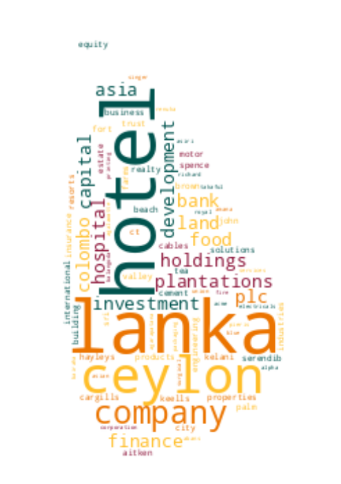

# Registrar of Companies - Sri Lanka

Data Scraped from Registrar of Companies - Sri Lanka (https://eroc.drc.gov.lk)

Scraped **85,264** Companies ([2.61MB](data/companies.tsv)) as of *2023-12-08 16:13:31*.

## Selection of Companies
*Sample of 10/85264*

* (1) PCC00287821 - **99X TECHNOLOGY AS**
* (9,474) PV4474 - **AURO FOODS**
* (18,948) PV00203865 - **CEYLON MERCHANTS & EXPORTS**
* (28,422) PV17508 - **DRU ERA**
* (37,895) PV00245240 - **HIRE LANKA TAXI & TOURS**
* (47,369) PV00223803 - **LANKA TEFL TRAINING INSTITUTE**
* (56,843) PV72502 - **OCEAN INVESTMENTS**
* (66,316) PV00267070 - **SALON RED ROSE & ACADEMY**
* (75,790) PV69149 - **TEKZOL**
* (85,264) PV118576 - **ZZAPPIT**

## Latest 1,000 Companies
*Sample of 10/1000*

* (1) PV00287774 - **ETHEREAL BEAUTY BOUTIQUE**
* (112) PV00287996 - **ARADHANA FOREIGN EMPLOYMENT**
* (223) PV00288229 - **SELEE BOUBLEE HOLDING**
* (334) PV00288459 - **NG GLOBAL CONNECT**
* (445) PV00288697 - **BLACKROCK SOLUTION**
* (556) PV00288915 - **AJITH SERVICES CENTRE AND ENTERPRISES**
* (667) PV00289152 - **MAYAN INTERNATIONAL**
* (778) PV00289414 - **AQUAFORCE HYDRO SOLUTIONS**
* (889) PV00289629 - **CH COMMERCIAL DESIGN & BUILD**
* (1,000) PV00290073 - **FUTURE DREAMS AND MERCHANT INVESTMENT**

## Selection for Companies by Type

### "PV"
*Sample of 10/78564*

* (1) PV20853 - **A AND A ASSOCIATES**
* (8,730) PV93547 - **AURORA BORE WELLS**
* (17,459) PV00238151 - **CEYLON NATURAL AGRO EXPORTS**
* (26,188) PV00240712 - **DULA DESIGNS**
* (34,917) PV00247047 - **HIRU CONSTRUCTIONS AND ENGINEERING ITEMS**
* (43,647) PV77407 - **LANKA VIP TOURS**
* (52,376) PV00218460 - **OCEAN PLUS**
* (61,105) PV00250751 - **SALON DE DASITH RU**
* (69,834) PV17567 - **TECHNOMEDICS INTERNATIONAL**
* (78,564) PV118576 - **ZZAPPIT**

### ""
*Sample of 10/2529*

* (1)  - **A KIRUBAA GROUP OF COMPANIES**
* (281)  - **AVI STUDIOS**
* (562)  - **CEYLON MEDEXPLORE**
* (843)  - **DOOR OF HOPE GLORY GARDEN**
* (1,124)  - **HENUKA VARDHANA MEGA GROUP**
* (1,405)  - **LENDNOW**
* (1,686)  - **NUSMILE**
* (1,967)  - **SARASAVI PRINTERS**
* (2,248)  - **THAJ ENTERPRISES**
* (2,529)  - **ZOVO ENTERPRISES**

### "GA"
*Sample of 10/1614*

* (1) GA00213478 - **A QUINT ONDAATJE FOUNDATION**
* (180) GA2758 - **ASSOCIATION OF MARGIN PROVIDERS**
* (359) GA3466 - **CEYLON DESICCATED COCONUT MANUFACTURERS' ASSOCIATION**
* (538) GA266 - **DIGAMADULLA DEVELOPMENT FOUNDATION**
* (717) GA2450 - **INDIAN OCEAN P & I CLUB ASSOCIATION OF CEYLON**
* (897) GA00211476 - **LANKA INTERNATIONAL CULTURAL CENTER**
* (1,076) GA2281 - **OH CHILD**
* (1,255) GA3291 - **SEAFOOD EXPORTERS' ASSOCIATION OF SRI LANKA**
* (1,434) GA2380 - **THE GOOD PRACTICE GROUP**
* (1,614) GA00272078 - **ZOI CHILD HEALTH & EDUCATION ORGANIZATION**

### "PB"
*Sample of 10/1008*

* (1) PB5111 - **A ONE TOP TRADING**
* (112) PB4666 - **AVIC INTERNATIONAL HOTELS LANKA**
* (224) PB862 - **CEYLINCO HOMES**
* (336) PB5116 - **COOPLIFE INSURANCE**
* (448) PB5364 - **GARWARE LANKA CONSTRUCTIONS**
* (560) PB4970 - **KARANDENIYA SANASA SHARE HOLDERS TRUST COMPANY**
* (672) PB5255 - **MEDIA MANAGEMENT TECHNOLOGIES**
* (784) PB5091 - **RHINO ROOFING**
* (896) PB3742 - **SWETHA WARNA**
* (1,008) PB4828 - **ZIPP INTERNATIONAL (LANKA)**

### "GL"
*Sample of 10/502*

* (1) GL00223389 - **A LITTLE  FOUNDATION**
* (56) GL00214560 - **ASSOCIATION OF SPORTS FEDERATIONS**
* (112) GL2339 - **CHILD DEVELOPMENT AND PROTECTION ORGANAIZATION**
* (168) GL00260129 - **FACTUM SOLUTIONS**
* (223) GL00246519 - **INSTITUTE OF OCEAN RESOURCES ANALYSIS**
* (279) GL00217709 - **LIZARD HATS**
* (335) GL00233761 - **POKKISHAM SOCIAL DEVELOPMENT ORGANIZATION**
* (390) GL00222874 - **SLASPA**
* (446) GL2007 - **THE SCHOOL RELIEF INITIATIVE GURANTEE)**
* (502) GL2310 - **ZOE LIFE INTERNATIONAL (GURANTEE)**

### "NF"
*Sample of 10/331*

* (1) NF137 - **AB FINLANKA**
* (37) NF667 - **ATTYEHSAZAN - E - HAFEZ**
* (74) NF406 - **CHINA COMMUNICATION IMPORT & EXPORT CORPORATION**
* (111) NF110 - **DONG HO SILUP (S)**
* (147) NF482 - **HYMEC (SOCIETE D` EQUIPMENT HYDRO MECHANIQUE)**
* (184) NF694 - **LANKA CONSULTING AS**
* (221) NF262 - **NKK CORPORATION**
* (257) NF480 - **SCHNEIDER ELECTRIC INDUSTRIES S.A.**
* (294) NF534 - **TOA CORPORATION**
* (331) NF711 - **ZTE CORPORATION**

### "FC"
*Sample of 10/253*

* (1) FC00251549 - **AA JAPAN (PVT) LTD**
* (29) FC00234986 - **ARD,  INC.**
* (57) FC1143 - **CHINA GEO-ENGINEERING CORPORATION**
* (85) FC1127 - **DAIHO CORPORATION**
* (113) FC1260 - **GE T & D INDIA**
* (141) FC1367 - **KANESATSU CORPORATION**
* (169) FC1110 - **NCC LIMITED**
* (197) FC1149 - **RANK`S INTERNAITONAL MIDDLE EAST (BVI)**
* (225) FC1252 - **TEACLY (S) PTE.**
* (253) FC1065 - **ZIBO GUANGZHENG ALKALI ALUMINIUM CHEMICAL INDUSTRY CO.,**

### "F"
*Sample of 10/145*

* (1) F234 - **ALCO INSURANCE COMPANY**
* (17) F345 - **BANARAS GMBH EXPROTS IMPORTS**
* (33) F302 - **CDFC ( CEY)**
* (49) F380 - **DUBAI BANK**
* (65) F177 - **IMPERIAL CHEMICAL INS**
* (81) F216 - **MORRISON & KNUDSON INTERNATIONAL INC**
* (97) F65 - **QUEENSLAND INSURANCE CO.**
* (113) F76 - **SUN LIFE ASSURANCE CO OF CANADA**
* (129) F104 - **THE NEW ASIATIC LIFE INSURANCE CO.**
* (145) F268 - **Y CICHAEL**

### "PQ"
*Sample of 10/120*

* (1) PQ188 - **ABANS ELECTRICALS**
* (14) PQ124 - **BOGAWANTALAWA TEA ESTATES PLC**
* (27) PQ52 - **CEYLON GUARDIAN INVESTMENT TRUST**
* (40) PQ173 - **COLOMBO LAND AND DEVELOPMENT COMPANY**
* (53) PQ137 - **GALADARI HOTELS (LANKA)**
* (67) PQ123 - **KELANI TYRES**
* (80) PQ86 - **LANKEM DEVELOPMENTS**
* (93) PQ167 - **ROYAL PALMS BEACH HOTELS**
* (106) PQ84 - **THE AUTODROME**
* (120) PQ00234079 - **WINDFORCE**

### "PBPV"
*Sample of 10/49*

* (1) PB1296PV - **A BAUR AND COMPANY  TRAVEL**
* (6) PB4687PV - **ARVANA INVESTMENTS**
* (11) PB1098PV - **COIRTEX**
* (17) PB30PV - **DAVID PIERIS AUTOMOBILES**
* (22) PB36PV - **FINTRAVEL**
* (27) PB3540PV - **HAYLEYS LIFESCIENCES**
* (33) PB3539PV - **KELSEY HOMES**
* (38) PB629PV - **NORTH SOUTH LINES**
* (43) PB3799PV - **ST ANTHONY'S HYDRO POWER**
* (49) PB458PV - **VENIGROS**

### "PBG"
*Sample of 10/45*

* (1) PBG45 - **ACCOUNTANCY ASSOSICATES**
* (5) PBG28 - **BLUE DIAMOND SPORTSMEN**
* (10) PBG8 - **COLOMBO MEDICAL SCHEMES**
* (15) PBG43 - **ERD FINANCE**
* (20) PBG9 - **OVERSEA CHILDRENS SCHOOL LTD ( BY GUARANTEE)**
* (25) PBG35 - **SAMPATH SPORTSMEN**
* (30) PBG17 - **THE BENEFIT PROVIDENT FUND**
* (35) PBG16 - **THE INSURANCE POLICY HOLDERS SERVICES**
* (40) PBG39 - **THEEPAM INSTITUTE**
* (45) PBG14 - **UNITED SPORTSMAN**

### "PVPB"
*Sample of 10/24*
* (1) PV4158PB - **ADAM CARBONS**
* (3) PV60755PB - **ALPHA WEALTH**
* (6) PV2525PB - **CENTRAL HOSPITALS**
* (8) PV6857PB - **CEYLON LEATHER PRODUCTS MANUFACTURERS**
* (11) PV6351PB - **DELMEGE**
* (13) PV115971PB - **ISOLEZ BIOTECH PHARMA AG**
* (16) PV6401PB - **MAG INDUSTRIES**
* (18) PV69844PB - **NOR LANKA MANUFACTURING COLOMBO**
* (21) PV3574PB - **SOUTH ASIA TEXTILES**
* (24) PV62911PB - **TRICO LOGISTICS**

### "PCC"
*Sample of 10/23*
* (1) PCC00287821 - **99X TECHNOLOGY AS**
* (3) PCC00284133 - **ASIRI PORT CITY HOSPITAL (PRIVATE) LIMITED .**
* (5) PCC00272290 - **BITAZZA LANKA (PRIVATE) LIMITED**
* (8) PCC00271314 - **CODEGEN INNOVATIONS (PRIVATE) LIMITED**
* (10) PCC00284521 - **ECHELON TRADE (PVT) LTD.**
* (13) PCC00287820 - **HORIZON GROUP USA GLOBAL LLC**
* (15) PCC00288843 - **IVIVA PTE LTD**
* (18) PCC00278728 - **PATHLY HOLDINGS, INC**
* (20) PCC00276910 - **REMEDIUMONE GLOBAL PRIVATE LIMITED**
* (23) PCC00284609 - **TIQRI SOFTWARE PTE LTD**

### "PBPQ"
*Sample of 10/20*
* (1) PB1015PQ - **ABANS FINANCE**
* (3) PB4739PQ - **ARPICO INSURANCE**
* (5) PB733PQ - **ASSOCIATED MOTOR FINANCE COMPANY**
* (7) PB1280PQ - **CEYLON TEA BROKERS**
* (9) PB633PQ - **DFCC VARDHANA BANK**
* (11) PB4520PQ - **HIKKADUWA BEACH RESORT**
* (13) PB647PQ - **PEOPLE'S LEASING & FINANCE**
* (15) PB813PQ - **SINGER FINANCE (LANKA)**
* (17) PB641PQ - **SOFTLOGIC FINANCE**
* (20) PB3831PQ - **VALLIBEL ONE**

### "PVPBPQ"
* (1) PV66136PBPQ - **BROWNS INVESTMENTS**
* (2) PVPB13254PQ - **JETWING SYMPHONY**
* (3) PV8330PBPQ - **LAUGFS GAS**
* (4) PVPB7385PQ - **LOTUS HYDRO POWER**
* (5) PV17807PB/PQ - **MACKWOODS ENERGY**
* (6) PV10922PBPQ - **RAIGAM WAYAMBA SALTERNS**
* (7) PVPB8234PQ - **RAMBODA FALLS**
* (8) PV415PBPQ - **RESUS ENERGY**
* (9) PV70371PB/PQ - **SINGHE HOSPITALS**
* (10) PV1536PBPQ - **SOFTLOGIC HOLDINGS**

### "PQPB"
* (1) PQ96PB - **ASIRI CENTRAL HOSPITALS**
* (2) PQ15PB - **ASSOCIATED ELECTRICAL CORPORATION**
* (3) PQ17PB - **ASSOCIATED PROPERTY DEVELOPMENT**
* (4) PQ193PB - **BERUWELA WALK INN**
* (5) PQ99PB - **CEYLON LEATHER PRODUCTS**
* (6) PQ143PB - **HOTEL DEVELOPERS (LANKA) LIMITED**
* (7) PQ176PB - **KURUWITA TEXTILE MILLS**
* (8) PQ220PB - **METROPOLITAN RESOURCE HOLDINGS**
* (9) PQ77PB - **MORISON**

### "PVPQ"
* (1) PV10527PQ - **ADAM CAPITAL**
* (2) PV78150PQ - **ADAM INVESTMENTS**
* (3) PV1618PQ - **AGSTAR**
* (4) PV72355PQ - **ANILANA HOTELS & PROPERTIES**
* (5) PV7206PQ - **ODEL**
* (6) PV1536PQ - **SOFT LOGIC HOLDINGS**

### "PVS"
* (1) PVS1795 - **CINE-TECH**
* (2) PVS8467 - **LAKMINI ENTERPRISES**
* (3) PVS7888 - **RADIAN PRODUCTS**
* (4) PVS7498 - **WINGS TRAVELS AND TOURS**
* (5) PVS8227 - **WOODLANDS LANKA**

### "OC"
* (1) OC108 - **CAMSO TRADING**
* (2) OC101 - **ISLANDERS MALDIVES PTE**
* (3) OC102 - **POWER HUB INTERNATIONAL SDN PHD**

### "PQPBPV"
* (1) PQ98PBPV - **ACE POWER GENERATION MATARA**
* (2) PQ16PB/PV - **ASSOCIATED MOTORWAYS**

### "GAGL"
* (1) GA683GL - **LANKA PRISON FELLOWSHIP**

### "PBPVPB"
* (1) PBPVPB138 - **MCLARENS SHIPPING**
