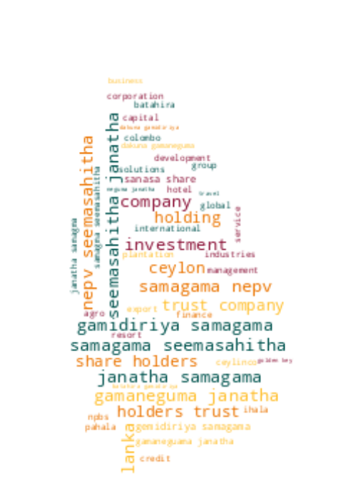

# Registrar of Companies - Sri Lanka

Data Scraped from Registrar of Companies - Sri Lanka (https://eroc.drc.gov.lk)

Scraped **129,536** Companies ([4.00MB](data/companies.tsv)) as of *2024-02-25 06:30:34*.

*Scraping Progress: 52,728/52,728*
✅✅✅✅✅✅✅✅✅✅

## Selection of Companies
*Sample of 10/129536*

* (1) PCC00287821 - **99X TECHNOLOGY AS**
* (14,393) PV96153 - **BLUESTAR ENGINEERING**
* (28,786) PV111625 - **DIMASHA INTERNATIONAL**
* (43,179) PV00213820 - **GOSHIRO INTERNATIONAL**
* (57,572) PV00200203 - **KEERTHIRATHNA HOLDINGS**
* (71,964) PV00225155 - **MONTARE**
* (86,357) PV80718 - **PRINTMASS**
* (100,750) PV15213 - **SEW GUNASEKERA PAWN BROKERS**
* (115,143) PB5300 - **THE PAPER FACTORY**
* (129,536) PV118576 - **ZZAPPIT**

## Latest 1,000 Companies
*Sample of 10/1000*

* (1) PV00291239 - **PRODUTIZE**
* (112) PV00291441 - **ROYAL FOREX MONEY EXCHANGE**
* (223) PV00291637 - **OREKS GLOBAL**
* (334) PV00291915 - **KSL RESOURCES**
* (445) PV00292262 - **EU RATIO ASSIGNMENT & COMPANY**
* (556) GA00292619 - **SUNCITY YOUTH FOUNDATION**
* (667) PV00292995 - **BIG SKY**
* (778) PCC00293394 - **ADANA FOOD (PRIVATE) LIMITED.**
* (889) PV00293921 - **KIYANNA.LK**
* (1,000) PV00294998 - **BUCKWHEAT HOLDINGS**

## Selection for Companies by Type

### "PV"
*Sample of 10/117737*

* (1) PV20853 - **A AND A ASSOCIATES**
* (13,082) PV104100 - **BLUE PLANET HOLDINGS**
* (26,164) PV62121 - **DILAN TRAILER MANUFACTURING**
* (39,246) PV00278181 - **GOLDEN GUEST HOUSE**
* (52,328) PV87285 - **KARACHCHI NORTH FARMERS**
* (65,409) PV00220007 - **MIXALOGY**
* (78,491) PV4472 - **PREMADASA SPORTS CENTRE**
* (91,573) PV00236768 - **SHA NATURAL BEAUTY PRODUCTS**
* (104,655) PV66262 - **THE SANDWICH FACTORY**
* (117,737) PV118576 - **ZZAPPIT**

### ""
*Sample of 10/4402*

* (1)  - **A AND Y COMMODITIES**
* (490)  - **BOSE AND CO**
* (979)  - **DIVAS CONNECT**
* (1,468)  - **GOLDEN RULE**
* (1,957)  - **KATEE ROTEE**
* (2,446)  - **MORINGA HOTELS**
* (2,935)  - **POUR & PERK**
* (3,424)  - **SHIKISEN**
* (3,913)  - **THE WAVE TRAINING CEYLON**
* (4,402)  - **ZULACART**

### "PB"
*Sample of 10/2769*

* (1) PB5111 - **A ONE TOP TRADING**
* (308) PB5067 - **CINNAMON TRAIL TRAVELS**
* (616) PB5357 - **IDEA INDUSTRIES**
* (923) PB3823 - **NATION`S REALTY**
* (1,231) PB3069 - **SEEMASAHITHA (JANATHA) BIBILEGAMA BATAHIRA PAHALA GAMIDIRIYA SAMAGAMA**
* (1,538) PB3242 - **SEEMASAHITHA (JANATHA) OLD FACTORY GEMIDIRIYA SAMAGMA**
* (1,846) PB4578 - **SEEMASAHITHA DIKYAYA GAMANEGUMA JANATHA SAMAGAMA**
* (2,153) PB4548 - **SEEMASAHITHA NEW MADAKUMBURA GAMANEGUMA JANATHA SAMAGAMA**
* (2,461) PB4923 - **SEWANAGALA SANASA SHARE HOLDERS TRUST COMPANY**
* (2,769) PB118 - **ZYREX POWER COMPANY**

### "GA"
*Sample of 10/2323*

* (1) GA00213478 - **A QUINT ONDAATJE FOUNDATION**
* (259) GA00224335 - **BODHI CHATHUPARISA TAMBAPANNIDEEPA**
* (517) GA00219625 - **CROSSROADS LANKA FOUNDATION**
* (775) GA565 - **GURUGODELLA JANATHA SANGAMAYA**
* (1,033) GA00218442 - **JILIN CHAMBER OF COMMERCE**
* (1,291) GA2737 - **MERCY COMMUNITY CENTRE**
* (1,549) GA2502 - **PRAJA SANWARDENA SAHAYOGEETHA AYATHANAYA**
* (1,807) GA148 - **SOCIAL AND EDUCATIONAL FUND OF SAI CHARITABLE TRUST**
* (2,065) GA00240607 - **THE JAPANESE TRUST BRIDGE**
* (2,323) GA470 - **ZONTA CLUB II OF COLOMBO**

### "GL"
*Sample of 10/765*

* (1) GL00223389 - **A LITTLE  FOUNDATION**
* (85) GL63 - **BRIDGE 2 PEACE**
* (170) GL00268852 - **E SUPPORTING CENTER**
* (255) GL2040 - **GROW & GLOW**
* (340) GL00250516 - **JATAA WORLDWIDE**
* (425) GL2162 - **METHTHA REHABILITATION FOUNDATION**
* (510) GL00278221 - **POOBALASINGHAM FOUNDATION**
* (595) GL2306 - **SKAVITA HUMANITARIAN ASSISTANCE AND RELIEF PROJECT**
* (680) GL2488 - **TOOBA ACADEMY**
* (765) GL2310 - **ZOE LIFE INTERNATIONAL (GURANTEE)**

### "NF"
*Sample of 10/503*

* (1) NF137 - **AB FINLANKA**
* (56) NF206 - **BRILLIANT VALLEY**
* (112) NF211 - **ED ZUBLIN AKTIENGESELLSCHAFT**
* (168) NF246 - **HALMODE APPAREL INC.**
* (224) NF660 - **KINDEN CORPORATION**
* (279) NF18 - **MIDDLE EAST BANK**
* (335) NF303 - **PACIFIC RESOUSRCES EXPORT**
* (391) NF442 - **SERVIER INTERNATIONAL**
* (447) NF524 - **THE HADDED APPAREL GROUP**
* (503) NF711 - **ZTE CORPORATION**

### "FC"
*Sample of 10/366*

* (1) FC00251549 - **AA JAPAN (PVT) LTD**
* (41) FC1044 - **BIS VAM ANLAGENTECHNIK GMBH**
* (82) FC1157 - **DAMODAR MENON INTERNATIONAL PRIVATE**
* (122) FC1191 - **GARAMSPACE COMPANY**
* (163) FC00236404 - **ITW CONSULTING PRIVATE LIMITED**
* (203) FC1092 - **MAST FAR EAST**
* (244) FC1169 - **OMRAN MAROON ENGINEERS COMPANY (PRIVATE JOINT STOCK)**
* (284) FC00211497 - **SBT CO., LTD.**
* (325) FC00247605 - **THE WESTMINSTER FOUNDATION FOR DEMOCRACY LIMITED**
* (366) FC1065 - **ZIBO GUANGZHENG ALKALI ALUMINIUM CHEMICAL INDUSTRY CO.,**

### "F"
*Sample of 10/205*

* (1) F234 - **ALCO INSURANCE COMPANY**
* (23) F225 - **BHARAT FIRE & GENERAL INS**
* (46) F301 - **DEEN RAMBLE PVT**
* (69) F375 - **HARRIS CORPORATION (BERMUDA)**
* (91) F205 - **LIVERPOOL MARINE & GEN INS CO.**
* (114) F315 - **OBEROI HOTELS (INDIA) PRIVATE**
* (137) F49 - **SCOTTISH UNION NATIONAL INSURANCE CO.**
* (159) F305 - **SWISSAIR TRANSPOTATION CO**
* (182) F193 - **THE STANDARD GENERAL ASSURANCE CO.**
* (205) F6 - **YORKSHIRE INSURANCE CO LTC CEASED 1/11/70**

### "PQ"
*Sample of 10/151*

* (1) PQ188 - **ABANS ELECTRICALS**
* (17) PQ00252285 - **CAPITAL ALLIANCE**
* (34) PQ173 - **COLOMBO LAND AND DEVELOPMENT COMPANY**
* (51) PQ53 - **EQUITY SEVEN**
* (67) PQ178 - **HUEJAY INTERNATIONAL INVESTMENT**
* (84) PQ194 - **LANKA CEMENT**
* (101) PQ136 - **NAMUNUKULA PLANTATIONS**
* (117) PQ125 - **ROYAL CERAMICS LANKA**
* (134) PQ162 - **TANGERINE BEACH HOTELS**
* (151) PQ181 - **YORK ARCADE HOLDINGS**

### "PBPV"
*Sample of 10/80*

* (1) PB1296PV - **A BAUR AND COMPANY  TRAVEL**
* (9) PB162PV - **ASSETLINE INSURANCE BROKERS**
* (18) PB419PV - **DAMBAKANDA ESTATES COMPANY**
* (27) PB717PV - **GLOBAL CONSUMER BRANDS**
* (36) PB29PV - **JAMES FINLAY PLANTATION HOLDINGS**
* (44) PB155PV - **MC MARINE**
* (53) PB514PV - **PURITAS**
* (62) PB3376PV - **SHAW WALLACE PROPERTIES**
* (71) PB5256PV - **TOKYO SUPER AGGREGATE**
* (80) PB144PV - **WORLD SUBSEA SERVICES**

### "PBG"
*Sample of 10/46*

* (1) PBG45 - **ACCOUNTANCY ASSOSICATES**
* (6) PBG48 - **BRIGHTSTAR FINANCE**
* (11) PBG37 - **CONSULTANCY AND FINANCE AND DEVELOPMENT**
* (16) PBG22 - **FREE LANKA SPORTSMEN**
* (21) PBG9 - **OVERSEA CHILDRENS SCHOOL LTD ( BY GUARANTEE)**
* (26) PBG35 - **SAMPATH SPORTSMEN**
* (31) PBG17 - **THE BENEFIT PROVIDENT FUND**
* (36) PBG16 - **THE INSURANCE POLICY HOLDERS SERVICES**
* (41) PBG39 - **THEEPAM INSTITUTE**
* (46) PBG14 - **UNITED SPORTSMAN**

### "PVPB"
*Sample of 10/40*

* (1) PV4158PB - **ADAM CARBONS**
* (5) PV7329PB - **BUSINESS MANAGEMENT SERVICES**
* (9) PV3326PB - **CEYBANK ASSET MANAGEMENT**
* (14) PV5736PB - **ELGI RUBBER COMPANY**
* (18) PV70722PB - **GALLE FACE PROPERTIES**
* (22) PV75597PB - **LAUGFS SOLUTIONS**
* (27) PV69844PB - **NOR LANKA MANUFACTURING COLOMBO**
* (31) PV3574PB - **SOUTH ASIA TEXTILES**
* (35) PV12903PB - **SUN TAN BEACH RESORTS**
* (40) PV127512PB - **UNITED CAPITAL HOLDINGS**

### "PBPQ"
*Sample of 10/39*

* (1) PB1196PQ - **AITKEN SPENCE PLANTATION MANAGEMENTS**
* (5) PB4739PQ - **ARPICO INSURANCE**
* (9) PB858PQ - **CENTRAL INVESTMENTS AND FINANCE**
* (13) PB744PQ - **EXPOLANKA HOLDINGS**
* (17) PB1595PQ - **LAUGFS POWER**
* (22) PB891PQ - **MULTI FINANCE**
* (26) PB1108PQ - **RENUKA AGRI FOODS**
* (30) PB813PQ - **SINGER FINANCE (LANKA)**
* (34) PB594PQ - **SWARNAMAHAL FINANCIAL SERVICES**
* (39) PB4242PQ - **WASKADUWA BEACH RESORT**

### "PCC"
*Sample of 10/36*

* (1) PCC00287821 - **99X TECHNOLOGY AS**
* (4) PCC00284133 - **ASIRI PORT CITY HOSPITAL (PRIVATE) LIMITED .**
* (8) PCC00289505 - **CHINA DUTY FREE (LANKA) (PVT) LTD.**
* (12) PCC00289048 - **COMMERCIAL BANK OF CEYLON PLC**
* (16) PCC00290631 - **FLEMINGO DUTY FREE (PRIVATE) LIMITED.**
* (20) PCC00289835 - **INDO-PACIFIC CENTRE PTE. LTD**
* (24) PCC00289495 - **KPMG PROFESSIONAL SERVICES (PRIVATE) LIMITED.**
* (28) PCC00274746 - **ODF PTE LTD**
* (32) PCC00276910 - **REMEDIUMONE GLOBAL PRIVATE LIMITED**
* (36) PCC00284609 - **TIQRI SOFTWARE PTE LTD**

### "NPVS"
*Sample of 10/29*
* (1) NPVS40803 - **ALNA WATER SYSTEMS**
* (4) NPVS22400 - **CEETEE INTERNATIONAL**
* (7) NPVS35441 - **DUMBARA FERTILIZERS**
* (10) NPVS15104 - **FIVE STAR EXPORTS**
* (13) NPVS42442 - **HERITAGE SAPPHIRES**
* (16) NPVS38695 - **MCMILLAN CEYLON MARKETING**
* (19) NPVS9611 - **Q-NET**
* (22) NPVS18562 - **SERENDIB INSURANCE BROKERS**
* (25) NPVS11267 - **SILVER SHRIMPS**
* (29) NPVS16673 - **WESTERN TRADING COMPANY**

### "PVPBPQ"
* (1) PV5301PBPQ - **ABANS**
* (2) PVPB13254PQ - **JETWING SYMPHONY**
* (3) PV8330PBPQ - **LAUGFS GAS**
* (4) PVPB7385PQ - **LOTUS HYDRO POWER**
* (5) PV17807PB/PQ - **MACKWOODS ENERGY**
* (6) PVPB8234PQ - **RAMBODA FALLS**
* (7) PV415PBPQ - **RESUS ENERGY**
* (8) PV70371PB/PQ - **SINGHE HOSPITALS**
* (9) PV1536PBPQ - **SOFTLOGIC HOLDINGS**
* (10) PV7617PBPQ - **TEEJAY LANKA**

### "PQPB"
* (1) PQ15PB - **ASSOCIATED ELECTRICAL CORPORATION**
* (2) PQ17PB - **ASSOCIATED PROPERTY DEVELOPMENT**
* (3) PQ193PB - **BERUWELA WALK INN**
* (4) PQ99PB - **CEYLON LEATHER PRODUCTS**
* (5) PQ61PB - **FINLAYS COLOMBO**
* (6) PQ143PB - **HOTEL DEVELOPERS (LANKA) LIMITED**
* (7) PQ176PB - **KURUWITA TEXTILE MILLS**
* (8) PQ220PB - **METROPOLITAN RESOURCE HOLDINGS**

### "OC"
* (1) OC111 - **ASTER JETFUEL**
* (2) OC108 - **CAMSO TRADING**
* (3) OC109 - **ENERGY COMMERCE B.V.**
* (4) OC101 - **ISLANDERS MALDIVES PTE**
* (5) OC104 - **MERCANTILE SEASCAPE SHIPPING COMPANY**
* (6) OC103 - **MERCANTILE SEBORNE SHIPPING**
* (7) OC102 - **POWER HUB INTERNATIONAL SDN PHD**

### "PVPQ"
* (1) PV10527PQ - **ADAM CAPITAL**
* (2) PV1618PQ - **AGSTAR**
* (3) PV72355PQ - **ANILANA HOTELS & PROPERTIES**
* (4) PV415PQ - **HEMAS POWER**
* (5) PV7206PQ - **ODEL**
* (6) PV1536PQ - **SOFT LOGIC HOLDINGS**

### "PVS"
* (1) PVS1795 - **CINE-TECH**
* (2) PVS8467 - **LAKMINI ENTERPRISES**
* (3) PVS7888 - **RADIAN PRODUCTS**
* (4) PVS7498 - **WINGS TRAVELS AND TOURS**
* (5) PVS8227 - **WOODLANDS LANKA**

### "PQPBPV"
* (1) PQ98PBPV - **ACE POWER GENERATION MATARA**
* (2) PQ16PB/PV - **ASSOCIATED MOTORWAYS**

### "PBPVPB"
* (1) PB64PVPB - **GAC SHIPPING**
* (2) PBPVPB138 - **MCLARENS SHIPPING**

### "NFA"
* (1) NF160A - **CO ECHO ENTERPRISES**

### "PVPBPV"
* (1) PV4405PBPV - **DAVE TRACTORS**

### "UC"
* (1) UC1 - **JACEY AND COMPANY**

### "GAGL"
* (1) GA683GL - **LANKA PRISON FELLOWSHIP**

### "PQPV"
* (1) PQ231PV - **UNION RESORTS**
