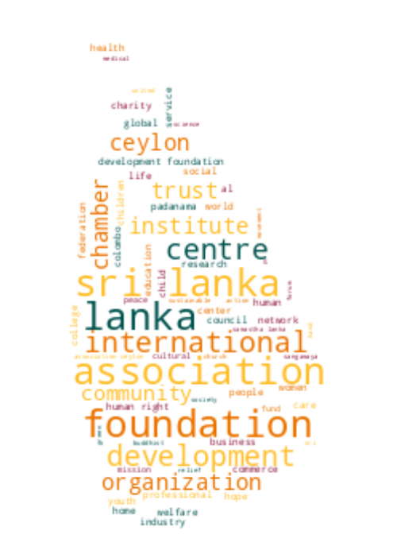

# Registrar of Companies - Sri Lanka

Data Scraped from Registrar of Companies - Sri Lanka (https://eroc.drc.gov.lk)

Scraped **128,264** Companies ([3.96MB](data/companies.tsv)) as of *2024-01-25 18:23:20*.

*Scraping Progress: 52,728/52,728*
✅✅✅✅✅✅✅✅✅✅

## Selection of Companies
*Sample of 10/128264*

* (1) PCC00287821 - **99X TECHNOLOGY AS**
* (14,252) PV118675 - **BLUEWING CREDIT**
* (28,503) PV10377 - **DILSHEY**
* (42,755) PV00281085 - **GOODWILL EXPRESS**
* (57,006) PV00276940 - **KEENKOL TECHNOLOGIES**
* (71,258) PV11013 - **MONRO INTERNATIONAL**
* (85,509) PV00286980 - **PRINT TEX MEGA HOLDINGS**
* (99,761) PV00263383 - **SEVENSEAS EXPORTS**
* (114,012) PV00214764 - **THE PEN FACTORY**
* (128,264) PV118576 - **ZZAPPIT**

## Latest 1,000 Companies
*Sample of 10/1000*

* (1) PV00289706 - **ASTRO HOLDINGS**
* (112) PV00289870 - **ARC SHIP MANAGEMENT & CHARTERING**
* (223) PV00290071 - **IRS TECH ENGINEERING NETWORK**
* (334) PV00290327 - **VALAMPURI CENTER'S**
* (445) PV00290572 - **CHARITH FURNITURE RETAIL**
* (556) PV00290874 - **ROYAL STAR INVESTMENTS**
* (667) PV00291131 - **NEVA GROUP HOLDINGS**
* (778) PV00291409 - **DEWMI WELLNESS FOOT AND SPA**
* (889) PV00291647 - **COCOPRIME  HOLDINGS**
* (1,000) PV00292810 - **UNIVERSAL IMPOEXPO CO**

## Selection for Companies by Type

### "PV"
*Sample of 10/116768*

* (1) PV20853 - **A AND A ASSOCIATES**
* (12,975) PV67904 - **BLUE RAKERS GUEST AND RESTAURANT**
* (25,949) PV4503 - **DIL FILMS (INTERNATIONAL)**
* (38,923) PV75002 - **GOLDEN CORALS**
* (51,897) PV00274922 - **KAPITAL LEISURE ADVENTURES KUCHCHAWELI**
* (64,871) PV00259797 - **MITSUKI CAPITAL HOLDINGS**
* (77,845) PV00271524 - **PRECISION CUT**
* (90,819) PV00292043 - **SHA BABY NEEDS**
* (103,793) PV00217357 - **THE SILK BODY**
* (116,768) PV118576 - **ZZAPPIT**

### ""
*Sample of 10/4129*

* (1)  - **A KIRUBAA GROUP OF COMPANIES**
* (459)  - **BRINE & COMPANY**
* (918)  - **DNA LEVESQUE VOYAGES**
* (1,377)  - **GOLDEN STAR INTERNATIONAL**
* (1,835)  - **KAVEE FASHIONS**
* (2,294)  - **MOVINA EXPORTS**
* (2,753)  - **POUR & PERK**
* (3,211)  - **SHINY  SECRETS**
* (3,670)  - **THE PRINCESS SEWING**
* (4,129)  - **ZULACART**

### "PB"
*Sample of 10/2753*

* (1) PB5111 - **A ONE TOP TRADING**
* (306) PB00212323 - **CHUANYUE GOLDNET INFORMATION TECHNOLOGY (COLOMBO) CO.**
* (612) PB00207066 - **HOUSELINE INVESTMENTS**
* (918) PB4967 - **NAGODA SANASA SHARA HOLDERS TRUST COMPANY**
* (1,224) PB1353 - **SEEMASAHITHA (JANATHA) BALABEDDA GEMIDIRIYA SAMAGAMA(NEPV (P) 663)**
* (1,529) PB3022 - **SEEMASAHITHA (JANATHA) MEDAGODA SHAKTHI GAMIDIRIYA SAMAGAMA**
* (1,835) PB4849 - **SEEMASAHITHA BINNAGAMA GAMANEGUMA JANATHA SAMAGAMA**
* (2,141) PB4221 - **SEEMASAHITHA MEEWATHPURA GAMANEGUMA JANATHA SAMAGAMA**
* (2,447) PB5032 - **SEVEN SEAS GLOBAL TRADING**
* (2,753) PB118 - **ZYREX POWER COMPANY**

### "GA"
*Sample of 10/2314*

* (1) GA00213478 - **A QUINT ONDAATJE FOUNDATION**
* (258) GA2249 - **BLESSING HANDS MISSION**
* (515) GA563 - **CREATOR`S FORUM**
* (772) GA3372 - **GURU DEV SUWA ARANA**
* (1,029) GA2427 - **JOYCE MAYER FOUNDATION**
* (1,286) GA2635 - **MENOPAUSE SOCIETY OF SRI LANKA**
* (1,543) GA00206824 - **POWER OF GOD HEALING CENTER**
* (1,800) GA00256328 - **SKY CRICKET CLUB**
* (2,057) GA385 - **THE INSTITURE OF PUBLIC FINANCE AND DEVELOPMENT ACCOUNTANCY**
* (2,314) GA470 - **ZONTA CLUB II OF COLOMBO**

### "GL"
*Sample of 10/742*

* (1) GL00223389 - **A LITTLE  FOUNDATION**
* (83) GL00236287 - **BRIDGE OF HOPE LANKA**
* (165) GL00273941 - **DREAM LIFE FOUNDATION**
* (248) GL2040 - **GROW & GLOW**
* (330) GL00240983 - **KANDURATA SAVIYA**
* (412) GL2255 - **MISSION FOR SMILES**
* (495) GL00258086 - **PROJECT BLOOM ASSOCIATION**
* (577) GL00264657 - **SLANA**
* (659) GL2313 - **TOXIN FREE CROP PRODUCER NETWORK**
* (742) GL2310 - **ZOE LIFE INTERNATIONAL (GURANTEE)**

### "NF"
*Sample of 10/511*

* (1) NF137 - **AB FINLANKA**
* (57) NF47 - **BRITISH AIRWAYS**
* (114) NF445 - **DUPLE METSEC**
* (171) NF290 - **GURPAR EXPORTS**
* (227) NF660 - **KINDEN CORPORATION**
* (284) NF142 - **MITSUI & CO.**
* (341) NF360 - **PFAFF SINGAPORE**
* (397) NF599 - **SHIMIZU CORPORATION**
* (454) NF186 - **TNGA LABORATORIES**
* (511) NF711 - **ZTE CORPORATION**

### "FC"
*Sample of 10/368*

* (1) FC00251549 - **AA JAPAN (PVT) LTD**
* (41) FC1372 - **BEMIS HONG KONG**
* (82) FC1051 - **CONCEPT 247**
* (123) FC1359 - **FRESENIUS INSTITUTE OF DIALYSIS NURSING COMPANY**
* (164) FC1070 - **IRCON INTERNATIONAL**
* (204) FC1073 - **MARK INFRATRADE**
* (245) FC1048 - **OPTIMA ENERGY SA**
* (286) FC1352 - **SHANDONG SINO - AGRI UNITED BIOTECHNOLOGY CO.,**
* (327) FC1236 - **TOKYO ELECTRICS POWER SERVICES CO.**
* (368) FC1065 - **ZIBO GUANGZHENG ALKALI ALUMINIUM CHEMICAL INDUSTRY CO.,**

### "F"
*Sample of 10/211*

* (1) F350 - **ALGEMENE BANK NEDERLAND**
* (24) F41 - **BOMBAY LIFE ASSURANCE CO.**
* (47) F351 - **DET NORSKE VERITAS**
* (71) F91 - **HOME INSURANCE CO.**
* (94) F201 - **LONDON AND OVERSEAS INS. CO.**
* (117) F55 - **NEWZELAND INS. CO.**
* (141) F317 - **ROYAL NEPAL AIR LINES CORPORATION**
* (164) F325 - **STYLE DESIGN AND TECHNICAL CONSULTANTS**
* (187) F250 - **THE PIONERR FIRE & GEN INS CO**
* (211) F268 - **Y CICHAEL**

### "PQ"
*Sample of 10/155*

* (1) PQ188 - **ABANS ELECTRICALS**
* (18) PQ00252285 - **CAPITAL ALLIANCE**
* (35) PQ173 - **COLOMBO LAND AND DEVELOPMENT COMPANY**
* (52) PQ53 - **EQUITY SEVEN**
* (69) PQ185 - **INDUSTRIAL ASPHALTS (CEYLON)**
* (86) PQ139 - **LANKA REALTY INVESTMENTS**
* (103) PQ78 - **NAWALOKA HOSPITALS**
* (120) PQ00247201 - **SANASA LIFE INSURANCE COMPANY**
* (137) PQ32 - **TEA SMALLHOLDER FACTORIES**
* (155) PQ181 - **YORK ARCADE HOLDINGS**

### "PBPV"
*Sample of 10/77*

* (1) PB1296PV - **A BAUR AND COMPANY  TRAVEL**
* (9) PB1491PV - **BAURS AIRSERVICES**
* (17) PB270PV - **DAVID PIERIS HOLDINGS**
* (26) PB36PV - **FINTRAVEL**
* (34) PB598PV - **HAYLEYS ELECTRONICS MANUFACTURING**
* (43) PB4516PV - **LUMIERE TEXTILES**
* (51) PB807PV - **PHOENIX VENTURES**
* (60) PB752PV - **RILEYS**
* (68) PB5092PV - **TOKYO EASTERN CEMENT COMPANY**
* (77) PB144PV - **WORLD SUBSEA SERVICES**

### "PBG"
*Sample of 10/45*

* (1) PBG45 - **ACCOUNTANCY ASSOSICATES**
* (5) PBG28 - **BLUE DIAMOND SPORTSMEN**
* (10) PBG8 - **COLOMBO MEDICAL SCHEMES**
* (15) PBG43 - **ERD FINANCE**
* (20) PBG50 - **NEW ERA PUBLICATIONS**
* (25) PBG47 - **RURAL COMMUNITY DEVELOPMENT PROJECT**
* (30) PBG7 - **SUYATHESA AFIVIRTHI SANGAM**
* (35) PBG20 - **THE FREE LANKA BENEFITS**
* (40) PBG21 - **THE WORKERS BENEFIT (LUNUGALA)**
* (45) PBG14 - **UNITED SPORTSMAN**

### "PVPB"
*Sample of 10/43*

* (1) PV4158PB - **ADAM CARBONS**
* (5) PV7329PB - **BUSINESS MANAGEMENT SERVICES**
* (10) PV440PB - **CITRUS VACATIONS LIMITED**
* (15) PV60865PB - **FAIRWAY DEVELOPMENTS**
* (19) PV115971PB - **ISOLEZ BIOTECH PHARMA AG**
* (24) PV69307PB - **NATURE'S BEST INDUSTRY**
* (29) PV3388PB - **SAHAS**
* (33) PV64641PB - **SOUTH ASIAN INSTITUTE OF TECHNOLOGY AND MEDICINE**
* (38) PV3822PB - **SWARNAMAHAL JEWELLERS**
* (43) PV77431PB - **WELIGAMA HOTEL PROPERTIES**

### "PBPQ"
*Sample of 10/38*

* (1) PB1015PQ - **ABANS FINANCE**
* (5) PB1090PQ - **AMBEON CAPITAL**
* (9) PB3259PQ - **BIMPUTH FINANCE**
* (13) PB765PQ - **DIALOG FINANCE**
* (17) PB4520PQ - **HIKKADUWA BEACH RESORT**
* (21) PB76PQ - **MERCANTILE INVESTMENTS & FINANCE**
* (25) PB1079PQ - **ORIENT FINANCE**
* (29) PB62PQ - **SANASA DEVELOPMENT BANK**
* (33) PB779PQ - **SOFTLOGIC CAPITAL**
* (38) PB526PQ - **VALLIBEL FINANCE**

### "PCC"
*Sample of 10/33*

* (1) PCC00287821 - **99X TECHNOLOGY AS**
* (4) PCC00278331 - **BITAZZA INTERNATIONAL LIMITED**
* (8) PCC00290488 - **CHINA HARBOUR ENGINEERING COMPANY (LANKA) LIMITED.**
* (11) PCC00289048 - **COMMERCIAL BANK OF CEYLON PLC.**
* (15) PCC00275578 - **GREENSTAT HYDROGEN (PVT) LTD.**
* (18) PCC00289835 - **INDO-PACIFIC CENTRE PTE. LTD**
* (22) PCC00290514 - **LAK ARCADE (PVT) LTD.**
* (25) PCC00274746 - **ODF PTE LTD**
* (29) PCC00276910 - **REMEDIUMONE GLOBAL PRIVATE LIMITED**
* (33) PCC00284609 - **TIQRI SOFTWARE PTE LTD**

### "NPVS"
*Sample of 10/28*
* (1) NPVS40803 - **ALNA WATER SYSTEMS**
* (4) NPVS22400 - **CEETEE INTERNATIONAL**
* (7) NPVS35441 - **DUMBARA FERTILIZERS**
* (10) NPVS34158 - **GEMCO**
* (13) NPVS3371 - **HYSTYLE APPAREL (PRIVATE)**
* (16) NPVS13741 - **PET PACKAGING**
* (19) NPVS9774 - **SAMINDU**
* (22) NPVS29809 - **SHERRY HOMES**
* (25) NPVS47980 - **STYLE APPAREL**
* (28) NPVS16673 - **WESTERN TRADING COMPANY**

### "PVPBPQ"
* (1) PV3562PB/PQ - **ASIA SIYAKA COMODITIES**
* (2) PVPB13254PQ - **JETWING SYMPHONY**
* (3) PV8330PBPQ - **LAUGFS GAS**
* (4) PVPB7385PQ - **LOTUS HYDRO POWER**
* (5) PV17807PB/PQ - **MACKWOODS ENERGY**
* (6) PVPB8234PQ - **RAMBODA FALLS**
* (7) PV415PBPQ - **RESUS ENERGY**
* (8) PV70371PB/PQ - **SINGHE HOSPITALS**
* (9) PV1536PBPQ - **SOFTLOGIC HOLDINGS**
* (10) PV7617PBPQ - **TEEJAY LANKA**

### "PQPB"
* (1) PQ96PB - **ASIRI CENTRAL HOSPITALS**
* (2) PQ15PB - **ASSOCIATED ELECTRICAL CORPORATION**
* (3) PQ17PB - **ASSOCIATED PROPERTY DEVELOPMENT**
* (4) PQ193PB - **BERUWELA WALK INN**
* (5) PQ99PB - **CEYLON LEATHER PRODUCTS**
* (6) PQ61PB - **FINLAYS COLOMBO**
* (7) PQ143PB - **HOTEL DEVELOPERS (LANKA) LIMITED**
* (8) PQ176PB - **KURUWITA TEXTILE MILLS**
* (9) PQ220PB - **METROPOLITAN RESOURCE HOLDINGS**
* (10) PQ77PB - **MORISON**

### "PVPQ"
* (1) PV10527PQ - **ADAM CAPITAL**
* (2) PV78150PQ - **ADAM INVESTMENTS**
* (3) PV1618PQ - **AGSTAR**
* (4) PV72355PQ - **ANILANA HOTELS & PROPERTIES**
* (5) PV415PQ - **HEMAS POWER**
* (6) PV7206PQ - **ODEL**
* (7) PV1536PQ - **SOFT LOGIC HOLDINGS**

### "OC"
* (1) OC108 - **CAMSO TRADING**
* (2) OC101 - **ISLANDERS MALDIVES PTE**
* (3) OC104 - **MERCANTILE SEASCAPE SHIPPING COMPANY**
* (4) OC106 - **MERCANTILE SEAWIND SHIPPING COMPANY**
* (5) OC103 - **MERCANTILE SEBORNE SHIPPING**
* (6) OC102 - **POWER HUB INTERNATIONAL SDN PHD**

### "PVS"
* (1) PVS1795 - **CINE-TECH**
* (2) PVS8467 - **LAKMINI ENTERPRISES**
* (3) PVS7888 - **RADIAN PRODUCTS**
* (4) PVS7498 - **WINGS TRAVELS AND TOURS**
* (5) PVS8227 - **WOODLANDS LANKA**

### "PBPVPB"
* (1) PB64PVPB - **GAC SHIPPING**
* (2) PB553PV/PB - **INTERNATIONAL CONSUMER BRANDS**
* (3) PBPVPB138 - **MCLARENS SHIPPING**

### "PQPBPV"
* (1) PQ98PBPV - **ACE POWER GENERATION MATARA**
* (2) PQ16PB/PV - **ASSOCIATED MOTORWAYS**

### "NFA"
* (1) NF160A - **CO ECHO ENTERPRISES**

### "PVPBPV"
* (1) PV4405PBPV - **DAVE TRACTORS**

### "UC"
* (1) UC1 - **JACEY AND COMPANY**

### "GAGL"
* (1) GA683GL - **LANKA PRISON FELLOWSHIP**

### "PBpv"
* (1) PB1236pv - **UNILEAVER CEYLON SERVICES**

### "PQPV"
* (1) PQ231PV - **UNION RESORTS**
