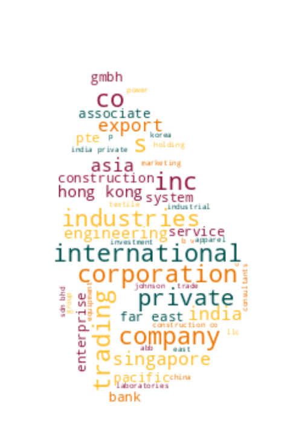

# Registrar of Companies - Sri Lanka

Data Scraped from Registrar of Companies - Sri Lanka (https://eroc.drc.gov.lk)

Scraped **128,080** Companies ([3.96MB](data/companies.tsv)) as of *2024-01-08 09:12:23*.

*Scraping Progress: 52,728/52,728*
✅✅✅✅✅✅✅✅✅✅

## Selection of Companies
*Sample of 10/128080*

* (1) PCC00287821 - **99X TECHNOLOGY AS**
* (14,232) PV00282698 - **BM EVENTS**
* (28,463) PV00251796 - **DILSIORGANIC**
* (42,694) PV21624 - **GORDON COMMODITIES**
* (56,925)  - **KECT VIYEMA RECRUITMENT & TRANING**
* (71,156) PV00210246 - **MONRAK TRADING**
* (85,387) PV00200381 - **PRINT PIX**
* (99,618) PV00242236 - **SEVEN STAR HOME & LAND**
* (113,849) PV127119 - **THE PALACE OF ROYAL BATH**
* (128,080) PV118576 - **ZZAPPIT**

## Latest 1,000 Companies
*Sample of 10/1000*

* (1) PV00289268 - **GREEN CLIFF**
* (112) PV00289432 - **UNLOCKING LANKA**
* (223) PV00289587 - **ECOMAXX INTERNATIONAL**
* (334) PV00289753 - **VISESH CARGO**
* (445) PV00289926 - **IDEA 8**
* (556) PV00290214 - **FAITH LANKA INTERNATIONAL**
* (667) PV00290530 - **CENTERLINE TRAVELS & TRADING**
* (778) PV00290913 - **AWADHI ENTERTAINMENT**
* (889) PV00291315 - **GEM AURA**
* (1,000) PV00291668 - **AARO CEYLON GROUP**

## Selection for Companies by Type

### "PV"
*Sample of 10/116725*

* (1) PV20853 - **A AND A ASSOCIATES**
* (12,970) PV00276993 - **BLUE RIBBON CEYLON**
* (25,939) PV107871 - **DIL ASIAN LANKA**
* (38,909) PV00214742 - **GOLDEN ENTERPRISES MARKETING**
* (51,878) PV82062 - **KANWIN CREDIT**
* (64,847) PV87902 - **MITKO FAMILY HEALTH CARE**
* (77,817) PV00286083 - **PRAVEINAA CREATIONS & INSTITUTE**
* (90,786) PV12176 - **SEYO LANKA**
* (103,755) PV00290742 - **THE SANDCASTLE**
* (116,725) PV118576 - **ZZAPPIT**

### ""
*Sample of 10/3952*

* (1)  - **A KIRUBAA GROUP OF COMPANIES**
* (440)  - **BRIO NET BAZAAR**
* (879)  - **DIMO SOLAR KEKIRAWA**
* (1,318)  - **GOLDEN ENERGY POWER**
* (1,757)  - **KANDYAN AESTHETICS**
* (2,196)  - **MORA EXCLUSIVO**
* (2,635)  - **POUR & PERK**
* (3,074)  - **SHASTA LANKA ENTERPRISE**
* (3,513)  - **THE LEMON TREE RESTAURANT**
* (3,952)  - **ZULACART**

### "PB"
*Sample of 10/2765*

* (1) PB5111 - **A ONE TOP TRADING**
* (308) PB929 - **CHRISTOMBU PLANTATIONS**
* (615) PB5081 - **HOUSE OF LONALI**
* (922) PB263 - **NANDA INVESTMENTS**
* (1,229) PB3371 - **SEEMASAHITHA (JANATHA) BALANGODA MORAHELA GAMIDIRIYA SAMAGAMA**
* (1,536) PB1793 - **SEEMASAHITHA (JANATHA) MEEGASARA GAMIDIRIYA SAMAGAMA (NEPV 697)**
* (1,843) PB4250 - **SEEMASAHITHA BOWALA UTHURA GAMANEGUMA JANATHA SAMAGAMA**
* (2,150) PB4319 - **SEEMASAHITHA MINIPURAGAMA GAMANEGUMA JANATHA SAMAGAMA**
* (2,457) PB919 - **SHANNON ESTATES COMPANY**
* (2,765) PB118 - **ZYREX POWER COMPANY**

### "GA"
*Sample of 10/2326*

* (1) GA00213478 - **A QUINT ONDAATJE FOUNDATION**
* (259) GA3343 - **BLUES DEVELOPMENT FOUNDATION**
* (517) GA00219625 - **CROSSROADS LANKA FOUNDATION**
* (776) GA2039 - **HAMBANTHOTA FISHERIES ECONOMIC ENTERPRISE DEVELOPMENT CENTRE**
* (1,034) GA00211236 - **KALKUDAH ALHIKMA ISLAMIC TRUST**
* (1,292) GA524 - **MIHIDIYA FOUNDATION**
* (1,551) GA2117 - **PRAGATHI FOUNDATION**
* (1,809) GA3380 - **SKANDA FOUNDATION**
* (2,067) GA2652 - **THE INSTITUTE OF FOOD SCIENCE AND TECHNOLOGY SRI LANKA**
* (2,326) GA470 - **ZONTA CLUB II OF COLOMBO**

### "GL"
*Sample of 10/742*

* (1) GL00223389 - **A LITTLE  FOUNDATION**
* (83) GL00236287 - **BRIDGE OF HOPE LANKA**
* (165) GL00253012 - **EASTERN CANCER CARE HOSPICE**
* (248) GL2204 - **GURUKUL LIFE SCIENCE FOUNDATION**
* (330) GL2262 - **KARUVI**
* (412) GL2217 - **MOHAMED ISMAIL WAHABDEEN FOUNDATION**
* (495) GL00232744 - **RANIL DE SILVA TRUST**
* (577) GL00288367 - **SLIIT UNI**
* (659) GL00214151 - **TITANS UNITED**
* (742) GL2310 - **ZOE LIFE INTERNATIONAL (GURANTEE)**

### "NF"
*Sample of 10/519*

* (1) NF137 - **AB FINLANKA**
* (58) NF315 - **CANADIAN COLLEGE OF BUSINESS COMPUTERS INC.**
* (116) NF225 - **DUTTON II TRADING**
* (173) NF635 - **HANBO ENTERPRISES**
* (231) NF300 - **KSP**
* (288) NF31 - **MOVING STAR**
* (346) NF57 - **POMP QUICK COMPANY**
* (403) NF522 - **SMART SHIRTS**
* (461) NF203 - **TOPSEAL COMPANY**
* (519) NF711 - **ZTE CORPORATION**

### "FC"
*Sample of 10/372*

* (1) FC00251549 - **AA JAPAN (PVT) LTD**
* (42) FC1332 - **CADDELL CONSTRUCTION CO. (DE) LLC**
* (83) FC1077 - **CYRIL SWEETT INTERNATIONAL**
* (124) FC1399 - **FUJITA CORPORATION**
* (165) FC1070 - **IRCON INTERNATIONAL**
* (207) FC00260998 - **MATSUURA KIKAI SEISAKUSHO CO. LTD.**
* (248) FC1390 - **ORIENTAL CONSULTANTS GLOBAL CO.,**
* (289) FC1352 - **SHANDONG SINO - AGRI UNITED BIOTECHNOLOGY CO.,**
* (330) FC1141 - **TIDE WATER MARINE INTERNATIONAL INC**
* (372) FC1065 - **ZIBO GUANGZHENG ALKALI ALUMINIUM CHEMICAL INDUSTRY CO.,**

### "F"
*Sample of 10/216*

* (1) F234 - **ALCO INSURANCE COMPANY**
* (24) F81 - **BOLNPRI FINE INS CO.**
* (48) F380 - **DUBAI BANK**
* (72) F340 - **HABIB BANK A.G. ZURICH**
* (96) F89 - **LIVERPOOL & LONDON GLOBE INS CO.**
* (120) F206 - **NEW HAMPSHIRE FIRE INS CO**
* (144) F261 - **ROWARAN AGENCIES**
* (168) F251 - **STATE BANK OF INDIA**
* (192) F97 - **THE OCEAN ACCIDENT & GUARANTEE CORPORATIO**
* (216) F268 - **Y CICHAEL**

### "PQ"
*Sample of 10/160*

* (1) PQ188 - **ABANS ELECTRICALS**
* (18) PQ130 - **CARGILLS (CEYLON)**
* (36) PQ114 - **COMMERCIAL DEVELOPMENT COMPANY**
* (54) PQ44 - **FIRST CAPITAL HOLDINGS**
* (71) PQ8 - **JOHN KEELLS HOTELS**
* (89) PQ86 - **LANKEM DEVELOPMENTS**
* (107) PQ40 - **PEGASUS HOTELS OF CEYLON**
* (124) PQ46 - **SELINSING**
* (142) PQ172 - **THE COLOMBO FORT LAND AND BUILDING**
* (160) PQ181 - **YORK ARCADE HOLDINGS**

### "PBPV"
*Sample of 10/71*

* (1) PB1296PV - **A BAUR AND COMPANY  TRAVEL**
* (8) PB1491PV - **BAURS AIRSERVICES**
* (16) PB3851PV - **EAST COAST LAND HOLDINGS**
* (24) PB303PV - **GEORGE STEUART HEALTH**
* (32) PB753PV - **HEYLEYS INDUSTRIAL SOLUTIONS**
* (39) PB583PV - **MARITIME AGENCIES**
* (47) PB514PV - **PURITAS**
* (55) PB3376PV - **SHAW WALLACE PROPERTIES**
* (63) PB5256PV - **TOKYO SUPER AGGREGATE**
* (71) PB458PV - **VENIGROS**

### "PBG"
*Sample of 10/46*

* (1) PBG45 - **ACCOUNTANCY ASSOSICATES**
* (6) PBG48 - **BRIGHTSTAR FINANCE**
* (11) PBG37 - **CONSULTANCY AND FINANCE AND DEVELOPMENT**
* (16) PBG22 - **FREE LANKA SPORTSMEN**
* (21) PBG9 - **OVERSEA CHILDRENS SCHOOL LTD ( BY GUARANTEE)**
* (26) PBG35 - **SAMPATH SPORTSMEN**
* (31) PBG17 - **THE BENEFIT PROVIDENT FUND**
* (36) PBG16 - **THE INSURANCE POLICY HOLDERS SERVICES**
* (41) PBG39 - **THEEPAM INSTITUTE**
* (46) PBG14 - **UNITED SPORTSMAN**

### "PVPB"
*Sample of 10/42*

* (1) PV4158PB - **ADAM CARBONS**
* (5) PV7329PB - **BUSINESS MANAGEMENT SERVICES**
* (10) PV440PB - **CITRUS VACATIONS LIMITED**
* (14) PV5736PB - **ELGI RUBBER COMPANY**
* (19) PV7493PB - **LAUGFS ECO SRI**
* (23) PV66661PB - **NAVARA CAPITAL**
* (28) PV3388PB - **SAHAS**
* (32) PV64641PB - **SOUTH ASIAN INSTITUTE OF TECHNOLOGY AND MEDICINE**
* (37) PV7847PB - **TOPPAN FORMS**
* (42) PV77431PB - **WELIGAMA HOTEL PROPERTIES**

### "PBPQ"
*Sample of 10/33*

* (1) PB1015PQ - **ABANS FINANCE**
* (4) PB5202PQ - **AMANA TAKAFUL LIFE**
* (8) PB733PQ - **ASSOCIATED MOTOR FINANCE COMPANY**
* (11) PB232PQ - **CITIZENS DEVELOPMENT BUSINESS FINANCE**
* (15) PB965PQ - **HNB FINANCE**
* (18) PB76PQ - **MERCANTILE INVESTMENTS & FINANCE**
* (22) PB647PQ - **PEOPLE'S LEASING & FINANCE**
* (25) PB62PQ - **SANASA DEVELOPMENT BANK**
* (29) PB779PQ - **SOFTLOGIC CAPITAL**
* (33) PB3831PQ - **VALLIBEL ONE**

### "PCC"
*Sample of 10/32*

* (1) PCC00287821 - **99X TECHNOLOGY AS**
* (4) PCC00278331 - **BITAZZA INTERNATIONAL LIMITED**
* (7) PCC00289505 - **CHINA DUTY FREE (LANKA) (PVT) LTD.**
* (11) PCC00289048 - **COMMERCIAL BANK OF CEYLON PLC.**
* (14) PCC00290631 - **FLEMINGO DUTY FREE (PRIVATE) LIMITED.**
* (18) PCC00289835 - **INDO-PACIFIC CENTRE PTE. LTD**
* (21) PCC00289495 - **KPMG PROFESSIONAL SERVICES (PRIVATE) LIMITED.**
* (25) PCC00278728 - **PATHLY HOLDINGS, INC**
* (28) PCC00276910 - **REMEDIUMONE GLOBAL PRIVATE LIMITED**
* (32) PCC00284609 - **TIQRI SOFTWARE PTE LTD**

### "NPVS"
*Sample of 10/28*
* (1) NPVS40803 - **ALNA WATER SYSTEMS**
* (4) NPVS22400 - **CEETEE INTERNATIONAL**
* (7) NPVS35441 - **DUMBARA FERTILIZERS**
* (10) NPVS34158 - **GEMCO**
* (13) NPVS3371 - **HYSTYLE APPAREL (PRIVATE)**
* (16) NPVS13741 - **PET PACKAGING**
* (19) NPVS9774 - **SAMINDU**
* (22) NPVS29809 - **SHERRY HOMES**
* (25) NPVS47980 - **STYLE APPAREL**
* (28) NPVS16673 - **WESTERN TRADING COMPANY**

### "PVPBPQ"
*Sample of 10/11*
* (1) PV3562PB/PQ - **ASIA SIYAKA COMODITIES**
* (2) PV66136PBPQ - **BROWNS INVESTMENTS**
* (3) PVPB13254PQ - **JETWING SYMPHONY**
* (4) PV8330PBPQ - **LAUGFS GAS**
* (5) PVPB7385PQ - **LOTUS HYDRO POWER**
* (6) PV17807PB/PQ - **MACKWOODS ENERGY**
* (7) PVPB8234PQ - **RAMBODA FALLS**
* (8) PV415PBPQ - **RESUS ENERGY**
* (9) PV70371PB/PQ - **SINGHE HOSPITALS**
* (11) PV7617PBPQ - **TEEJAY LANKA**

### "PQPB"
* (1) PQ96PB - **ASIRI CENTRAL HOSPITALS**
* (2) PQ15PB - **ASSOCIATED ELECTRICAL CORPORATION**
* (3) PQ17PB - **ASSOCIATED PROPERTY DEVELOPMENT**
* (4) PQ193PB - **BERUWELA WALK INN**
* (5) PQ99PB - **CEYLON LEATHER PRODUCTS**
* (6) PQ143PB - **HOTEL DEVELOPERS (LANKA) LIMITED**
* (7) PQ176PB - **KURUWITA TEXTILE MILLS**
* (8) PQ220PB - **METROPOLITAN RESOURCE HOLDINGS**
* (9) PQ77PB - **MORISON**

### "PVPQ"
* (1) PV10527PQ - **ADAM CAPITAL**
* (2) PV78150PQ - **ADAM INVESTMENTS**
* (3) PV1618PQ - **AGSTAR**
* (4) PV539PQ - **ALUMEX**
* (5) PV72355PQ - **ANILANA HOTELS & PROPERTIES**
* (6) PV415PQ - **HEMAS POWER**
* (7) PV7206PQ - **ODEL**
* (8) PV1536PQ - **SOFT LOGIC HOLDINGS**

### "OC"
* (1) OC108 - **CAMSO TRADING**
* (2) OC110 - **GLOBAL SOFT TECHNOLOGIES**
* (3) OC101 - **ISLANDERS MALDIVES PTE**
* (4) OC104 - **MERCANTILE SEASCAPE SHIPPING COMPANY**
* (5) OC106 - **MERCANTILE SEAWIND SHIPPING COMPANY**
* (6) OC103 - **MERCANTILE SEBORNE SHIPPING**
* (7) OC102 - **POWER HUB INTERNATIONAL SDN PHD**

### "PVS"
* (1) PVS1795 - **CINE-TECH**
* (2) PVS8467 - **LAKMINI ENTERPRISES**
* (3) PVS7888 - **RADIAN PRODUCTS**
* (4) PVS7498 - **WINGS TRAVELS AND TOURS**
* (5) PVS8227 - **WOODLANDS LANKA**

### "PBPVPB"
* (1) PB64PVPB - **GAC SHIPPING**
* (2) PB553PV/PB - **INTERNATIONAL CONSUMER BRANDS**
* (3) PBPVPB138 - **MCLARENS SHIPPING**

### "PQPBPV"
* (1) PQ98PBPV - **ACE POWER GENERATION MATARA**
* (2) PQ16PB/PV - **ASSOCIATED MOTORWAYS**

### "NFA"
* (1) NF160A - **CO ECHO ENTERPRISES**

### "PVPBPV"
* (1) PV4405PBPV - **DAVE TRACTORS**

### "PBPQPB"
* (1) PB613PQ/PB - **JANASHAKTHI**

### "GAGL"
* (1) GA683GL - **LANKA PRISON FELLOWSHIP**

### "PBpv"
* (1) PB1236pv - **UNILEAVER CEYLON SERVICES**

### "PQPV"
* (1) PQ231PV - **UNION RESORTS**
