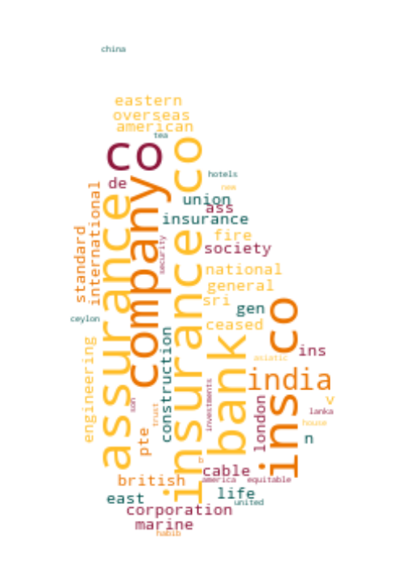

# Registrar of Companies - Sri Lanka

Data Scraped from Registrar of Companies - Sri Lanka (https://eroc.drc.gov.lk)

Scraped **127,907** Companies ([3.96MB](data/companies.tsv)) as of *2024-01-07 00:43:06*.

*Scraping Progress: 52,728/52,728*
✅✅✅✅✅✅✅✅✅✅

## Selection of Companies
*Sample of 10/127907*

* (1) PCC00287821 - **99X TECHNOLOGY AS**
* (14,212) PV00280891 - **BOBY HAPPY**
* (28,424) PV13388 - **DIMASHA APPARELS**
* (42,636) PV127460 - **GOURMET CEYLON**
* (56,848) PV00273777 - **KEERTHY STAR**
* (71,059) PV96497 - **MOON IN SUN HOLDINGS**
* (85,271) PV110590 - **PRINTICATEASIA**
* (99,483) PV00263383 - **SEVENSEAS EXPORTS**
* (113,695) GL77 - **THE OVERSEAS SCHOOL OF COLOMBO**
* (127,907) PV118576 - **ZZAPPIT**

## Latest 1,000 Companies
*Sample of 10/1000*

* (1) PV00288988 - **ORANGE MOBILE.LK**
* (112) PV00289152 - **MAYAN INTERNATIONAL**
* (223) PV00289305 - **TRAVELCEYLO**
* (334) PV00289478 - **WEERASOORIYA ENTERPRISES**
* (445) PV00289628 - **PEPPERCINNA AGRO**
* (556) PV00289807 - **ASIAN STAR ENTERPRISES**
* (667) PV00290020 - **SPILL CO.**
* (778) PV00290463 - **GLOBAL ASTONISH**
* (889) PV00291040 - **WOOD ART GALLERY**
* (1,000) PV00291621 - **TRAVEL KIT**

## Selection for Companies by Type

### "PV"
*Sample of 10/116720*

* (1) PV20853 - **A AND A ASSOCIATES**
* (12,969) PV114907 - **BLUE WATER LILY**
* (25,938) PV00211045 - **DILAN REST**
* (38,907) PV67948 - **GOLDEN FORK RESTAURANT**
* (51,876) PV86726 - **KAPRUKA FARMS**
* (64,844) PV00217684 - **MIYULA RESTAURANT**
* (77,813) PV00269830 - **PRECISION COMPOSITES**
* (90,782) PV122746 - **SHA ASIA**
* (103,751) PV00283721 - **THE RUSSIAN SCHOOL OF BALLET & DANCING**
* (116,720) PV118576 - **ZZAPPIT**

### ""
*Sample of 10/3839*

* (1)  - **A KIRUBAA GROUP OF COMPANIES**
* (427)  - **BOSKOFA BATTERIES AND ENERGY STORAGE SYSTEMSDIOGER HEAVY INDUSTRIES**
* (853)  - **DILINA SILVA FOUNDATION**
* (1,280)  - **GOLD LANKA GEM & JEWELLERY**
* (1,706)  - **KADOL SANDS RESORT AND SPA**
* (2,133)  - **MOHIZHU FABRIC**
* (2,559)  - **PIZZERIA LA BOUGAINVILLEA**
* (2,986)  - **SHAVEEN HARDWARE AND DISTRIBUTORS**
* (3,412)  - **THE LAKE HOUSE MEDIA ACADEMY**
* (3,839)  - **ZULACART**

### "PB"
*Sample of 10/2750*

* (1) PB5111 - **A ONE TOP TRADING**
* (306) PB3879 - **CITY GRADUATE CAMPUS**
* (611) PB5327 - **IDEA METALS**
* (917) PB1066 - **NATURES BEAUTY CREATIONS**
* (1,222) PB3278 - **SEEMASAHITHA (JANATHA) BAMBARAGALA THELAMBUGAHAARA GAMIDIRIYA SAMAGAMA**
* (1,528) PB3345 - **SEEMASAHITHA (JANATHA) MEEGASDENIYA GAMIDIRIYA SAMAGAMA**
* (1,833) PB4204 - **SEEMASAHITHA BORAWEWA GAMANEGUMA JANATHA SAMAGAMA**
* (2,139) PB4175 - **SEEMASAHITHA MILLAVIYA GAMANEGUMA JANATHA SAMAGAMA**
* (2,444) PB171 - **SEYLAN BANK ASSET MANAGEMENT**
* (2,750) PB118 - **ZYREX POWER COMPANY**

### "GA"
*Sample of 10/2305*

* (1) GA00213478 - **A QUINT ONDAATJE FOUNDATION**
* (257) GA00224335 - **BODHI CHATHUPARISA TAMBAPANNIDEEPA**
* (513) GA2270 - **DEEPA CENTRE FOR COMMUNITY DEVELOPMENT AND PEACE BUILDING**
* (769) GA3325 - **HASHTAG GENERATION**
* (1,025) GA632 - **KAUDULUGAMA RANATHISARA PRAJA SANWARDHANA SANGAMAYA**
* (1,281) GA00212597 - **MISSION  OF HOPE LANKA**
* (1,537) GA00262775 - **PRAGNA COLLECTIVE**
* (1,793) GA3399 - **SLINTEC ACADEMY**
* (2,049) GA3408 - **THE INSTITUTION OF FIRE ENGINEERS**
* (2,305) GA470 - **ZONTA CLUB II OF COLOMBO**

### "GL"
*Sample of 10/737*

* (1) GL00223389 - **A LITTLE  FOUNDATION**
* (82) GL00254209 - **BREATH INTERNATIONAL**
* (164) GL2193 - **ECOWAVE**
* (246) GL65 - **HAMBANTHOTA BUSINESS DEVELOPMENT CENTRE**
* (328) GL2349 - **KENKO FOOD**
* (409) GL00218144 - **MOPA**
* (491) GL00248072 - **REDEMPTION**
* (573) GL00260057 - **SOCIAL ECONOMIC AND EDUCATION DEVELOPMENT FOUNDATION**
* (655) GL2205 - **TRADERS ASSOCIATION VAVUNIYA**
* (737) GL2310 - **ZOE LIFE INTERNATIONAL (GURANTEE)**

### "NF"
*Sample of 10/515*

* (1) NF137 - **AB FINLANKA**
* (58) NF315 - **CANADIAN COLLEGE OF BUSINESS COMPUTERS INC.**
* (115) NF225 - **DUTTON II TRADING**
* (172) NF54 - **HABIB BANK ZURICH (INTERNATIONAL)**
* (229) NF260 - **KOREA EXCHANGE BANK**
* (286) NF63 - **MONSANTO SINGAPORE COMPANY**
* (343) NF19 - **PIRELLI CONSTRUCTION COMPANY**
* (400) NF10 - **SLIPCON (S) (PRIVATE) LIMIITED**
* (457) NF368 - **TOMMY HILFIGER (INDIA)**
* (515) NF711 - **ZTE CORPORATION**

### "FC"
*Sample of 10/373*

* (1) FC00251549 - **AA JAPAN (PVT) LTD**
* (42) FC1044 - **BIS VAM ANLAGENTECHNIK GMBH**
* (83) FC1122 - **CREW SKILLS INTERNATIONAL**
* (125) FC1081 - **FUJITO PTE**
* (166) FC00268109 - **ITD CEMENTATION INDIA LIMITED**
* (207) FC1064 - **MANAGEMENT SYSTEMS INTERNATIONAL INC**
* (249) FC1341 - **ORCHESTRA ASIA**
* (290) FC1119 - **SCHLUMBER OILFIELD EASTERN**
* (331) FC00247605 - **THE WESTMINSTER FOUNDATION FOR DEMOCRACY LIMITED**
* (373) FC1065 - **ZIBO GUANGZHENG ALKALI ALUMINIUM CHEMICAL INDUSTRY CO.,**

### "F"
*Sample of 10/219*

* (1) F234 - **ALCO INSURANCE COMPANY**
* (25) F81 - **BOLNPRI FINE INS CO.**
* (49) F351 - **DET NORSKE VERITAS**
* (73) F340 - **HABIB BANK A.G. ZURICH**
* (97) F47 - **LONDON & LANKASHIRE INSURANCE CO.**
* (122) F67 - **NORTH BRITISH AND MERCANTILE INSURANCE COMPANY**
* (146) F274 - **ROCKIT COLMAN CLIQUIL OVERSEAS**
* (170) F172 - **STERLING GEN INS CO**
* (194) F250 - **THE PIONERR FIRE & GEN INS CO**
* (219) F6 - **YORKSHIRE INSURANCE CO LTC CEASED 1/11/70**

### "PQ"
*Sample of 10/157*

* (1) PQ188 - **ABANS ELECTRICALS**
* (18) PQ00252285 - **CAPITAL ALLIANCE**
* (35) PQ211 - **CITRUS LEISURE**
* (53) PQ69 - **DUNAMIS CAPITAL**
* (70) PQ72 - **HUNAS HOLDINGS**
* (87) PQ194 - **LANKA CEMENT**
* (105) PQ27 - **NATIONAL DEVELOPMENT BANK**
* (122) PQ00251293 - **SARVODAYA DEVELOPMENT FINANCE**
* (139) PQ84 - **THE AUTODROME**
* (157) PQ00234079 - **WINDFORCE**

### "PBPV"
*Sample of 10/70*

* (1) PB1296PV - **A BAUR AND COMPANY  TRAVEL**
* (8) PB956PV - **BEIRA BRUSH**
* (16) PB235PV - **EAMEL EXPORTS**
* (24) PB303PV - **GEORGE STEUART HEALTH**
* (31) PB350PV - **HAYLEYS PLANTATION SERVICES**
* (39) PB155PV - **MC MARINE**
* (47) PB504PV - **RAVI MARKETING SERVICES**
* (54) PB3376PV - **SHAW WALLACE PROPERTIES**
* (62) PB5256PV - **TOKYO SUPER AGGREGATE**
* (70) PB312PV - **VERITAS INVESTMENTS**

### "PBG"
*Sample of 10/46*

* (1) PBG45 - **ACCOUNTANCY ASSOSICATES**
* (6) PBG48 - **BRIGHTSTAR FINANCE**
* (11) PBG37 - **CONSULTANCY AND FINANCE AND DEVELOPMENT**
* (16) PBG22 - **FREE LANKA SPORTSMEN**
* (21) PBG9 - **OVERSEA CHILDRENS SCHOOL LTD ( BY GUARANTEE)**
* (26) PBG35 - **SAMPATH SPORTSMEN**
* (31) PBG17 - **THE BENEFIT PROVIDENT FUND**
* (36) PBG16 - **THE INSURANCE POLICY HOLDERS SERVICES**
* (41) PBG39 - **THEEPAM INSTITUTE**
* (46) PBG14 - **UNITED SPORTSMAN**

### "PVPB"
*Sample of 10/40*

* (1) PV4158PB - **ADAM CARBONS**
* (5) PV11479PB - **CARGILLS CONVENIENT FOODS**
* (9) PV440PB - **CITRUS VACATIONS LIMITED**
* (14) PV64927PB - **EVOKE INTERNATIONAL**
* (18) PV7493PB - **LAUGFS ECO SRI**
* (22) PV66661PB - **NAVARA CAPITAL**
* (27) PV12813PB - **SIERRA CONSTRUCTION**
* (31) PV1418PB - **SRI LANKAN CATERING**
* (35) PV7847PB - **TOPPAN FORMS**
* (40) PV77431PB - **WELIGAMA HOTEL PROPERTIES**

### "PBPQ"
*Sample of 10/32*

* (1) PB1015PQ - **ABANS FINANCE**
* (4) PB4739PQ - **ARPICO INSURANCE**
* (7) PB3259PQ - **BIMPUTH FINANCE**
* (11) PB127PQ - **FIRST CAPITAL TREASURIES**
* (14) PB3006PQ - **LUCKY LANKA MILK PROCESSING COMPANY**
* (18) PB712PQ - **MULLER AND PHILLIPS DISTRIBUTORS**
* (21) PB647PQ - **PEOPLE'S LEASING & FINANCE**
* (25) PB238PQ - **SENKADAGALA FINANCE**
* (28) PB779PQ - **SOFTLOGIC CAPITAL**
* (32) PB3831PQ - **VALLIBEL ONE**

### "PCC"
*Sample of 10/28*
* (1) PCC00287821 - **99X TECHNOLOGY AS**
* (4) PCC00278331 - **BITAZZA INTERNATIONAL LIMITED**
* (7) PCC00285477 - **CHINA HARBOUR ENGINEERING COMPANY LIMITED**
* (10) PCC00284521 - **ECHELON TRADE (PVT) LTD.**
* (13) PCC00289173 - **HATTON NATIONAL BANK PLC.**
* (16) PCC00288843 - **IVIVA PTE LTD**
* (19) PCC00290357 - **NIHONBASHI (PVT) LTD.**
* (22) PCC00289735 - **PORT CITY BPO (PRIVATE) LIMITED.**
* (25) PCC00289409 - **SAMPATH BANK PLC.**
* (28) PCC00284609 - **TIQRI SOFTWARE PTE LTD**

### "NPVS"
*Sample of 10/28*
* (1) NPVS40803 - **ALNA WATER SYSTEMS**
* (4) NPVS22400 - **CEETEE INTERNATIONAL**
* (7) NPVS35441 - **DUMBARA FERTILIZERS**
* (10) NPVS34158 - **GEMCO**
* (13) NPVS3371 - **HYSTYLE APPAREL (PRIVATE)**
* (16) NPVS13741 - **PET PACKAGING**
* (19) NPVS9774 - **SAMINDU**
* (22) NPVS29809 - **SHERRY HOMES**
* (25) NPVS47980 - **STYLE APPAREL**
* (28) NPVS16673 - **WESTERN TRADING COMPANY**

### "PVPBPQ"
*Sample of 10/11*
* (1) PV3562PB/PQ - **ASIA SIYAKA COMODITIES**
* (2) PV66136PBPQ - **BROWNS INVESTMENTS**
* (3) PVPB13254PQ - **JETWING SYMPHONY**
* (4) PV8330PBPQ - **LAUGFS GAS**
* (5) PVPB7385PQ - **LOTUS HYDRO POWER**
* (6) PV17807PB/PQ - **MACKWOODS ENERGY**
* (7) PVPB8234PQ - **RAMBODA FALLS**
* (8) PV415PBPQ - **RESUS ENERGY**
* (9) PV70371PB/PQ - **SINGHE HOSPITALS**
* (11) PV7617PBPQ - **TEEJAY LANKA**

### "PQPB"
* (1) PQ96PB - **ASIRI CENTRAL HOSPITALS**
* (2) PQ15PB - **ASSOCIATED ELECTRICAL CORPORATION**
* (3) PQ17PB - **ASSOCIATED PROPERTY DEVELOPMENT**
* (4) PQ193PB - **BERUWELA WALK INN**
* (5) PQ99PB - **CEYLON LEATHER PRODUCTS**
* (6) PQ143PB - **HOTEL DEVELOPERS (LANKA) LIMITED**
* (7) PQ176PB - **KURUWITA TEXTILE MILLS**
* (8) PQ220PB - **METROPOLITAN RESOURCE HOLDINGS**
* (9) PQ77PB - **MORISON**

### "PVPQ"
* (1) PV10527PQ - **ADAM CAPITAL**
* (2) PV78150PQ - **ADAM INVESTMENTS**
* (3) PV1618PQ - **AGSTAR**
* (4) PV539PQ - **ALUMEX**
* (5) PV72355PQ - **ANILANA HOTELS & PROPERTIES**
* (6) PV7206PQ - **ODEL**
* (7) PV1536PQ - **SOFT LOGIC HOLDINGS**

### "OC"
* (1) OC108 - **CAMSO TRADING**
* (2) OC110 - **GLOBAL SOFT TECHNOLOGIES**
* (3) OC101 - **ISLANDERS MALDIVES PTE**
* (4) OC104 - **MERCANTILE SEASCAPE SHIPPING COMPANY**
* (5) OC103 - **MERCANTILE SEBORNE SHIPPING**
* (6) OC102 - **POWER HUB INTERNATIONAL SDN PHD**

### "PVS"
* (1) PVS1795 - **CINE-TECH**
* (2) PVS8467 - **LAKMINI ENTERPRISES**
* (3) PVS7888 - **RADIAN PRODUCTS**
* (4) PVS7498 - **WINGS TRAVELS AND TOURS**
* (5) PVS8227 - **WOODLANDS LANKA**

### "PBPVPB"
* (1) PB64PVPB - **GAC SHIPPING**
* (2) PB553PV/PB - **INTERNATIONAL CONSUMER BRANDS**
* (3) PBPVPB138 - **MCLARENS SHIPPING**

### "PQPBPV"
* (1) PQ98PBPV - **ACE POWER GENERATION MATARA**
* (2) PQ16PB/PV - **ASSOCIATED MOTORWAYS**

### "NFA"
* (1) NF160A - **CO ECHO ENTERPRISES**

### "PVPBPV"
* (1) PV4405PBPV - **DAVE TRACTORS**

### "GAGL"
* (1) GA683GL - **LANKA PRISON FELLOWSHIP**

### "PBpv"
* (1) PB1236pv - **UNILEAVER CEYLON SERVICES**

### "PQPV"
* (1) PQ231PV - **UNION RESORTS**
