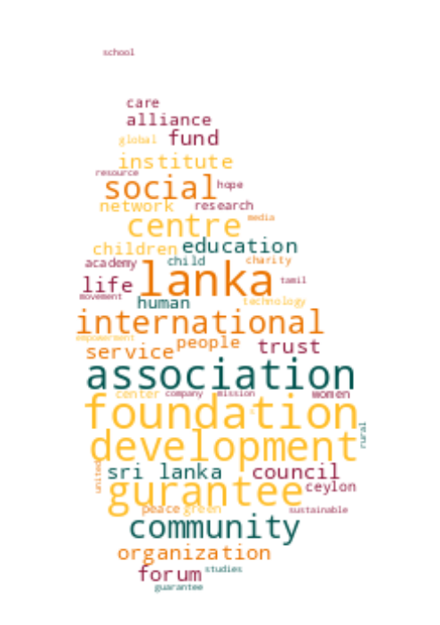

# Registrar of Companies - Sri Lanka

Data Scraped from Registrar of Companies - Sri Lanka (https://eroc.drc.gov.lk)

Scraped **65,337** Companies ([2.00MB](data/companies.tsv)) as of *2023-12-07 07:06:50*.

## Selection of Companies
*Sample of 10/65337*

* (1) PCC00287821 - **99X TECHNOLOGY AS**
* (7,260) PV2748 - **ARNI HOLDINGS AND INVESTMENTS**
* (14,520) PV131336 - **BRAINTREE INTERNATIONAL**
* (21,779) PV00220479 - **CLIMAX ACCOUNTING AND BUSINESS ADVISORY**
* (29,039) PV00246322 - **EVER MARK CONSTRUCTION**
* (36,298) PV22353 - **JUELSTOX INTERNATIONAL**
* (43,558) PV00281716 - **NEW WICKRAMA DISTRIBUTORS**
* (50,817) PV00284061 - **RTN MIRACLE**
* (58,077) PV00289049 - **THALKOTE BOUTIQUE VILLAS**
* (65,337) PV118576 - **ZZAPPIT**

## Latest 1,000 Companies
*Sample of 10/1000*

* (1) PV00287050 - **FOTO TWIST**
* (112) PV00287331 - **PRASHASTHI**
* (223) PV00287647 - **VOGUE VANITY INTERNATIONAL**
* (334) PV00287946 - **FRSHPLUK**
* (445) PV00288232 - **BRAINWAVE**
* (556) PV00288533 - **LASHKO CONSULTING**
* (667) PCC00288843 - **IVIVA PTE LTD**
* (778) PV00289147 - **AYU BLISS**
* (889) PV00289471 - **KF MARINE SERVICES**
* (1,000) PV00289925 - **ISLAND HARMONY TRAVELS**

## Selection for Companies by Type

### "PV"
*Sample of 10/60216*

* (1) PV20853 - **A AND A ASSOCIATES**
* (6,691) PV13086 - **ARMON S.S. INVESTMENTS**
* (13,382) PV00268255 - **BOWWA - HOTEL FOR DOGS**
* (20,072) PV00286762 - **CLOUD TREE HOLIDAYS**
* (26,763) PV00228543 - **EVERLINE TRADING**
* (33,453) PV125328 - **KAIROS SENSING**
* (40,144) PV18416 - **NEW WORLD WASHING PLANT**
* (46,834) PV00251488 - **ROYALTY AUTOMOTIVES**
* (53,525) PV00203848 - **TESLA ENERGY**
* (60,216) PV118576 - **ZZAPPIT**

### ""
*Sample of 10/1958*

* (1)  - **A KIRUBAA GROUP OF COMPANIES**
* (218)  - **ASB TRADING**
* (435)  - **BROTHERS MATRIMONY**
* (653)  - **CLEARFREIGHT ASIA HOLDINGS LIMITED**
* (870)  - **ELYSIACORE VENTURES**
* (1,088)  - **JIANFENG INTERNATIONAL TRADING COMPANY**
* (1,305)  - **NEXUS INFORMATION TECHNOLOGIES**
* (1,523)  - **SAECO**
* (1,740)  - **THAPRO MENTOR HUB**
* (1,958)  - **ZOVO ENTERPRISES**

### "GA"
*Sample of 10/1214*

* (1) GA00213478 - **A QUINT ONDAATJE FOUNDATION**
* (135) GA3435 - **ARROW CHARITY ORGANIZATION**
* (270) GA727 - **BRITISH WELFARE GROUP**
* (405) GA3454 - **CHILD, ADOLESCENT AND FAMILY SERVICES**
* (540) GA00208840 - **DIRIYA SAHANA NONE PROFITABLE ORGANIZATION**
* (674) GA2564 - **ISLAMIC RELIEF COMMITTEE**
* (809) GA2001 - **NUCLEUS FOUNDATION**
* (944) GA2213 - **SESATHA ECONOMICS LIVELIHOOD DEVELOPMENT ASSOCIATION**
* (1,079) GA2652 - **THE INSTITUTE OF FOOD SCIENCE AND TECHNOLOGY SRI LANKA**
* (1,214) GA00230951 - **YOHAN PATHIRANA FOUNDATION**

### "PB"
*Sample of 10/773*

* (1) PB5111 - **A ONE TOP TRADING**
* (86) PB3910 - **ASHA FINANCIAL SERVICES**
* (172) PB00214582 - **C ENTERPRISES & BROTHERS**
* (258) PB4777 - **CEYLON FISHING INDUSTRIES**
* (344) PB1316 - **CROSS WORLD**
* (429) PB5402 - **GOLDEN GATE MICRO CREDIT COMPANY**
* (515) PB134 - **LOIB FINANCIAL SERVICES**
* (601) PB1523 - **RANATUNGA PASSENGER TRANSPORT SERVICES  (NPVBS 388)**
* (687) PB1444 - **TANLANKA  (NPBS 110)**
* (773) PB4828 - **ZIPP INTERNATIONAL (LANKA)**

### "GL"
*Sample of 10/367*

* (1) GL00223389 - **A LITTLE  FOUNDATION**
* (41) GL00286045 - **AR RISALAH INSTITUTE OF ISLAMIC STUDIES**
* (82) GL00254209 - **BREATH INTERNATIONAL**
* (123) GL00260327 - **CIVIL AMAYAM**
* (163) GL00250057 - **FAMILIES WELFARE**
* (204) GL00240983 - **KANDURATA SAVIYA**
* (245) GL00289237 - **PARAMPARIKA UDARATA RADALA SANSADAYA**
* (285) GL2211 - **SLASSCOM**
* (326) GL2307 - **THE RUHUNA RAINBOW TRUST**
* (367) GL2310 - **ZOE LIFE INTERNATIONAL (GURANTEE)**

### "NF"
*Sample of 10/260*

* (1) NF137 - **AB FINLANKA**
* (29) NF624 - **ANABOND**
* (58) NF6 - **BUNOUGHS WELLCOME (FAR-EAST)**
* (87) NF566 - **CITY ANG GUILDS(SOUTH ASIA) PRIVATE)**
* (116) NF653 - **EM C (BENELUX) B.V .**
* (144) NF464 - **JARFALLA INTERNATIONAL AB**
* (173) NF320 - **MATALAN DISCOUNT CLUB (CASH AND CARRY)**
* (202) NF602 - **PRYM FASHION ASIA PACIFIC**
* (231) NF219 - **THURICH COMPANY**
* (260) NF711 - **ZTE CORPORATION**

### "FC"
*Sample of 10/198*

* (1) FC00251549 - **AA JAPAN (PVT) LTD**
* (22) FC1174 - **ALSTRONG ENTERPRISES INDIA PRIVATE**
* (44) FC1044 - **BIS VAM ANLAGENTECHNIK GMBH**
* (66) FC1139 - **CHINA NATIONAL ELECTRONICS IMP. & EXP.**
* (88) FC1370 - **DEBENHAMS HONG KONG**
* (110) FC1208 - **HUNAN ROAD & BRIDGE CONSTRUCITON GROUP CORPORATION**
* (132) FC1092 - **MAST FAR EAST**
* (154) FC1085 - **PARSWA SYSTEMS PVT**
* (176) FC00211406 - **STERLING C&S CONSULTING ENGINEER PTE. LTD.**
* (198) FC1193 - **WORLD PRODUCTION PARTNERS CO.**

### "F"
*Sample of 10/117*

* (1) F234 - **ALCO INSURANCE COMPANY**
* (13) F183 - **ATEANTIE ( EAST)**
* (26) F87 - **BRITISH EQUITABLE ASS CO.**
* (39) F272 - **COLMENT LEVINGS PTY**
* (52) F295 - **GEORGE E JAYOR (OVERSEAS)**
* (65) F255 - **LA MATERAL ELECRIEQUE**
* (78) F261 - **ROWARAN AGENCIES**
* (91) F197 - **THE BANGALORE PROVIDENT INSURANCE CORPORATION**
* (104) F250 - **THE PIONERR FIRE & GEN INS CO**
* (117) F268 - **Y CICHAEL**

### "PQ"
*Sample of 10/89*

* (1) PQ188 - **ABANS ELECTRICALS**
* (10) PQ204 - **ASIRI HOSPITAL HOLDINGS**
* (20) PQ41 - **CARSON CUMBERBATCH**
* (30) PQ29 - **CEYLON TOBACO COMPANY**
* (40) PQ173 - **COLOMBO LAND AND DEVELOPMENT COMPANY**
* (49) PQ44 - **FIRST CAPITAL HOLDINGS**
* (59) PQ58 - **KELANI VALLEY PLANTATIONS**
* (69) PQ125 - **ROYAL CERAMICS LANKA**
* (79) PQ172 - **THE COLOMBO FORT LAND AND BUILDING**
* (89) PQ00234079 - **WINDFORCE**

### "PBPV"
*Sample of 10/36*

* (1) PB1296PV - **A BAUR AND COMPANY  TRAVEL**
* (4) PB872PV - **ALEXANDRA INDUSTRIES (CEYLON)**
* (8) PB162PV - **ASSETLINE INSURANCE BROKERS**
* (12) PB159PV - **COLOMBO BUSINESS SCHOOL**
* (16) PB419PV - **DAMBAKANDA ESTATES COMPANY**
* (20) PB98PV - **FINLAY AIRLINE AGENCIES**
* (24) PB3539PV - **KELSEY HOMES**
* (28) PB5065PV - **RIHAN AYAMPERUMA DESIGN ASSOCIATES**
* (32) PB754PV - **SUPER FELT**
* (36) PB458PV - **VENIGROS**

### "PCC"
*Sample of 10/22*
* (1) PCC00287821 - **99X TECHNOLOGY AS**
* (3) PCC00284133 - **ASIRI PORT CITY HOSPITAL (PRIVATE) LIMITED .**
* (5) PCC00272290 - **BITAZZA LANKA (PRIVATE) LIMITED**
* (8) PCC00271314 - **CODEGEN INNOVATIONS (PRIVATE) LIMITED**
* (10) PCC00284521 - **ECHELON TRADE (PVT) LTD.**
* (12) PCC00289173 - **HATTON NATIONAL BANK PLC.**
* (15) PCC00289410 - **NCINGA PTE LTD**
* (17) PCC00278728 - **PATHLY HOLDINGS, INC**
* (19) PCC00276910 - **REMEDIUMONE GLOBAL PRIVATE LIMITED**
* (22) PCC00284609 - **TIQRI SOFTWARE PTE LTD**

### "PVPB"
*Sample of 10/20*
* (1) PV4158PB - **ADAM CARBONS**
* (3) PV60755PB - **ALPHA WEALTH**
* (5) PV11479PB - **CARGILLS CONVENIENT FOODS**
* (7) PV3326PB - **CEYBANK ASSET MANAGEMENT**
* (9) PV440PB - **CITRUS VACATIONS LIMITED**
* (11) PV7155PB - **DYNAWASH**
* (13) PV7493PB - **LAUGFS ECO SRI**
* (15) PV6401PB - **MAG INDUSTRIES**
* (17) PV21775PB - **ORIENT CAPITAL**
* (20) PV62911PB - **TRICO LOGISTICS**

### "PBPQ"
*Sample of 10/18*
* (1) PB1015PQ - **ABANS FINANCE**
* (2) PB1196PQ - **AITKEN SPENCE PLANTATION MANAGEMENTS**
* (4) PB139PQ - **ASIA ASSET FINANCE**
* (6) PB3259PQ - **BIMPUTH FINANCE**
* (8) PB232PQ - **CITIZENS DEVELOPMENT BUSINESS FINANCE**
* (10) PB3754PQ - **PEOPLE'S  INSURANCE**
* (12) PB238PQ - **SENKADAGALA FINANCE**
* (14) PB779PQ - **SOFTLOGIC CAPITAL**
* (16) PB594PQ - **SWARNAMAHAL FINANCIAL SERVICES**
* (18) PB3831PQ - **VALLIBEL ONE**

### "PBG"
*Sample of 10/18*
* (1) PBG32 - **BASIL SPORTSMEN**
* (2) PBG28 - **BLUE DIAMOND SPORTSMEN**
* (4) PBG3 - **CEYLON MUTUAL INSURANCE CO**
* (6) PBG37 - **CONSULTANCY AND FINANCE AND DEVELOPMENT**
* (8) PBG27 - **PAMANKADE SPORTSMEN**
* (10) PBG17 - **THE BENEFIT PROVIDENT FUND**
* (12) PBG10 - **THE EASTERN MUTUAL GENERAL ASSURANCE**
* (14) PBG23 - **THE STAR BENEFIT CO**
* (16) PBG21 - **THE WORKERS BENEFIT (LUNUGALA)**
* (18) PBG49 - **TRRO**

### "PVPBPQ"
* (1) PV66136PBPQ - **BROWNS INVESTMENTS**
* (2) PVPB13254PQ - **JETWING SYMPHONY**
* (3) PV8330PBPQ - **LAUGFS GAS**
* (4) PVPB7385PQ - **LOTUS HYDRO POWER**
* (5) PV17807PB/PQ - **MACKWOODS ENERGY**
* (6) PVPB8234PQ - **RAMBODA FALLS**
* (7) PV70371PB/PQ - **SINGHE HOSPITALS**
* (8) PV1536PBPQ - **SOFTLOGIC HOLDINGS**

### "PQPB"
* (1) PQ96PB - **ASIRI CENTRAL HOSPITALS**
* (2) PQ15PB - **ASSOCIATED ELECTRICAL CORPORATION**
* (3) PQ17PB - **ASSOCIATED PROPERTY DEVELOPMENT**
* (4) PQ193PB - **BERUWELA WALK INN**
* (5) PQ99PB - **CEYLON LEATHER PRODUCTS**
* (6) PQ176PB - **KURUWITA TEXTILE MILLS**
* (7) PQ220PB - **METROPOLITAN RESOURCE HOLDINGS**

### "PVPQ"
* (1) PV10527PQ - **ADAM CAPITAL**
* (2) PV78150PQ - **ADAM INVESTMENTS**
* (3) PV1618PQ - **AGSTAR**
* (4) PV72355PQ - **ANILANA HOTELS & PROPERTIES**
* (5) PV7206PQ - **ODEL**
* (6) PV1536PQ - **SOFT LOGIC HOLDINGS**

### "PVS"
* (1) PVS1795 - **CINE-TECH**
* (2) PVS8467 - **LAKMINI ENTERPRISES**
* (3) PVS7888 - **RADIAN PRODUCTS**
* (4) PVS7498 - **WINGS TRAVELS AND TOURS**
* (5) PVS8227 - **WOODLANDS LANKA**

### "OC"
* (1) OC108 - **CAMSO TRADING**
* (2) OC101 - **ISLANDERS MALDIVES PTE**
* (3) OC102 - **POWER HUB INTERNATIONAL SDN PHD**

### "PQPBPV"
* (1) PQ98PBPV - **ACE POWER GENERATION MATARA**
* (2) PQ16PB/PV - **ASSOCIATED MOTORWAYS**
