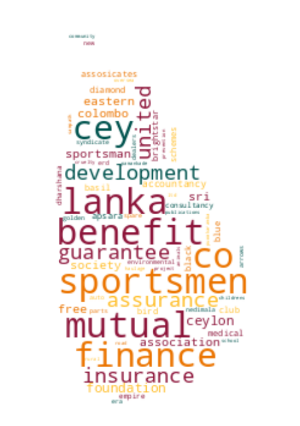

# Registrar of Companies - Sri Lanka

Data Scraped from Registrar of Companies - Sri Lanka (https://eroc.drc.gov.lk)

Scraped **141,691** Companies ([4.38MB](data/companies.tsv)) as of *2025-10-24 10:10:51*.

*Scraping Progress: 52,728/52,728*
✅✅✅✅✅✅✅✅✅✅

## Selection of Companies
*Sample of 10/141691*

* (1) PCC00287821 - **99X TECHNOLOGY AS**
* (15,744) PV96889 - **BOON FOOD AND CATERING**
* (31,487) PV00214126 - **DIVA OSU AYURVEDA**
* (47,231) PV118072 - **GREAT LEATHER**
* (62,974) PV80537 - **KETHAKIE HERBAL PRODUCTS**
* (78,717) PV00293064 - **MT BUYING AND SELLING CONTRACTORS**
* (94,461) PV00214256 - **PUNCHI PANCHIKAWATTA MOTORS**
* (110,204) PV00208437 - **SHAM LANKA HOLDINGS**
* (125,947) PV11372 - **THE VISA CENTRE**
* (141,691) PV118576 - **ZZAPPIT**

## Latest 1,000 Companies
*Sample of 10/1000*

* (1) PV00326758 - **DIGI MARTECH GLOBAL**
* (112) PV00327650 - **GN FAMILY**
* (223) PV00328630 - **GALAXY NETWORK  SOLUTIONS**
* (334) PV00329634 - **KIND SOUL CAREGIVERS**
* (445) PV00330685 - **GAMEVERSE**
* (556) PV00332089 - **SMOOTH BEVERAGES**
* (667) PV00333987 - **SEWANA ROOFING**
* (778) PV00336138 - **HAWSON SUSTAINABLE RECYCLING**
* (889) PV00338047 - **LT CREATIONS**
* (1,000) PV00343130 - **LION READS**

## Selection for Companies by Type

### "PV"
*Sample of 10/128914*

* (1) PV20853 - **A AND A ASSOCIATES**
* (14,324) PV00272415 - **BOLIEMA GROUP OF COMPANIES**
* (28,648) PV65774 - **DISARA DISTRIBUTORS**
* (42,972) PV00269295 - **GOZAYAAN LANKA**
* (57,295) PV13098 - **KEEN MISSION SECURITY SERVICES**
* (71,619) PV00277685 - **MOOFLIFE**
* (85,943) PV00290278 - **PRINCE  SOLUTIONS**
* (100,266) PV00287295 - **SHANGFANG RESTAURANT**
* (114,590) PV17624 - **THERMO PLASTICS**
* (128,914) PV118576 - **ZZAPPIT**

### ""
*Sample of 10/5028*

* (1)  - **A BRAND HOLDINGS**
* (559)  - **BOOST BEVERAGES**
* (1,118)  - **DILSHA TRADING**
* (1,676)  - **GOOD CHOICE TRADING**
* (2,235)  - **KARATS AND FACETS**
* (2,793)  - **MSQ TRADERS**
* (3,352)  - **PWK TRANSPORT**
* (3,910)  - **SILUXSON**
* (4,469)  - **THYA INTERNATIONAL**
* (5,028)  - **ZZ PRESTIGE MOTORS**

### "PB"
*Sample of 10/2786*

* (1) PB5111 - **A ONE TOP TRADING**
* (310) PB4798 - **CITRUS VILLAS KALPITIYA**
* (619) PB4863 - **HOMAGAMA SANASA SHARE HOLDERS TRUST**
* (929) PB4972 - **NACHCHADUWA SANASA SHARE HOLDERS TRUST COMPANY**
* (1,238) PB607 - **SEEMASAHITHA (JANATHA) BALAKOTUNNA GAMIDIRIYA SAMAGAMA**
* (1,548) PB3162 - **SEEMASAHITHA (JANATHA) NILGALA GEMIDIRIYA SAMAGAMA**
* (1,857) PB4116 - **SEEMASAHITHA DIKELLA EKAMUTHU GAMANEGUMA JANATHA SAMAGAMA**
* (2,167) PB4416 - **SEEMASAHITHA NUGAWELA GAMANEGUMA JANATHA SAMAGAMA**
* (2,476) PB5079 - **SINGER INSURANCE BROKERS**
* (2,786) PB118 - **ZYREX POWER COMPANY**

### "GA"
*Sample of 10/2512*

* (1) GA00321009 - **A HAND OF HOPE**
* (280) GA3275 - **BIOGENIC GREEN TECHNOLOGY RESEARCH INSTITUTE**
* (559) GA00208839 - **DEFENCE SERVICE WAR DISABLED OFFICERS' ASSOCIATION**
* (838) GA565 - **GURUGODELLA JANATHA SANGAMAYA**
* (1,117) GA3010 - **JESUS LIVES ASSOCIATION**
* (1,396) GA288 - **MIDORI FOUNDATION**
* (1,675) GA3014 - **PROFESSIONAL YOUTH WORKERS ASSOCIATION**
* (1,954) GA2792 - **SMYL'S RURAL DEVELOPMENT**
* (2,233) GA2652 - **THE INSTITUTE OF FOOD SCIENCE AND TECHNOLOGY SRI LANKA**
* (2,512) GA470 - **ZONTA CLUB II OF COLOMBO**

### "GL"
*Sample of 10/817*

* (1) GL00223389 - **A LITTLE  FOUNDATION**
* (91) GL00266643 - **BLUE GREEN FOUNDATION**
* (182) GL00257726 - **DR SITHIRAVELU SARAVANAPAVAN FOUNDATION**
* (273) GL00208963 - **HANDS FOR EDUCATION**
* (363) GL00231777 - **KABILAR SOCIAL ADVANCENMENT COUNCIL**
* (454) GL00262552 - **MISSION GREEN S L**
* (545) GL00248072 - **REDEMPTION**
* (635) GL00257943 - **SMILES CHILD CARE FOUNDATION**
* (726) GL2348 - **TRINITY CENTRE OF EXCELLENCE COMPANY**
* (817) GL2310 - **ZOE LIFE INTERNATIONAL (GURANTEE)**

### "NF"
*Sample of 10/522*

* (1) NF137 - **AB FINLANKA**
* (58) NF218 - **BLOOM & PEAT PRODUCTS**
* (116) NF328 - **EDEN LLC**
* (174) NF639 - **HEINZ INDIA PRIVATE**
* (232) NF260 - **KOREA EXCHANGE BANK**
* (290) NF45 - **MOUNTAIN INDUSTRIES**
* (348) NF597 - **PRACTICAL ACTION**
* (406) NF299 - **SOCIETE GENERALE**
* (464) NF150 - **TORRENT EXPORTS**
* (522) NF711 - **ZTE CORPORATION**

### "FC"
*Sample of 10/379*

* (1) FC00251549 - **AA JAPAN (PVT) LTD**
* (43) FC1011 - **BRANDIX INDIA APPAREL CITY PRIVATE**
* (85) FC00277895 - **CUBE CONTENT GOVERNANCE GLOBAL LIMITED**
* (127) FC00214044 - **GEMCO INTERNATIONAL B.V.**
* (169) FC1274 - **JANSON BRIDGING INTERNATIONAL B.V.**
* (211) FC1092 - **MAST FAR EAST**
* (253) FC1169 - **OMRAN MAROON ENGINEERS COMPANY (PRIVATE JOINT STOCK)**
* (295) FC1096 - **SAMSUNG INDIA ELECTRONICS PRIVATE LIMITED**
* (337) FC1019 - **TETRA - PAK INDIA PRIVATE**
* (379) FC1065 - **ZIBO GUANGZHENG ALKALI ALUMINIUM CHEMICAL INDUSTRY CO.,**

### "F"
*Sample of 10/206*

* (1) F234 - **ALCO INSURANCE COMPANY**
* (23) F87 - **BRITISH EQUITABLE ASS CO.**
* (46) F100 - **EMPLOYEES LIAB ARSON CO**
* (69) F294 - **HANSAGIRIYA TEA COMPANY**
* (92) F77 - **LONDON ASSURANCE**
* (114) F315 - **OBEROI HOTELS (INDIA) PRIVATE**
* (137) F379 - **SIMPLEX CONCRETE PILES (INDIA) PRIVATE**
* (160) F191 - **THE BHARATAMATA PR. ASS. CO.**
* (183) F126 - **THE UNITED INDIA PROM. ASSON**
* (206) F6 - **YORKSHIRE INSURANCE CO LTC CEASED 1/11/70**

### "PQ"
*Sample of 10/163*

* (1) PQ188 - **ABANS ELECTRICALS**
* (19) PQ56 - **BUKIT DARAH**
* (37) PQ71 - **COLOMBO CITY HOLDINGS**
* (55) PQ53 - **EQUITY SEVEN**
* (73) PQ11 - **JOHN KEELLS**
* (91) PQ86 - **LANKEM DEVELOPMENTS**
* (109) PQ40 - **PEGASUS HOTELS OF CEYLON**
* (127) PQ105 - **SATHOSA MOTORS**
* (145) PQ1 - **THE FINANCE COMPANY**
* (163) PQ181 - **YORK ARCADE HOLDINGS**

### "PBPV"
*Sample of 10/85*

* (1) PB1296PV - **A BAUR AND COMPANY  TRAVEL**
* (10) PB540PV - **BALTIC CONTROL SERVICES**
* (19) PB419PV - **DAMBAKANDA ESTATES COMPANY**
* (29) PB36PV - **FINTRAVEL**
* (38) PB753PV - **HAYLEYS AVENTURA**
* (47) PB1738PV - **LANKA CANNERIES**
* (57) PB5365PV - **NIMBUS CLOUD LANKA**
* (66) PB752PV - **RILEYS**
* (75) PB1236PV - **UNILEVER CEYLON SERVICES**
* (85) PB144PV - **WORLD SUBSEA SERVICES**

### "PCC"
*Sample of 10/74*

* (1) PCC00287821 - **99X TECHNOLOGY AS**
* (9) PCC00320557 - **AVENTUDE (PVT) LTD.**
* (17) PCC00285477 - **CHINA HARBOUR ENGINEERING COMPANY LIMITED**
* (25) PCC00299964 - **EXPERIENZ LIMITED.**
* (33) PCC00287820 - **HORIZON GROUP USA GLOBAL LLC**
* (41) PCC00332631 - **INTERVEST GLOBAL DELIVERY (PRIVATE) LIMITED.**
* (49) PCC00298024 - **MITRA INNOVATION (AMERICAS) INC.**
* (57) PCC00278728 - **PATHLY HOLDINGS, INC**
* (65) PCC00284610 - **SATGURU TRAVEL AND TOURISM LLC**
* (74) PCC00292982 - **YOULANKA GROUP LIMITED**

### "PVPB"
*Sample of 10/54*

* (1) PV4158PB - **ADAM CARBONS**
* (6) PV77699PB - **BUTANI CAPITAL**
* (12) PV1632PB - **COMINDTAX MANAGEMENT SERVICE**
* (18) PV70722PB - **GALLE FACE PROPERTIES**
* (24) PV7493PB - **LAUGFS ECO SRI**
* (30) PV69307PB - **NATURE'S BEST INDUSTRY**
* (36) PV64694PB - **PADIYAPELELLA HYDROPOWER**
* (42) PV3574PB - **SOUTH ASIA TEXTILES**
* (48) PV3822PB - **SWARNAMAHAL JEWELLERS**
* (54) PV19546PB - **UNITED HOTELS COMPANY**

### "PBG"
*Sample of 10/46*

* (1) PBG45 - **ACCOUNTANCY ASSOSICATES**
* (6) PBG48 - **BRIGHTSTAR FINANCE**
* (11) PBG37 - **CONSULTANCY AND FINANCE AND DEVELOPMENT**
* (16) PBG22 - **FREE LANKA SPORTSMEN**
* (21) PBG9 - **OVERSEA CHILDRENS SCHOOL LTD ( BY GUARANTEE)**
* (26) PBG35 - **SAMPATH SPORTSMEN**
* (31) PBG17 - **THE BENEFIT PROVIDENT FUND**
* (36) PBG16 - **THE INSURANCE POLICY HOLDERS SERVICES**
* (41) PBG39 - **THEEPAM INSTITUTE**
* (46) PBG14 - **UNITED SPORTSMAN**

### "PBPQ"
*Sample of 10/31*

* (1) PB1196PQ - **AITKEN SPENCE PLANTATION MANAGEMENTS**
* (4) PB139PQ - **ASIA ASSET FINANCE**
* (7) PB3259PQ - **BIMPUTH LANKA INVESTMENTS**
* (11) PB765PQ - **DIALOG FINANCE**
* (14) PB1595PQ - **LAUGFS POWER**
* (17) PB1079PQ - **ORIENT FINANCE**
* (21) PB62PQ - **SANASA DEVELOPMENT BANK**
* (24) PB917PQ - **SIYAPATHA FINANCE**
* (27) PB689PQ - **TESS AGRO**
* (31) PB4242PQ - **WASKADUWA BEACH RESORT**

### "NPVS"
*Sample of 10/29*
* (1) NPVS40803 - **ALNA WATER SYSTEMS**
* (4) NPVS22400 - **CEETEE INTERNATIONAL**
* (7) NPVS35441 - **DUMBARA FERTILIZERS**
* (10) NPVS15104 - **FIVE STAR EXPORTS**
* (13) NPVS42442 - **HERITAGE SAPPHIRES**
* (16) NPVS38695 - **MCMILLAN CEYLON MARKETING**
* (19) NPVS9611 - **Q-NET**
* (22) NPVS18562 - **SERENDIB INSURANCE BROKERS**
* (25) NPVS11267 - **SILVER SHRIMPS**
* (29) NPVS16673 - **WESTERN TRADING COMPANY**

### "PVPBPQ"
*Sample of 10/11*
* (1) PV5301PBPQ - **ABANS**
* (2) PV3562PB/PQ - **ASIA SIYAKA COMODITIES**
* (3) PVPB13254PQ - **JETWING SYMPHONY**
* (4) PV8330PBPQ - **LAUGFS GAS**
* (5) PVPB7385PQ - **LOTUS HYDRO POWER**
* (6) PV10922PBPQ - **RAIGAM WAYAMBA SALTERNS**
* (7) PVPB8234PQ - **RAMBODA FALLS**
* (8) PV415PBPQ - **RESUS ENERGY**
* (9) PV70371PB/PQ - **SINGHE HOSPITALS**
* (11) PV7617PBPQ - **TEEJAY LANKA**

### "PQPB"
* (1) PQ96PB - **ASIRI CENTRAL HOSPITALS**
* (2) PQ15PB - **ASSOCIATED ELECTRICAL CORPORATION**
* (3) PQ193PB - **BERUWELA WALK INN**
* (4) PQ99PB - **CEYLON LEATHER PRODUCTS**
* (5) PQ19PB - **EQUITY ONE**
* (6) PQ176PB - **KURUWITA TEXTILE MILLS**
* (7) PQ220PB - **METROPOLITAN RESOURCE HOLDINGS**
* (8) PQ77PB - **MORISON**

### "OC"
* (1) OC111 - **ASTER JETFUEL**
* (2) OC108 - **CAMSO TRADING**
* (3) OC109 - **ENERGY COMMERCE B.V.**
* (4) OC110 - **GLOBAL SOFT TECHNOLOGIES**
* (5) OC106 - **MERCANTILE SEAWIND SHIPPING COMPANY**
* (6) OC103 - **MERCANTILE SEBORNE SHIPPING**
* (7) OC102 - **POWER HUB INTERNATIONAL SDN PHD**

### "PVS"
* (1) PVS1795 - **CINE-TECH**
* (2) PVS8467 - **LAKMINI ENTERPRISES**
* (3) PVS7888 - **RADIAN PRODUCTS**
* (4) PVS7498 - **WINGS TRAVELS AND TOURS**
* (5) PVS8227 - **WOODLANDS LANKA**

### "PVPQ"
* (1) PV10527PQ - **ADAM CAPITAL**
* (2) PV1618PQ - **AGSTAR**
* (3) PV72355PQ - **ANILANA HOTELS & PROPERTIES**

### "PBPVPB"
* (1) PB64PVPB - **GAC SHIPPING**
* (2) PB553PV/PB - **INTERNATIONAL CONSUMER BRANDS**
* (3) PBPVPB138 - **MCLARENS SHIPPING**

### "PQPBPV"
* (1) PQ98PBPV - **ACE POWER GENERATION MATARA**
* (2) PQ16PB/PV - **ASSOCIATED MOTORWAYS**

### "NFA"
* (1) NF160A - **CO ECHO ENTERPRISES**

### "PBPQPB"
* (1) PB613PQ/PB - **JANASHAKTHI**

### "GAGL"
* (1) GA683GL - **LANKA PRISON FELLOWSHIP**

### "CIA"
* (1) CIA389 - **REFINITIV**

### "PBpv"
* (1) PB1236pv - **UNILEAVER CEYLON SERVICES**

### "PQPV"
* (1) PQ231PV - **UNION RESORTS**
